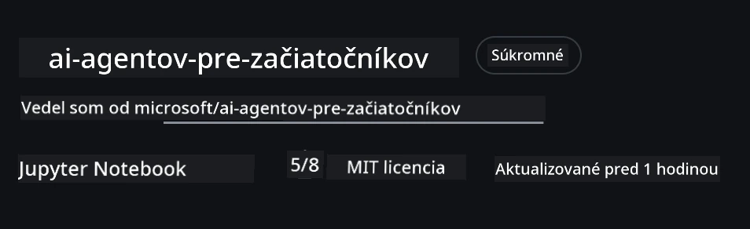
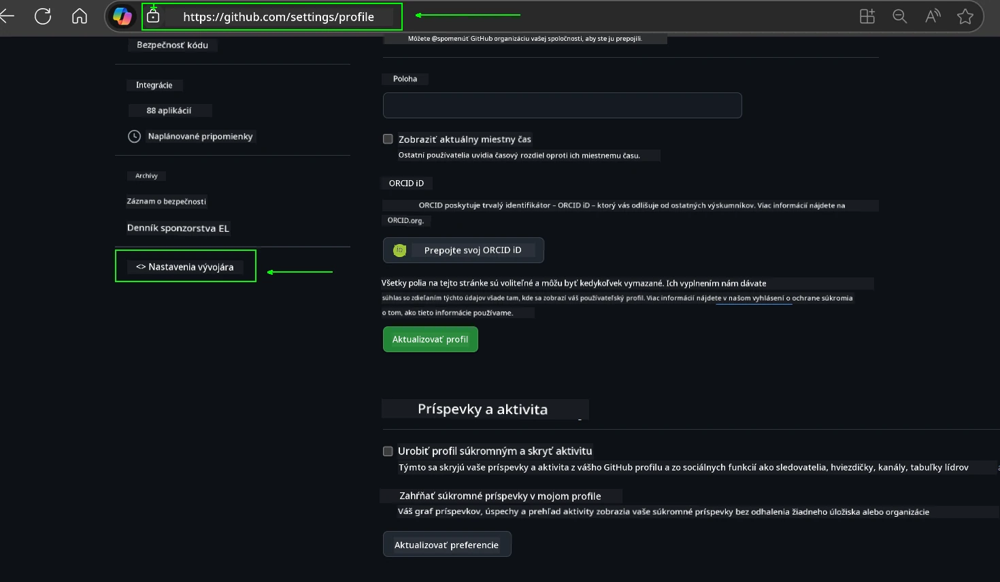
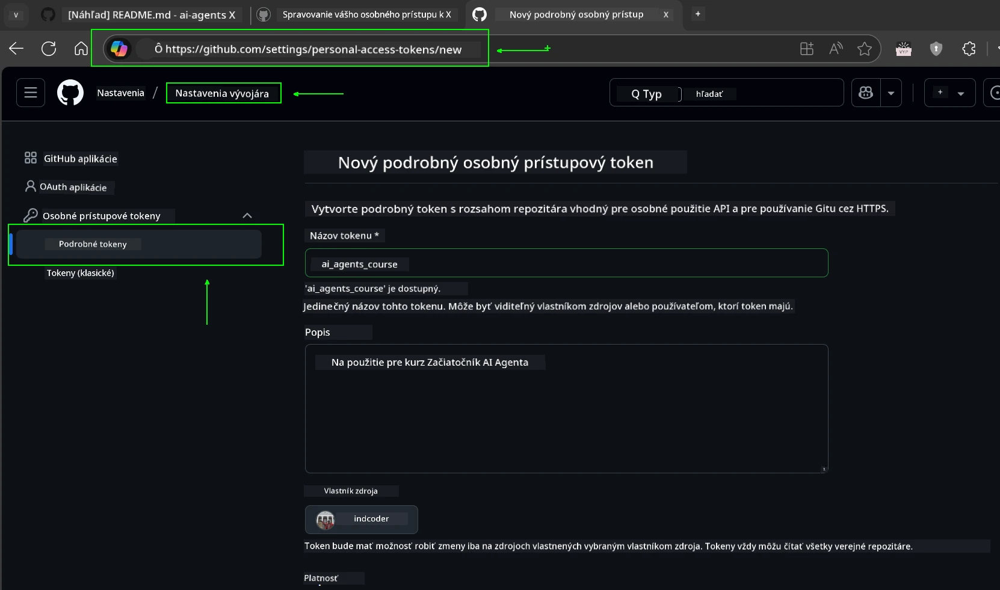
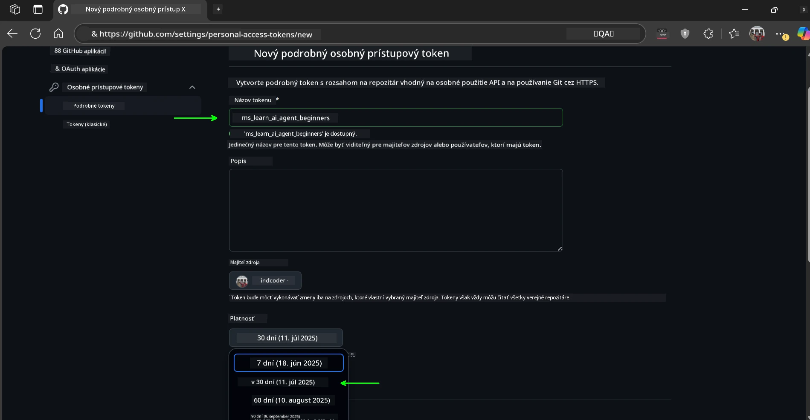
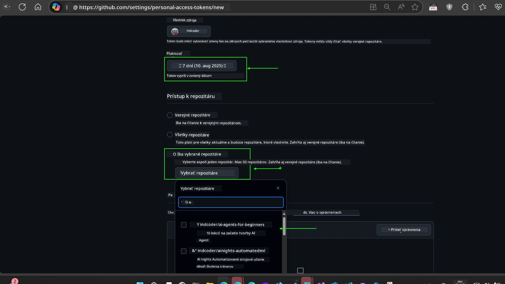
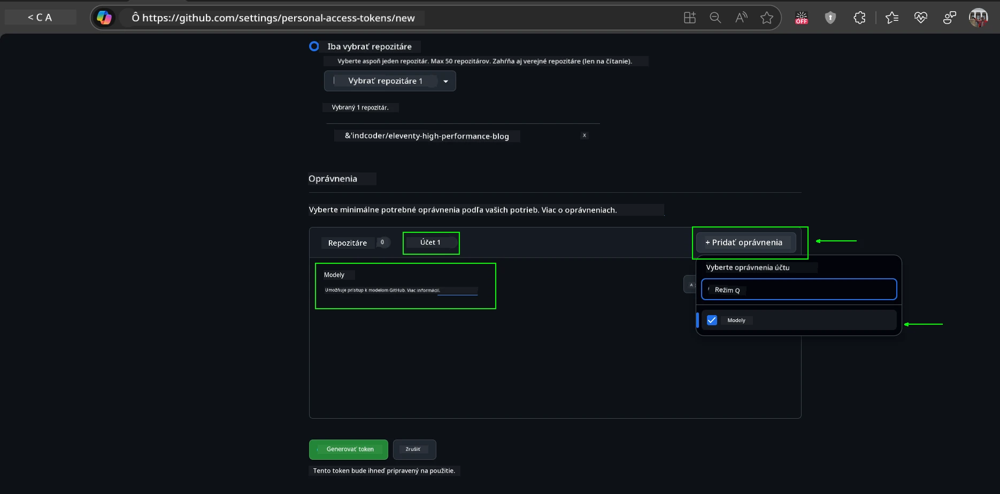
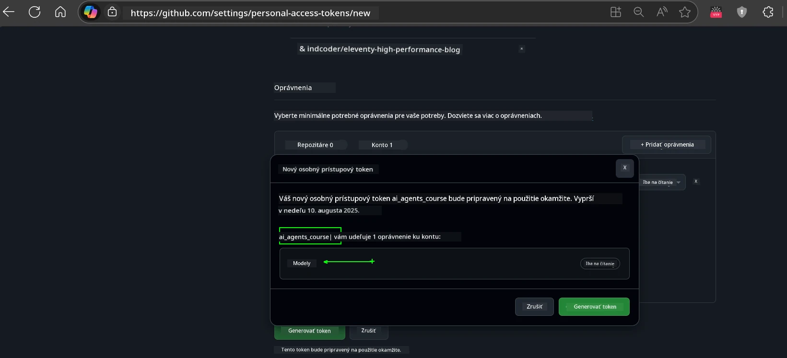
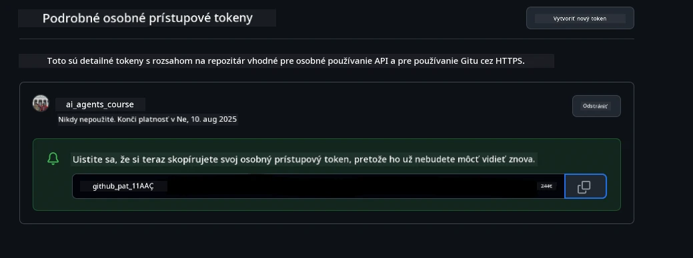
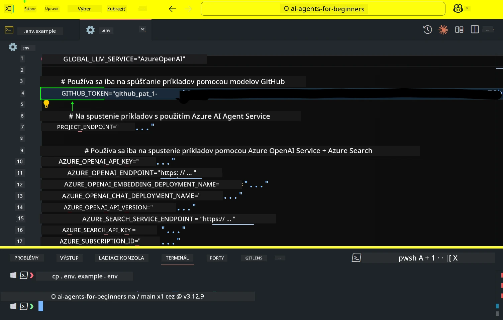
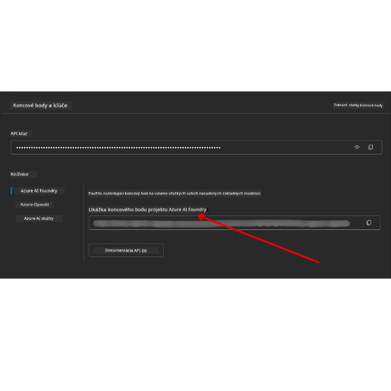

<!--
CO_OP_TRANSLATOR_METADATA:
{
  "original_hash": "63b1a8f6e840df15934935b728e569f0",
  "translation_date": "2025-12-03T14:55:11+00:00",
  "source_file": "00-course-setup/README.md",
  "language_code": "sk"
}
-->
# Nastavenie kurzu

## Úvod

Táto lekcia sa zameriava na to, ako spustiť ukážky kódu z tohto kurzu.

## Pripojte sa k ostatným študentom a získajte pomoc

Predtým, ako začnete klonovať svoje úložisko, pripojte sa k [Discord kanálu AI Agents For Beginners](https://aka.ms/ai-agents/discord), kde môžete získať pomoc s nastavením, odpovede na otázky o kurze alebo sa spojiť s ostatnými študentmi.

## Klonujte alebo forknite toto úložisko

Na začiatok si prosím klonujte alebo forknite GitHub úložisko. Týmto si vytvoríte vlastnú verziu materiálov kurzu, aby ste mohli spúšťať, testovať a upravovať kód!

Toto môžete urobiť kliknutím na odkaz na <a href="https://github.com/microsoft/ai-agents-for-beginners/fork" target="_blank">fork úložiska</a>.

Teraz by ste mali mať vlastnú forknutú verziu tohto kurzu na nasledujúcom odkaze:



### Plytké klonovanie (odporúčané pre workshopy / Codespaces)

  >Celé úložisko môže byť veľké (~3 GB), ak stiahnete celú históriu a všetky súbory. Ak sa zúčastňujete iba workshopu alebo potrebujete len niekoľko priečinkov z lekcií, plytké klonovanie (alebo riedke klonovanie) zabráni väčšine tohto sťahovania tým, že skráti históriu a/alebo preskočí niektoré súbory.

#### Rýchle plytké klonovanie — minimálna história, všetky súbory

Nahraďte `<your-username>` v nasledujúcich príkazoch URL adresou vášho forku (alebo upstream URL, ak preferujete).

Na klonovanie iba najnovšej histórie commitov (malé sťahovanie):

```bash|powershell
git clone --depth 1 https://github.com/<your-username>/ai-agents-for-beginners.git
```

Na klonovanie konkrétnej vetvy:

```bash|powershell
git clone --depth 1 --branch <branch-name> https://github.com/<your-username>/ai-agents-for-beginners.git
```

#### Čiastočné (riedke) klonovanie — minimálne súbory + iba vybrané priečinky

Toto používa čiastočné klonovanie a riedke checkout (vyžaduje Git 2.25+ a odporúča sa moderný Git s podporou čiastočného klonovania):

```bash|powershell
git clone --depth 1 --filter=blob:none --sparse https://github.com/<your-username>/ai-agents-for-beginners.git
```

Prejdite do priečinka úložiska:

```bash|powershell
cd ai-agents-for-beginners
```

Potom špecifikujte, ktoré priečinky chcete (príklad nižšie ukazuje dva priečinky):

```bash|powershell
git sparse-checkout set 00-course-setup 01-intro-to-ai-agents
```

Po klonovaní a overení súborov, ak potrebujete iba súbory a chcete uvoľniť miesto (bez histórie gitu), prosím odstráňte metadáta úložiska (💀nevratné — stratíte všetku funkčnosť Gitu: žiadne commity, pull requesty, push requesty alebo prístup k histórii).

```bash
# zsh/bash
rm -rf .git
```

```powershell
# PowerShell
Remove-Item -Recurse -Force .git
```

#### Použitie GitHub Codespaces (odporúčané na vyhnutie sa veľkým lokálnym sťahovaniam)

- Vytvorte nový Codespace pre toto úložisko cez [GitHub UI](https://github.com/codespaces).  

- V termináli novovytvoreného Codespace spustite jeden z príkazov na plytké/riedke klonovanie vyššie, aby ste do pracovného priestoru Codespace priniesli iba priečinky lekcií, ktoré potrebujete.
- Voliteľné: po klonovaní v Codespaces odstráňte .git na uvoľnenie miesta (pozrite si príkazy na odstránenie vyššie).
- Poznámka: Ak preferujete otvoriť úložisko priamo v Codespaces (bez ďalšieho klonovania), majte na pamäti, že Codespaces vytvorí prostredie devcontainer a môže stále poskytnúť viac, než potrebujete. Klonovanie plytkej kópie vo vnútri nového Codespace vám dáva väčšiu kontrolu nad využitím disku.

#### Tipy

- Vždy nahraďte URL klonovania vaším forkom, ak chcete upravovať/commitovať.
- Ak neskôr potrebujete viac histórie alebo súborov, môžete ich načítať alebo upraviť riedky checkout na zahrnutie ďalších priečinkov.

## Spustenie kódu

Tento kurz ponúka sériu Jupyter Notebookov, ktoré môžete spustiť, aby ste získali praktické skúsenosti s budovaním AI agentov.

Ukážky kódu používajú buď:

**Vyžaduje GitHub účet - zadarmo**:

1) Semantic Kernel Agent Framework + GitHub Models Marketplace. Označené ako (semantic-kernel.ipynb)
2) AutoGen Framework + GitHub Models Marketplace. Označené ako (autogen.ipynb)

**Vyžaduje Azure predplatné**:

3) Azure AI Foundry + Azure AI Agent Service. Označené ako (azureaiagent.ipynb)

Odporúčame vám vyskúšať všetky tri typy príkladov, aby ste zistili, ktorý vám najviac vyhovuje.

Ktorúkoľvek možnosť si vyberiete, určí, ktoré kroky nastavenia musíte dodržať nižšie:

## Požiadavky

- Python 3.12+
  - **POZNÁMKA**: Ak nemáte nainštalovaný Python3.12, uistite sa, že ho nainštalujete. Potom vytvorte svoj venv pomocou python3.12, aby ste zabezpečili inštaláciu správnych verzií z súboru requirements.txt.
  
    >Príklad

    Vytvorte adresár pre Python venv:

    ```bash|powershell
    python -m venv venv
    ```

    Potom aktivujte prostredie venv pre:

    ```bash
    # zsh/bash
    source venv/bin/activate
    ```
  
    ```dos
    # Command Prompt for Windows
    venv\Scripts\activate
    ```

- .NET 10+: Pre ukážky kódu používajúce .NET, uistite sa, že máte nainštalovaný [.NET 10 SDK](https://dotnet.microsoft.com/download/dotnet/10.0) alebo novší. Potom skontrolujte svoju nainštalovanú verziu .NET SDK:

    ```bash|powershell
    dotnet --list-sdks
    ```

- GitHub účet - Pre prístup k GitHub Models Marketplace
- Azure predplatné - Pre prístup k Azure AI Foundry
- Azure AI Foundry účet - Pre prístup k Azure AI Agent Service

V koreňovom adresári tohto úložiska sme zahrnuli súbor `requirements.txt`, ktorý obsahuje všetky potrebné Python balíčky na spustenie ukážok kódu.

Môžete ich nainštalovať spustením nasledujúceho príkazu vo vašom termináli v koreňovom adresári úložiska:

```bash|powershell
pip install -r requirements.txt
```

Odporúčame vytvoriť Python virtuálne prostredie, aby ste sa vyhli konfliktom a problémom.

## Nastavenie VSCode

Uistite sa, že používate správnu verziu Pythonu vo VSCode.


## Nastavenie pre ukážky používajúce GitHub Models 

### Krok 1: Získajte svoj GitHub Personal Access Token (PAT)

Tento kurz využíva GitHub Models Marketplace, ktorý poskytuje bezplatný prístup k veľkým jazykovým modelom (LLM), ktoré budete používať na budovanie AI agentov.

Na použitie GitHub Models budete potrebovať vytvoriť [GitHub Personal Access Token](https://docs.github.com/en/authentication/keeping-your-account-and-data-secure/managing-your-personal-access-tokens).

Toto môžete urobiť prechodom na <a href="https://github.com/settings/personal-access-tokens" target="_blank">nastavenia Personal Access Tokens</a> vo vašom GitHub účte.

Prosím, dodržujte [Princíp minimálnych oprávnení](https://docs.github.com/en/get-started/learning-to-code/storing-your-secrets-safely) pri vytváraní vášho tokenu. To znamená, že by ste mali tokenu prideliť iba tie oprávnenia, ktoré sú potrebné na spustenie ukážok kódu v tomto kurze.

1. Vyberte možnosť `Fine-grained tokens` na ľavej strane obrazovky prechodom do **Developer settings**.

   

   Potom vyberte `Generate new token`.

   

2. Zadajte popisný názov pre váš token, ktorý odráža jeho účel, aby ste ho neskôr ľahko identifikovali.

    🔐 Odporúčaná doba trvania tokenu

    Odporúčaná doba: 30 dní
    Pre bezpečnejší prístup môžete zvoliť kratšie obdobie — napríklad 7 dní 🛡️
    Je to skvelý spôsob, ako si stanoviť osobný cieľ a dokončiť kurz, kým je vaša motivácia vysoká 🚀.

    

3. Obmedzte rozsah tokenu na váš fork tohto úložiska.

    

4. Obmedzte oprávnenia tokenu: V časti **Permissions** kliknite na kartu **Account** a potom na tlačidlo "+ Add permissions". Zobrazí sa rozbaľovacie menu. Vyhľadajte **Models** a zaškrtnite políčko.

    

5. Overte požadované oprávnenia pred generovaním tokenu. 

6. Pred generovaním tokenu sa uistite, že ste pripravení uložiť token na bezpečné miesto, ako je trezor správcu hesiel, pretože po jeho vytvorení už nebude zobrazený. 

Skopírujte svoj nový token, ktorý ste práve vytvorili. Teraz ho pridáte do svojho súboru `.env` zahrnutého v tomto kurze.

### Krok 2: Vytvorte svoj `.env` súbor

Na vytvorenie súboru `.env` spustite nasledujúci príkaz vo vašom termináli.

```bash
# zsh/bash
cp .env.example .env
```

```powershell
# PowerShell
Copy-Item .env.example .env
```

Týmto sa skopíruje príklad súboru a vytvorí sa `.env` vo vašom adresári, kde vyplníte hodnoty pre premenné prostredia.

So skopírovaným tokenom otvorte súbor `.env` vo svojom obľúbenom textovom editore a vložte svoj token do poľa `GITHUB_TOKEN`.



Teraz by ste mali byť schopní spustiť ukážky kódu z tohto kurzu.

## Nastavenie pre ukážky používajúce Azure AI Foundry a Azure AI Agent Service

### Krok 1: Získajte svoj Azure Project Endpoint

Postupujte podľa krokov na vytvorenie hubu a projektu v Azure AI Foundry, ktoré nájdete tu: [Prehľad zdrojov hubu](https://learn.microsoft.com/azure/ai-foundry/concepts/ai-resources)

Keď vytvoríte svoj projekt, budete musieť získať reťazec pripojenia pre váš projekt.

Toto môžete urobiť prechodom na stránku **Overview** vášho projektu v portáli Azure AI Foundry.



### Krok 2: Vytvorte svoj `.env` súbor

Na vytvorenie súboru `.env` spustite nasledujúci príkaz vo vašom termináli.

```bash
# zsh/bash
cp .env.example .env
```

```powershell
# PowerShell
Copy-Item .env.example .env
```

Týmto sa skopíruje príklad súboru a vytvorí sa `.env` vo vašom adresári, kde vyplníte hodnoty pre premenné prostredia.

So skopírovaným tokenom otvorte súbor `.env` vo svojom obľúbenom textovom editore a vložte svoj token do poľa `PROJECT_ENDPOINT`.

### Krok 3: Prihláste sa do Azure

Ako bezpečnostnú najlepšiu prax použijeme [autentifikáciu bez kľúča](https://learn.microsoft.com/azure/developer/ai/keyless-connections?tabs=csharp%2Cazure-cli?WT.mc_id=academic-105485-koreyst) na autentifikáciu do Azure OpenAI pomocou Microsoft Entra ID. 

Ďalej otvorte terminál a spustite `az login --use-device-code`, aby ste sa prihlásili do svojho Azure účtu.

Po prihlásení vyberte svoje predplatné v termináli.

## Ďalšie premenné prostredia - Azure Search a Azure OpenAI 

Pre lekciu Agentic RAG - Lekcia 5 - sú k dispozícii ukážky, ktoré používajú Azure Search a Azure OpenAI.

Ak chcete spustiť tieto ukážky, budete musieť pridať nasledujúce premenné prostredia do svojho súboru `.env`:

### Stránka prehľadu (Projekt)

- `AZURE_SUBSCRIPTION_ID` - Skontrolujte **Project details** na stránke **Overview** vášho projektu.

- `AZURE_AI_PROJECT_NAME` - Pozrite sa na vrch stránky **Overview** vášho projektu.

- `AZURE_OPENAI_SERVICE` - Nájdite to na karte **Included capabilities** pre **Azure OpenAI Service** na stránke **Overview**.

### Centrum správy

- `AZURE_OPENAI_RESOURCE_GROUP` - Prejdite na **Project properties** na stránke **Overview** v **Management Center**.

- `GLOBAL_LLM_SERVICE` - Pod **Connected resources**, nájdite názov pripojenia **Azure AI Services**. Ak nie je uvedený, skontrolujte **Azure portal** vo vašej skupine zdrojov pre názov zdroja AI Services.

### Stránka modelov + koncových bodov

- `AZURE_OPENAI_EMBEDDING_DEPLOYMENT_NAME` - Vyberte svoj embedding model (napr. `text-embedding-ada-002`) a poznačte si **Deployment name** z detailov modelu.

- `AZURE_OPENAI_CHAT_DEPLOYMENT_NAME` - Vyberte svoj chat model (napr. `gpt-4o-mini`) a poznačte si **Deployment name** z detailov modelu.

### Azure portál

- `AZURE_OPENAI_ENDPOINT` - Vyhľadajte **Azure AI services**, kliknite na to, potom prejdite na **Resource Management**, **Keys and Endpoint**, posuňte sa nadol na "Azure OpenAI endpoints" a skopírujte ten, ktorý hovorí "Language APIs".

- `AZURE_OPENAI_API_KEY` - Z tej istej obrazovky skopírujte KEY 1 alebo KEY 2.

- `AZURE_SEARCH_SERVICE_ENDPOINT` - Nájdite svoj **Azure AI Search** zdroj, kliknite naň a pozrite si **Overview**.

- `AZURE_SEARCH_API_KEY` - Potom prejdite na **Settings** a potom **Keys**, aby ste skopírovali primárny alebo sekundárny admin kľúč.

### Externá webová stránka

- `AZURE_OPENAI_API_VERSION` - Navštívte stránku [API version lifecycle](https://learn.microsoft.com/azure/ai-services/openai/api-version-deprecation#latest-ga-api-release) pod **Latest GA API release**.

### Nastavenie autentifikácie bez kľúča

Namiesto pevného kódovania vašich poverení použijeme pripojenie bez kľúča s Azure OpenAI. Na to importujeme `DefaultAzureCredential` a neskôr zavoláme funkciu `DefaultAzureCredential`, aby sme získali poverenie.

```python
# Python
from azure.identity import DefaultAzureCredential, InteractiveBrowserCredential
```

## Zasekli ste sa niekde?
Ak máte akékoľvek problémy s týmto nastavením, pripojte sa do nášho <a href="https://discord.gg/kzRShWzttr" target="_blank">Azure AI Community Discord</a> alebo <a href="https://github.com/microsoft/ai-agents-for-beginners/issues?WT.mc_id=academic-105485-koreyst" target="_blank">vytvorte problém</a>.

## Ďalšia lekcia

Teraz ste pripravení spustiť kód pre tento kurz. Prajeme vám veľa zábavy pri objavovaní sveta AI agentov!

[Úvod do AI agentov a ich využitia](../01-intro-to-ai-agents/README.md)

---

<!-- CO-OP TRANSLATOR DISCLAIMER START -->
**Upozornenie**:  
Tento dokument bol preložený pomocou služby AI prekladu [Co-op Translator](https://github.com/Azure/co-op-translator). Aj keď sa snažíme o presnosť, prosím, uvedomte si, že automatizované preklady môžu obsahovať chyby alebo nepresnosti. Pôvodný dokument v jeho pôvodnom jazyku by mal byť považovaný za autoritatívny zdroj. Pre kritické informácie sa odporúča profesionálny ľudský preklad. Nezodpovedáme za žiadne nedorozumenia alebo nesprávne interpretácie vyplývajúce z použitia tohto prekladu.
<!-- CO-OP TRANSLATOR DISCLAIMER END -->