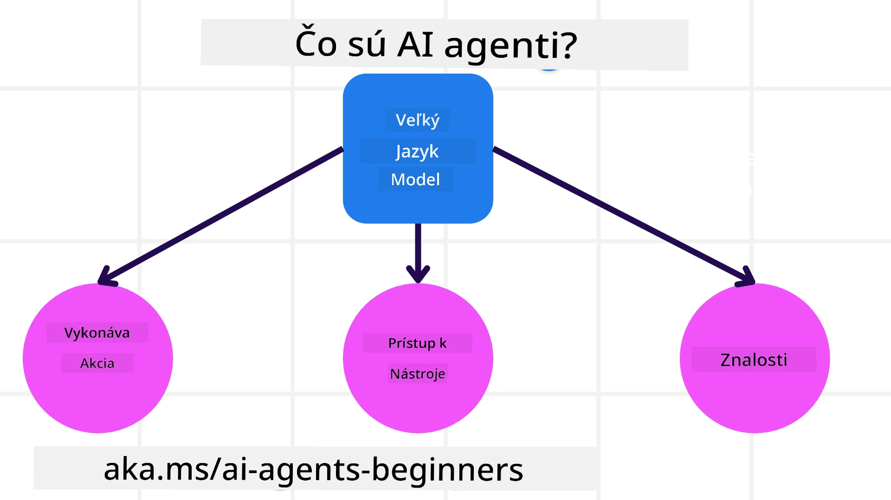
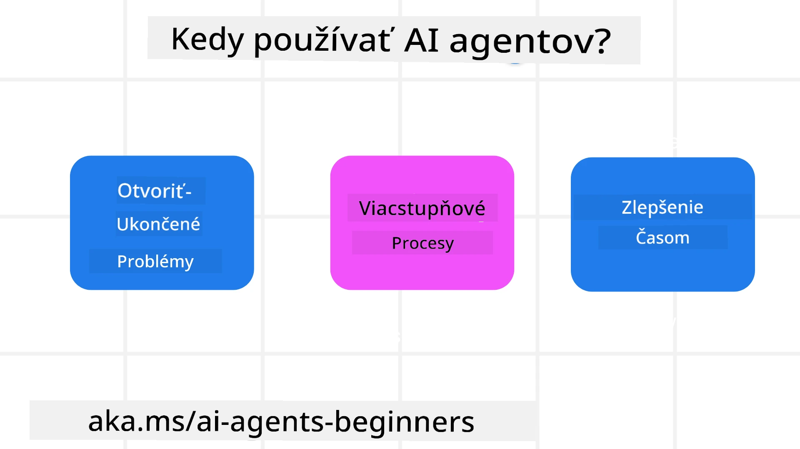

<!--
CO_OP_TRANSLATOR_METADATA:
{
  "original_hash": "cdd28bc00816d2773bb2b5968d782abc",
  "translation_date": "2025-11-11T11:36:24+00:00",
  "source_file": "01-intro-to-ai-agents/README.md",
  "language_code": "sk"
}
-->

> _(Kliknite na obrázok vyššie, aby ste si pozreli video k tejto lekcii)_

# Úvod do AI agentov a ich využitia

Vitajte v kurze "AI agenti pre začiatočníkov"! Tento kurz poskytuje základné znalosti a praktické príklady na vytváranie AI agentov.

Pripojte sa k <a href="https://discord.gg/kzRShWzttr" target="_blank">Azure AI Discord komunite</a>, kde môžete stretnúť ďalších študentov a tvorcov AI agentov a klásť otázky týkajúce sa tohto kurzu.

Na začiatku kurzu sa zameriame na lepšie pochopenie toho, čo sú AI agenti a ako ich môžeme využiť v aplikáciách a pracovných postupoch, ktoré vytvárame.

## Úvod

Táto lekcia pokrýva:

- Čo sú AI agenti a aké sú rôzne typy agentov?
- Aké prípady použitia sú najvhodnejšie pre AI agentov a ako nám môžu pomôcť?
- Aké sú základné stavebné bloky pri navrhovaní agentických riešení?

## Ciele učenia
Po absolvovaní tejto lekcie by ste mali byť schopní:

- Pochopiť koncepty AI agentov a ako sa líšia od iných AI riešení.
- Efektívne aplikovať AI agentov.
- Produktívne navrhovať agentické riešenia pre používateľov aj zákazníkov.

## Definovanie AI agentov a typy AI agentov

### Čo sú AI agenti?

AI agenti sú **systémy**, ktoré umožňujú **veľkým jazykovým modelom (LLMs)** **vykonávať akcie** tým, že rozširujú ich schopnosti a poskytujú im **prístup k nástrojom** a **vedomostiam**.

Rozdeľme túto definíciu na menšie časti:

- **Systém** - Je dôležité myslieť na agentov nie ako na jeden komponent, ale ako na systém mnohých komponentov. Na základnej úrovni sú komponenty AI agenta:
  - **Prostredie** - Definovaný priestor, v ktorom AI agent operuje. Napríklad, ak máme AI agenta na rezerváciu cestovania, prostredím môže byť systém rezervácie cestovania, ktorý agent používa na dokončenie úloh.
  - **Senzory** - Prostredia obsahujú informácie a poskytujú spätnú väzbu. AI agenti používajú senzory na zhromažďovanie a interpretáciu týchto informácií o aktuálnom stave prostredia. V príklade agenta na rezerváciu cestovania môže systém poskytovať informácie, ako je dostupnosť hotelov alebo ceny letov.
  - **Aktuátory** - Keď AI agent získa aktuálny stav prostredia, pre danú úlohu určí, akú akciu vykonať na zmenu prostredia. Pre agenta na rezerváciu cestovania to môže byť rezervácia dostupnej izby pre používateľa.

**Veľké jazykové modely** - Koncept agentov existoval už pred vznikom LLMs. Výhodou budovania AI agentov s LLMs je ich schopnosť interpretovať ľudský jazyk a dáta. Táto schopnosť umožňuje LLMs interpretovať informácie z prostredia a definovať plán na jeho zmenu.

**Vykonávanie akcií** - Mimo systémov AI agentov sú LLMs obmedzené na situácie, kde akciou je generovanie obsahu alebo informácií na základe požiadavky používateľa. V rámci systémov AI agentov môžu LLMs vykonávať úlohy interpretáciou požiadavky používateľa a využívaním nástrojov dostupných v ich prostredí.

**Prístup k nástrojom** - Aké nástroje má LLM k dispozícii, je definované 1) prostredím, v ktorom operuje, a 2) vývojárom AI agenta. V našom príklade cestovného agenta sú nástroje agenta obmedzené operáciami dostupnými v systéme rezervácie, a/alebo vývojár môže obmedziť prístup agenta k nástrojom na lety.

**Pamäť + vedomosti** - Pamäť môže byť krátkodobá v kontexte konverzácie medzi používateľom a agentom. Dlhodobo, mimo informácií poskytovaných prostredím, môžu AI agenti získavať vedomosti z iných systémov, služieb, nástrojov a dokonca aj od iných agentov. V príklade cestovného agenta môžu byť tieto vedomosti informácie o preferenciách používateľa uložené v zákazníckej databáze.

### Rôzne typy agentov

Teraz, keď máme všeobecnú definíciu AI agentov, pozrime sa na konkrétne typy agentov a ako by sa mohli aplikovať na AI agenta na rezerváciu cestovania.

| **Typ agenta**                | **Popis**                                                                                                                       | **Príklad**                                                                                                                                                                                                                   |
| ----------------------------- | -------------------------------------------------------------------------------------------------------------------------------- | ----------------------------------------------------------------------------------------------------------------------------------------------------------------------------------------------------------------------------- |
| **Jednoduchí reflexní agenti**      | Vykonávajú okamžité akcie na základe preddefinovaných pravidiel.                                                                                  | Cestovný agent interpretuje kontext e-mailu a presmeruje sťažnosti na cestovanie na zákaznícky servis.                                                                                                                          |
| **Modelovo založení reflexní agenti** | Vykonávajú akcie na základe modelu sveta a zmien v tomto modeli.                                                              | Cestovný agent uprednostňuje trasy s významnými zmenami cien na základe prístupu k historickým údajom o cenách.                                                                                                             |
| **Agenti založení na cieľoch**         | Vytvárajú plány na dosiahnutie konkrétnych cieľov interpretáciou cieľa a určením akcií na jeho dosiahnutie.                                  | Cestovný agent rezervuje cestu určením potrebných cestovných opatrení (auto, verejná doprava, lety) z aktuálnej polohy do cieľovej destinácie.                                                                                |
| **Agenti založení na užitočnosti**      | Zohľadňujú preferencie a numericky vyhodnocujú kompromisy na určenie, ako dosiahnuť ciele.                                               | Cestovný agent maximalizuje užitočnosť vyhodnotením pohodlia vs. nákladov pri rezervácii cestovania.                                                                                                                                          |
| **Učiaci sa agenti**           | Zlepšujú sa časom reagovaním na spätnú väzbu a prispôsobovaním akcií.                                                        | Cestovný agent sa zlepšuje používaním spätnej väzby od zákazníkov z dotazníkov po ceste na úpravu budúcich rezervácií.                                                                                                               |
| **Hierarchickí agenti**       | Obsahujú viacero agentov v hierarchickom systéme, kde agenti na vyššej úrovni rozdeľujú úlohy na podúlohy pre agentov na nižšej úrovni. | Cestovný agent ruší cestu rozdelením úlohy na podúlohy (napríklad zrušenie konkrétnych rezervácií) a agenti na nižšej úrovni ich dokončujú, pričom podávajú správy agentovi na vyššej úrovni.                                     |
| **Systémy viacerých agentov (MAS)** | Agenti vykonávajú úlohy nezávisle, buď kooperatívne alebo konkurenčne.                                                           | Kooperatívne: Viacerí agenti rezervujú konkrétne cestovné služby, ako sú hotely, lety a zábava. Konkurenčne: Viacerí agenti spravujú a súťažia o zdieľaný kalendár rezervácií hotelov na rezerváciu zákazníkov do hotela. |

## Kedy používať AI agentov

V predchádzajúcej časti sme použili prípad použitia cestovného agenta na vysvetlenie, ako sa rôzne typy agentov môžu použiť v rôznych scenároch rezervácie cestovania. Tento príklad budeme používať počas celého kurzu.

Pozrime sa na typy prípadov použitia, na ktoré sú AI agenti najvhodnejší:

- **Otvorené problémy** - umožnenie LLM určiť potrebné kroky na dokončenie úlohy, pretože ich nie je vždy možné pevne zakódovať do pracovného postupu.
- **Procesy s viacerými krokmi** - úlohy, ktoré vyžadujú určitú úroveň zložitosti, pri ktorej AI agent potrebuje používať nástroje alebo informácie počas viacerých krokov namiesto jednorazového získania.
- **Zlepšovanie časom** - úlohy, pri ktorých sa agent môže zlepšovať časom prijímaním spätnej väzby buď od svojho prostredia alebo používateľov, aby poskytoval lepšiu užitočnosť.

Viac úvah o používaní AI agentov pokrývame v lekcii Budovanie dôveryhodných AI agentov.

## Základy agentických riešení

### Vývoj agenta

Prvým krokom pri navrhovaní systému AI agenta je definovanie nástrojov, akcií a správania. V tomto kurze sa zameriavame na používanie **Azure AI Agent Service** na definovanie našich agentov. Ponúka funkcie ako:

- Výber otvorených modelov, ako sú OpenAI, Mistral a Llama
- Používanie licencovaných údajov prostredníctvom poskytovateľov, ako je Tripadvisor
- Používanie štandardizovaných nástrojov OpenAPI 3.0

### Agentické vzory

Komunikácia s LLMs prebieha prostredníctvom promptov. Vzhľadom na poloautonómnu povahu AI agentov nie je vždy možné alebo potrebné manuálne znovu promptovať LLM po zmene prostredia. Používame **agentické vzory**, ktoré nám umožňujú promptovať LLM počas viacerých krokov škálovateľnejším spôsobom.

Tento kurz je rozdelený na niektoré z aktuálne populárnych agentických vzorov.

### Agentické rámce

Agentické rámce umožňujú vývojárom implementovať agentické vzory prostredníctvom kódu. Tieto rámce ponúkajú šablóny, pluginy a nástroje na lepšiu spoluprácu AI agentov. Tieto výhody poskytujú schopnosti na lepšiu pozorovateľnosť a riešenie problémov systémov AI agentov.

V tomto kurze preskúmame výskumom podložený rámec AutoGen a produkčne pripravený rámec Agent od Semantic Kernel.

## Ukážkové kódy

- Python: [Agent Framework](./code_samples/01-python-agent-framework.ipynb)
- .NET: [Agent Framework](./code_samples/01-dotnet-agent-framework.md)

## Máte ďalšie otázky o AI agentoch?

Pripojte sa k [Azure AI Foundry Discord](https://aka.ms/ai-agents/discord), kde môžete stretnúť ďalších študentov, zúčastniť sa konzultačných hodín a získať odpovede na vaše otázky o AI agentoch.

## Predchádzajúca lekcia

[Nastavenie kurzu](../00-course-setup/README.md)

## Nasledujúca lekcia

[Preskúmanie agentických rámcov](../02-explore-agentic-frameworks/README.md)

---

<!-- CO-OP TRANSLATOR DISCLAIMER START -->
**Zrieknutie sa zodpovednosti**:  
Tento dokument bol preložený pomocou služby AI prekladu [Co-op Translator](https://github.com/Azure/co-op-translator). Aj keď sa snažíme o presnosť, prosím, berte na vedomie, že automatizované preklady môžu obsahovať chyby alebo nepresnosti. Pôvodný dokument v jeho pôvodnom jazyku by mal byť považovaný za autoritatívny zdroj. Pre kritické informácie sa odporúča profesionálny ľudský preklad. Nenesieme zodpovednosť za akékoľvek nedorozumenia alebo nesprávne interpretácie vyplývajúce z použitia tohto prekladu.
<!-- CO-OP TRANSLATOR DISCLAIMER END -->