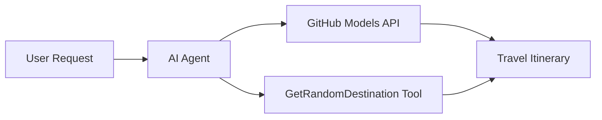

<!--
CO_OP_TRANSLATOR_METADATA:
{
  "original_hash": "5f351412e934f0833c8c821a0a60efaf",
  "translation_date": "2025-11-13T13:52:43+00:00",
  "source_file": "01-intro-to-ai-agents/code_samples/01-dotnet-agent-framework.md",
  "language_code": "sk"
}
-->
# 🌍 AI Cestovný Agent s Microsoft Agent Framework (.NET)

## 📋 Prehľad Scenára

Tento príklad ukazuje, ako vytvoriť inteligentného agenta na plánovanie ciest pomocou Microsoft Agent Framework pre .NET. Agent dokáže automaticky generovať personalizované itineráre na jednodňové výlety do náhodných destinácií po celom svete.

### Hlavné Schopnosti:

- 🎲 **Náhodný Výber Destinácie**: Používa vlastný nástroj na výber dovolenkových miest
- 🗺️ **Inteligentné Plánovanie Ciest**: Vytvára podrobné itineráre deň po dni
- 🔄 **Streamovanie v Reálnom Čase**: Podporuje okamžité aj streamované odpovede
- 🛠️ **Integrácia Vlastných Nástrojov**: Ukazuje, ako rozšíriť schopnosti agenta

## 🔧 Technická Architektúra

### Základné Technológie

- **Microsoft Agent Framework**: Najnovšia implementácia pre vývoj AI agentov v .NET
- **Integrácia GitHub Models**: Používa inferenčnú službu AI modelov od GitHubu
- **Kompatibilita s OpenAI API**: Využíva knižnice klientov OpenAI s vlastnými endpointmi
- **Bezpečná Konfigurácia**: Správa API kľúčov na základe prostredia

### Kľúčové Komponenty

1. **AIAgent**: Hlavný orchestrátor agenta, ktorý spracováva tok konverzácie
2. **Vlastné Nástroje**: Funkcia `GetRandomDestination()` dostupná pre agenta
3. **Chat Klient**: Rozhranie pre konverzáciu podporované GitHub Models
4. **Podpora Streamovania**: Schopnosť generovať odpovede v reálnom čase

### Vzor Integrácie



## 🚀 Začíname

### Predpoklady

- [.NET 10 SDK](https://dotnet.microsoft.com/download/dotnet/10.0) alebo novší
- [Prístupový token pre GitHub Models API](https://docs.github.com/github-models/github-models-at-scale/using-your-own-api-keys-in-github-models)

### Požadované Premenné Prostredia

```bash
# zsh/bash
export GH_TOKEN=<your_github_token>
export GH_ENDPOINT=https://models.github.ai/inference
export GH_MODEL_ID=openai/gpt-5-mini
```

```powershell
# PowerShell
$env:GH_TOKEN = "<your_github_token>"
$env:GH_ENDPOINT = "https://models.github.ai/inference"
$env:GH_MODEL_ID = "openai/gpt-5-mini"
```

### Ukážkový Kód

Na spustenie ukážkového kódu,

```bash
# zsh/bash
chmod +x ./01-dotnet-agent-framework.cs
./01-dotnet-agent-framework.cs
```

Alebo pomocou dotnet CLI:

```bash
dotnet run ./01-dotnet-agent-framework.cs
```

Pozrite si [`01-dotnet-agent-framework.cs`](../../../../01-intro-to-ai-agents/code_samples/01-dotnet-agent-framework.cs) pre kompletný kód.

```csharp
#!/usr/bin/dotnet run

#:package Microsoft.Extensions.AI@9.*
#:package Microsoft.Agents.AI.OpenAI@1.*-*

using System.ClientModel;
using System.ComponentModel;

using Microsoft.Agents.AI;
using Microsoft.Extensions.AI;

using OpenAI;

// Tool Function: Random Destination Generator
// This static method will be available to the agent as a callable tool
// The [Description] attribute helps the AI understand when to use this function
// This demonstrates how to create custom tools for AI agents
[Description("Provides a random vacation destination.")]
static string GetRandomDestination()
{
    // List of popular vacation destinations around the world
    // The agent will randomly select from these options
    var destinations = new List<string>
    {
        "Paris, France",
        "Tokyo, Japan",
        "New York City, USA",
        "Sydney, Australia",
        "Rome, Italy",
        "Barcelona, Spain",
        "Cape Town, South Africa",
        "Rio de Janeiro, Brazil",
        "Bangkok, Thailand",
        "Vancouver, Canada"
    };

    // Generate random index and return selected destination
    // Uses System.Random for simple random selection
    var random = new Random();
    int index = random.Next(destinations.Count);
    return destinations[index];
}

// Extract configuration from environment variables
// Retrieve the GitHub Models API endpoint, defaults to https://models.github.ai/inference if not specified
// Retrieve the model ID, defaults to openai/gpt-5-mini if not specified
// Retrieve the GitHub token for authentication, throws exception if not specified
var github_endpoint = Environment.GetEnvironmentVariable("GH_ENDPOINT") ?? "https://models.github.ai/inference";
var github_model_id = Environment.GetEnvironmentVariable("GH_MODEL_ID") ?? "openai/gpt-5-mini";
var github_token = Environment.GetEnvironmentVariable("GH_TOKEN") ?? throw new InvalidOperationException("GH_TOKEN is not set.");

// Configure OpenAI Client Options
// Create configuration options to point to GitHub Models endpoint
// This redirects OpenAI client calls to GitHub's model inference service
var openAIOptions = new OpenAIClientOptions()
{
    Endpoint = new Uri(github_endpoint)
};

// Initialize OpenAI Client with GitHub Models Configuration
// Create OpenAI client using GitHub token for authentication
// Configure it to use GitHub Models endpoint instead of OpenAI directly
var openAIClient = new OpenAIClient(new ApiKeyCredential(github_token), openAIOptions);

// Create AI Agent with Travel Planning Capabilities
// Initialize OpenAI client, get chat client for specified model, and create AI agent
// Configure agent with travel planning instructions and random destination tool
// The agent can now plan trips using the GetRandomDestination function
AIAgent agent = openAIClient
    .GetChatClient(github_model_id)
    .CreateAIAgent(
        instructions: "You are a helpful AI Agent that can help plan vacations for customers at random destinations",
        tools: [AIFunctionFactory.Create(GetRandomDestination)]
    );

// Execute Agent: Plan a Day Trip
// Run the agent with streaming enabled for real-time response display
// Shows the agent's thinking and response as it generates the content
// Provides better user experience with immediate feedback
await foreach (var update in agent.RunStreamingAsync("Plan me a day trip"))
{
    await Task.Delay(10);
    Console.Write(update);
}
```

## 🎓 Kľúčové Zistenia

1. **Architektúra Agenta**: Microsoft Agent Framework poskytuje čistý, typovo bezpečný prístup k vývoju AI agentov v .NET
2. **Integrácia Nástrojov**: Funkcie označené atribútmi `[Description]` sa stávajú dostupnými nástrojmi pre agenta
3. **Správa Konfigurácie**: Premenné prostredia a bezpečné spracovanie poverení nasledujú najlepšie praktiky .NET
4. **Kompatibilita s OpenAI**: Integrácia GitHub Models funguje bezproblémovo cez OpenAI-kompatibilné API

## 🔗 Ďalšie Zdroje

- [Dokumentácia Microsoft Agent Framework](https://learn.microsoft.com/agent-framework)
- [GitHub Models Marketplace](https://github.com/marketplace?type=models)
- [Microsoft.Extensions.AI](https://learn.microsoft.com/dotnet/ai/microsoft-extensions-ai)
- [.NET Single File Apps](https://devblogs.microsoft.com/dotnet/announcing-dotnet-run-app)

---

<!-- CO-OP TRANSLATOR DISCLAIMER START -->
**Zrieknutie sa zodpovednosti**:  
Tento dokument bol preložený pomocou služby AI prekladu [Co-op Translator](https://github.com/Azure/co-op-translator). Hoci sa snažíme o presnosť, prosím, berte na vedomie, že automatizované preklady môžu obsahovať chyby alebo nepresnosti. Pôvodný dokument v jeho rodnom jazyku by mal byť považovaný za autoritatívny zdroj. Pre kritické informácie sa odporúča profesionálny ľudský preklad. Nenesieme zodpovednosť za akékoľvek nedorozumenia alebo nesprávne interpretácie vyplývajúce z použitia tohto prekladu.
<!-- CO-OP TRANSLATOR DISCLAIMER END -->