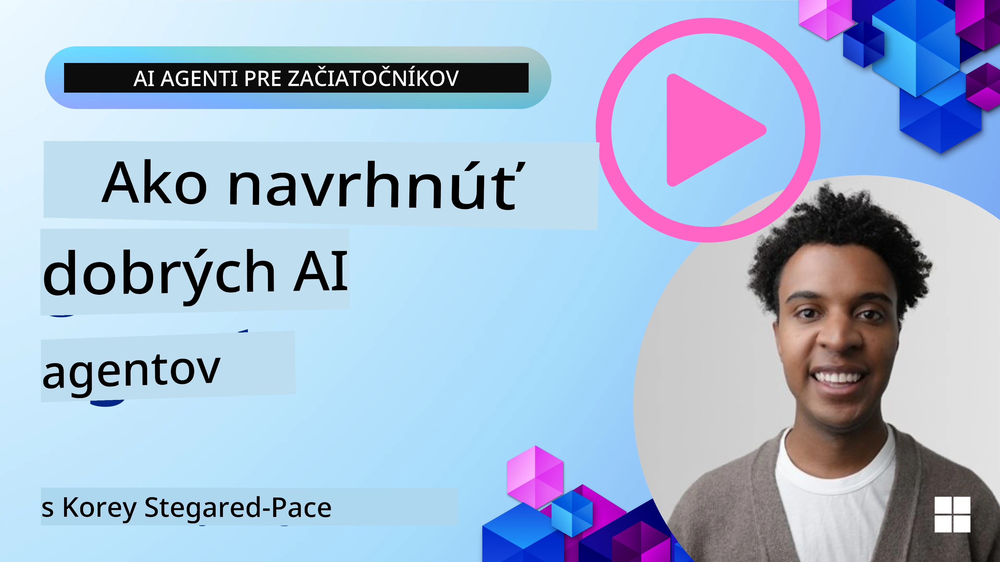
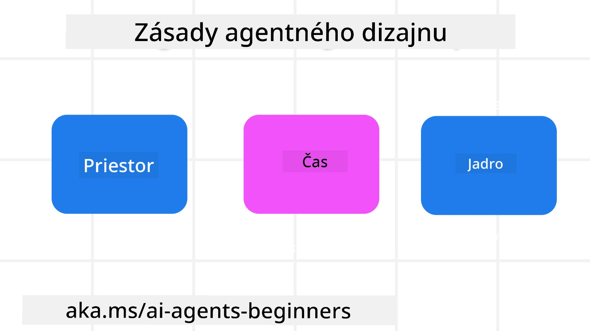

<!--
CO_OP_TRANSLATOR_METADATA:
{
  "original_hash": "d71524fe83a23829ae7a23b4031aaac8",
  "translation_date": "2025-11-13T13:57:48+00:00",
  "source_file": "03-agentic-design-patterns/README.md",
  "language_code": "sk"
}
-->

> _(Kliknite na obrázok vyššie, aby ste si pozreli video k tejto lekcii)_
# Princípy dizajnu agentov AI

## Úvod

Existuje mnoho spôsobov, ako premýšľať o budovaní systémov AI agentov. Keďže nejednoznačnosť je vlastnosťou, a nie chybou v dizajne generatívnej AI, je pre inžinierov niekedy ťažké zistiť, kde vôbec začať. Vytvorili sme súbor princípov dizajnu UX zameraných na človeka, ktoré umožnia vývojárom budovať systémy agentov zamerané na zákazníka, aby vyriešili svoje obchodné potreby. Tieto princípy dizajnu nie sú predpisovou architektúrou, ale skôr východiskovým bodom pre tímy, ktoré definujú a budujú skúsenosti s agentmi.

Vo všeobecnosti by agenti mali:

- Rozširovať a škálovať ľudské schopnosti (brainstorming, riešenie problémov, automatizácia atď.)
- Vyplniť medzery v znalostiach (dostať ma do obrazu v oblasti znalostí, preklad atď.)
- Uľahčiť a podporovať spoluprácu spôsobmi, ktoré preferujeme ako jednotlivci pri práci s ostatnými
- Urobiť z nás lepšie verzie samých seba (napr. životný kouč/organizátor úloh, pomoc pri učení sa emocionálnej regulácie a zručností v oblasti všímavosti, budovanie odolnosti atď.)

## Táto lekcia pokryje

- Čo sú princípy dizajnu agentov
- Aké sú niektoré pokyny na implementáciu týchto princípov dizajnu
- Aké sú niektoré príklady použitia princípov dizajnu

## Ciele učenia

Po dokončení tejto lekcie budete schopní:

1. Vysvetliť, čo sú princípy dizajnu agentov
2. Vysvetliť pokyny na používanie princípov dizajnu agentov
3. Pochopiť, ako vytvoriť agenta pomocou princípov dizajnu agentov

## Princípy dizajnu agentov

### Agent (Priestor)

Toto je prostredie, v ktorom agent funguje. Tieto princípy informujú o tom, ako navrhujeme agentov na zapojenie sa do fyzických a digitálnych svetov.

- **Spojenie, nie zrútenie** – pomáhať spájať ľudí s inými ľuďmi, udalosťami a akčnými znalosťami na umožnenie spolupráce a spojenia.
- Agenti pomáhajú spájať udalosti, znalosti a ľudí.
- Agenti približujú ľudí k sebe. Nie sú navrhnutí na nahradenie alebo znevažovanie ľudí.
- **Ľahko dostupní, no občas neviditeľní** – agent funguje prevažne na pozadí a upozorňuje nás len vtedy, keď je to relevantné a vhodné.
  - Agent je ľahko objaviteľný a dostupný pre autorizovaných používateľov na akomkoľvek zariadení alebo platforme.
  - Agent podporuje multimodálne vstupy a výstupy (zvuk, hlas, text atď.).
  - Agent dokáže plynulo prechádzať medzi popredím a pozadím; medzi proaktívnym a reaktívnym, v závislosti od vnímania potrieb používateľa.
  - Agent môže fungovať v neviditeľnej forme, no jeho procesy na pozadí a spolupráca s inými agentmi sú pre používateľa transparentné a kontrolovateľné.

### Agent (Čas)

Toto je spôsob, akým agent funguje v priebehu času. Tieto princípy informujú o tom, ako navrhujeme agentov interagujúcich naprieč minulosťou, prítomnosťou a budúcnosťou.

- **Minulosť**: Reflexia histórie, ktorá zahŕňa stav aj kontext.
  - Agent poskytuje relevantnejšie výsledky na základe analýzy bohatších historických údajov, nielen udalostí, ľudí alebo stavov.
  - Agent vytvára spojenia z minulých udalostí a aktívne reflektuje pamäť na zapojenie sa do aktuálnych situácií.
- **Prítomnosť**: Narážanie viac než upozorňovanie.
  - Agent stelesňuje komplexný prístup k interakcii s ľuďmi. Keď sa udalosť stane, agent ide nad rámec statického upozornenia alebo inej statickej formality. Agent dokáže zjednodušiť procesy alebo dynamicky generovať podnety na nasmerovanie pozornosti používateľa v správnom momente.
  - Agent poskytuje informácie na základe kontextového prostredia, sociálnych a kultúrnych zmien a prispôsobené zámeru používateľa.
  - Interakcia s agentom môže byť postupná, vyvíjajúca sa/rozrastajúca sa v komplexnosti na posilnenie používateľov v dlhodobom horizonte.
- **Budúcnosť**: Prispôsobovanie sa a vývoj.
  - Agent sa prispôsobuje rôznym zariadeniam, platformám a modalitám.
  - Agent sa prispôsobuje správaniu používateľa, potrebám prístupnosti a je voľne prispôsobiteľný.
  - Agent je formovaný a vyvíja sa prostredníctvom neustálej interakcie s používateľom.

### Agent (Jadro)

Toto sú kľúčové prvky v jadre dizajnu agenta.

- **Prijímajte neistotu, ale budujte dôveru**.
  - Určitá úroveň neistoty agenta sa očakáva. Neistota je kľúčovým prvkom dizajnu agenta.
  - Dôvera a transparentnosť sú základné vrstvy dizajnu agenta.
  - Ľudia majú kontrolu nad tým, kedy je agent zapnutý/vypnutý a stav agenta je vždy jasne viditeľný.

## Pokyny na implementáciu týchto princípov

Pri používaní predchádzajúcich princípov dizajnu použite nasledujúce pokyny:

1. **Transparentnosť**: Informujte používateľa, že je zapojená AI, ako funguje (vrátane minulých akcií) a ako poskytnúť spätnú väzbu a upraviť systém.
2. **Kontrola**: Umožnite používateľovi prispôsobiť, špecifikovať preferencie a personalizovať, a mať kontrolu nad systémom a jeho atribútmi (vrátane schopnosti zabudnúť).
3. **Konzistentnosť**: Snažte sa o konzistentné, multimodálne skúsenosti naprieč zariadeniami a koncovými bodmi. Používajte známe prvky UI/UX, kde je to možné (napr. ikona mikrofónu pre hlasovú interakciu) a čo najviac znižujte kognitívnu záťaž zákazníka (napr. snažte sa o stručné odpovede, vizuálne pomôcky a obsah „Viac informácií“).

## Ako navrhnúť cestovného agenta pomocou týchto princípov a pokynov

Predstavte si, že navrhujete cestovného agenta, tu je spôsob, ako by ste mohli premýšľať o použití princípov dizajnu a pokynov:

1. **Transparentnosť** – Informujte používateľa, že cestovný agent je agent s podporou AI. Poskytnite základné pokyny, ako začať (napr. „Ahoj“ správa, ukážkové výzvy). Jasne to dokumentujte na produktovej stránke. Zobrazte zoznam výziev, ktoré používateľ v minulosti zadal. Urobte jasným, ako poskytnúť spätnú väzbu (palec hore a dole, tlačidlo Poslať spätnú väzbu atď.). Jasne artikulujte, či má agent obmedzenia používania alebo témy.
2. **Kontrola** – Uistite sa, že je jasné, ako môže používateľ upraviť agenta po jeho vytvorení pomocou vecí, ako je systémová výzva. Umožnite používateľovi zvoliť, aký podrobný má byť agent, jeho štýl písania a akékoľvek obmedzenia na témy, o ktorých by agent nemal hovoriť. Umožnite používateľovi prezerať a mazať akékoľvek súvisiace súbory alebo údaje, výzvy a minulé konverzácie.
3. **Konzistentnosť** – Uistite sa, že ikony pre Zdieľať výzvu, pridať súbor alebo fotografiu a označiť niekoho alebo niečo sú štandardné a rozpoznateľné. Použite ikonu kancelárskej sponky na označenie nahrávania/zdieľania súborov s agentom a ikonu obrázka na označenie nahrávania grafiky.

## Ukážkové kódy

- Python: [Agent Framework](./code_samples/03-python-agent-framework.ipynb)
- .NET: [Agent Framework](./code_samples/03-dotnet-agent-framework.md)

## Máte ďalšie otázky o vzoroch dizajnu agentov AI?

Pripojte sa k [Azure AI Foundry Discord](https://aka.ms/ai-agents/discord), aby ste sa stretli s ostatnými študentmi, zúčastnili sa konzultačných hodín a získali odpovede na svoje otázky o agentoch AI.

## Ďalšie zdroje

- <a href="https://openai.com" target="_blank">Praktiky pre správu agentických AI systémov | OpenAI</a>
- <a href="https://microsoft.com" target="_blank">Projekt HAX Toolkit - Microsoft Research</a>
- <a href="https://responsibleaitoolbox.ai" target="_blank">Responsible AI Toolbox</a>

## Predchádzajúca lekcia

[Preskúmanie agentických rámcov](../02-explore-agentic-frameworks/README.md)

## Nasledujúca lekcia

[Vzor dizajnu používania nástrojov](../04-tool-use/README.md)

---

<!-- CO-OP TRANSLATOR DISCLAIMER START -->
**Upozornenie**:  
Tento dokument bol preložený pomocou služby AI prekladu [Co-op Translator](https://github.com/Azure/co-op-translator). Hoci sa snažíme o presnosť, prosím, berte na vedomie, že automatizované preklady môžu obsahovať chyby alebo nepresnosti. Pôvodný dokument v jeho rodnom jazyku by mal byť považovaný za autoritatívny zdroj. Pre kritické informácie sa odporúča profesionálny ľudský preklad. Nie sme zodpovední za žiadne nedorozumenia alebo nesprávne interpretácie vyplývajúce z použitia tohto prekladu.
<!-- CO-OP TRANSLATOR DISCLAIMER END -->