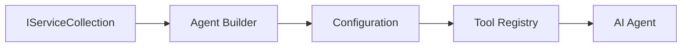

<!--
CO_OP_TRANSLATOR_METADATA:
{
  "original_hash": "bcc874e190347bd6a095aed56dc16de8",
  "translation_date": "2025-11-13T13:59:06+00:00",
  "source_file": "03-agentic-design-patterns/code_samples/03-dotnet-agent-framework.md",
  "language_code": "sk"
}
-->
# 🎨 Agentické návrhové vzory s GitHub modelmi (.NET)

## 📋 Ciele učenia

Tento príklad demonštruje návrhové vzory na podnikovej úrovni pre vytváranie inteligentných agentov pomocou Microsoft Agent Framework v .NET s integráciou GitHub modelov. Naučíte sa profesionálne vzory a architektonické prístupy, ktoré robia agentov pripravenými na produkciu, udržiavateľnými a škálovateľnými.

### Podnikové návrhové vzory

- 🏭 **Factory Pattern**: Štandardizovaná tvorba agentov s injekciou závislostí
- 🔧 **Builder Pattern**: Plynulá konfigurácia a nastavenie agentov
- 🧵 **Thread-Safe Patterns**: Správa súbežných konverzácií
- 📋 **Repository Pattern**: Organizovaná správa nástrojov a schopností

## 🎯 Architektonické výhody .NET

### Podnikové funkcie

- **Silné typovanie**: Validácia počas kompilácie a podpora IntelliSense
- **Injekcia závislostí**: Integrovaný DI kontajner
- **Správa konfigurácie**: Vzory IConfiguration a Options
- **Async/Await**: Prvotriedna podpora asynchrónneho programovania

### Vzory pripravené na produkciu

- **Integrácia logovania**: Podpora ILogger a štruktúrovaného logovania
- **Kontroly zdravia**: Integrované monitorovanie a diagnostika
- **Validácia konfigurácie**: Silné typovanie s anotáciami dát
- **Správa chýb**: Štruktúrované riadenie výnimiek

## 🔧 Technická architektúra

### Základné komponenty .NET

- **Microsoft.Extensions.AI**: Zjednotené abstrakcie AI služieb
- **Microsoft.Agents.AI**: Rámec pre orchestráciu agentov na podnikovej úrovni
- **Integrácia GitHub modelov**: Vzory API klientov s vysokým výkonom
- **Systém konfigurácie**: Integrácia appsettings.json a prostredia

### Implementácia návrhových vzorov



## 🏗️ Demonštrované podnikové vzory

### 1. **Kreacionálne vzory**

- **Agent Factory**: Centralizovaná tvorba agentov s konzistentnou konfiguráciou
- **Builder Pattern**: Plynulé API pre komplexnú konfiguráciu agentov
- **Singleton Pattern**: Správa zdieľaných zdrojov a konfigurácie
- **Injekcia závislostí**: Voľné prepojenie a testovateľnosť

### 2. **Behaviorálne vzory**

- **Strategy Pattern**: Zameniteľné stratégie vykonávania nástrojov
- **Command Pattern**: Zapuzdrené operácie agentov s undo/redo
- **Observer Pattern**: Riadenie životného cyklu agentov na základe udalostí
- **Template Method**: Štandardizované pracovné postupy vykonávania agentov

### 3. **Štrukturálne vzory**

- **Adapter Pattern**: Vrstva integrácie API GitHub modelov
- **Decorator Pattern**: Rozšírenie schopností agentov
- **Facade Pattern**: Zjednodušené rozhrania pre interakciu s agentmi
- **Proxy Pattern**: Lazy loading a caching pre výkon

## 📚 Návrhové princípy .NET

### SOLID princípy

- **Jednoduchá zodpovednosť**: Každá komponenta má jeden jasný účel
- **Otvorené/Zatvorené**: Rozšíriteľné bez modifikácie
- **Liskov substitúcia**: Implementácie nástrojov založené na rozhraní
- **Segregácia rozhraní**: Zamerané, súdržné rozhrania
- **Inverzia závislostí**: Závislosť na abstrakciách, nie na konkrétnych implementáciách

### Čistá architektúra

- **Doménová vrstva**: Základné abstrakcie agentov a nástrojov
- **Aplikačná vrstva**: Orchestrácia agentov a pracovné postupy
- **Infrastruktúrna vrstva**: Integrácia GitHub modelov a externých služieb
- **Prezentačná vrstva**: Interakcia s používateľom a formátovanie odpovedí

## 🔒 Podnikové úvahy

### Bezpečnosť

- **Správa poverení**: Bezpečné spracovanie API kľúčov pomocou IConfiguration
- **Validácia vstupov**: Silné typovanie a validácia pomocou anotácií dát
- **Sanitácia výstupov**: Bezpečné spracovanie a filtrovanie odpovedí
- **Audit logovanie**: Komplexné sledovanie operácií

### Výkon

- **Asynchrónne vzory**: Nezablokované I/O operácie
- **Pooling pripojení**: Efektívna správa HTTP klientov
- **Caching**: Ukladanie odpovedí pre zlepšenie výkonu
- **Správa zdrojov**: Správne uvoľňovanie a čistenie zdrojov

### Škálovateľnosť

- **Bezpečnosť vlákien**: Podpora súbežného vykonávania agentov
- **Pooling zdrojov**: Efektívne využívanie zdrojov
- **Správa záťaže**: Obmedzovanie rýchlosti a zvládanie preťaženia
- **Monitorovanie**: Výkonnostné metriky a kontroly zdravia

## 🚀 Nasadenie do produkcie

- **Správa konfigurácie**: Nastavenia špecifické pre prostredie
- **Stratégia logovania**: Štruktúrované logovanie s korelačnými ID
- **Správa chýb**: Globálne spracovanie výnimiek s riadnym zotavením
- **Monitorovanie**: Application Insights a výkonnostné počítadlá
- **Testovanie**: Vzory jednotkových testov, integračných testov a testovania záťaže

Pripravení vytvárať inteligentných agentov na podnikovej úrovni s .NET? Poďme navrhnúť niečo robustné! 🏢✨

## 🚀 Začíname

### Predpoklady

- [.NET 10 SDK](https://dotnet.microsoft.com/download/dotnet/10.0) alebo vyšší
- [Prístupový token API GitHub modelov](https://docs.github.com/github-models/github-models-at-scale/using-your-own-api-keys-in-github-models)

### Požadované environmentálne premenné

```bash
# zsh/bash
export GH_TOKEN=<your_github_token>
export GH_ENDPOINT=https://models.github.ai/inference
export GH_MODEL_ID=openai/gpt-5-mini
```

```powershell
# PowerShell
$env:GH_TOKEN = "<your_github_token>"
$env:GH_ENDPOINT = "https://models.github.ai/inference"
$env:GH_MODEL_ID = "openai/gpt-5-mini"
```

### Ukážkový kód

Na spustenie ukážkového kódu,

```bash
# zsh/bash
chmod +x ./03-dotnet-agent-framework.cs
./03-dotnet-agent-framework.cs
```

Alebo pomocou dotnet CLI:

```bash
dotnet run ./03-dotnet-agent-framework.cs
```

Pozrite si [`03-dotnet-agent-framework.cs`](../../../../03-agentic-design-patterns/code_samples/03-dotnet-agent-framework.cs) pre kompletný kód.

```csharp
#!/usr/bin/dotnet run

#:package Microsoft.Extensions.AI@10.*
#:package Microsoft.Agents.AI.OpenAI@1.*-*

using System.ClientModel;
using System.ComponentModel;

using Microsoft.Agents.AI;
using Microsoft.Extensions.AI;

using OpenAI;

// Tool Function: Random Destination Generator
// This static method will be available to the agent as a callable tool
// The [Description] attribute helps the AI understand when to use this function
// This demonstrates how to create custom tools for AI agents
[Description("Provides a random vacation destination.")]
static string GetRandomDestination()
{
    // List of popular vacation destinations around the world
    // The agent will randomly select from these options
    var destinations = new List<string>
    {
        "Paris, France",
        "Tokyo, Japan",
        "New York City, USA",
        "Sydney, Australia",
        "Rome, Italy",
        "Barcelona, Spain",
        "Cape Town, South Africa",
        "Rio de Janeiro, Brazil",
        "Bangkok, Thailand",
        "Vancouver, Canada"
    };

    // Generate random index and return selected destination
    // Uses System.Random for simple random selection
    var random = new Random();
    int index = random.Next(destinations.Count);
    return destinations[index];
}

// Extract configuration from environment variables
// Retrieve the GitHub Models API endpoint, defaults to https://models.github.ai/inference if not specified
// Retrieve the model ID, defaults to openai/gpt-5-mini if not specified
// Retrieve the GitHub token for authentication, throws exception if not specified
var github_endpoint = Environment.GetEnvironmentVariable("GH_ENDPOINT") ?? "https://models.github.ai/inference";
var github_model_id = Environment.GetEnvironmentVariable("GH_MODEL_ID") ?? "openai/gpt-5-mini";
var github_token = Environment.GetEnvironmentVariable("GH_TOKEN") ?? throw new InvalidOperationException("GH_TOKEN is not set.");

// Configure OpenAI Client Options
// Create configuration options to point to GitHub Models endpoint
// This redirects OpenAI client calls to GitHub's model inference service
var openAIOptions = new OpenAIClientOptions()
{
    Endpoint = new Uri(github_endpoint)
};

// Initialize OpenAI Client with GitHub Models Configuration
// Create OpenAI client using GitHub token for authentication
// Configure it to use GitHub Models endpoint instead of OpenAI directly
var openAIClient = new OpenAIClient(new ApiKeyCredential(github_token), openAIOptions);

// Define Agent Identity and Comprehensive Instructions
// Agent name for identification and logging purposes
var AGENT_NAME = "TravelAgent";

// Detailed instructions that define the agent's personality, capabilities, and behavior
// This system prompt shapes how the agent responds and interacts with users
var AGENT_INSTRUCTIONS = """
You are a helpful AI Agent that can help plan vacations for customers.

Important: When users specify a destination, always plan for that location. Only suggest random destinations when the user hasn't specified a preference.

When the conversation begins, introduce yourself with this message:
"Hello! I'm your TravelAgent assistant. I can help plan vacations and suggest interesting destinations for you. Here are some things you can ask me:
1. Plan a day trip to a specific location
2. Suggest a random vacation destination
3. Find destinations with specific features (beaches, mountains, historical sites, etc.)
4. Plan an alternative trip if you don't like my first suggestion

What kind of trip would you like me to help you plan today?"

Always prioritize user preferences. If they mention a specific destination like "Bali" or "Paris," focus your planning on that location rather than suggesting alternatives.
""";

// Create AI Agent with Advanced Travel Planning Capabilities
// Initialize complete agent pipeline: OpenAI client → Chat client → AI agent
// Configure agent with name, detailed instructions, and available tools
// This demonstrates the .NET agent creation pattern with full configuration
AIAgent agent = openAIClient
    .GetChatClient(github_model_id)
    .CreateAIAgent(
        name: AGENT_NAME,
        instructions: AGENT_INSTRUCTIONS,
        tools: [AIFunctionFactory.Create(GetRandomDestination)]
    );

// Create New Conversation Thread for Context Management
// Initialize a new conversation thread to maintain context across multiple interactions
// Threads enable the agent to remember previous exchanges and maintain conversational state
// This is essential for multi-turn conversations and contextual understanding
AgentThread thread = agent.GetNewThread();

// Execute Agent: First Travel Planning Request
// Run the agent with an initial request that will likely trigger the random destination tool
// The agent will analyze the request, use the GetRandomDestination tool, and create an itinerary
// Using the thread parameter maintains conversation context for subsequent interactions
await foreach (var update in agent.RunStreamingAsync("Plan me a day trip", thread))
{
    await Task.Delay(10);
    Console.Write(update);
}

Console.WriteLine();

// Execute Agent: Follow-up Request with Context Awareness
// Demonstrate contextual conversation by referencing the previous response
// The agent remembers the previous destination suggestion and will provide an alternative
// This showcases the power of conversation threads and contextual understanding in .NET agents
await foreach (var update in agent.RunStreamingAsync("I don't like that destination. Plan me another vacation.", thread))
{
    await Task.Delay(10);
    Console.Write(update);
}
```

---

<!-- CO-OP TRANSLATOR DISCLAIMER START -->
**Zrieknutie sa zodpovednosti**:  
Tento dokument bol preložený pomocou služby AI prekladu [Co-op Translator](https://github.com/Azure/co-op-translator). Hoci sa snažíme o presnosť, prosím, berte na vedomie, že automatizované preklady môžu obsahovať chyby alebo nepresnosti. Pôvodný dokument v jeho rodnom jazyku by mal byť považovaný za autoritatívny zdroj. Pre kritické informácie sa odporúča profesionálny ľudský preklad. Nenesieme zodpovednosť za akékoľvek nedorozumenia alebo nesprávne interpretácie vyplývajúce z použitia tohto prekladu.
<!-- CO-OP TRANSLATOR DISCLAIMER END -->