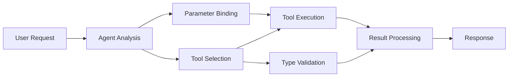

<!--
CO_OP_TRANSLATOR_METADATA:
{
  "original_hash": "91d6061e402489603f2ec8b528cae59b",
  "translation_date": "2025-11-18T18:14:44+00:00",
  "source_file": "04-tool-use/code_samples/04-dotnet-agent-framework.md",
  "language_code": "sk"
}
-->
# 🛠️ Pokročilé používanie nástrojov s GitHub modelmi (.NET)

## 📋 Ciele učenia

Tento notebook demonštruje vzory integrácie nástrojov na podnikovej úrovni pomocou Microsoft Agent Framework v .NET s GitHub modelmi. Naučíte sa vytvárať sofistikovaných agentov s viacerými špecializovanými nástrojmi, využívajúc silné typovanie C# a podnikové funkcie .NET.

### Pokročilé schopnosti nástrojov, ktoré zvládnete

- 🔧 **Architektúra s viacerými nástrojmi**: Vytváranie agentov s viacerými špecializovanými schopnosťami
- 🎯 **Typovo bezpečné vykonávanie nástrojov**: Využitie overovania počas kompilácie v C#
- 📊 **Vzory podnikových nástrojov**: Návrh nástrojov pripravených na produkciu a spracovanie chýb
- 🔗 **Kombinácia nástrojov**: Spájanie nástrojov pre zložité obchodné pracovné postupy

## 🎯 Výhody architektúry nástrojov v .NET

### Funkcie podnikových nástrojov

- **Overovanie počas kompilácie**: Silné typovanie zaisťuje správnosť parametrov nástrojov
- **Dependency Injection**: Integrácia IoC kontajnera na správu nástrojov
- **Async/Await vzory**: Nezablokované vykonávanie nástrojov so správnym riadením zdrojov
- **Štruktúrované logovanie**: Integrované logovanie na monitorovanie vykonávania nástrojov

### Vzory pripravené na produkciu

- **Spracovanie výnimiek**: Komplexné spracovanie chýb s typovanými výnimkami
- **Riadenie zdrojov**: Správne vzory likvidácie a správa pamäte
- **Monitorovanie výkonu**: Integrované metriky a ukazovatele výkonu
- **Správa konfigurácie**: Typovo bezpečná konfigurácia s overovaním

## 🔧 Technická architektúra

### Základné komponenty nástrojov v .NET

- **Microsoft.Extensions.AI**: Zjednotená vrstva abstrakcie nástrojov
- **Microsoft.Agents.AI**: Orchestrácia nástrojov na podnikovej úrovni
- **Integrácia GitHub modelov**: Vysokovýkonný API klient s poolingom pripojení

### Pipeline vykonávania nástrojov



## 🛠️ Kategórie a vzory nástrojov

### 1. **Nástroje na spracovanie dát**

- **Overovanie vstupov**: Silné typovanie s anotáciami dát
- **Transformačné operácie**: Typovo bezpečná konverzia a formátovanie dát
- **Obchodná logika**: Nástroje na výpočty a analýzy špecifické pre doménu
- **Formátovanie výstupov**: Generovanie štruktúrovaných odpovedí

### 2. **Integračné nástroje**

- **API konektory**: Integrácia RESTful služieb s HttpClient
- **Nástroje pre databázy**: Integrácia Entity Framework pre prístup k dátam
- **Operácie so súbormi**: Bezpečné operácie so súborovým systémom s overovaním
- **Externé služby**: Vzory integrácie služieb tretích strán

### 3. **Pomocné nástroje**

- **Spracovanie textu**: Nástroje na manipuláciu a formátovanie reťazcov
- **Operácie s dátumom/časom**: Výpočty dátumu/času s ohľadom na kultúru
- **Matematické nástroje**: Presné výpočty a štatistické operácie
- **Overovacie nástroje**: Overovanie obchodných pravidiel a verifikácia dát

Pripravení vytvárať agentov na podnikovej úrovni s výkonnými, typovo bezpečnými schopnosťami nástrojov v .NET? Poďme navrhnúť profesionálne riešenia! 🏢⚡

## 🚀 Začíname

### Predpoklady

- [.NET 10 SDK](https://dotnet.microsoft.com/download/dotnet/10.0) alebo vyšší
- [Prístupový token pre GitHub Models API](https://docs.github.com/github-models/github-models-at-scale/using-your-own-api-keys-in-github-models)

### Požadované premenné prostredia

```bash
# zsh/bash
export GH_TOKEN=<your_github_token>
export GH_ENDPOINT=https://models.github.ai/inference
export GH_MODEL_ID=openai/gpt-5-mini
```

```powershell
# PowerShell
$env:GH_TOKEN = "<your_github_token>"
$env:GH_ENDPOINT = "https://models.github.ai/inference"
$env:GH_MODEL_ID = "openai/gpt-5-mini"
```

### Ukážkový kód

Na spustenie ukážkového kódu,

```bash
# zsh/bash
chmod +x ./04-dotnet-agent-framework.cs
./04-dotnet-agent-framework.cs
```

Alebo pomocou dotnet CLI:

```bash
dotnet run ./04-dotnet-agent-framework.cs
```

Pozrite si [`04-dotnet-agent-framework.cs`](../../../../04-tool-use/code_samples/04-dotnet-agent-framework.cs) pre kompletný kód.

```csharp
#!/usr/bin/dotnet run

#:package Microsoft.Extensions.AI@10.*
#:package Microsoft.Agents.AI.OpenAI@1.*-*

using System.ClientModel;
using System.ComponentModel;

using Microsoft.Agents.AI;
using Microsoft.Extensions.AI;

using OpenAI;

// Tool Function: Random Destination Generator
// This static method will be available to the agent as a callable tool
// The [Description] attribute helps the AI understand when to use this function
// This demonstrates how to create custom tools for AI agents
[Description("Provides a random vacation destination.")]
static string GetRandomDestination()
{
    // List of popular vacation destinations around the world
    // The agent will randomly select from these options
    var destinations = new List<string>
    {
        "Paris, France",
        "Tokyo, Japan",
        "New York City, USA",
        "Sydney, Australia",
        "Rome, Italy",
        "Barcelona, Spain",
        "Cape Town, South Africa",
        "Rio de Janeiro, Brazil",
        "Bangkok, Thailand",
        "Vancouver, Canada"
    };

    // Generate random index and return selected destination
    // Uses System.Random for simple random selection
    var random = new Random();
    int index = random.Next(destinations.Count);
    return destinations[index];
}

// Extract configuration from environment variables
// Retrieve the GitHub Models API endpoint, defaults to https://models.github.ai/inference if not specified
// Retrieve the model ID, defaults to openai/gpt-5-mini if not specified
// Retrieve the GitHub token for authentication, throws exception if not specified
var github_endpoint = Environment.GetEnvironmentVariable("GH_ENDPOINT") ?? "https://models.github.ai/inference";
var github_model_id = Environment.GetEnvironmentVariable("GH_MODEL_ID") ?? "openai/gpt-5-mini";
var github_token = Environment.GetEnvironmentVariable("GH_TOKEN") ?? throw new InvalidOperationException("GH_TOKEN is not set.");

// Configure OpenAI Client Options
// Create configuration options to point to GitHub Models endpoint
// This redirects OpenAI client calls to GitHub's model inference service
var openAIOptions = new OpenAIClientOptions()
{
    Endpoint = new Uri(github_endpoint)
};

// Initialize OpenAI Client with GitHub Models Configuration
// Create OpenAI client using GitHub token for authentication
// Configure it to use GitHub Models endpoint instead of OpenAI directly
var openAIClient = new OpenAIClient(new ApiKeyCredential(github_token), openAIOptions);

// Define Agent Identity and Comprehensive Instructions
// Agent name for identification and logging purposes
var AGENT_NAME = "TravelAgent";

// Detailed instructions that define the agent's personality, capabilities, and behavior
// This system prompt shapes how the agent responds and interacts with users
var AGENT_INSTRUCTIONS = """
You are a helpful AI Agent that can help plan vacations for customers.

Important: When users specify a destination, always plan for that location. Only suggest random destinations when the user hasn't specified a preference.

When the conversation begins, introduce yourself with this message:
"Hello! I'm your TravelAgent assistant. I can help plan vacations and suggest interesting destinations for you. Here are some things you can ask me:
1. Plan a day trip to a specific location
2. Suggest a random vacation destination
3. Find destinations with specific features (beaches, mountains, historical sites, etc.)
4. Plan an alternative trip if you don't like my first suggestion

What kind of trip would you like me to help you plan today?"

Always prioritize user preferences. If they mention a specific destination like "Bali" or "Paris," focus your planning on that location rather than suggesting alternatives.
""";

// Create AI Agent with Advanced Travel Planning Capabilities
// Initialize complete agent pipeline: OpenAI client → Chat client → AI agent
// Configure agent with name, detailed instructions, and available tools
// This demonstrates the .NET agent creation pattern with full configuration
AIAgent agent = openAIClient
    .GetChatClient(github_model_id)
    .CreateAIAgent(
        name: AGENT_NAME,
        instructions: AGENT_INSTRUCTIONS,
        tools: [AIFunctionFactory.Create(GetRandomDestination)]
    );

// Create New Conversation Thread for Context Management
// Initialize a new conversation thread to maintain context across multiple interactions
// Threads enable the agent to remember previous exchanges and maintain conversational state
// This is essential for multi-turn conversations and contextual understanding
AgentThread thread = agent.GetNewThread();

// Execute Agent: First Travel Planning Request
// Run the agent with an initial request that will likely trigger the random destination tool
// The agent will analyze the request, use the GetRandomDestination tool, and create an itinerary
// Using the thread parameter maintains conversation context for subsequent interactions
await foreach (var update in agent.RunStreamingAsync("Plan me a day trip", thread))
{
    await Task.Delay(10);
    Console.Write(update);
}

Console.WriteLine();

// Execute Agent: Follow-up Request with Context Awareness
// Demonstrate contextual conversation by referencing the previous response
// The agent remembers the previous destination suggestion and will provide an alternative
// This showcases the power of conversation threads and contextual understanding in .NET agents
await foreach (var update in agent.RunStreamingAsync("I don't like that destination. Plan me another vacation.", thread))
{
    await Task.Delay(10);
    Console.Write(update);
}
```

---

<!-- CO-OP TRANSLATOR DISCLAIMER START -->
**Upozornenie**:  
Tento dokument bol preložený pomocou služby AI prekladu [Co-op Translator](https://github.com/Azure/co-op-translator). Hoci sa snažíme o presnosť, prosím, uvedomte si, že automatizované preklady môžu obsahovať chyby alebo nepresnosti. Pôvodný dokument v jeho pôvodnom jazyku by mal byť považovaný za autoritatívny zdroj. Pre kritické informácie sa odporúča profesionálny ľudský preklad. Nezodpovedáme za žiadne nedorozumenia alebo nesprávne interpretácie vyplývajúce z použitia tohto prekladu.
<!-- CO-OP TRANSLATOR DISCLAIMER END -->