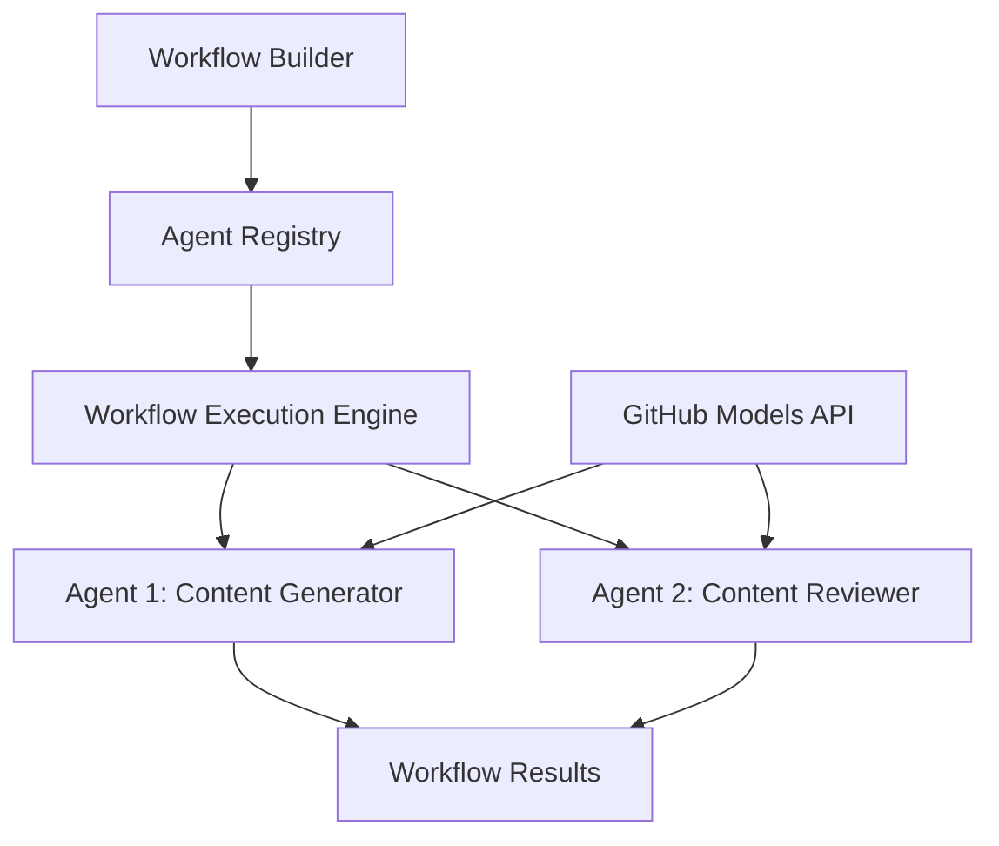

<!--
CO_OP_TRANSLATOR_METADATA:
{
  "original_hash": "034158688d0a45aae06dcbb21b0da5ae",
  "translation_date": "2025-11-11T12:57:40+00:00",
  "source_file": "08-multi-agent/code_samples/workflows-agent-framework/dotNET/01.dotnet-agent-framework-workflow-ghmodel-basic.md",
  "language_code": "sk"
}
-->
# 🔄 Základné pracovné postupy agentov s GitHub modelmi (.NET)

## 📋 Návod na orchestráciu pracovných postupov

Tento notebook ukazuje, ako vytvoriť sofistikované **pracovné postupy agentov** pomocou Microsoft Agent Framework pre .NET a GitHub modelov. Naučíte sa vytvárať viacstupňové obchodné procesy, kde AI agenti spolupracujú na dosiahnutí zložitých úloh prostredníctvom štruktúrovaných vzorov orchestrácie.

## 🎯 Ciele učenia

### 🏗️ **Základy architektúry pracovných postupov**
- **Workflow Builder**: Navrhovanie a orchestrácia zložitých viacstupňových AI procesov
- **Koordinácia agentov**: Koordinácia viacerých špecializovaných agentov v rámci pracovných postupov
- **Integrácia GitHub modelov**: Využitie služby inferencie AI modelov od GitHubu v pracovných postupoch
- **Vizuálny návrh pracovných postupov**: Tvorba a vizualizácia štruktúr pracovných postupov pre lepšie pochopenie

### 🔄 **Vzory orchestrácie procesov**
- **Sekvenčné spracovanie**: Prepojenie viacerých úloh agentov v logickom poradí
- **Správa stavu**: Udržiavanie kontextu a toku dát medzi fázami pracovného postupu
- **Riešenie chýb**: Implementácia odolného zotavenia po chybách a odolnosti pracovného postupu
- **Optimalizácia výkonu**: Návrh efektívnych pracovných postupov pre operácie v podnikovej škále

### 🏢 **Aplikácie pracovných postupov v podnikoch**
- **Automatizácia obchodných procesov**: Automatizácia zložitých organizačných pracovných postupov
- **Pipeline produkcie obsahu**: Redakčné pracovné postupy s fázami kontroly a schvaľovania
- **Automatizácia zákazníckeho servisu**: Viacstupňové riešenie zákazníckych požiadaviek
- **Pracovné postupy spracovania dát**: ETL pracovné postupy s AI-poháňanou transformáciou

## ⚙️ Predpoklady a nastavenie

### 📦 **Požadované NuGet balíčky**

Táto ukážka pracovného postupu používa niekoľko kľúčových .NET balíčkov:

```xml
<!-- Core AI Framework -->
<PackageReference Include="Microsoft.Extensions.AI" Version="9.9.0" />

<!-- Agent Framework (Local Development) -->
<!-- Microsoft.Agents.AI.dll - Core agent abstractions -->
<!-- Microsoft.Agents.AI.OpenAI.dll - OpenAI/GitHub Models integration -->

<!-- Configuration and Environment -->
<PackageReference Include="DotNetEnv" Version="3.1.1" />
```

### 🔑 **Konfigurácia GitHub modelov**

**Nastavenie prostredia (.env súbor):**
```env
GITHUB_TOKEN=your_github_personal_access_token
GITHUB_ENDPOINT=https://models.inference.ai.azure.com
GITHUB_MODEL_ID=gpt-4o-mini
```

**Prístup k GitHub modelom:**
1. Zaregistrujte sa na GitHub Models (momentálne v preview)
2. Vygenerujte osobný prístupový token s povoleniami na prístup k modelom
3. Konfigurujte environmentálne premenné, ako je uvedené vyššie

### 🏗️ **Prehľad architektúry pracovného postupu**



**Kľúčové komponenty:**
- **WorkflowBuilder**: Hlavný orchestrátor na návrh pracovných postupov
- **AIAgent**: Individuálni špecializovaní agenti s konkrétnymi schopnosťami
- **GitHub Models Client**: Integrácia služby inferencie AI modelov
- **Execution Context**: Správa stavu a toku dát medzi fázami pracovného postupu

## 🎨 **Vzorové návrhy pracovných postupov pre podniky**

### 📝 **Pracovný postup produkcie obsahu**
```
User Request → Content Generation → Quality Review → Final Output
```

### 🔍 **Pipeline spracovania dokumentov**
```
Document Input → Analysis → Extraction → Validation → Structured Output
```

### 💼 **Pracovný postup business intelligence**
```
Data Collection → Processing → Analysis → Report Generation → Distribution
```

### 🤝 **Automatizácia zákazníckeho servisu**
```
Customer Inquiry → Classification → Processing → Response Generation → Follow-up
```

## 🏢 **Výhody pre podniky**

### 🎯 **Spoľahlivosť a škálovateľnosť**
- **Deterministické vykonávanie**: Konzistentné, opakovateľné výsledky pracovných postupov
- **Zotavenie po chybách**: Elegantné riešenie zlyhaní v akejkoľvek fáze pracovného postupu
- **Monitorovanie výkonu**: Sledovanie metrik vykonávania a príležitostí na optimalizáciu
- **Správa zdrojov**: Efektívne prideľovanie a využívanie zdrojov AI modelov

### 🔒 **Bezpečnosť a súlad**
- **Bezpečné overovanie**: Overovanie na základe tokenov GitHub pre prístup k API
- **Auditné stopy**: Kompletné logovanie vykonávania pracovných postupov a rozhodovacích bodov
- **Kontrola prístupu**: Granulárne povolenia na vykonávanie a monitorovanie pracovných postupov
- **Ochrana dát**: Bezpečné spracovanie citlivých informácií v rámci pracovných postupov

### 📊 **Pozorovateľnosť a správa**
- **Vizuálny návrh pracovných postupov**: Jasné zobrazenie tokov procesov a závislostí
- **Monitorovanie vykonávania**: Sledovanie pokroku a výkonu pracovných postupov v reálnom čase
- **Hlásenie chýb**: Podrobná analýza chýb a možnosti ladenia
- **Analýza výkonu**: Metriky na optimalizáciu a plánovanie kapacity

Poďme vytvoriť váš prvý podnikový AI pracovný postup! 🚀

## 💻 Spustenie kódu

Kompletná implementácia je dostupná v `01.dotnet-agent-framework-workflow-ghmodel-basic.cs`. Tento súbor ukazuje:

1. **Konfigurácia prostredia** - Načítanie poverení GitHub Models zo súboru `.env`
2. **Nastavenie OpenAI klienta** - Konfigurácia klienta na použitie GitHub Models endpointu
3. **Tvorba agentov** - Definovanie špecializovaných agentov (Front Desk a Concierge)
4. **Workflow Builder** - Tvorba viacagentového pracovného postupu so sekvenčným spracovaním
5. **Vykonávanie pracovného postupu** - Spustenie pracovného postupu s prúdiacimi výsledkami

### 🚀 Spustenie príkladu

```bash
# Make the script executable (Unix/Linux/macOS)
chmod +x 01.dotnet-agent-framework-workflow-ghmodel-basic.cs

# Run the workflow
./01.dotnet-agent-framework-workflow-ghmodel-basic.cs
```

Alebo na Windows:
```powershell
dotnet run 01.dotnet-agent-framework-workflow-ghmodel-basic.cs
```

### 📝 Očakávaný výstup

Pracovný postup:
1. Prijme vašu požiadavku na cestovnú destináciu ("Chcel by som ísť do Paríža")
2. Agent Front Desk poskytne počiatočné odporúčanie
3. Agent Concierge preskúma a upraví odporúčanie
4. Konečný výstup zobrazí kompletný tok konverzácie

### 🔧 Prispôsobenie

Pracovný postup môžete prispôsobiť:
- Úpravou inštrukcií agentov na zmenu ich správania
- Pridaním ďalších agentov na vytvorenie zložitejších viacstupňových pracovných postupov
- Zmenou správy používateľa na testovanie rôznych scenárov
- Úpravou hrán pracovného postupu na vytvorenie rôznych vzorov vykonávania

---

<!-- CO-OP TRANSLATOR DISCLAIMER START -->
**Zrieknutie sa zodpovednosti**:  
Tento dokument bol preložený pomocou služby AI prekladu [Co-op Translator](https://github.com/Azure/co-op-translator). Hoci sa snažíme o presnosť, prosím, berte na vedomie, že automatizované preklady môžu obsahovať chyby alebo nepresnosti. Pôvodný dokument v jeho rodnom jazyku by mal byť považovaný za autoritatívny zdroj. Pre kritické informácie sa odporúča profesionálny ľudský preklad. Nie sme zodpovední za žiadne nedorozumenia alebo nesprávne interpretácie vyplývajúce z použitia tohto prekladu.
<!-- CO-OP TRANSLATOR DISCLAIMER END -->