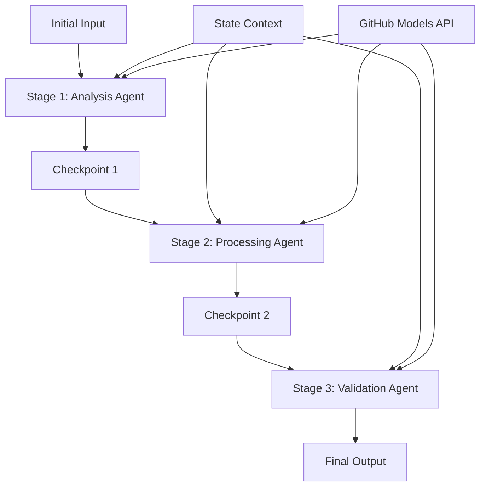

<!--
CO_OP_TRANSLATOR_METADATA:
{
  "original_hash": "1be9c8dcbd79a02d33d2c138684c1394",
  "translation_date": "2025-11-11T14:02:28+00:00",
  "source_file": "08-multi-agent/code_samples/workflows-agent-framework/dotNET/02.dotnet-agent-framework-workflow-ghmodel-sequential.md",
  "language_code": "sk"
}
-->
# ⏩ Sekvenčné pracovné postupy agentov s modelmi GitHub (.NET)

## 📋 Pokročilý tutoriál sekvenčného spracovania

Tento notebook demonštruje **vzory sekvenčných pracovných postupov** pomocou Microsoft Agent Framework pre .NET a modelov GitHub. Naučíte sa, ako vytvárať sofistikované spracovateľské potrubia krok za krokom, kde agenti vykonávajú úlohy v konkrétnom poradí, pričom každá fáza stavia na výsledkoch predchádzajúcej fázy.

## 🎯 Ciele učenia

### 🔄 **Architektúra sekvenčného spracovania**
- **Dizajn lineárneho pracovného postupu**: Vytvárajte spracovateľské potrubia krok za krokom s jasnými závislosťami
- **Správa stavu**: Udržiavajte kontext a tok dát medzi fázami sekvenčného pracovného postupu
- **Integrácia modelov GitHub**: Využívajte AI modely GitHub v viacfázových pracovných postupoch .NET
- **Vzory podnikových potrubí**: Vytvárajte produkčne pripravené systémy sekvenčného spracovania

### 🏗️ **Pokročilé sekvenčné vzory**
- **Spracovanie Stage-Gate**: Implementujte validačné kontrolné body medzi fázami pracovného postupu
- **Zachovanie kontextu**: Udržiavajte stav a nahromadené znalosti vo všetkých fázach
- **Propagácia chýb**: Riešte zlyhania elegantne v sekvenčných spracovateľských reťazcoch
- **Optimalizácia výkonu**: Efektívne sekvenčné vykonávanie s minimálnou záťažou

### 🏢 **Podnikové sekvenčné aplikácie**
- **Potrubie spracovania dokumentov**: Viacfázová analýza, transformácia a validácia dokumentov
- **Pracovné postupy kontroly kvality**: Sekvenčné preskúmanie, validácia a schvaľovacie procesy
- **Potrubie produkcie obsahu**: Výskum → Písanie → Úprava → Preskúmanie → Publikovanie
- **Automatizácia obchodných procesov**: Viackrokové obchodné pracovné postupy s jasnými závislosťami fáz

## ⚙️ Predpoklady a nastavenie

### 📦 **Požadované balíčky NuGet**

Základné balíčky pre sekvenčné pracovné postupy .NET:

```xml
<!-- Core AI Framework -->
<PackageReference Include="Microsoft.Extensions.AI" Version="9.9.0" />

<!-- Client Model Abstractions -->
<PackageReference Include="System.ClientModel" Version="1.6.1.0" />

<!-- Azure Identity and Async LINQ Support -->
<PackageReference Include="Azure.Identity" Version="1.15.0" />
<PackageReference Include="System.Linq.Async" Version="6.0.3" />

<!-- Local Agent Framework References -->
<!-- Microsoft.Agents.AI.dll - Core agent abstractions -->
<!-- Microsoft.Agents.AI.OpenAI.dll - GitHub Models integration -->
```

### 🔑 **Konfigurácia modelov GitHub**

**Nastavenie prostredia (.env súbor):**
```env
GITHUB_TOKEN=your_github_personal_access_token
GITHUB_ENDPOINT=https://models.inference.ai.azure.com
GITHUB_MODEL_ID=gpt-4o-mini
```

**Správa konfigurácie:**
```csharp
// Load environment variables securely
Env.Load("../../../.env");
var githubToken = Environment.GetEnvironmentVariable("GITHUB_TOKEN");
var githubEndpoint = Environment.GetEnvironmentVariable("GITHUB_ENDPOINT");
var modelId = Environment.GetEnvironmentVariable("GITHUB_MODEL_ID");
```

### 🏗️ **Architektúra sekvenčného pracovného postupu**



**Kľúčové komponenty:**
- **Sekvenční agenti**: Špecializovaní agenti pre každú fázu spracovania
- **Kontext stavu**: Udržiava nahromadené dáta a rozhodnutia medzi fázami
- **Kontrolné body**: Validačné body medzi fázami na zabezpečenie kvality a konzistencie
- **Klient modelov GitHub**: Konzistentný prístup k AI modelom vo všetkých fázach pracovného postupu

## 🎨 **Vzory dizajnu sekvenčného pracovného postupu**

### 📝 **Potrubie spracovania dokumentov**
```
Raw Document → Content Extraction → Analysis → Validation → Structured Output
```

### 🎯 **Pracovný postup tvorby obsahu**
```
Brief/Requirements → Research → Content Creation → Review → Final Polish
```

### 🔍 **Potrubie kontroly kvality**
```
Initial Review → Technical Validation → Compliance Check → Final Approval
```

### 💼 **Pracovný postup obchodnej inteligencie**
```
Data Collection → Processing → Analysis → Report Generation → Distribution
```

## 🏢 **Výhody podnikových sekvenčných procesov**

### 🎯 **Spoľahlivosť a kvalita**
- **Deterministické spracovanie**: Konzistentné, opakovateľné výsledky prostredníctvom štruktúrovaných fáz
- **Kontrolné body kvality**: Validačné body zabezpečujú kvalitu v každej fáze
- **Izolácia chýb**: Problémy v jednej fáze sa nešíria do nasledujúcich fáz
- **Auditné stopy**: Kompletné sledovanie rozhodnutí a transformácií v každej fáze

### 📈 **Škálovateľnosť a výkon**
- **Modulárny dizajn**: Každú fázu je možné optimalizovať nezávisle
- **Správa zdrojov**: Efektívne prideľovanie zdrojov AI modelov medzi fázami
- **Optimalizácia stavu**: Minimálny prenos stavu medzi fázami pre optimálny výkon
- **Paralelné skupiny fáz**: Viac sekvenčných pracovných postupov môže bežať paralelne

### 🔒 **Bezpečnosť a súlad**
- **Bezpečnosť na úrovni fáz**: Rôzne bezpečnostné politiky pre rôzne fázy spracovania
- **Validácia dát**: Zabezpečenie integrity dát a súladu na každom kontrolnom bode
- **Kontrola prístupu**: Granulárne povolenia pre rôzne fázy pracovného postupu
- **Regulačný súlad**: Splnenie regulačných požiadaviek prostredníctvom štruktúrovaného spracovania

### 📊 **Monitorovanie a analýza**
- **Metriky na úrovni fáz**: Monitorovanie výkonu pre každú fázu pracovného postupu
- **Identifikácia úzkych miest**: Identifikácia a optimalizácia pomalých fáz
- **Metriky kvality**: Sledovanie kvality a úspešnosti v každej fáze
- **Optimalizácia procesov**: Neustále zlepšovanie na základe analýzy na úrovni fáz

Poďme vytvárať robustné sekvenčné AI spracovateľské potrubia! 🚀

## 💻 Spustenie kódu

Kompletná implementácia je dostupná v `02.dotnet-agent-framework-workflow-ghmodel-sequential.cs`. Tento súbor demonštruje **trojfázový pracovný postup analýzy nábytku**:

1. **Fáza 1 - Predajný agent**: Analyzuje obrázky nábytku a poskytuje návrhy na nákup
2. **Fáza 2 - Cenový agent**: Poskytuje podrobný rozpis cien a možnosti rozpočtu
3. **Fáza 3 - Agent ponúk**: Generuje profesionálny dokument ponuky vo formáte Markdown

### 🏗️ **Architektúra pracovného postupu**

```
Image Input → Sales Analysis → Price Estimation → Quote Generation → Final Output
```

Každý agent:
- Prijíma výstup z predchádzajúcej fázy ako kontext
- Stavia na predchádzajúcej analýze so špecializovanou expertízou
- Udržiava kontinuitu pracovného postupu prostredníctvom správy stavu

### 🚀 Spustenie príkladu

**Predpoklady:**
- Umiestnite obrázok nábytku na `../imgs/home.png` (alebo aktualizujte premennú `imgPath`)
- Nakonfigurujte svoj `.env` súbor s povereniami modelov GitHub

```bash
# Make the script executable (Unix/Linux/macOS)
chmod +x 02.dotnet-agent-framework-workflow-ghmodel-sequential.cs

# Run the sequential workflow
./02.dotnet-agent-framework-workflow-ghmodel-sequential.cs
```

Alebo na Windows:
```powershell
dotnet run 02.dotnet-agent-framework-workflow-ghmodel-sequential.cs
```

### 📝 Očakávaný výstup

Pracovný postup bude:
1. **Predajný agent**: Identifikovať položky nábytku z obrázku a poskytnúť odporúčania
2. **Cenový agent**: Pridať podrobnú analýzu cien s rozpočtovými úrovňami a nákupnými odporúčaniami
3. **Agent ponúk**: Generovať formátovaný dokument ponuky so všetkými syntetizovanými informáciami

Konečný výstup bude komplexná, profesionálna ponuka nábytku založená na analýze obrázkov.

### 🔧 Možnosti prispôsobenia

**Úprava správania agenta:**
```csharp
// Adjust agent instructions to change their focus
const string SalesAgentInstructions = "Your custom instructions...";
```

**Zmena sekvenčného toku:**
```csharp
// Add or reorder workflow stages
var workflow = new WorkflowBuilder(salesagent)
    .AddEdge(salesagent, priceagent)
    .AddEdge(priceagent, quoteagent)
    .AddEdge(quoteagent, newAgent)  // Add another stage
    .Build();
```

**Použitie iného vstupu:**
```csharp
// Process text instead of images
ChatMessage userMessage = new ChatMessage(ChatRole.User, [
    new TextContent("Analyze pricing for a modern living room set")
]);
```

### 🎯 Reálne aplikácie

Tento sekvenčný vzor je ideálny pre:
- **E-commerce**: Analýza produktov → Ceny → Generovanie ponúk
- **Nehnuteľnosti**: Analýza nehnuteľností → Hodnotenie → Tvorba zoznamov
- **Poistenie**: Analýza nárokov → Posúdenie → Generovanie ponúk
- **Tvorba obsahu**: Výskum → Písanie → Úprava → Publikovanie

### 🔍 Pochopenie toku stavu

Každý agent v sekvencii prijíma:
- **Pôvodný vstup**: Počiatočnú správu používateľa (obrázok + text)
- **Výstupy predchádzajúcich agentov**: Všetky odpovede predchádzajúcich agentov v histórii konverzácie
- **Nahromadený kontext**: Kompletný stav udržiavaný počas celého pracovného postupu

To umožňuje sofistikované viacfázové spracovanie, kde každý agent stavia na komplexnom kontexte zo všetkých predchádzajúcich fáz.

---

<!-- CO-OP TRANSLATOR DISCLAIMER START -->
**Zrieknutie sa zodpovednosti**:  
Tento dokument bol preložený pomocou služby AI prekladu [Co-op Translator](https://github.com/Azure/co-op-translator). Hoci sa snažíme o presnosť, prosím, berte na vedomie, že automatizované preklady môžu obsahovať chyby alebo nepresnosti. Pôvodný dokument v jeho rodnom jazyku by mal byť považovaný za autoritatívny zdroj. Pre kritické informácie sa odporúča profesionálny ľudský preklad. Nenesieme zodpovednosť za akékoľvek nedorozumenia alebo nesprávne interpretácie vyplývajúce z použitia tohto prekladu.
<!-- CO-OP TRANSLATOR DISCLAIMER END -->