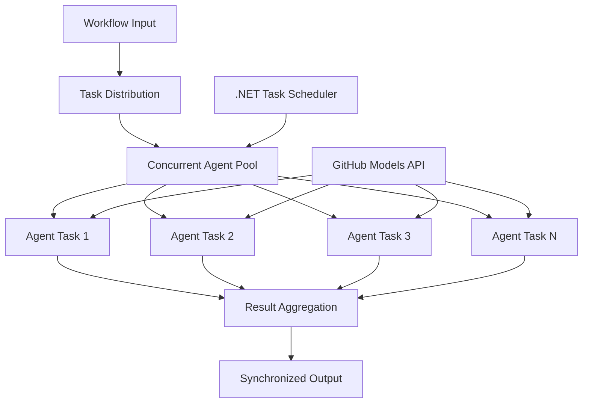

<!--
CO_OP_TRANSLATOR_METADATA:
{
  "original_hash": "b9c6e32c9b5f2fed20b6916984440d88",
  "translation_date": "2025-11-11T13:30:04+00:00",
  "source_file": "08-multi-agent/code_samples/workflows-agent-framework/dotNET/03.dotnet-agent-framework-workflow-ghmodel-concurrent.md",
  "language_code": "sk"
}
-->
# ⚡ Súbežné pracovné postupy agentov s GitHub modelmi (.NET)

## 📋 Návod na vysokovýkonné paralelné spracovanie

Tento notebook demonštruje **vzory súbežných pracovných postupov** pomocou Microsoft Agent Framework pre .NET a GitHub modelov. Naučíte sa, ako vytvárať vysokovýkonné pracovné postupy paralelného spracovania, ktoré maximalizujú priepustnosť vykonávaním viacerých AI agentov súčasne pri zachovaní koordinácie a konzistencie údajov.

## 🎯 Ciele učenia

### 🚀 **Základy súbežného spracovania**
- **Paralelné vykonávanie agentov**: Spúšťanie viacerých AI agentov súčasne pre maximálny výkon
- **Vzory Async/Await**: Využitie asynchrónneho programovacieho modelu .NET pre efektívnu súbežnosť
- **Integrácia GitHub modelov**: Koordinácia viacerých súbežných volaní na službu inferencie AI modelov GitHub
- **Riadenie zdrojov**: Efektívne riadenie zdrojov AI modelov počas súbežných operácií

### 🏗️ **Pokročilá architektúra súbežnosti**
- **Paralelizmus založený na úlohách**: Použitie knižnice Task Parallel Library v .NET pre optimálne súbežné vykonávanie
- **Vzory synchronizácie**: Koordinácia súbežných agentov pri predchádzaní pretekovým podmienkam
- **Vyvažovanie záťaže**: Efektívne rozdelenie práce medzi dostupnú kapacitu súbežného spracovania
- **Odolnosť voči chybám**: Riešenie zlyhaní jednotlivých agentov bez zastavenia celého pracovného postupu

### 🏢 **Podnikové aplikácie súbežnosti**
- **Spracovanie dokumentov vo veľkom objeme**: Súbežné spracovanie viacerých dokumentov
- **Analýza obsahu v reálnom čase**: Súbežná analýza prichádzajúcich dátových tokov
- **Optimalizácia dávkového spracovania**: Maximalizácia priepustnosti pre spracovanie veľkého objemu dát
- **Multimodálna analýza**: Paralelné spracovanie rôznych typov a formátov obsahu

## ⚙️ Predpoklady a nastavenie

### 📦 **Požadované balíčky NuGet**

Základné balíčky pre vysokovýkonné súbežné pracovné postupy:

```xml
<!-- Core AI Framework with Async Support -->
<PackageReference Include="Microsoft.Extensions.AI" Version="9.9.0" />

<!-- Client Model Abstractions for API Communication -->
<PackageReference Include="System.ClientModel" Version="1.6.1.0" />

<!-- Azure Identity and Async LINQ for Advanced Operations -->
<PackageReference Include="Azure.Identity" Version="1.15.0" />
<PackageReference Include="System.Linq.Async" Version="6.0.3" />

<!-- Local Agent Framework References -->
<!-- Microsoft.Agents.AI.dll - Core agent abstractions with async support -->
<!-- Microsoft.Agents.AI.OpenAI.dll - GitHub Models integration with concurrency -->
```

### 🔑 **Konfigurácia GitHub modelov**

**Nastavenie prostredia (.env súbor):**
```env
GITHUB_TOKEN=your_github_personal_access_token
GITHUB_ENDPOINT=https://models.inference.ai.azure.com
GITHUB_MODEL_ID=gpt-4o-mini
```

**Úvahy o súbežnom spracovaní:**
```csharp
// Configure for concurrent operations
var clientOptions = new OpenAIClientOptions()
{
    Endpoint = new Uri(githubEndpoint),
    // Configure connection pooling for concurrent requests
    NetworkTimeout = TimeSpan.FromMinutes(5)
};
```

### 🏗️ **Architektúra súbežného pracovného postupu**



**Kľúčové komponenty:**
- **Task Parallel Library**: Vstavaná podpora .NET pre súbežné operácie
- **Agent Pool**: Viacero inštancií agentov pre paralelné spracovanie
- **Agregácia výsledkov**: Koordinácia a zlúčenie výsledkov súbežných agentov
- **Synchronizačné body**: Zabezpečenie konzistencie údajov počas súbežných operácií

## 🎨 **Vzory návrhu súbežných pracovných postupov**

### 🔍 **Paralelný výskum a analýza**
```
Research Topic → Concurrent Research Agents → Result Synthesis → Final Report
```

### 📊 **Spracovanie dát z viacerých zdrojov**
```
Data Sources → Parallel Processing Agents → Data Integration → Unified Output
```

### 🎭 **Pipeline na generovanie obsahu**
```
Content Requirements → Concurrent Content Generators → Quality Review → Final Content
```

### 🔄 **Fan-Out/Fan-In spracovanie**
```
Single Input → Multiple Concurrent Processors → Result Aggregation → Single Output
```

## 🏢 **Výhody výkonu pre podniky**

### ⚡ **Priepustnosť a škálovateľnosť**
- **Lineárne škálovanie výkonu**: Pridanie viacerých súbežných agentov na zvýšenie priepustnosti
- **Využitie zdrojov**: Maximálna efektivita dostupnej kapacity AI modelov
- **Zníženie času spracovania**: Výrazné skrátenie času prostredníctvom paralelného vykonávania
- **Elastické škálovanie**: Dynamické prispôsobenie počtu súbežných agentov podľa pracovného zaťaženia

### 🛡️ **Spoľahlivosť a odolnosť**
- **Izolácia chýb**: Zlyhania jednotlivých agentov neovplyvňujú ostatné súbežné operácie
- **Postupná degradácia**: Systém pokračuje v prevádzke s obmedzenou kapacitou agentov
- **Obnova chýb**: Automatické mechanizmy opakovania pre zlyhané súbežné operácie
- **Rozdelenie záťaže**: Rovnomerné rozdelenie práce medzi dostupných agentov

### 📊 **Monitorovanie výkonu**
- **Metriky súbežného vykonávania**: Sledovanie výkonu všetkých paralelných operácií
- **Analýza využitia zdrojov**: Monitorovanie CPU, pamäte a sieťového využitia
- **Analýza priepustnosti**: Meranie efektivity získanej zo súbežného spracovania
- **Detekcia úzkych miest**: Identifikácia a riešenie obmedzení výkonu

### 🔧 **Vývoj a prevádzka**
- **Asynchrónny programovací model**: Využitie zrelých vzorov async/await v .NET
- **Koordinácia úloh**: Vstavané riadenie a koordinácia úloh
- **Riešenie výnimiek**: Komplexné riešenie chýb pre súbežné operácie
- **Podpora ladenia**: Nástroje na ladenie pracovných postupov v Visual Studio

Poďme vytvárať vysokovýkonné súbežné AI pracovné postupy s .NET! 🚀

## 💻 Spustenie kódu

Kompletná implementácia je dostupná v `03.dotnet-agent-framework-workflow-ghmodel-concurrent.cs`. Tento súbor demonštruje **Fan-Out/Fan-In súbežný pracovný postup** pre plánovanie ciest:

### 🏗️ **Architektúra pracovného postupu**

```
User Request → ConcurrentStartExecutor → [Researcher Agent || Planner Agent] → ConcurrentAggregationExecutor → Final Output
```

**Kľúčové komponenty:**

1. **ConcurrentStartExecutor**: Súčasne vysiela požiadavku používateľa všetkým agentom
2. **Researcher Agent**: Súbežne analyzuje destinácie a atrakcie
3. **Planner Agent**: Súbežne vytvára podrobné cestovné plány
4. **ConcurrentAggregationExecutor**: Zbiera a zlúčuje výsledky od oboch agentov

### 🎯 **Fan-Out/Fan-In vzor**

Tento pracovný postup demonštruje klasický **Fan-Out/Fan-In** vzor:
- **Fan-Out**: Jedna vstupná správa je súčasne vyslaná viacerým agentom
- **Súbežné spracovanie**: Viacerí agenti pracujú paralelne na tej istej úlohe
- **Fan-In**: Výsledky od všetkých agentov sú zhromaždené a zlúčené do jedného výstupu

### 🚀 Spustenie príkladu

```bash
# Make the script executable (Unix/Linux/macOS)
chmod +x 03.dotnet-agent-framework-workflow-ghmodel-concurrent.cs

# Run the concurrent workflow
./03.dotnet-agent-framework-workflow-ghmodel-concurrent.cs
```

Alebo na Windows:
```powershell
dotnet run 03.dotnet-agent-framework-workflow-ghmodel-concurrent.cs
```

### 📝 Očakávaný výstup

Pracovný postup bude:
1. **Vyslanie požiadavky**: Odoslanie "Naplánuj výlet do Seattlu v decembri" obom agentom
2. **Súbežné spracovanie**: Obaja agenti pracujú súčasne:
   - Researcher identifikuje atrakcie a detaily
   - Planner vytvára itinerár a logistiku
3. **Agregácia**: Kombinácia oboch odpovedí do komplexného výstupu
4. **Zobrazenie výsledkov**: Zobrazenie zlúčeného cestovného plánu so všetkými informáciami

### 🔧 Možnosti prispôsobenia

**Pridanie viacerých súbežných agentov:**
```csharp
// Create additional specialized agents
AIAgent budgetAgent = openAIClient.GetChatClient(github_model_id).CreateAIAgent(
    name: "Budget-Agent", instructions: "Calculate travel costs...");

// Add to fan-out
var workflow = new WorkflowBuilder(startExecutor)
    .AddFanOutEdge(startExecutor, targets: [researcherAgent, plannerAgent, budgetAgent])
    .AddFanInEdge(aggregationExecutor, sources: [researcherAgent, plannerAgent, budgetAgent])
    .WithOutputFrom(aggregationExecutor)
    .Build();

// Update aggregation count
if (this._messages.Count == 3) { ... }
```

**Úprava inštrukcií agentov:**
```csharp
const string ResearcherAgentInstructions = "Your custom instructions for research...";
const string PlanAgentInstructions = "Your custom instructions for planning...";
```

**Zmena úlohy:**
```csharp
StreamingRun run = await InProcessExecution.StreamAsync(
    workflow, 
    "Plan a European vacation for 2 weeks in summer"
);
```

### 🎯 Reálne aplikácie

Tento súbežný vzor je ideálny pre:
- **Tvorbu obsahu**: Viacerí autori vytvárajú rôzne sekcie súčasne
- **Kontrolu kódu**: Viacerí recenzenti analyzujú kód z rôznych perspektív
- **Prieskum trhu**: Paralelná analýza rôznych segmentov trhu
- **Spracovanie dokumentov**: Súbežná extrakcia, analýza a validácia
- **Multiperspektívna analýza**: Získanie rôznych pohľadov na ten istý vstup

### 🔍 Pochopenie vlastných vykonávateľov

**ConcurrentStartExecutor:**
- Implementuje `IMessageHandler<string>` na prijatie vstupu typu string
- Vysiela správy všetkým pripojeným agentom
- Posiela `TurnToken` na spustenie súbežného spracovania

**ConcurrentAggregationExecutor:**
- Implementuje `IMessageHandler<ChatMessage>` na prijatie odpovedí agentov
- Zbiera správy bezpečne voči vláknam
- Agreguje, keď dorazia všetky očakávané odpovede
- Poskytuje konečný výstup pomocou `context.YieldOutputAsync()`

### ⚡ Výhody výkonu

**Súbežné vs sekvenčné:**
- Sekvenčné: Agent1 (30s) → Agent2 (30s) = **60 sekúnd celkom**
- Súbežné: Agent1 (30s) || Agent2 (30s) = **30 sekúnd celkom**

**Zlepšenie priepustnosti**: Až N× rýchlejšie pre N súbežných agentov (v závislosti od pracovného zaťaženia a zdrojov)

### 🛡️ Riešenie chýb

Pracovný postup rieši zlyhania jednotlivých agentov elegantne:
- Ak jeden agent zlyhá, ostatní pokračujú v spracovaní
- Agregátor môže implementovať logiku časového limitu
- Čiastočné výsledky môžu byť v prípade potreby vrátené

### 📊 Pokročilé funkcie

**Dynamický počet agentov:**
Upravte logiku agregácie na podporu variabilného počtu agentov:

```csharp
private int _expectedAgentCount;
private readonly List<ChatMessage> _messages = [];

public async ValueTask HandleAsync(ChatMessage message, IWorkflowContext context)
{
    this._messages.Add(message);
    if (this._messages.Count == _expectedAgentCount)
    {
        // Process aggregation
    }
}
```

Tento vzor súbežného pracovného postupu je nevyhnutný pre vytváranie vysokovýkonných, škálovateľných systémov AI agentov!

---

<!-- CO-OP TRANSLATOR DISCLAIMER START -->
**Zrieknutie sa zodpovednosti**:  
Tento dokument bol preložený pomocou služby AI prekladu [Co-op Translator](https://github.com/Azure/co-op-translator). Aj keď sa snažíme o presnosť, prosím, berte na vedomie, že automatizované preklady môžu obsahovať chyby alebo nepresnosti. Pôvodný dokument v jeho rodnom jazyku by mal byť považovaný za autoritatívny zdroj. Pre kritické informácie sa odporúča profesionálny ľudský preklad. Nenesieme zodpovednosť za akékoľvek nedorozumenia alebo nesprávne interpretácie vyplývajúce z použitia tohto prekladu.
<!-- CO-OP TRANSLATOR DISCLAIMER END -->