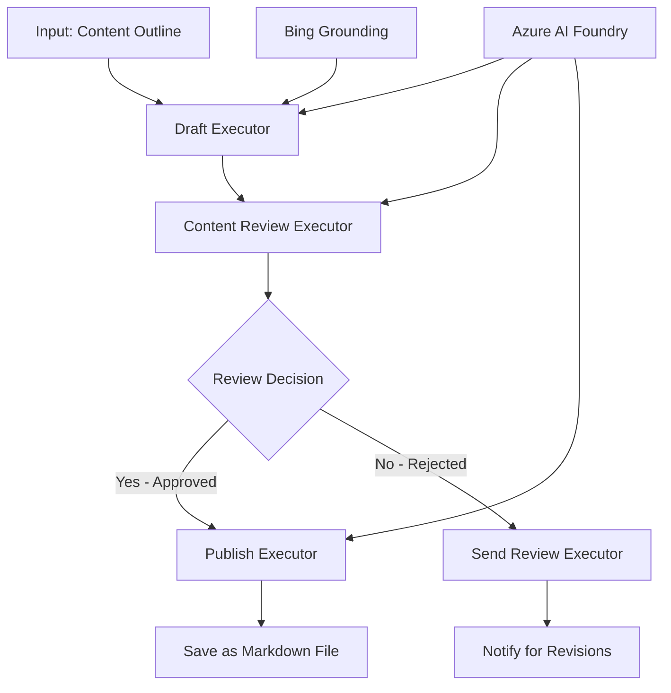

<!--
CO_OP_TRANSLATOR_METADATA:
{
  "original_hash": "8abd335151cee553293b637ee3d80d10",
  "translation_date": "2025-11-11T12:28:42+00:00",
  "source_file": "08-multi-agent/code_samples/workflows-agent-framework/dotNET/04.dotnet-agent-framework-workflow-aifoundry-condition.md",
  "language_code": "sk"
}
-->
# 🔀 Podmienené pracovné postupy agentov s Azure AI Foundry (.NET)

## 📋 Návod na inteligentné pracovné postupy založené na rozhodovaní

Tento notebook demonštruje **vzory podmienených pracovných postupov** pomocou Azure AI Foundry a Microsoft Agent Framework pre .NET. Naučíte sa, ako vytvárať sofistikované pracovné postupy založené na rozhodovaní, ktoré inteligentne smerujú spracovanie na základe AI analýzy, obchodných pravidiel a dynamických podmienok pre automatizáciu na podnikovej úrovni.

## 🎯 Ciele učenia

### 🧠 **Architektúra inteligentného rozhodovania**
- **Implementácia podmieneného logického rozhodovania**: Vytvárajte komplexné rozhodovacie stromy s viacerými bodmi vetvenia
- **Smerovanie poháňané AI**: Používajte modely Azure AI Foundry na inteligentné rozhodovanie o smerovaní
- **Dynamická adaptácia pracovného postupu**: Modifikujte správanie pracovného postupu na základe analýzy a podmienok v reálnom čase
- **Integrácia podnikových pravidiel**: Zahrňte obchodnú logiku a požiadavky na súlad do pracovných postupov

### 🔀 **Pokročilé podmienené vzory**
- **Rozhodovanie na základe viacerých kritérií**: Vyhodnocujte viacero faktorov pre rozhodovanie o smerovaní
- **Spracovanie s ohľadom na kontext**: Robte rozhodnutia na základe nahromadeného kontextu a histórie pracovného postupu
- **Adaptívna modifikácia pracovného postupu**: Dynamicky upravujte cesty spracovania na základe podmienok v reálnom čase
- **Integrácia pravidlového enginu**: Implementujte sofistikované obchodné pravidlové enginy do pracovných postupov

### 🏢 **Podnikové aplikácie podmienených pracovných postupov**
- **Klasifikácia a smerovanie dokumentov**: Automaticky klasifikujte a smerujte dokumenty do vhodných pracovných postupov
- **Triedenie zákazníckych služieb**: Inteligentné smerovanie zákazníckych dotazov na špecializované tímy
- **Spracovanie súladu a rizík**: Aplikujte rôzne validačné a kontrolné procesy na základe hodnotenia rizík
- **Pracovné postupy kontroly kvality**: Smerujte obsah cez vhodné kontrolné procesy na základe kvalitatívnych metrík

## ⚙️ Predpoklady a nastavenie

### 📦 **Požadované balíčky NuGet**

Pokročilé balíčky pre spracovanie podmienených pracovných postupov:

```xml
<!-- Core AI Framework -->
<PackageReference Include="Microsoft.Extensions.AI" Version="9.9.0" />

<!-- Azure AI Agents with Persistent State -->
<PackageReference Include="Azure.AI.Agents.Persistent" Version="1.2.0-beta.5" />

<!-- Azure Identity and Utilities -->
<PackageReference Include="Azure.Identity" Version="1.15.0" />
<PackageReference Include="System.Linq.Async" Version="6.0.3" />
<PackageReference Include="DotNetEnv" Version="3.1.1" />

<!-- Local Workflow Framework References -->
<!-- Microsoft.Agents.Workflows.dll - Advanced workflow orchestration -->
<!-- Microsoft.Agents.AI.AzureAI.dll - Azure AI Foundry integration -->
<!-- Microsoft.Agents.AI.dll - Core agent abstractions -->
```

### 🔑 **Konfigurácia Azure AI Foundry**

**Požadované zdroje Azure:**
- Pracovný priestor Azure AI Foundry s modelmi na podmienené spracovanie
- Predplatné Azure s vhodnými kvótami výpočtov a povoleniami
- Nasadené AI modely na rozhodovanie a analýzu obsahu
- (Voliteľné) Pripojenie Bing Search API pre schopnosti zakotvenia

**Konfigurácia prostredia (.env súbor):**
```env
# Azure AI Foundry Configuration
AZURE_AI_PROJECT_ENDPOINT=https://your-project.cognitiveservices.azure.com/
BING_CONNECTION_ID=your-bing-connection-id
```

**Nastavenie autentifikácie:**
```csharp
// Azure CLI or Managed Identity authentication
using Azure.Identity;
var credential = new AzureCliCredential();

// Load environment configuration
DotNetEnv.Env.Load("../../../.env");
```

### 🏗️ **Architektúra podmieneného pracovného postupu**



**Kľúčové komponenty:**
- **Draft Executor**: AI agent, ktorý vytvára počiatočné návrhy obsahu z osnov
- **Content Review Executor**: AI agent, ktorý hodnotí kvalitu a súlad návrhov
- **Podmienené smerovanie**: Logika rozhodovania, ktorá smeruje na základe výsledkov hodnotenia
- **Cesty publikovania/kontroly**: Oddelené cesty spracovania pre schválený vs zamietnutý obsah
- **Správa stavu**: Udržiava kontext obsahu a kontroly počas celého pracovného postupu

## 🎨 **Vzory dizajnu podmienených pracovných postupov**

### 📋 **Produkcia obsahu s kontrolnými bránami kvality**
```
Outline → Draft Creation → Quality Review → {Approve: Publish | Reject: Revise}
```

### 🎯 **Spracovanie dokumentov na základe rizík**
```
Document → Risk Assessment → {Low: Standard | High: Enhanced Review}
```

### 🔍 **Inteligentné smerovanie zákazníckych služieb**
```
Customer Query → Analysis → {Simple: FAQ Bot | Complex: Human Agent}
```

### 💼 **Pracovné postupy riadené súladom**
```
Content → Compliance Check → {Pass: Publish | Fail: Legal Review}
```

## 🏢 **Výhody podmienených pracovných postupov pre podniky**

### 🎯 **Inteligentná automatizácia**
- **Inteligentné rozhodovanie**: Rozhodovanie o smerovaní poháňané AI na základe analýzy obsahu a kontextu
- **Adaptívne spracovanie**: Pracovné postupy, ktoré sa automaticky prispôsobujú meniacim sa podmienkam
- **Presadzovanie obchodných pravidiel**: Automatická aplikácia komplexnej obchodnej logiky a politík
- **Smerovanie s ohľadom na kontext**: Rozhodovanie na základe celej histórie pracovného postupu a nahromadeného kontextu

### 📈 **Prevádzková dokonalosť**
- **Optimalizované prideľovanie zdrojov**: Smerovanie práce na najvhodnejších špecialistov a procesy
- **Zníženie manuálneho zásahu**: Automatizované rozhodovanie minimalizuje potrebu ľudského smerovania
- **Rýchlejšie časy riešenia**: Priame smerovanie na vhodné odborné znalosti a schopnosti spracovania
- **Konzistentná aplikácia**: Jednotná aplikácia obchodných pravidiel a kritérií rozhodovania

### 🛡️ **Riadenie rizík a súladu**
- **Automatizované hodnotenie rizík**: Hodnotenie obsahu a úrovní rizika poháňané AI
- **Presadzovanie súladu**: Automatické smerovanie cez požadované regulačné procesy
- **Aplikácia bezpečnostných protokolov**: Zlepšené bezpečnostné opatrenia aplikované na základe hodnotenia rizík
- **Udržiavanie auditnej stopy**: Kompletná dokumentácia rozhodnutí o smerovaní a ich odôvodnení

### 📊 **Analytika a neustále zlepšovanie**
- **Analytika rozhodovania**: Sledovanie efektívnosti a presnosti rozhodnutí o smerovaní
- **Rozpoznávanie vzorov**: Identifikácia trendov a vzorov v rozhodnutiach o smerovaní v priebehu času
- **Optimalizácia výkonu**: Neustále zlepšovanie kritérií rozhodovania a efektívnosti smerovania
- **Obchodná inteligencia**: Prehľady o charakteristikách obsahu a požiadavkách na spracovanie

### 🔧 **Technická dokonalosť**
- **Trvalá správa stavu**: Udržiavanie komplexného stavu počas vykonávania pracovného postupu
- **Škálovateľná architektúra**: Riešenie požiadaviek na spracovanie podmienených pracovných postupov vo veľkom objeme
- **Schopnosti integrácie**: Bezproblémová integrácia s existujúcimi obchodnými systémami a procesmi
- **Monitorovanie a pozorovateľnosť**: Komplexné sledovanie výkonu pracovného postupu a rozhodnutí

Poďme vytvárať inteligentné, rozhodovaním poháňané podnikové pracovné postupy s .NET! 🚀

## 💻 Spustenie kódu

Kompletná implementácia je dostupná v `04.dotnet-agent-framework-workflow-aifoundry-condition.cs`. Táto demonštruje **pracovný postup produkcie obsahu s kontrolnými bránami kvality**:

### 🏗️ **Architektúra pracovného postupu**

```
Content Outline → Draft Creation → Quality Review → Conditional Routing:
                                                      ├─ Approved (>200 words) → Publish
                                                      └─ Rejected (<200 words) → Review Notification
```

**Agenti v pracovnom postupe:**
1. **Evangelist Agent**: Vytvára návrhy tutoriálov z osnov s Bing zakotvením
2. **Content Reviewer Agent**: Hodnotí kvalitu návrhov (počet slov, úplnosť)
3. **Publisher Agent**: Ukladá schválený obsah ako Markdown súbory s časovou pečiatkou

**Vlastné vykonávače:**
1. **DraftExecutor**: Orchestruje tvorbu návrhov
2. **ContentReviewExecutor**: Vykonáva hodnotenie kvality
3. **PublishExecutor**: Spracováva publikovanie schváleného obsahu
4. **SendReviewExecutor**: Spravuje oznámenia o zamietnutom obsahu

### 🚀 Spustenie príkladu

**Predpoklady:**
- Konfigurovaný pracovný priestor Azure AI Foundry
- Autentifikácia Azure CLI (`az login`)
- (Voliteľné) Pripojenie Bing Search pre zakotvenie

```bash
# Make the script executable (Unix/Linux/macOS)
chmod +x 04.dotnet-agent-framework-workflow-aifoundry-condition.cs

# Run the conditional workflow
./04.dotnet-agent-framework-workflow-aifoundry-condition.cs
```

Alebo na Windows:
```powershell
dotnet run 04.dotnet-agent-framework-workflow-aifoundry-condition.cs
```

### 📝 Očakávaný výstup

Pracovný postup bude:
1. **Vytvárať agentov**: Inicializovať troch špecializovaných agentov Azure AI Foundry
2. **Generovať návrh**: Agent Evangelist vytvorí návrh tutoriálu z osnovy
3. **Hodnotiť obsah**: Content Reviewer hodnotí kvalitu návrhu
4. **Podmienené smerovanie**:
   - **Ak schválené (>200 slov)**: Publish Executor uloží ako Markdown súbor
   - **Ak zamietnuté (<200 slov)**: Send Review Executor pošle oznámenie o kontrole
5. **Zobraziť výsledky**: Ukáže konečný výsledok pracovného postupu

### 🔧 Možnosti prispôsobenia

**Upraviť kritériá hodnotenia:**
```csharp
const string ContentReviewerInstructions = @"
You are a content reviewer...
1. Check if content is more than 500 words (instead of 200)
2. Verify technical accuracy
3. Ensure proper formatting
...";
```

**Pridať viac podmienených ciest:**
```csharp
var workflow = new WorkflowBuilder(draftExecutor)
    .AddEdge(draftExecutor, contentReviewerExecutor)
    .AddEdge(contentReviewerExecutor, publishExecutor, condition: GetCondition("Excellent"))
    .AddEdge(contentReviewerExecutor, editExecutor, condition: GetCondition("Good"))
    .AddEdge(contentReviewerExecutor, sendReviewerExecutor, condition: GetCondition("Poor"))
    .Build();
```

**Zmeniť požiadavky na obsah:**
```csharp
string OUTLINE_Content = @"
# Your Custom Topic
## Section 1
https://your-reference-url
## Section 2
...
";
```

### 🎯 Aplikácie v reálnom svete

Tento vzor podmieneného pracovného postupu je ideálny pre:
- **Systémy správy obsahu**: Automatizované redakčné pracovné postupy s kontrolnými bránami kvality
- **Spracovanie dokumentov**: Smerovanie dokumentov na základe klasifikácie a súladu
- **Zákaznícka podpora**: Inteligentné smerovanie tiketov na základe zložitosti a naliehavosti
- **Právna kontrola**: Smerovanie zmlúv na základe hodnotenia rizík a hodnoty
- **HR procesy**: Smerovanie žiadostí cez vhodné screeningové pracovné postupy

### 🔍 Pochopenie podmieneného logického rozhodovania

**Funkcia podmienky:**
```csharp
public Func<object?, bool> GetCondition(string expectedResult) =>
    reviewResult => reviewResult is ReviewResult review && review.Result == expectedResult;
```

Táto funkcia vytvára predikát, ktorý:
1. Kontroluje, či je výsledok typu `ReviewResult`
2. Porovnáva vlastnosť `Result` s očakávanou hodnotou
3. Vracia true/false na určenie smerovania

**Hrany pracovného postupu s podmienkami:**
```csharp
.AddEdge(contentReviewerExecutor, publishExecutor, condition: GetCondition("Yes"))
.AddEdge(contentReviewerExecutor, sendReviewerExecutor, condition: GetCondition("No"))
```

### 📊 Pokročilé funkcie

**Validácia JSON schémy:**
Pracovný postup používa JSON schémy na zabezpečenie štruktúrovaných odpovedí:

```csharp
// Define response structure
public class ReviewResult
{
    [JsonPropertyName("review_result")]
    public string Result { get; set; } = string.Empty;
    
    [JsonPropertyName("reason")]
    public string Reason { get; set; } = string.Empty;
    
    [JsonPropertyName("draft_content")]
    public string DraftContent { get; set; } = string.Empty;
}

// Apply to agent
ResponseFormat = ChatResponseFormat.ForJsonSchema(
    AIJsonUtilities.CreateJsonSchema(typeof(ReviewResult)), 
    "ReviewResult", 
    "Review Result From DraftContent"
)
```

**Integrácia Bing zakotvenia:**
Agent Evangelist používa Bing zakotvenie na prístup k informáciám v reálnom čase:

```csharp
var bingGroundingConfig = new BingGroundingSearchConfiguration(bing_conn_id);
BingGroundingToolDefinition bingGroundingTool = new(
    new BingGroundingSearchToolParameters([bingGroundingConfig])
);
```

To umožňuje agentovi sledovať URL adresy v osnovách a extrahovať aktuálne informácie.

### 🛡️ Spracovanie chýb

Pracovný postup zahŕňa robustné spracovanie chýb pre zamietnutý obsah:
- Zlyhania kontroly spúšťajú alternatívnu cestu
- Oznámenia poskytujú jasné dôvody zamietnutia
- Obsah je zachovaný na revíziu

### 🔄 Rozšírenie pracovného postupu

**Pridať slučku revízie:**
Vytvorte spätnú väzbu, ktorá automaticky prepracuje obsah:

```csharp
.AddEdge(contentReviewerExecutor, publishExecutor, condition: GetCondition("Yes"))
.AddEdge(contentReviewerExecutor, draftExecutor, condition: GetCondition("No")) // Loop back
```

**Implementovať viacúrovňovú kontrolu:**
Pridať viacero fáz kontroly s rôznymi kritériami:

```csharp
.AddEdge(draftExecutor, technicalReviewer)
.AddEdge(technicalReviewer, editorialReviewer, condition: GetCondition("TechPass"))
.AddEdge(editorialReviewer, publishExecutor, condition: GetCondition("EditPass"))
```

Tento vzor podmieneného pracovného postupu poskytuje základ pre vytváranie sofistikovaných, inteligentných podnikových automatizačných systémov! 🚀

---

<!-- CO-OP TRANSLATOR DISCLAIMER START -->
**Zrieknutie sa zodpovednosti**:  
Tento dokument bol preložený pomocou služby AI prekladu [Co-op Translator](https://github.com/Azure/co-op-translator). Aj keď sa snažíme o presnosť, prosím, berte na vedomie, že automatizované preklady môžu obsahovať chyby alebo nepresnosti. Pôvodný dokument v jeho rodnom jazyku by mal byť považovaný za autoritatívny zdroj. Pre kritické informácie sa odporúča profesionálny ľudský preklad. Nie sme zodpovední za žiadne nedorozumenia alebo nesprávne interpretácie vyplývajúce z použitia tohto prekladu.
<!-- CO-OP TRANSLATOR DISCLAIMER END -->