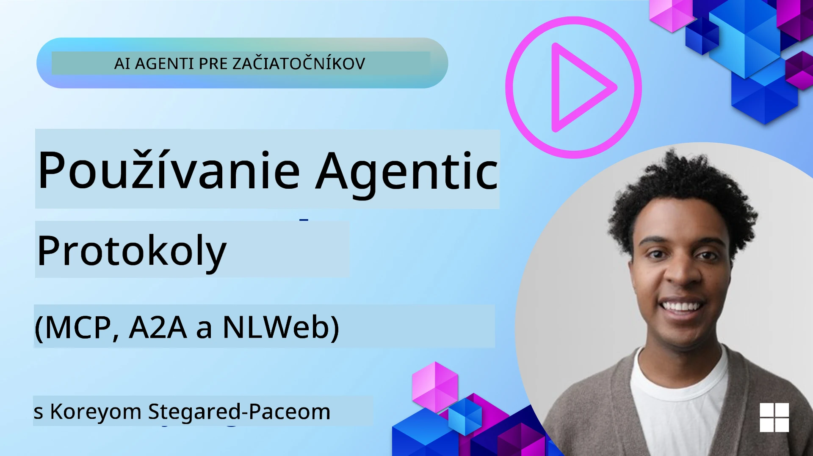
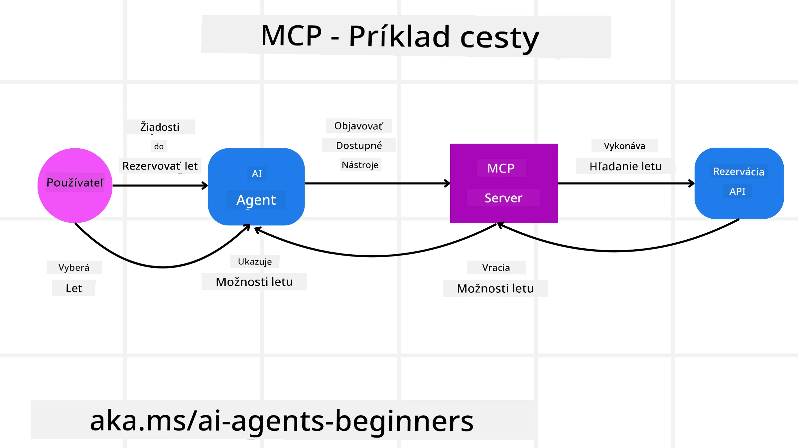
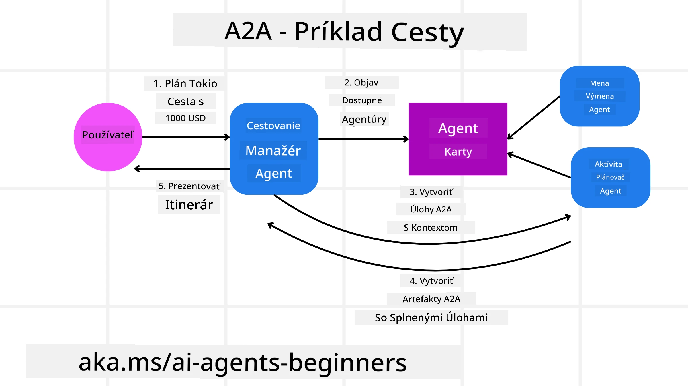
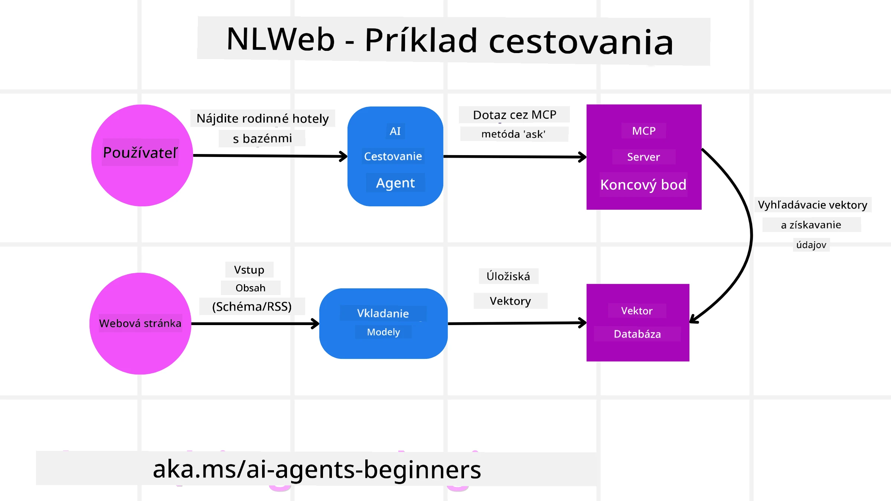

<!--
CO_OP_TRANSLATOR_METADATA:
{
  "original_hash": "aff92c6f019b4627ca9399c6e3882e17",
  "translation_date": "2025-09-18T15:32:46+00:00",
  "source_file": "11-agentic-protocols/README.md",
  "language_code": "sk"
}
-->
# Používanie agentických protokolov (MCP, A2A a NLWeb)

> _(Kliknite na obrázok vyššie pre zobrazenie videa k tejto lekcii)_

S rastúcim využívaním AI agentov rastie aj potreba protokolov, ktoré zabezpečujú štandardizáciu, bezpečnosť a podporujú otvorené inovácie. V tejto lekcii sa pozrieme na 3 protokoly, ktoré sa snažia splniť tieto požiadavky - Model Context Protocol (MCP), Agent to Agent (A2A) a Natural Language Web (NLWeb).

## Úvod

V tejto lekcii sa naučíte:

• Ako **MCP** umožňuje AI agentom prístup k externým nástrojom a dátam na splnenie úloh používateľa.

• Ako **A2A** umožňuje komunikáciu a spoluprácu medzi rôznymi AI agentmi.

• Ako **NLWeb** prináša rozhrania v prirodzenom jazyku na akúkoľvek webovú stránku, čím umožňuje AI agentom objavovať a interagovať s obsahom.

## Ciele učenia

• **Identifikovať** hlavný účel a výhody MCP, A2A a NLWeb v kontexte AI agentov.

• **Vysvetliť**, ako každý protokol uľahčuje komunikáciu a interakciu medzi LLM, nástrojmi a inými agentmi.

• **Rozpoznať** odlišné úlohy, ktoré každý protokol zohráva pri budovaní komplexných agentických systémov.

## Model Context Protocol

**Model Context Protocol (MCP)** je otvorený štandard, ktorý poskytuje štandardizovaný spôsob, ako aplikácie poskytujú kontext a nástroje LLM. To umožňuje "univerzálny adaptér" na rôzne zdroje dát a nástroje, ku ktorým sa AI agenti môžu pripojiť konzistentným spôsobom.

Pozrime sa na komponenty MCP, výhody oproti priamemu používaniu API a príklad, ako by AI agenti mohli používať MCP server.

### Základné komponenty MCP

MCP funguje na **architektúre klient-server** a jeho základné komponenty sú:

• **Hostitelia** sú aplikácie LLM (napríklad editor kódu ako VSCode), ktoré iniciujú pripojenia k MCP serveru.

• **Klienti** sú komponenty v hostiteľskej aplikácii, ktoré udržiavajú jednosmerné pripojenia so servermi.

• **Servery** sú ľahké programy, ktoré poskytujú špecifické schopnosti.

Protokol obsahuje tri základné prvky, ktoré definujú schopnosti MCP servera:

• **Nástroje**: Diskrétne akcie alebo funkcie, ktoré môže AI agent vyvolať na vykonanie úlohy. Napríklad služba počasia môže poskytovať nástroj "získať počasie" alebo e-commerce server môže poskytovať nástroj "kúpiť produkt". MCP servery inzerujú názvy, popisy a schémy vstupov/výstupov každého nástroja vo svojom zozname schopností.

• **Zdroje**: Dátové položky alebo dokumenty, ktoré môže MCP server poskytovať a klienti ich môžu na požiadanie získať. Príklady zahŕňajú obsah súborov, záznamy databázy alebo logy. Zdroje môžu byť textové (ako kód alebo JSON) alebo binárne (ako obrázky alebo PDF).

• **Podnety**: Preddefinované šablóny, ktoré poskytujú navrhované podnety, umožňujúce komplexnejšie pracovné postupy.

### Výhody MCP

MCP prináša významné výhody pre AI agentov:

• **Dynamické objavovanie nástrojov**: Agenti môžu dynamicky prijímať zoznam dostupných nástrojov zo servera spolu s popismi ich funkcií. Na rozdiel od tradičných API, ktoré často vyžadujú statické kódovanie pre integrácie, MCP ponúka prístup "integrovať raz", čo vedie k väčšej prispôsobivosti.

• **Interoperabilita medzi LLM**: MCP funguje naprieč rôznymi LLM, čo poskytuje flexibilitu pri výbere základných modelov na hodnotenie lepšieho výkonu.

• **Štandardizovaná bezpečnosť**: MCP obsahuje štandardnú metódu autentifikácie, čo zlepšuje škálovateľnosť pri pridávaní prístupu k ďalším MCP serverom. To je jednoduchšie ako správa rôznych kľúčov a typov autentifikácie pre rôzne tradičné API.

### Príklad MCP

Predstavte si, že používateľ chce rezervovať let pomocou AI asistenta poháňaného MCP.

1. **Pripojenie**: AI asistent (MCP klient) sa pripojí k MCP serveru poskytovanému leteckou spoločnosťou.

2. **Objavovanie nástrojov**: Klient sa opýta MCP servera leteckej spoločnosti: "Aké nástroje máte k dispozícii?" Server odpovie nástrojmi ako "vyhľadať lety" a "rezervovať lety".

3. **Vyvolanie nástroja**: Používateľ požiada AI asistenta: "Prosím, vyhľadaj let z Portlandu do Honolulu." AI asistent, využívajúc svoj LLM, identifikuje, že potrebuje vyvolať nástroj "vyhľadať lety" a odovzdá relevantné parametre (pôvod, cieľ) MCP serveru.

4. **Vykonanie a odpoveď**: MCP server, fungujúci ako obal, vykoná skutočné volanie na interné API leteckej spoločnosti. Potom prijme informácie o lete (napr. JSON dáta) a pošle ich späť AI asistentovi.

5. **Ďalšia interakcia**: AI asistent predstaví možnosti letu. Po výbere letu môže asistent vyvolať nástroj "rezervovať let" na rovnakom MCP serveri, čím dokončí rezerváciu.

## Agent-to-Agent Protocol (A2A)

Zatiaľ čo MCP sa zameriava na pripojenie LLM k nástrojom, **Agent-to-Agent (A2A) protokol** ide o krok ďalej tým, že umožňuje komunikáciu a spoluprácu medzi rôznymi AI agentmi. A2A spája AI agentov naprieč rôznymi organizáciami, prostrediami a technologickými stackmi na splnenie spoločnej úlohy.

Preskúmame komponenty a výhody A2A spolu s príkladom jeho aplikácie v našej cestovnej aplikácii.

### Základné komponenty A2A

A2A sa zameriava na umožnenie komunikácie medzi agentmi a ich spoluprácu na splnení podúlohy používateľa. Každý komponent protokolu k tomu prispieva:

#### Agent Card

Podobne ako MCP server zdieľa zoznam nástrojov, Agent Card obsahuje:
- Názov agenta.
- **Popis všeobecných úloh**, ktoré vykonáva.
- **Zoznam špecifických zručností** s popismi, ktoré pomáhajú iným agentom (alebo dokonca ľudským používateľom) pochopiť, kedy a prečo by chceli volať tohto agenta.
- **Aktuálnu URL adresu koncového bodu** agenta.
- **Verziu** a **schopnosti** agenta, ako napríklad streamovanie odpovedí a push notifikácie.

#### Agent Executor

Agent Executor je zodpovedný za **odovzdanie kontextu používateľského rozhovoru vzdialenému agentovi**, ktorý tento kontext potrebuje na pochopenie úlohy, ktorú má splniť. Na A2A serveri agent používa svoj vlastný Large Language Model (LLM) na analýzu prichádzajúcich požiadaviek a vykonávanie úloh pomocou svojich interných nástrojov.

#### Artifact

Keď vzdialený agent dokončí požadovanú úlohu, jeho výsledok sa vytvorí ako artifact. Artifact **obsahuje výsledok práce agenta**, **popis toho, čo bolo dokončené**, a **textový kontext**, ktorý sa posiela cez protokol. Po odoslaní artifactu sa spojenie s vzdialeným agentom uzavrie, kým nebude opäť potrebné.

#### Event Queue

Táto komponenta sa používa na **spracovanie aktualizácií a odovzdávanie správ**. Je obzvlášť dôležitá v produkcii pre agentické systémy, aby sa zabránilo uzavretiu spojenia medzi agentmi pred dokončením úlohy, najmä keď časy dokončenia úloh môžu byť dlhšie.

### Výhody A2A

• **Zlepšená spolupráca**: Umožňuje agentom od rôznych dodávateľov a platforiem interagovať, zdieľať kontext a spolupracovať, čím uľahčuje automatizáciu naprieč tradične odpojenými systémami.

• **Flexibilita výberu modelu**: Každý A2A agent môže rozhodnúť, ktorý LLM použije na spracovanie svojich požiadaviek, čo umožňuje optimalizované alebo jemne doladené modely pre každého agenta, na rozdiel od jedného LLM pripojenia v niektorých scenároch MCP.

• **Integrovaná autentifikácia**: Autentifikácia je priamo integrovaná do A2A protokolu, čo poskytuje robustný bezpečnostný rámec pre interakcie agentov.

### Príklad A2A

Rozšírme náš scenár rezervácie cesty, ale tentokrát pomocou A2A.

1. **Požiadavka používateľa na multi-agenta**: Používateľ interaguje s "Cestovným agentom" A2A klientom/agentom, napríklad tým, že povie: "Prosím, rezervujte celý výlet do Honolulu na budúci týždeň, vrátane letov, hotela a prenájmu auta."

2. **Orchestrácia cestovným agentom**: Cestovný agent prijme túto komplexnú požiadavku. Použije svoj LLM na premýšľanie o úlohe a určí, že potrebuje interagovať s inými špecializovanými agentmi.

3. **Komunikácia medzi agentmi**: Cestovný agent potom použije A2A protokol na pripojenie k downstream agentom, ako je "Letecký agent", "Hotelový agent" a "Agent prenájmu auta", ktoré sú vytvorené rôznymi spoločnosťami.

4. **Delegované vykonanie úlohy**: Cestovný agent pošle špecifické úlohy týmto špecializovaným agentom (napr. "Nájdi lety do Honolulu", "Rezervuj hotel", "Prenajmi auto"). Každý z týchto špecializovaných agentov, ktorý používa svoje vlastné LLM a svoje vlastné nástroje (ktoré môžu byť MCP servery), vykoná svoju špecifickú časť rezervácie.

5. **Konsolidovaná odpoveď**: Keď všetci downstream agenti dokončia svoje úlohy, cestovný agent skompiluje výsledky (detaily letu, potvrdenie hotela, rezervácia auta) a pošle komplexnú, chatovú odpoveď späť používateľovi.

## Natural Language Web (NLWeb)

Webové stránky už dlho slúžia ako primárny spôsob, ako používatelia získavajú informácie a dáta na internete.

Pozrime sa na rôzne komponenty NLWeb, výhody NLWeb a príklad, ako NLWeb funguje v našej cestovnej aplikácii.

### Komponenty NLWeb

- **NLWeb aplikácia (Core Service Code)**: Systém, ktorý spracováva otázky v prirodzenom jazyku. Spája rôzne časti platformy na vytvorenie odpovedí. Môžete si ho predstaviť ako **motor, ktorý poháňa funkcie prirodzeného jazyka** webovej stránky.

- **NLWeb protokol**: Základný súbor pravidiel pre interakciu v prirodzenom jazyku s webovou stránkou. Posiela odpovede vo formáte JSON (často pomocou Schema.org). Jeho účelom je vytvoriť jednoduchý základ pre "AI Web", podobne ako HTML umožnil zdieľanie dokumentov online.

- **MCP server (Model Context Protocol Endpoint)**: Každé nastavenie NLWeb funguje aj ako **MCP server**. To znamená, že môže **zdieľať nástroje (ako metódu "ask") a dáta** s inými AI systémami. V praxi to umožňuje, aby obsah a schopnosti webovej stránky boli použiteľné AI agentmi, čím sa stránka stáva súčasťou širšieho "ekosystému agentov".

- **Embedding modely**: Tieto modely sa používajú na **konverziu obsahu webovej stránky do numerických reprezentácií nazývaných vektory** (embeddingy). Tieto vektory zachytávajú význam spôsobom, ktorý počítače môžu porovnávať a vyhľadávať. Sú uložené v špeciálnej databáze a používatelia si môžu vybrať, ktorý embedding model chcú použiť.

- **Vektorová databáza (Mechanizmus vyhľadávania)**: Táto databáza **ukladá embeddingy obsahu webovej stránky**. Keď niekto položí otázku, NLWeb skontroluje vektorovú databázu, aby rýchlo našiel najrelevantnejšie informácie. Poskytuje rýchly zoznam možných odpovedí, zoradených podľa podobnosti. NLWeb funguje s rôznymi systémami na ukladanie vektorov, ako sú Qdrant, Snowflake, Milvus, Azure AI Search a Elasticsearch.

### NLWeb na príklade

Zvážme našu webovú stránku na rezerváciu ciest, ale tentokrát poháňanú NLWeb.

1. **Získavanie dát**: Existujúce katalógy produktov webovej stránky (napr. zoznamy letov, popisy hotelov, balíčky zájazdov) sú formátované pomocou Schema.org alebo načítané cez RSS feedy. Nástroje NLWeb spracujú tieto štruktúrované dáta, vytvoria embeddingy a uložia ich do lokálnej alebo vzdialenej vektorovej databázy.

2. **Dotaz v prirodzenom jazyku (ľudský)**: Používateľ navštívi webovú stránku a namiesto navigácie v menu napíše do chatového rozhrania: "Nájdi mi rodinný hotel v Honolulu s bazénom na budúci týždeň".

3. **Spracovanie NLWeb**: NLWeb aplikácia prijme tento dotaz. Pošle dotaz LLM na porozumenie a zároveň vyhľadá vo svojej vektorovej databáze relevantné zoznamy hotelov.

4. **Presné výsledky**: LLM pomáha interpretovať výsledky vyhľadávania z databázy, identifikovať najlepšie zhody na základe kritérií "rodinný", "bazén" a "Honolulu" a potom formátuje odpoveď v prirodzenom jazyku. Dôležité je, že odpoveď odkazuje na skutočné hotely z katalógu webovej stránky, čím sa vyhýba vymysleným informáciám.

5. **Interakcia AI agenta**: Keďže NLWeb slúži ako MCP server, externý AI cestovný agent by sa mohol tiež pripojiť k NLWeb inštancii tejto webovej stránky. AI agent by mohol použiť metódu `ask` MCP na priamy dotaz na webovú stránku: `ask("Existujú nejaké vegánske reštaurácie v oblasti Honolulu odporúčané hotelom?")`. NLWeb inštancia by to spracovala, využila svoju databázu informácií o reštauráciách (ak je načítaná) a vrátila štruktúrovanú JSON odpoveď.

### Máte ďalšie otázky o MCP/A2A/NLWeb?

Pripojte sa k [Azure AI Foundry Discord](https://aka.ms/ai-agents/discord), kde sa môžete stretnúť s ďalšími študentmi, zúčastniť sa konzultačných hodín a získať odpovede na vaše otázky o AI agentoch.

## Zdroje

- [MCP pre začiatočníkov](https://aka.ms/mcp-for-beginners)  
- [MCP dokumentácia](https://github.com/microsoft/semantic-kernel/tree/main/python/semantic-kernel/semantic_kernel/connectors/mcp)
- [NLWeb Repo](https://github.com/nlweb-ai/NLWeb)
- [Semantic Kernel Guides](https

---

**Upozornenie**:  
Tento dokument bol preložený pomocou služby AI prekladu [Co-op Translator](https://github.com/Azure/co-op-translator). Aj keď sa snažíme o presnosť, prosím, berte na vedomie, že automatizované preklady môžu obsahovať chyby alebo nepresnosti. Pôvodný dokument v jeho pôvodnom jazyku by mal byť považovaný za autoritatívny zdroj. Pre kritické informácie sa odporúča profesionálny ľudský preklad. Nie sme zodpovední za akékoľvek nedorozumenia alebo nesprávne interpretácie vyplývajúce z použitia tohto prekladu.