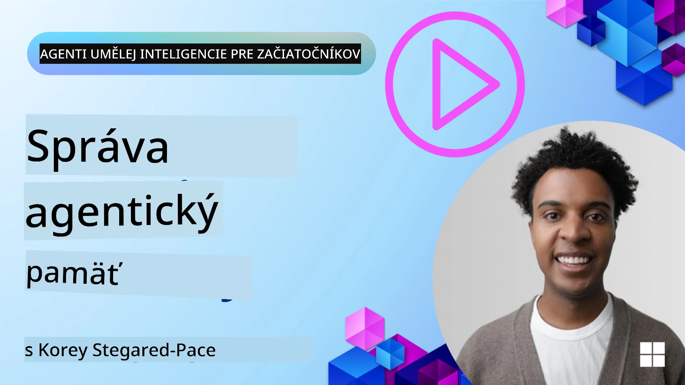

<!--
CO_OP_TRANSLATOR_METADATA:
{
  "original_hash": "a1d90991499ad697c4ad24decaf36968",
  "translation_date": "2025-12-09T12:44:23+00:00",
  "source_file": "13-agent-memory/README.md",
  "language_code": "sk"
}
-->
# Pamäť pre AI agentov 

Pri diskusii o jedinečných výhodách vytvárania AI agentov sa najčastejšie spomínajú dve veci: schopnosť využívať nástroje na plnenie úloh a schopnosť zlepšovať sa v priebehu času. Pamäť je základom pre vytváranie samostatne sa zlepšujúcich agentov, ktorí dokážu poskytovať lepšie zážitky pre našich používateľov.

V tejto lekcii sa pozrieme na to, čo je pamäť pre AI agentov, ako ju môžeme spravovať a využívať v prospech našich aplikácií.

## Úvod

Táto lekcia pokrýva:

• **Pochopenie pamäte AI agenta**: Čo je pamäť a prečo je pre agentov nevyhnutná.

• **Implementácia a ukladanie pamäte**: Praktické metódy pridávania pamäťových schopností do vašich AI agentov, so zameraním na krátkodobú a dlhodobú pamäť.

• **Vytváranie samostatne sa zlepšujúcich AI agentov**: Ako pamäť umožňuje agentom učiť sa z minulých interakcií a zlepšovať sa v priebehu času.

## Dostupné implementácie

Táto lekcia obsahuje dva komplexné tutoriály v notebookoch:

• **[13-agent-memory.ipynb](./13-agent-memory.ipynb)**: Implementuje pamäť pomocou Mem0 a Azure AI Search s rámcom Semantic Kernel.

• **[13-agent-memory-cognee.ipynb](./13-agent-memory-cognee.ipynb)**: Implementuje štruktúrovanú pamäť pomocou Cognee, automaticky vytvára znalostný graf podporovaný embeddingmi, vizualizuje graf a umožňuje inteligentné vyhľadávanie.

## Ciele učenia

Po absolvovaní tejto lekcie budete vedieť:

• **Rozlišovať medzi rôznymi typmi pamäte AI agenta**, vrátane pracovnej, krátkodobej a dlhodobej pamäte, ako aj špecializovaných foriem, ako sú pamäť osobnosti a epizodická pamäť.

• **Implementovať a spravovať krátkodobú a dlhodobú pamäť pre AI agentov** pomocou rámca Semantic Kernel, využívajúc nástroje ako Mem0, Cognee, Whiteboard memory a integráciu s Azure AI Search.

• **Pochopiť princípy samostatne sa zlepšujúcich AI agentov** a ako robustné systémy správy pamäte prispievajú k neustálemu učeniu a adaptácii.

## Pochopenie pamäte AI agenta

V jadre **pamäť pre AI agentov označuje mechanizmy, ktoré im umožňujú uchovávať a vybavovať si informácie**. Tieto informácie môžu zahŕňať konkrétne detaily o konverzácii, preferencie používateľa, minulé akcie alebo dokonca naučené vzory.

Bez pamäte sú AI aplikácie často bezstavové, čo znamená, že každá interakcia začína od nuly. To vedie k opakovanému a frustrujúcemu používateľskému zážitku, kde agent "zabúda" predchádzajúci kontext alebo preferencie.

### Prečo je pamäť dôležitá?

Inteligencia agenta je úzko spojená s jeho schopnosťou vybavovať si a využívať minulé informácie. Pamäť umožňuje agentom byť:

• **Reflexívni**: Učiť sa z minulých akcií a výsledkov.

• **Interaktívni**: Udržiavať kontext počas prebiehajúcej konverzácie.

• **Proaktívni a reaktívni**: Predvídať potreby alebo reagovať vhodne na základe historických údajov.

• **Autonómni**: Fungovať nezávislejšie vďaka využívaniu uložených znalostí.

Cieľom implementácie pamäte je urobiť agentov **spoľahlivejšími a schopnejšími**.

### Typy pamäte

#### Pracovná pamäť

Predstavte si ju ako kúsok poznámkového papiera, ktorý agent používa počas jednej úlohy alebo myšlienkového procesu. Uchováva okamžité informácie potrebné na výpočet ďalšieho kroku.

Pre AI agentov pracovná pamäť často zachytáva najrelevantnejšie informácie z konverzácie, aj keď je celá história chatu dlhá alebo skrátená. Zameriava sa na extrakciu kľúčových prvkov, ako sú požiadavky, návrhy, rozhodnutia a akcie.

**Príklad pracovnej pamäte**

V prípade agenta na rezerváciu ciest by pracovná pamäť mohla zachytiť aktuálnu požiadavku používateľa, napríklad "Chcem si rezervovať výlet do Paríža". Táto konkrétna požiadavka je držaná v bezprostrednom kontexte agenta na vedenie aktuálnej interakcie.

#### Krátkodobá pamäť

Tento typ pamäte uchováva informácie počas jednej konverzácie alebo relácie. Je to kontext aktuálneho chatu, ktorý umožňuje agentovi odkazovať na predchádzajúce kroky v dialógu.

**Príklad krátkodobej pamäte**

Ak sa používateľ opýta: "Koľko by stál let do Paríža?" a potom pokračuje: "A čo ubytovanie tam?", krátkodobá pamäť zabezpečí, že agent vie, že "tam" sa vzťahuje na "Paríž" v rámci tej istej konverzácie.

#### Dlhodobá pamäť

Toto sú informácie, ktoré pretrvávajú naprieč viacerými konverzáciami alebo reláciami. Umožňuje agentom pamätať si preferencie používateľov, historické interakcie alebo všeobecné znalosti počas dlhších období. To je dôležité pre personalizáciu.

**Príklad dlhodobej pamäte**

Dlhodobá pamäť by mohla uchovávať, že "Ben má rád lyžovanie a outdoorové aktivity, obľubuje kávu s výhľadom na hory a chce sa vyhnúť pokročilým lyžiarskym svahom kvôli minulému zraneniu". Tieto informácie, naučené z predchádzajúcich interakcií, ovplyvňujú odporúčania v budúcich plánovacích reláciách, čím sú vysoko personalizované.

#### Pamäť osobnosti

Tento špecializovaný typ pamäte pomáha agentovi vyvinúť konzistentnú "osobnosť" alebo "personu". Umožňuje agentovi pamätať si detaily o sebe alebo o svojej zamýšľanej úlohe, čím sú interakcie plynulejšie a zameranejšie.

**Príklad pamäte osobnosti**

Ak je agent na plánovanie ciest navrhnutý ako "expert na lyžovanie", pamäť osobnosti by mohla posilniť túto úlohu, ovplyvňujúc jeho odpovede tak, aby zodpovedali tónu a znalostiam experta.

#### Pamäť pracovného postupu/epizodická pamäť

Táto pamäť uchováva sekvenciu krokov, ktoré agent vykonáva počas zložitej úlohy, vrátane úspechov a neúspechov. Je to ako pamätať si konkrétne "epizódy" alebo minulé skúsenosti, aby sa z nich dalo učiť.

**Príklad epizodickej pamäte**

Ak sa agent pokúsil rezervovať konkrétny let, ale neúspešne kvôli nedostupnosti, epizodická pamäť by mohla zaznamenať tento neúspech, čo by agentovi umožnilo skúsiť alternatívne lety alebo informovať používateľa o probléme informovanejším spôsobom pri ďalšom pokuse.

#### Pamäť entít

Táto pamäť zahŕňa extrakciu a zapamätanie si konkrétnych entít (ako sú osoby, miesta alebo veci) a udalostí z konverzácií. Umožňuje agentovi vytvoriť štruktúrované pochopenie kľúčových prvkov, o ktorých sa diskutovalo.

**Príklad pamäte entít**

Z konverzácie o minulom výlete by agent mohol extrahovať "Paríž", "Eiffelova veža" a "večera v reštaurácii Le Chat Noir" ako entity. Pri budúcej interakcii by si agent mohol spomenúť na "Le Chat Noir" a ponúknuť rezerváciu tam.

#### Štruktúrovaný RAG (Retrieval Augmented Generation)

Aj keď je RAG širšou technikou, "štruktúrovaný RAG" je zdôraznený ako výkonná pamäťová technológia. Extrahuje husté, štruktúrované informácie z rôznych zdrojov (konverzácie, e-maily, obrázky) a používa ich na zvýšenie presnosti, vybavenia a rýchlosti odpovedí. Na rozdiel od klasického RAG, ktorý sa spolieha výlučne na sémantickú podobnosť, štruktúrovaný RAG pracuje so samotnou štruktúrou informácií.

**Príklad štruktúrovaného RAG**

Namiesto jednoduchého porovnávania kľúčových slov by štruktúrovaný RAG mohol analyzovať detaily letu (destinácia, dátum, čas, letecká spoločnosť) z e-mailu a uložiť ich štruktúrovaným spôsobom. To umožňuje presné dotazy, ako napríklad "Aký let som si rezervoval do Paríža na utorok?"

## Implementácia a ukladanie pamäte

Implementácia pamäte pre AI agentov zahŕňa systematický proces **správy pamäte**, ktorý zahŕňa generovanie, ukladanie, vyhľadávanie, integráciu, aktualizáciu a dokonca aj "zabúdanie" (alebo mazanie) informácií. Vyhľadávanie je obzvlášť kľúčovým aspektom.

### Špecializované nástroje na pamäť

#### Mem0

Jedným zo spôsobov, ako ukladať a spravovať pamäť agenta, je použitie špecializovaných nástrojov, ako je Mem0. Mem0 funguje ako vrstva pretrvávajúcej pamäte, ktorá umožňuje agentom vybaviť si relevantné interakcie, ukladať preferencie používateľov a faktický kontext a učiť sa z úspechov a neúspechov v priebehu času. Myšlienka je, že bezstavoví agenti sa menia na stavových.

Funguje prostredníctvom **dvojfázového pamäťového potrubia: extrakcia a aktualizácia**. Najprv sa správy pridané do vlákna agenta odosielajú do služby Mem0, ktorá používa veľký jazykový model (LLM) na zhrnutie histórie konverzácie a extrakciu nových spomienok. Následne fáza aktualizácie riadená LLM určuje, či tieto spomienky pridať, upraviť alebo vymazať, pričom ich ukladá do hybridného úložiska dát, ktoré môže zahŕňať vektorové, grafové a kľúčovo-hodnotové databázy. Tento systém tiež podporuje rôzne typy pamäte a môže zahŕňať grafovú pamäť na správu vzťahov medzi entitami.

#### Cognee

Ďalším výkonným prístupom je použitie **Cognee**, open-source sémantickej pamäte pre AI agentov, ktorá transformuje štruktúrované a neštruktúrované dáta na dotazovateľné znalostné grafy podporované embeddingmi. Cognee poskytuje **dvojité úložisko** kombinujúce vektorové vyhľadávanie podobnosti s grafovými vzťahmi, čo umožňuje agentom pochopiť nielen to, aké informácie sú podobné, ale aj ako sa koncepty navzájom vzťahujú.

Vyniká v **hybridnom vyhľadávaní**, ktoré kombinuje vektorovú podobnosť, štruktúru grafu a LLM uvažovanie - od vyhľadávania surových častí až po odpovedanie na otázky s vedomím grafu. Systém udržiava **živú pamäť**, ktorá sa vyvíja a rastie, pričom zostáva dotazovateľná ako jeden prepojený graf, podporujúc krátkodobý kontext relácie aj dlhodobú pretrvávajúcu pamäť.

Tutoriál v notebooku Cognee ([13-agent-memory-cognee.ipynb](./13-agent-memory-cognee.ipynb)) demonštruje budovanie tejto unifikovanej pamäťovej vrstvy s praktickými príkladmi spracovania rôznych zdrojov dát, vizualizácie znalostného grafu a dotazovania s rôznymi stratégiami vyhľadávania prispôsobenými konkrétnym potrebám agenta.

### Ukladanie pamäte pomocou RAG

Okrem špecializovaných nástrojov na pamäť, ako je Mem0, môžete využiť robustné vyhľadávacie služby, ako je **Azure AI Search ako backend na ukladanie a vyhľadávanie spomienok**, najmä pre štruktúrovaný RAG.

To umožňuje zakotviť odpovede vášho agenta vo vašich vlastných dátach, čím sa zabezpečia relevantnejšie a presnejšie odpovede. Azure AI Search môže byť použitý na ukladanie používateľských spomienok na cestovanie, katalógov produktov alebo akýchkoľvek iných znalostí špecifických pre danú oblasť.

Azure AI Search podporuje funkcie ako **štruktúrovaný RAG**, ktorý vyniká v extrakcii a vyhľadávaní hustých, štruktúrovaných informácií z veľkých datasetov, ako sú histórie konverzácií, e-maily alebo dokonca obrázky. To poskytuje "nadľudskú presnosť a vybavenie" v porovnaní s tradičnými prístupmi k textovému rozdeľovaniu a embeddingom.

## Vytváranie samostatne sa zlepšujúcich AI agentov

Bežný vzor pre samostatne sa zlepšujúcich agentov zahŕňa zavedenie **"znalostného agenta"**. Tento samostatný agent pozoruje hlavnú konverzáciu medzi používateľom a primárnym agentom. Jeho úlohou je:

1. **Identifikovať hodnotné informácie**: Určiť, či je nejaká časť konverzácie hodná uloženia ako všeobecná znalosť alebo konkrétna preferencia používateľa.

2. **Extrahovať a zhrnúť**: Destilovať podstatné učenie alebo preferenciu z konverzácie.

3. **Uložiť do znalostnej bázy**: Uložiť tieto extrahované informácie, často do vektorovej databázy, aby ich bolo možné neskôr vyhľadať.

4. **Doplniť budúce dotazy**: Keď používateľ iniciuje nový dotaz, znalostný agent vyhľadá relevantné uložené informácie a pridá ich k používateľovej výzve, čím poskytne kľúčový kontext primárnemu agentovi (podobne ako RAG).

### Optimalizácie pre pamäť

• **Správa latencie**: Aby sa predišlo spomaleniu interakcií používateľa, môže sa najprv použiť lacnejší a rýchlejší model na rýchle overenie, či je informácia hodná uloženia alebo vyhľadania, pričom zložitejší proces extrakcie/vyhľadávania sa spustí len v prípade potreby.

• **Údržba znalostnej bázy**: Pre rastúcu znalostnú bázu môžu byť menej často používané informácie presunuté do "studeného úložiska" na správu nákladov.

## Máte ďalšie otázky o pamäti agenta?

Pripojte sa k [Azure AI Foundry Discord](https://aka.ms/ai-agents/discord), kde sa môžete stretnúť s ďalšími študentmi, zúčastniť sa konzultačných hodín a získať odpovede na vaše otázky o AI agentoch.

---

<!-- CO-OP TRANSLATOR DISCLAIMER START -->
**Zrieknutie sa zodpovednosti**:  
Tento dokument bol preložený pomocou služby AI prekladu [Co-op Translator](https://github.com/Azure/co-op-translator). Aj keď sa snažíme o presnosť, prosím, berte na vedomie, že automatizované preklady môžu obsahovať chyby alebo nepresnosti. Pôvodný dokument v jeho rodnom jazyku by mal byť považovaný za autoritatívny zdroj. Pre kritické informácie sa odporúča profesionálny ľudský preklad. Nie sme zodpovední za žiadne nedorozumenia alebo nesprávne interpretácie vyplývajúce z použitia tohto prekladu.
<!-- CO-OP TRANSLATOR DISCLAIMER END -->