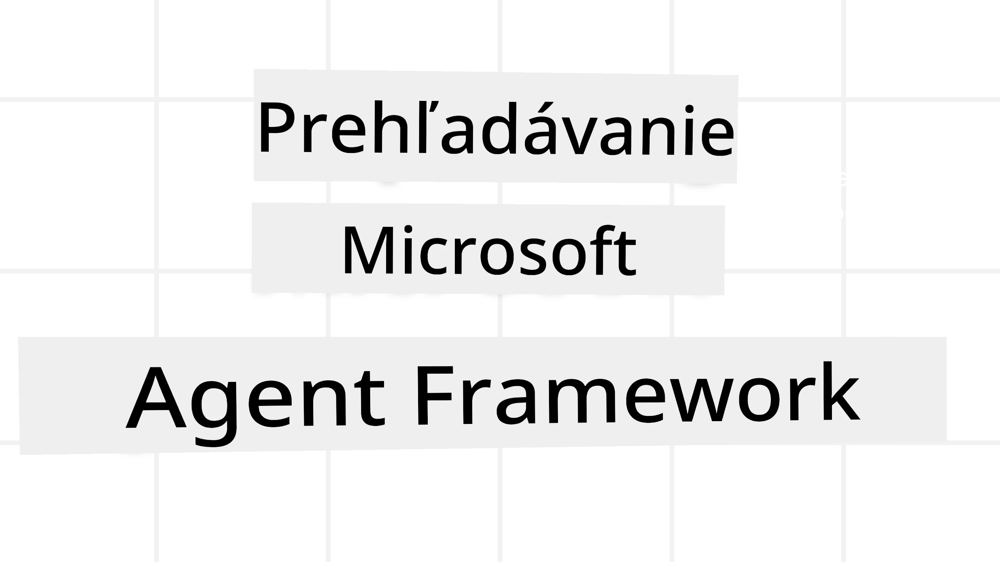
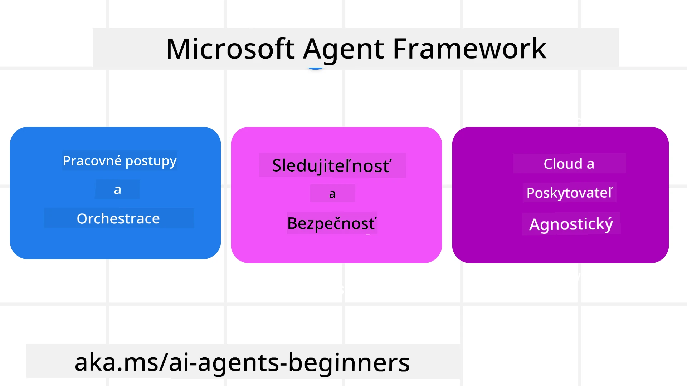
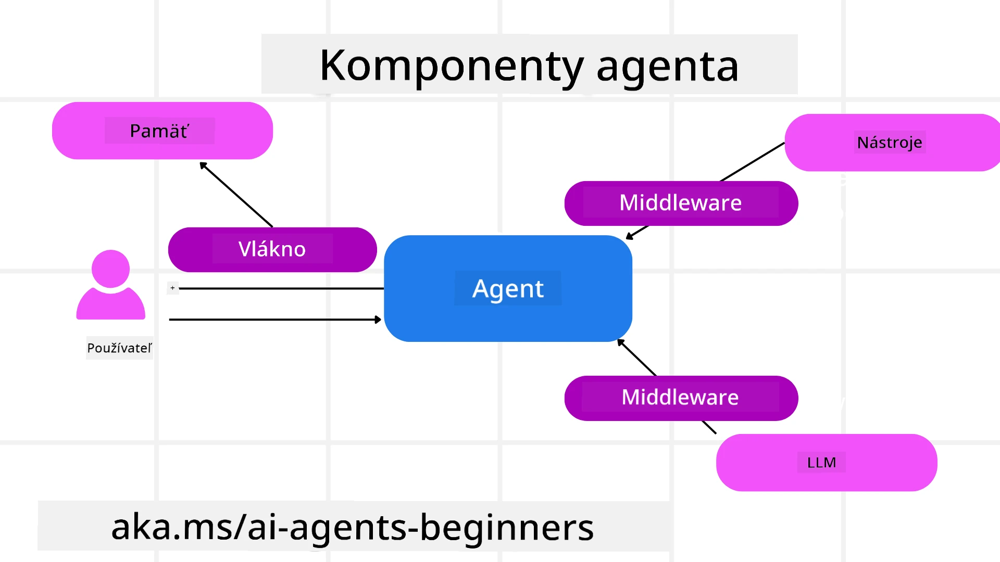

<!--
CO_OP_TRANSLATOR_METADATA:
{
  "original_hash": "19c4dab375acbc733855cc7f2f04edbc",
  "translation_date": "2025-10-02T08:11:50+00:00",
  "source_file": "14-microsoft-agent-framework/README.md",
  "language_code": "sk"
}
-->
# Preskúmanie Microsoft Agent Framework



### Úvod

Táto lekcia pokrýva:

- Porozumenie Microsoft Agent Framework: Kľúčové vlastnosti a hodnota  
- Preskúmanie kľúčových konceptov Microsoft Agent Framework
- Porovnanie MAF so Semantic Kernel a AutoGen: Príručka migrácie

## Ciele učenia

Po dokončení tejto lekcie budete vedieť:

- Vytvárať AI agentov pripravených na produkciu pomocou Microsoft Agent Framework
- Použiť základné vlastnosti Microsoft Agent Framework na vaše agentické prípady použitia
- Migrovať a integrovať existujúce agentické rámce a nástroje  

## Ukážky kódu 

Ukážky kódu pre [Microsoft Agent Framework (MAF)](https://aka.ms/ai-agents-beginners/agent-framewrok) nájdete v tomto repozitári pod súbormi `xx-python-agent-framework` a `xx-dotnet-agent-framework`.

## Porozumenie Microsoft Agent Framework



[Microsoft Agent Framework (MAF)](https://aka.ms/ai-agents-beginners/agent-framewrok) stavia na skúsenostiach a poznatkoch zo Semantic Kernel a AutoGen. Ponúka flexibilitu na riešenie širokej škály agentických prípadov použitia v produkčných aj výskumných prostrediach vrátane:

- **Sekvenčná orchestrácia agentov** v scenároch, kde sú potrebné krokové pracovné postupy.
- **Súbežná orchestrácia** v scenároch, kde agenti musia vykonávať úlohy súčasne.
- **Orchestrácia skupinového chatu** v scenároch, kde agenti môžu spolupracovať na jednej úlohe.
- **Orchestrácia odovzdania** v scenároch, kde agenti odovzdávajú úlohu jeden druhému po dokončení čiastkových úloh.
- **Magnetická orchestrácia** v scenároch, kde manažérsky agent vytvára a upravuje zoznam úloh a koordinuje podagentov na dokončenie úlohy.

Na dodanie AI agentov v produkcii MAF obsahuje aj funkcie pre:

- **Pozorovateľnosť** prostredníctvom OpenTelemetry, kde každá akcia AI agenta vrátane volania nástrojov, krokov orchestrácie, tokov uvažovania a monitorovania výkonu je sledovaná cez Azure AI Foundry dashboardy.
- **Bezpečnosť** hostovaním agentov natívne na Azure AI Foundry, ktoré zahŕňa bezpečnostné kontroly ako prístup na základe rolí, spracovanie súkromných údajov a zabudovanú bezpečnosť obsahu.
- **Trvanlivosť** ako vlákna a pracovné postupy agentov môžu pozastaviť, obnoviť a zotaviť sa z chýb, čo umožňuje dlhšie procesy.
- **Kontrola** ako sú podporované pracovné postupy s ľudským zásahom, kde úlohy sú označené ako vyžadujúce schválenie človekom.

Microsoft Agent Framework sa tiež zameriava na interoperabilitu prostredníctvom:

- **Cloud-agnostickosti** - Agenti môžu bežať v kontajneroch, on-premise a naprieč rôznymi cloudmi.
- **Poskytovateľskej agnostickosti** - Agenti môžu byť vytvorení prostredníctvom preferovaného SDK vrátane Azure OpenAI a OpenAI.
- **Integrácie otvorených štandardov** - Agenti môžu využívať protokoly ako Agent-to-Agent (A2A) a Model Context Protocol (MCP) na objavovanie a používanie iných agentov a nástrojov.
- **Pluginov a konektorov** - Pripojenia môžu byť vytvorené k dátovým a pamäťovým službám ako Microsoft Fabric, SharePoint, Pinecone a Qdrant.

Pozrime sa, ako sú tieto funkcie aplikované na niektoré základné koncepty Microsoft Agent Framework.

## Kľúčové koncepty Microsoft Agent Framework

### Agenti



**Vytváranie agentov**

Vytváranie agentov sa vykonáva definovaním inferenčnej služby (LLM Provider), súboru inštrukcií pre AI agenta a priradeného `name`:

```python
agent = AzureOpenAIChatClient(credential=AzureCliCredential()).create_agent( instructions="You are good at recommending trips to customers based on their preferences.", name="TripRecommender" )
```

Vyššie uvedené používa `Azure OpenAI`, ale agenti môžu byť vytvorení pomocou rôznych služieb vrátane `Azure AI Foundry Agent Service`:

```python
AzureAIAgentClient(async_credential=credential).create_agent( name="HelperAgent", instructions="You are a helpful assistant." ) as agent
```

OpenAI `Responses`, `ChatCompletion` API

```python
agent = OpenAIResponsesClient().create_agent( name="WeatherBot", instructions="You are a helpful weather assistant.", )
```

```python
agent = OpenAIChatClient().create_agent( name="HelpfulAssistant", instructions="You are a helpful assistant.", )
```

alebo vzdialených agentov pomocou protokolu A2A:

```python
agent = A2AAgent( name=agent_card.name, description=agent_card.description, agent_card=agent_card, url="https://your-a2a-agent-host" )
```

**Spúšťanie agentov**

Agenti sú spúšťaní pomocou metód `.run` alebo `.run_stream` pre odpovede bez streamovania alebo so streamovaním.

```python
result = await agent.run("What are good places to visit in Amsterdam?")
print(result.text)
```

```python
async for update in agent.run_stream("What are the good places to visit in Amsterdam?"):
    if update.text:
        print(update.text, end="", flush=True)

```

Každé spustenie agenta môže mať aj možnosti prispôsobenia parametrov, ako napríklad `max_tokens`, ktoré agent používa, `tools`, ktoré agent môže volať, a dokonca aj samotný `model`, ktorý agent používa.

To je užitočné v prípadoch, kde sú na dokončenie úlohy používateľa potrebné konkrétne modely alebo nástroje.

**Nástroje**

Nástroje môžu byť definované pri definovaní agenta:

```python
def get_attractions( location: Annotated[str, Field(description="The location to get the top tourist attractions for")], ) -> str: """Get the top tourist attractions for a given location.""" return f"The top attractions for {location} are." 


# When creating a ChatAgent directly 

agent = ChatAgent( chat_client=OpenAIChatClient(), instructions="You are a helpful assistant", tools=[get_attractions]

```

a tiež pri spúšťaní agenta:

```python

result1 = await agent.run( "What's the best place to visit in Seattle?", tools=[get_attractions] # Tool provided for this run only )
```

**Vlákna agentov**

Vlákna agentov sa používajú na spracovanie viacotáčkových konverzácií. Vlákna môžu byť vytvorené buď:

- Použitím `get_new_thread()`, čo umožňuje vlákno uložiť na dlhší čas
- Automatickým vytvorením vlákna pri spúšťaní agenta, pričom vlákno existuje iba počas aktuálneho spustenia.

Na vytvorenie vlákna kód vyzerá takto:

```python
# Create a new thread. 
thread = agent.get_new_thread() # Run the agent with the thread. 
response = await agent.run("Hello, I am here to help you book travel. Where would you like to go?", thread=thread)

```

Potom môžete vlákno serializovať na uloženie na neskoršie použitie:

```python
# Create a new thread. 
thread = agent.get_new_thread() 

# Run the agent with the thread. 

response = await agent.run("Hello, how are you?", thread=thread) 

# Serialize the thread for storage. 

serialized_thread = await thread.serialize() 

# Deserialize the thread state after loading from storage. 

resumed_thread = await agent.deserialize_thread(serialized_thread)
```

**Middleware agenta**

Agenti interagujú s nástrojmi a LLM na dokončenie úloh používateľa. V určitých scenároch chceme vykonať alebo sledovať akcie medzi týmito interakciami. Middleware agenta nám to umožňuje prostredníctvom:

*Function Middleware*

Tento middleware nám umožňuje vykonať akciu medzi agentom a funkciou/nástrojom, ktorý bude volať. Príkladom použitia by mohlo byť logovanie volania funkcie.

V kóde nižšie `next` definuje, či by mal byť volaný ďalší middleware alebo samotná funkcia.

```python
async def logging_function_middleware(
    context: FunctionInvocationContext,
    next: Callable[[FunctionInvocationContext], Awaitable[None]],
) -> None:
    """Function middleware that logs function execution."""
    # Pre-processing: Log before function execution
    print(f"[Function] Calling {context.function.name}")

    # Continue to next middleware or function execution
    await next(context)

    # Post-processing: Log after function execution
    print(f"[Function] {context.function.name} completed")
```

*Chat Middleware*

Tento middleware nám umožňuje vykonať alebo logovať akciu medzi agentom a požiadavkami medzi LLM.

Obsahuje dôležité informácie, ako napríklad `messages`, ktoré sú posielané AI službe.

```python
async def logging_chat_middleware(
    context: ChatContext,
    next: Callable[[ChatContext], Awaitable[None]],
) -> None:
    """Chat middleware that logs AI interactions."""
    # Pre-processing: Log before AI call
    print(f"[Chat] Sending {len(context.messages)} messages to AI")

    # Continue to next middleware or AI service
    await next(context)

    # Post-processing: Log after AI response
    print("[Chat] AI response received")

```

**Pamäť agenta**

Ako bolo pokryté v lekcii `Agentic Memory`, pamäť je dôležitým prvkom umožňujúcim agentovi operovať v rôznych kontextoch. MAF ponúka niekoľko rôznych typov pamätí:

*Pamäť v pamäti*

Toto je pamäť uložená vo vláknach počas behu aplikácie.

```python
# Create a new thread. 
thread = agent.get_new_thread() # Run the agent with the thread. 
response = await agent.run("Hello, I am here to help you book travel. Where would you like to go?", thread=thread)
```

*Trvalé správy*

Táto pamäť sa používa pri ukladaní histórie konverzácií naprieč rôznymi reláciami. Je definovaná pomocou `chat_message_store_factory`:

```python
from agent_framework import ChatMessageStore

# Create a custom message store
def create_message_store():
    return ChatMessageStore()

agent = ChatAgent(
    chat_client=OpenAIChatClient(),
    instructions="You are a Travel assistant.",
    chat_message_store_factory=create_message_store
)

```

*Dynamická pamäť*

Táto pamäť je pridaná do kontextu pred spustením agentov. Tieto pamäte môžu byť uložené v externých službách, ako je mem0:

```python
from agent_framework.mem0 import Mem0Provider

# Using Mem0 for advanced memory capabilities
memory_provider = Mem0Provider(
    api_key="your-mem0-api-key",
    user_id="user_123",
    application_id="my_app"
)

agent = ChatAgent(
    chat_client=OpenAIChatClient(),
    instructions="You are a helpful assistant with memory.",
    context_providers=memory_provider
)

```

**Pozorovateľnosť agenta**

Pozorovateľnosť je dôležitá pre budovanie spoľahlivých a udržiavateľných agentických systémov. MAF integruje OpenTelemetry na poskytovanie sledovania a metrík pre lepšiu pozorovateľnosť.

```python
from agent_framework.observability import get_tracer, get_meter

tracer = get_tracer()
meter = get_meter()
with tracer.start_as_current_span("my_custom_span"):
    # do something
    pass
counter = meter.create_counter("my_custom_counter")
counter.add(1, {"key": "value"})
```

### Pracovné postupy

MAF ponúka pracovné postupy, ktoré sú preddefinované kroky na dokončenie úlohy a zahŕňajú AI agentov ako komponenty v týchto krokoch.

Pracovné postupy sú zložené z rôznych komponentov, ktoré umožňujú lepšiu kontrolu toku. Pracovné postupy tiež umožňujú **orchestráciu viacerých agentov** a **kontrolné body** na uloženie stavov pracovného postupu.

Základné komponenty pracovného postupu sú:

**Exekútory**

Exekútory prijímajú vstupné správy, vykonávajú priradené úlohy a potom produkujú výstupnú správu. Tým sa pracovný postup posúva smerom k dokončeniu väčšej úlohy. Exekútory môžu byť buď AI agenti alebo vlastná logika.

**Hrany**

Hrany sa používajú na definovanie toku správ v pracovnom postupe. Môžu byť:

*Priame hrany* - Jednoduché spojenia jeden na jedného medzi exekútormi:

```python
from agent_framework import WorkflowBuilder

builder = WorkflowBuilder()
builder.add_edge(source_executor, target_executor)
builder.set_start_executor(source_executor)
workflow = builder.build()
```

*Podmienené hrany* - Aktivované po splnení určitej podmienky. Napríklad, keď hotelové izby nie sú dostupné, exekútor môže navrhnúť iné možnosti.

*Switch-case hrany* - Posielajú správy rôznym exekútorom na základe definovaných podmienok. Napríklad, ak má cestovný zákazník prioritný prístup, jeho úlohy budú spracované cez iný pracovný postup.

*Fan-out hrany* - Posielajú jednu správu viacerým cieľom.

*Fan-in hrany* - Zbierajú viac správ od rôznych exekútorov a posielajú ich jednému cieľu.

**Udalosti**

Na lepšiu pozorovateľnosť pracovných postupov MAF ponúka zabudované udalosti pre vykonávanie vrátane:

- `WorkflowStartedEvent`  - Začiatok vykonávania pracovného postupu
- `WorkflowOutputEvent` - Pracovný postup produkuje výstup
- `WorkflowErrorEvent` - Pracovný postup narazí na chybu
- `ExecutorInvokeEvent`  - Exekútor začína spracovanie
- `ExecutorCompleteEvent`  - Exekútor dokončuje spracovanie
- `RequestInfoEvent` - Vydaná požiadavka

## Migrácia z iných rámcov (Semantic Kernel a AutoGen)

### Rozdiely medzi MAF a Semantic Kernel

**Zjednodušené vytváranie agentov**

Semantic Kernel vyžaduje vytvorenie inštancie Kernel pre každého agenta. MAF používa zjednodušený prístup pomocou rozšírení pre hlavné poskytovateľov.

```python
agent = AzureOpenAIChatClient(credential=AzureCliCredential()).create_agent( instructions="You are good at reccomending trips to customers based on their preferences.", name="TripRecommender" )
```

**Vytváranie vlákien agentov**

Semantic Kernel vyžaduje manuálne vytváranie vlákien. V MAF je agent priamo priradený vlákno.

```python
thread = agent.get_new_thread() # Run the agent with the thread. 
```

**Registrácia nástrojov**

V Semantic Kernel sú nástroje registrované do Kernel a Kernel je potom odovzdaný agentovi. V MAF sú nástroje registrované priamo počas procesu vytvárania agenta.

```python
agent = ChatAgent( chat_client=OpenAIChatClient(), instructions="You are a helpful assistant", tools=[get_attractions]
```

### Rozdiely medzi MAF a AutoGen

**Tímy vs pracovné postupy**

`Tímy` sú štruktúra udalostí pre aktivity riadené udalosťami s agentmi v AutoGen. MAF používa `Pracovné postupy`, ktoré smerujú dáta k exekútorom prostredníctvom architektúry založenej na grafoch.

**Vytváranie nástrojov**

AutoGen používa `FunctionTool` na obalenie funkcií, ktoré agenti môžu volať. MAF používa @ai_function, ktorý funguje podobne, ale tiež automaticky odvodzuje schémy pre každú funkciu.

**Správanie agentov**

Agenti sú v AutoGen predvolene jednootáčkoví, pokiaľ `max_tool_iterations` nie je nastavené na vyššiu hodnotu. V MAF je `ChatAgent` predvolene viacotáčkový, čo znamená, že bude pokračovať vo volaní nástrojov, kým úloha používateľa nebude dokončená.

## Ukážky kódu 

Ukážky kódu pre Microsoft Agent Framework nájdete v tomto repozitári pod súbormi `xx-python-agent-framework` a `xx-dotnet-agent-framework`.

## Máte ďalšie otázky o Microsoft Agent Framework?

Pripojte sa k [Azure AI Foundry Discord](https://aka.ms/ai-agents/discord), kde sa môžete stretnúť s ostatnými študentmi, zúčastniť sa konzultačných hodín a získať odpovede na vaše otázky o AI agentoch.

---

**Upozornenie**:  
Tento dokument bol preložený pomocou služby AI prekladu [Co-op Translator](https://github.com/Azure/co-op-translator). Aj keď sa snažíme o presnosť, upozorňujeme, že automatizované preklady môžu obsahovať chyby alebo nepresnosti. Pôvodný dokument v jeho pôvodnom jazyku by mal byť považovaný za autoritatívny zdroj. Pre kritické informácie sa odporúča profesionálny ľudský preklad. Nezodpovedáme za akékoľvek nedorozumenia alebo nesprávne interpretácie vyplývajúce z použitia tohto prekladu.