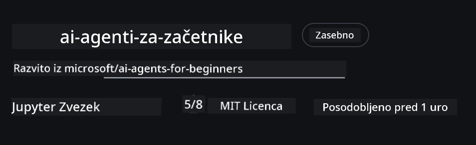
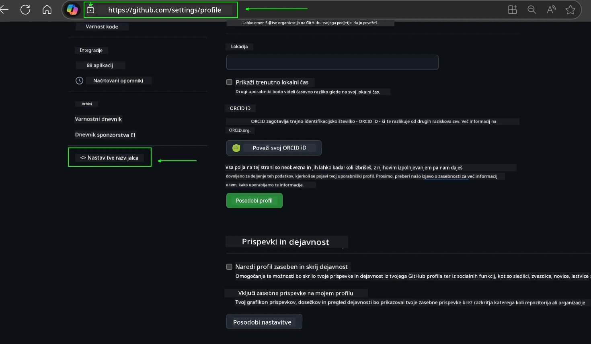
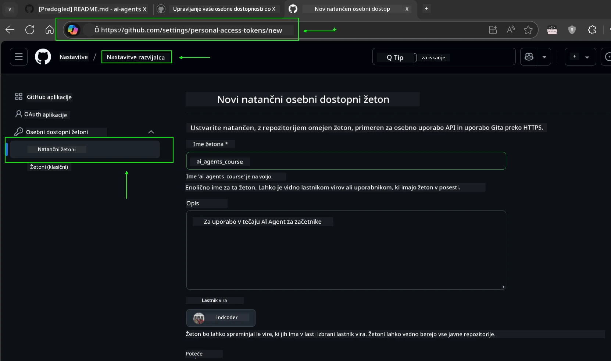
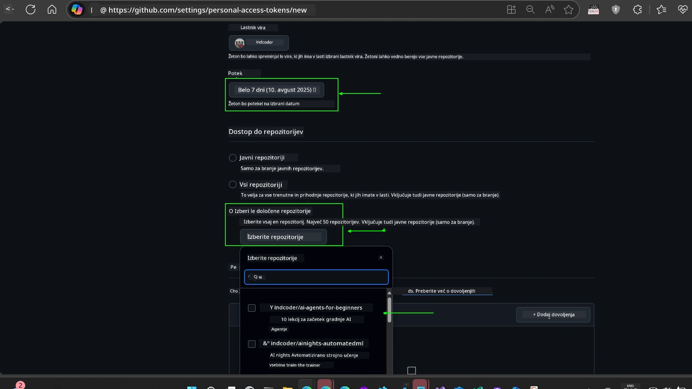
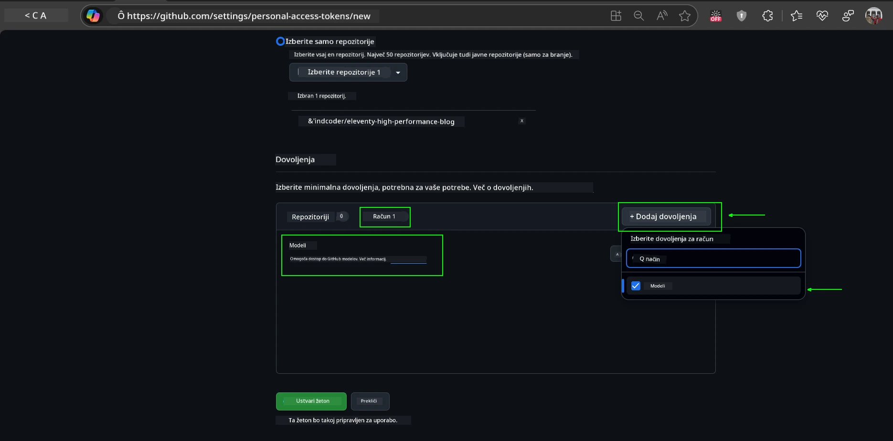
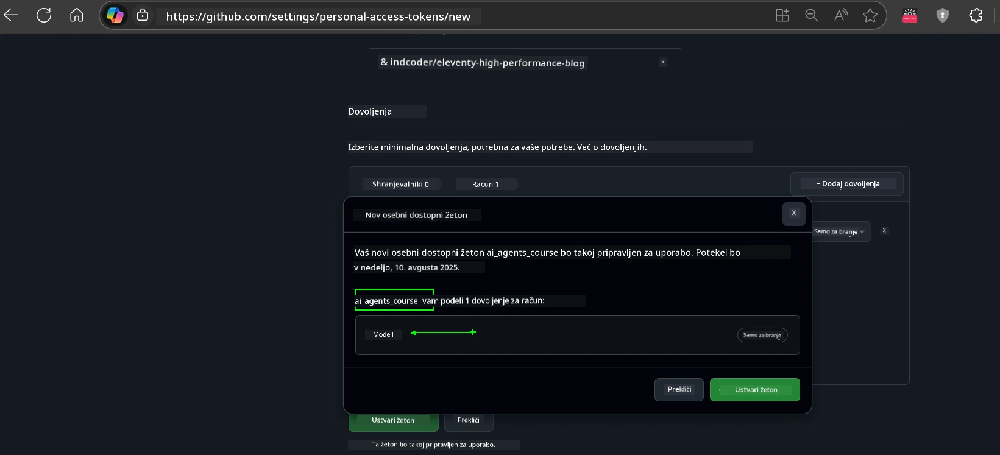
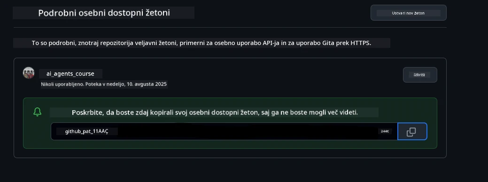
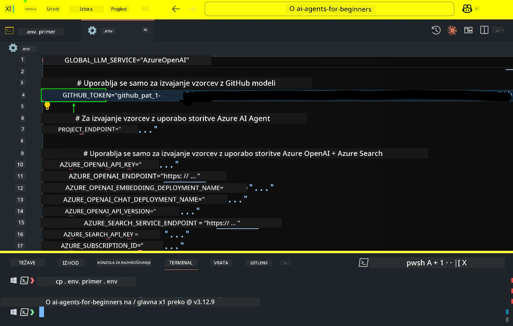
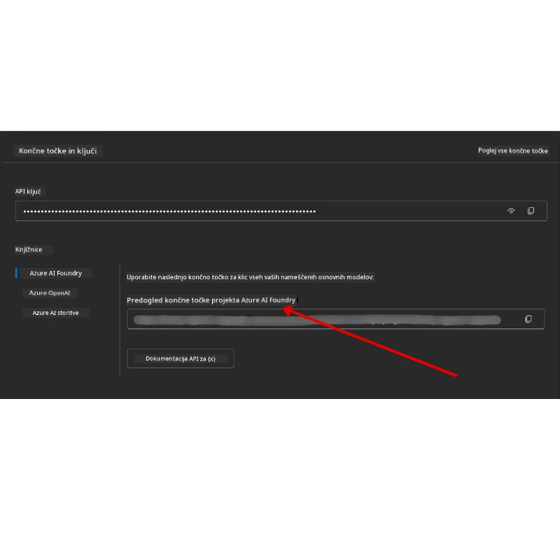

<!--
CO_OP_TRANSLATOR_METADATA:
{
  "original_hash": "63b1a8f6e840df15934935b728e569f0",
  "translation_date": "2025-12-03T15:06:07+00:00",
  "source_file": "00-course-setup/README.md",
  "language_code": "sl"
}
-->
# Nastavitev tečaja

## Uvod

V tej lekciji bomo obravnavali, kako zagnati vzorčne kode tega tečaja.

## Pridružite se drugim udeležencem in poiščite pomoč

Preden začnete klonirati svoj repozitorij, se pridružite [Discord kanalu AI Agents For Beginners](https://aka.ms/ai-agents/discord), kjer lahko dobite pomoč pri nastavitvi, postavite vprašanja o tečaju ali se povežete z drugimi udeleženci.

## Klonirajte ali forkirajte ta repozitorij

Za začetek prosimo, da klonirate ali forkirate GitHub repozitorij. Tako boste ustvarili svojo različico gradiva tečaja, da boste lahko zagnali, testirali in prilagodili kodo!

To lahko storite s klikom na povezavo za <a href="https://github.com/microsoft/ai-agents-for-beginners/fork" target="_blank">fork repozitorija</a>.

Zdaj bi morali imeti svojo forkirano različico tega tečaja na naslednji povezavi:



### Plitko kloniranje (priporočeno za delavnice / Codespaces)

  >Celoten repozitorij je lahko velik (~3 GB), če prenesete celotno zgodovino in vse datoteke. Če se udeležujete le delavnice ali potrebujete le nekaj map z lekcijami, plitko kloniranje (ali redko kloniranje) prepreči večino tega prenosa z omejevanjem zgodovine in/ali preskakovanjem datotek.

#### Hitro plitko kloniranje — minimalna zgodovina, vse datoteke

Zamenjajte `<your-username>` v spodnjih ukazih z URL-jem vašega forka (ali z URL-jem izvornega repozitorija, če to raje uporabljate).

Za kloniranje samo najnovejše zgodovine commitov (majhen prenos):

```bash|powershell
git clone --depth 1 https://github.com/<your-username>/ai-agents-for-beginners.git
```

Za kloniranje določene veje:

```bash|powershell
git clone --depth 1 --branch <branch-name> https://github.com/<your-username>/ai-agents-for-beginners.git
```

#### Delno (redko) kloniranje — minimalne datoteke + samo izbrane mape

To uporablja delno kloniranje in redko preverjanje (zahteva Git 2.25+ in priporočeno sodobno različico Gita s podporo za delno kloniranje):

```bash|powershell
git clone --depth 1 --filter=blob:none --sparse https://github.com/<your-username>/ai-agents-for-beginners.git
```

Premaknite se v mapo repozitorija:

```bash|powershell
cd ai-agents-for-beginners
```

Nato določite, katere mape želite (primer spodaj prikazuje dve mapi):

```bash|powershell
git sparse-checkout set 00-course-setup 01-intro-to-ai-agents
```

Po kloniranju in preverjanju datotek, če potrebujete samo datoteke in želite sprostiti prostor (brez zgodovine git), izbrišite metapodatke repozitorija (💀nepovratno — izgubili boste vse funkcionalnosti Git: brez commitov, pullov, pushov ali dostopa do zgodovine).

```bash
# zsh/bash
rm -rf .git
```

```powershell
# PowerShell
Remove-Item -Recurse -Force .git
```

#### Uporaba GitHub Codespaces (priporočeno za izogibanje velikim lokalnim prenosom)

- Ustvarite nov Codespace za ta repozitorij prek [GitHub uporabniškega vmesnika](https://github.com/codespaces).  

- V terminalu na novo ustvarjenega Codespace-a zaženite enega od ukazov za plitko/redko kloniranje zgoraj, da vnesete samo mape z lekcijami, ki jih potrebujete, v delovni prostor Codespace-a.
- Opcijsko: po kloniranju znotraj Codespaces odstranite .git, da sprostite dodaten prostor (glejte zgornje ukaze za odstranitev).
- Opomba: Če raje odprete repozitorij neposredno v Codespaces (brez dodatnega kloniranja), bodite pozorni, da bo Codespaces zgradil okolje devcontainer in morda še vedno pripravil več, kot potrebujete. Kloniranje plitke kopije znotraj svežega Codespace-a vam omogoča več nadzora nad uporabo diska.

#### Nasveti

- Vedno zamenjajte URL za kloniranje s svojim forkom, če želite urejati/commitat.
- Če kasneje potrebujete več zgodovine ali datotek, jih lahko pridobite ali prilagodite redko preverjanje, da vključite dodatne mape.

## Zagon kode

Ta tečaj ponuja serijo Jupyter zvezkov, ki jih lahko zaženete za praktično izkušnjo pri gradnji AI agentov.

Vzorčne kode uporabljajo:

**Zahteva GitHub račun - Brezplačno**:

1) Semantic Kernel Agent Framework + GitHub Models Marketplace. Označeno kot (semantic-kernel.ipynb)
2) AutoGen Framework + GitHub Models Marketplace. Označeno kot (autogen.ipynb)

**Zahteva Azure naročnino**:

3) Azure AI Foundry + Azure AI Agent Service. Označeno kot (azureaiagent.ipynb)

Spodbujamo vas, da preizkusite vse tri vrste primerov, da vidite, kateri vam najbolj ustreza.

Katero koli možnost izberete, bo določila, katere korake za nastavitev morate slediti spodaj:

## Zahteve

- Python 3.12+
  - **OPOMBA**: Če nimate nameščenega Python3.12, ga namestite. Nato ustvarite svoj venv z uporabo python3.12, da zagotovite pravilne različice iz datoteke requirements.txt.
  
    >Primer

    Ustvarite Python venv mapo:

    ```bash|powershell
    python -m venv venv
    ```

    Nato aktivirajte venv okolje za:

    ```bash
    # zsh/bash
    source venv/bin/activate
    ```
  
    ```dos
    # Command Prompt for Windows
    venv\Scripts\activate
    ```

- .NET 10+: Za vzorčne kode, ki uporabljajo .NET, poskrbite, da namestite [.NET 10 SDK](https://dotnet.microsoft.com/download/dotnet/10.0) ali novejši. Nato preverite svojo nameščeno različico .NET SDK:

    ```bash|powershell
    dotnet --list-sdks
    ```

- GitHub račun - Za dostop do GitHub Models Marketplace
- Azure naročnina - Za dostop do Azure AI Foundry
- Azure AI Foundry račun - Za dostop do Azure AI Agent Service

V korenskem imeniku tega repozitorija smo vključili datoteko `requirements.txt`, ki vsebuje vse potrebne Python pakete za zagon vzorčnih kod.

Namestite jih lahko z naslednjim ukazom v terminalu v korenskem imeniku repozitorija:

```bash|powershell
pip install -r requirements.txt
```

Priporočamo ustvarjanje Python virtualnega okolja, da se izognete morebitnim konfliktom in težavam.

## Nastavitev VSCode

Prepričajte se, da uporabljate pravilno različico Pythona v VSCode.


## Nastavitev za vzorce z uporabo GitHub modelov 

### Korak 1: Pridobite svoj GitHub osebni dostopni žeton (PAT)

Ta tečaj uporablja GitHub Models Marketplace, ki omogoča brezplačen dostop do velikih jezikovnih modelov (LLM), ki jih boste uporabili za gradnjo AI agentov.

Za uporabo GitHub modelov boste morali ustvariti [GitHub osebni dostopni žeton](https://docs.github.com/en/authentication/keeping-your-account-and-data-secure/managing-your-personal-access-tokens).

To lahko storite tako, da obiščete <a href="https://github.com/settings/personal-access-tokens" target="_blank">nastavitve osebnih dostopnih žetonov</a> v svojem GitHub računu.

Prosimo, sledite [načelu najmanjših privilegijev](https://docs.github.com/en/get-started/learning-to-code/storing-your-secrets-safely) pri ustvarjanju svojega žetona. To pomeni, da žetonu dodelite samo tista dovoljenja, ki jih potrebuje za zagon vzorčnih kod v tem tečaju.

1. Na levi strani zaslona izberite možnost `Fine-grained tokens` z navigacijo do **Developer settings**.

   

   Nato izberite `Generate new token`.

   

2. Vnesite opisno ime za svoj žeton, ki odraža njegov namen, da ga boste kasneje lažje prepoznali.

    🔐 Priporočilo za trajanje žetona

    Priporočeno trajanje: 30 dni
    Za bolj varno držo lahko izberete krajše obdobje—na primer 7 dni 🛡️
    To je odličen način, da si postavite osebni cilj in dokončate tečaj, medtem ko je vaša učna motivacija visoka 🚀.

    

3. Omejite obseg žetona na svoj fork tega repozitorija.

    

4. Omejite dovoljenja žetona: Pod **Permissions**, kliknite zavihek **Account** in nato gumb "+ Add permissions". Pojavi se spustni meni. Poiščite **Models** in označite polje.

    

5. Preverite zahtevana dovoljenja pred ustvarjanjem žetona. 

6. Pred ustvarjanjem žetona se prepričajte, da ste pripravljeni shraniti žeton na varno mesto, kot je trezor za gesla, saj ga po ustvarjanju ne boste več videli. 

Kopirajte svoj novi žeton, ki ste ga pravkar ustvarili. Zdaj ga boste dodali v svojo `.env` datoteko, vključeno v ta tečaj.

### Korak 2: Ustvarite svojo `.env` datoteko

Za ustvarjanje `.env` datoteke zaženite naslednji ukaz v terminalu.

```bash
# zsh/bash
cp .env.example .env
```

```powershell
# PowerShell
Copy-Item .env.example .env
```

To bo kopiralo primer datoteke in ustvarilo `.env` v vaši mapi, kjer izpolnite vrednosti za okoljske spremenljivke.

S kopiranim žetonom odprite `.env` datoteko v svojem najljubšem urejevalniku besedila in prilepite svoj žeton v polje `GITHUB_TOKEN`.



Zdaj bi morali biti sposobni zagnati vzorčne kode tega tečaja.

## Nastavitev za vzorce z uporabo Azure AI Foundry in Azure AI Agent Service

### Korak 1: Pridobite končno točko svojega Azure projekta

Sledite korakom za ustvarjanje vozlišča in projekta v Azure AI Foundry, ki jih najdete tukaj: [Pregled virov vozlišča](https://learn.microsoft.com/azure/ai-foundry/concepts/ai-resources)

Ko ustvarite svoj projekt, boste morali pridobiti povezovalni niz za svoj projekt.

To lahko storite tako, da obiščete stran **Pregled** svojega projekta v portalu Azure AI Foundry.



### Korak 2: Ustvarite svojo `.env` datoteko

Za ustvarjanje `.env` datoteke zaženite naslednji ukaz v terminalu.

```bash
# zsh/bash
cp .env.example .env
```

```powershell
# PowerShell
Copy-Item .env.example .env
```

To bo kopiralo primer datoteke in ustvarilo `.env` v vaši mapi, kjer izpolnite vrednosti za okoljske spremenljivke.

S kopiranim žetonom odprite `.env` datoteko v svojem najljubšem urejevalniku besedila in prilepite svoj žeton v polje `PROJECT_ENDPOINT`.

### Korak 3: Prijavite se v Azure

Kot najboljšo varnostno prakso bomo uporabili [avtentikacijo brez ključev](https://learn.microsoft.com/azure/developer/ai/keyless-connections?tabs=csharp%2Cazure-cli?WT.mc_id=academic-105485-koreyst) za avtentikacijo v Azure OpenAI z Microsoft Entra ID. 

Nato odprite terminal in zaženite `az login --use-device-code`, da se prijavite v svoj Azure račun.

Ko se prijavite, v terminalu izberite svojo naročnino.

## Dodatne okoljske spremenljivke - Azure Search in Azure OpenAI 

Za lekcijo Agentic RAG - Lekcija 5 - so na voljo vzorci, ki uporabljajo Azure Search in Azure OpenAI.

Če želite zagnati te vzorce, boste morali dodati naslednje okoljske spremenljivke v svojo `.env` datoteko:

### Stran Pregled (Projekt)

- `AZURE_SUBSCRIPTION_ID` - Preverite **Podrobnosti projekta** na strani **Pregled** vašega projekta.

- `AZURE_AI_PROJECT_NAME` - Poglejte na vrh strani **Pregled** vašega projekta.

- `AZURE_OPENAI_SERVICE` - Najdite to na zavihku **Vključene zmogljivosti** za **Azure OpenAI Service** na strani **Pregled**.

### Center za upravljanje

- `AZURE_OPENAI_RESOURCE_GROUP` - Pojdite na **Lastnosti projekta** na strani **Pregled** v **Centru za upravljanje**.

- `GLOBAL_LLM_SERVICE` - Pod **Povezani viri** poiščite ime povezave **Azure AI Services**. Če ni navedeno, preverite **Azure portal** v svoji skupini virov za ime vira AI Services.

### Stran Modeli + Končne točke

- `AZURE_OPENAI_EMBEDDING_DEPLOYMENT_NAME` - Izberite svoj model za vdelavo (npr. `text-embedding-ada-002`) in zabeležite **Ime uvajanja** iz podrobnosti modela.

- `AZURE_OPENAI_CHAT_DEPLOYMENT_NAME` - Izberite svoj model za klepet (npr. `gpt-4o-mini`) in zabeležite **Ime uvajanja** iz podrobnosti modela.

### Azure Portal

- `AZURE_OPENAI_ENDPOINT` - Poiščite **Azure AI storitve**, kliknite nanje, nato pojdite na **Upravljanje virov**, **Ključi in končna točka**, pomaknite se navzdol do "Azure OpenAI končne točke" in kopirajte tisto, ki pravi "Jezikovne API-je".

- `AZURE_OPENAI_API_KEY` - Na istem zaslonu kopirajte KLJUČ 1 ali KLJUČ 2.

- `AZURE_SEARCH_SERVICE_ENDPOINT` - Poiščite svoj **Azure AI Search** vir, kliknite nanj in si oglejte **Pregled**.

- `AZURE_SEARCH_API_KEY` - Nato pojdite na **Nastavitve** in nato **Ključi**, da kopirate primarni ali sekundarni skrbniški ključ.

### Zunanja spletna stran

- `AZURE_OPENAI_API_VERSION` - Obiščite stran [Življenjski cikel različice API-ja](https://learn.microsoft.com/azure/ai-services/openai/api-version-deprecation#latest-ga-api-release) pod **Najboljša GA različica API-ja**.

### Nastavitev avtentikacije brez ključev

Namesto da trdo kodirate svoje poverilnice, bomo uporabili povezavo brez ključev z Azure OpenAI. Za to bomo uvozili `DefaultAzureCredential` in kasneje poklicali funkcijo `DefaultAzureCredential`, da pridobimo poverilnico.

```python
# Python
from azure.identity import DefaultAzureCredential, InteractiveBrowserCredential
```

## Ste se kje zataknili?
Če imate kakršne koli težave pri zagonu te nastavitve, se pridružite našemu <a href="https://discord.gg/kzRShWzttr" target="_blank">Discord strežniku Azure AI Community</a> ali <a href="https://github.com/microsoft/ai-agents-for-beginners/issues?WT.mc_id=academic-105485-koreyst" target="_blank">ustvarite težavo</a>.

## Naslednja lekcija

Zdaj ste pripravljeni za zagon kode za ta tečaj. Veselo učenje o svetu AI agentov!

[Uvod v AI agente in primere uporabe agentov](../01-intro-to-ai-agents/README.md)

---

<!-- CO-OP TRANSLATOR DISCLAIMER START -->
**Omejitev odgovornosti**:  
Ta dokument je bil preveden z uporabo storitve za prevajanje z umetno inteligenco [Co-op Translator](https://github.com/Azure/co-op-translator). Čeprav si prizadevamo za natančnost, vas prosimo, da upoštevate, da lahko avtomatizirani prevodi vsebujejo napake ali netočnosti. Izvirni dokument v njegovem izvirnem jeziku je treba obravnavati kot avtoritativni vir. Za ključne informacije priporočamo profesionalni človeški prevod. Ne prevzemamo odgovornosti za morebitne nesporazume ali napačne razlage, ki izhajajo iz uporabe tega prevoda.
<!-- CO-OP TRANSLATOR DISCLAIMER END -->