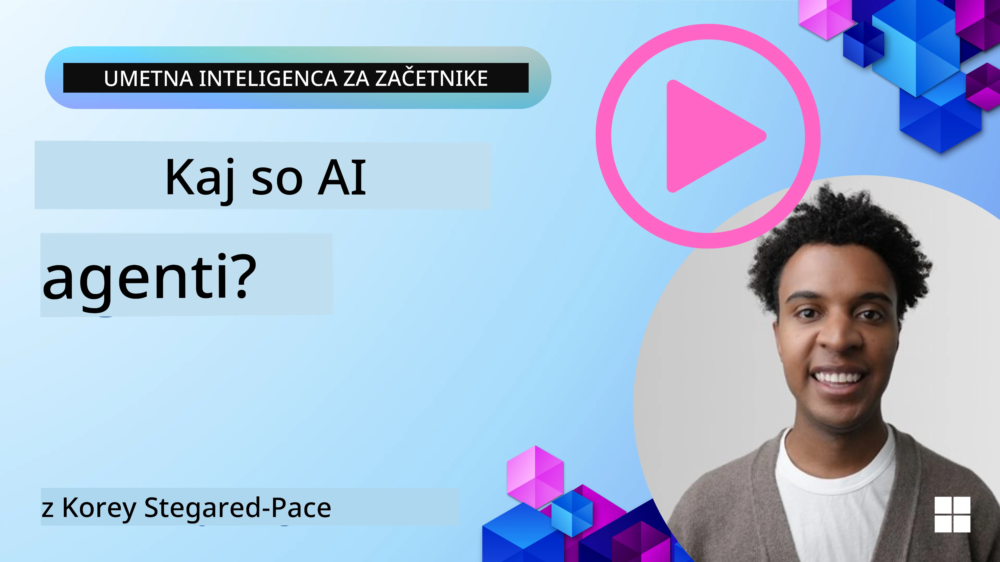
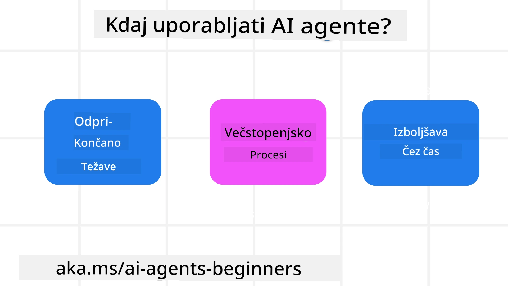

<!--
CO_OP_TRANSLATOR_METADATA:
{
  "original_hash": "cdd28bc00816d2773bb2b5968d782abc",
  "translation_date": "2025-11-11T11:43:54+00:00",
  "source_file": "01-intro-to-ai-agents/README.md",
  "language_code": "sl"
}
-->

> _(Kliknite na zgornjo sliko za ogled videa te lekcije)_

# Uvod v AI agente in primere uporabe agentov

Dobrodošli v tečaju "AI agenti za začetnike"! Ta tečaj ponuja osnovno znanje in praktične primere za gradnjo AI agentov.

Pridružite se <a href="https://discord.gg/kzRShWzttr" target="_blank">Azure AI Discord skupnosti</a>, kjer lahko spoznate druge učence in graditelje AI agentov ter zastavite vprašanja o tem tečaju.

Za začetek tečaja se bomo najprej bolje spoznali z AI agenti in kako jih lahko uporabimo v aplikacijah in delovnih procesih, ki jih gradimo.

## Uvod

Ta lekcija zajema:

- Kaj so AI agenti in katere vrste agentov obstajajo?
- Kateri primeri uporabe so najbolj primerni za AI agente in kako nam lahko pomagajo?
- Katere so osnovne gradnike pri oblikovanju rešitev z agenti?

## Cilji učenja
Po zaključku te lekcije boste lahko:

- Razumeli koncepte AI agentov in kako se razlikujejo od drugih AI rešitev.
- Učinkovito uporabljali AI agente.
- Produktivno oblikovali rešitve z agenti za uporabnike in stranke.

## Definicija AI agentov in vrste AI agentov

### Kaj so AI agenti?

AI agenti so **sistemi**, ki omogočajo **velikim jezikovnim modelom (LLMs)**, da **izvajajo dejanja** s širjenjem njihovih zmožnosti, tako da LLM-jem omogočijo **dostop do orodij** in **znanja**.

Razčlenimo to definicijo na manjše dele:

- **Sistem** - Pomembno je razmišljati o agentih ne le kot o enem samem komponentu, temveč kot o sistemu več komponent. Na osnovni ravni so komponente AI agenta:
  - **Okolje** - Določeno območje, kjer AI agent deluje. Na primer, če imamo AI agenta za rezervacijo potovanj, bi lahko bilo okolje sistem za rezervacijo potovanj, ki ga AI agent uporablja za dokončanje nalog.
  - **Senzorji** - Okolja imajo informacije in zagotavljajo povratne informacije. AI agenti uporabljajo senzorje za zbiranje in interpretacijo teh informacij o trenutnem stanju okolja. V primeru agenta za rezervacijo potovanj lahko sistem za rezervacijo zagotovi informacije, kot so razpoložljivost hotelov ali cene letov.
  - **Aktuatorji** - Ko AI agent prejme trenutno stanje okolja, za trenutno nalogo določi, katero dejanje izvesti, da spremeni okolje. Za agenta za rezervacijo potovanj bi to lahko bilo rezervacija razpoložljive sobe za uporabnika.

**Veliki jezikovni modeli** - Koncept agentov je obstajal že pred nastankom LLM-jev. Prednost gradnje AI agentov z LLM-ji je njihova sposobnost interpretacije človeškega jezika in podatkov. Ta sposobnost omogoča LLM-jem interpretacijo informacij iz okolja in določanje načrta za spremembo okolja.

**Izvajanje dejanj** - Zunaj sistemov AI agentov so LLM-ji omejeni na situacije, kjer je dejanje generiranje vsebine ali informacij na podlagi uporabnikovega poziva. Znotraj sistemov AI agentov lahko LLM-ji opravljajo naloge z interpretacijo uporabnikove zahteve in uporabo orodij, ki so na voljo v njihovem okolju.

**Dostop do orodij** - Katera orodja so na voljo LLM-ju, je določeno z 1) okoljem, v katerem deluje, in 2) razvijalcem AI agenta. V našem primeru agenta za rezervacijo potovanj so orodja agenta omejena z operacijami, ki so na voljo v sistemu za rezervacijo, in/ali razvijalec lahko omeji dostop agenta do orodij, kot so leti.

**Spomin+Znanje** - Spomin je lahko kratkoročen v kontekstu pogovora med uporabnikom in agentom. Dolgoročno, zunaj informacij, ki jih zagotavlja okolje, lahko AI agenti pridobivajo znanje iz drugih sistemov, storitev, orodij in celo drugih agentov. V primeru agenta za potovanja bi to znanje lahko bile informacije o uporabnikovih potovalnih preferencah, ki se nahajajo v bazi podatkov strank.

### Različne vrste agentov

Zdaj, ko imamo splošno definicijo AI agentov, si poglejmo nekatere specifične vrste agentov in kako bi jih uporabili pri AI agentu za rezervacijo potovanj.

| **Vrsta agenta**              | **Opis**                                                                                                                       | **Primer**                                                                                                                                                                                                                   |
| ----------------------------- | -------------------------------------------------------------------------------------------------------------------------------- | ----------------------------------------------------------------------------------------------------------------------------------------------------------------------------------------------------------------------------- |
| **Preprosti refleksni agenti** | Izvajajo takojšnja dejanja na podlagi vnaprej določenih pravil.                                                                 | Agent za potovanja interpretira kontekst e-pošte in posreduje pritožbe glede potovanj službi za pomoč strankam.                                                                                                               |
| **Modelno osnovani refleksni agenti** | Izvajajo dejanja na podlagi modela sveta in sprememb tega modela.                                                            | Agent za potovanja daje prednost potem z znatnimi spremembami cen na podlagi dostopa do zgodovinskih podatkov o cenah.                                                                                                        |
| **Agenti, ki temeljijo na ciljih** | Ustvarjajo načrte za dosego specifičnih ciljev z interpretacijo cilja in določanjem dejanj za njegovo dosego.                  | Agent za potovanja rezervira potovanje z določanjem potrebnih potovalnih aranžmajev (avto, javni prevoz, leti) od trenutne lokacije do cilja.                                                                                 |
| **Agenti, ki temeljijo na uporabnosti** | Upoštevajo preference in numerično tehtajo kompromise za določitev, kako doseči cilje.                                      | Agent za potovanja maksimizira uporabnost z tehtanjem udobja proti stroškom pri rezervaciji potovanja.                                                                                                                       |
| **Učeči se agenti**           | Se izboljšujejo skozi čas z odzivanjem na povratne informacije in prilagajanjem dejanj.                                          | Agent za potovanja se izboljšuje z uporabo povratnih informacij strank iz anket po potovanju za prilagoditev prihodnjih rezervacij.                                                                                           |
| **Hierarhični agenti**        | Vključujejo več agentov v večstopenjskem sistemu, kjer agenti na višji ravni razdelijo naloge na podnaloge za agente na nižji ravni. | Agent za potovanja odpove potovanje z razdelitvijo naloge na podnaloge (na primer odpoved specifičnih rezervacij) in jih dodeli agentom na nižji ravni, ki jih dokončajo ter poročajo agentu na višji ravni.                     |
| **Sistemi več agentov (MAS)** | Agenti samostojno opravljajo naloge, bodisi sodelovalno ali tekmovalno.                                                          | Sodelovalno: Več agentov rezervira specifične potovalne storitve, kot so hoteli, leti in zabava. Tekmovalno: Več agentov upravlja in tekmuje za skupni koledar rezervacij hotelov, da rezervira stranke v hotel.                 |

## Kdaj uporabiti AI agente

V prejšnjem razdelku smo uporabili primer agenta za potovanja, da pojasnimo, kako se različne vrste agentov lahko uporabijo v različnih scenarijih rezervacije potovanj. Ta aplikacija bo uporabljena skozi celoten tečaj.

Poglejmo vrste primerov uporabe, za katere so AI agenti najbolj primerni:

- **Odprti problemi** - omogočanje LLM-ju, da določi potrebne korake za dokončanje naloge, ker jih ni vedno mogoče vnaprej določiti v delovnem procesu.
- **Večstopenjski procesi** - naloge, ki zahtevajo določeno stopnjo kompleksnosti, pri kateri AI agent potrebuje uporabo orodij ali informacij skozi več korakov namesto enkratnega pridobivanja.
- **Izboljšanje skozi čas** - naloge, pri katerih se agent lahko izboljšuje skozi čas z prejemanjem povratnih informacij bodisi iz okolja bodisi od uporabnikov, da zagotovi boljšo uporabnost.

Več o razmislekih pri uporabi AI agentov bomo obravnavali v lekciji o gradnji zaupanja vrednih AI agentov.

## Osnove rešitev z agenti

### Razvoj agentov

Prvi korak pri oblikovanju sistema AI agenta je določitev orodij, dejanj in vedenj. V tem tečaju se osredotočamo na uporabo **Azure AI Agent Service** za definiranje naših agentov. Ponuja funkcije, kot so:

- Izbor odprtih modelov, kot so OpenAI, Mistral in Llama
- Uporaba licenciranih podatkov prek ponudnikov, kot je Tripadvisor
- Uporaba standardiziranih orodij OpenAPI 3.0

### Vzorci z agenti

Komunikacija z LLM-ji poteka prek pozivov. Glede na polavtonomno naravo AI agentov ni vedno mogoče ali potrebno ročno ponovno pozvati LLM po spremembi v okolju. Uporabljamo **vzorčne vzorce z agenti**, ki omogočajo pozivanje LLM-ja skozi več korakov na bolj skalabilen način.

Ta tečaj je razdeljen na nekatere trenutno priljubljene vzorce z agenti.

### Okviri z agenti

Okviri z agenti omogočajo razvijalcem implementacijo vzorcev z agenti prek kode. Ti okviri ponujajo predloge, vtičnike in orodja za boljše sodelovanje AI agentov. Te prednosti omogočajo boljšo opazljivost in odpravljanje težav v sistemih AI agentov.

V tem tečaju bomo raziskali raziskovalno usmerjen okvir AutoGen in produkcijsko pripravljen okvir Agent iz Semantic Kernel.

## Primeri kode

- Python: [Okvir z agenti](./code_samples/01-python-agent-framework.ipynb)
- .NET: [Okvir z agenti](./code_samples/01-dotnet-agent-framework.md)

## Imate več vprašanj o AI agentih?

Pridružite se [Azure AI Foundry Discord](https://aka.ms/ai-agents/discord), kjer lahko spoznate druge učence, se udeležite uradnih ur in dobite odgovore na vprašanja o AI agentih.

## Prejšnja lekcija

[Postavitev tečaja](../00-course-setup/README.md)

## Naslednja lekcija

[Raziskovanje okvirov z agenti](../02-explore-agentic-frameworks/README.md)

---

<!-- CO-OP TRANSLATOR DISCLAIMER START -->
**Omejitev odgovornosti**:  
Ta dokument je bil preveden z uporabo storitve AI za prevajanje [Co-op Translator](https://github.com/Azure/co-op-translator). Čeprav si prizadevamo za natančnost, vas prosimo, da upoštevate, da lahko avtomatizirani prevodi vsebujejo napake ali netočnosti. Izvirni dokument v njegovem maternem jeziku naj se šteje za avtoritativni vir. Za ključne informacije je priporočljivo profesionalno človeško prevajanje. Ne odgovarjamo za morebitna nesporazumevanja ali napačne razlage, ki izhajajo iz uporabe tega prevoda.
<!-- CO-OP TRANSLATOR DISCLAIMER END -->