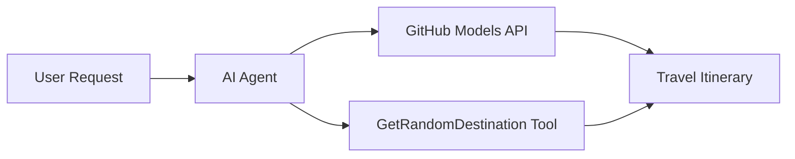

<!--
CO_OP_TRANSLATOR_METADATA:
{
  "original_hash": "5f351412e934f0833c8c821a0a60efaf",
  "translation_date": "2025-11-13T14:28:05+00:00",
  "source_file": "01-intro-to-ai-agents/code_samples/01-dotnet-agent-framework.md",
  "language_code": "sl"
}
-->
# 🌍 AI Potovalni Agent z Microsoft Agent Framework (.NET)

## 📋 Pregled scenarija

Ta primer prikazuje, kako zgraditi inteligentnega agenta za načrtovanje potovanj z uporabo Microsoft Agent Framework za .NET. Agent lahko samodejno ustvari personalizirane dnevne načrte izletov za naključne destinacije po svetu.

### Ključne zmogljivosti:

- 🎲 **Naključna izbira destinacije**: Uporablja prilagojeno orodje za izbiro počitniških lokacij
- 🗺️ **Inteligentno načrtovanje potovanj**: Ustvari podrobne dnevne načrte
- 🔄 **Pretakanje v realnem času**: Podpira takojšnje in pretočne odgovore
- 🛠️ **Integracija prilagojenih orodij**: Prikazuje, kako razširiti zmogljivosti agenta

## 🔧 Tehnična arhitektura

### Osnovne tehnologije

- **Microsoft Agent Framework**: Najnovejša implementacija .NET za razvoj AI agentov
- **Integracija GitHub Models**: Uporablja GitHubovo storitev za sklepanje AI modelov
- **Združljivost z OpenAI API**: Izkoristi OpenAI knjižnice s prilagojenimi končnimi točkami
- **Varna konfiguracija**: Upravljanje API ključev na osnovi okolja

### Ključne komponente

1. **AIAgent**: Glavni orkestrator agenta, ki upravlja potek pogovora
2. **Prilagojena orodja**: Funkcija `GetRandomDestination()` na voljo agentu
3. **Chat Client**: Pogovorni vmesnik, podprt z GitHub Models
4. **Podpora za pretakanje**: Zmožnosti generiranja odgovorov v realnem času

### Vzorec integracije



## 🚀 Začetek

### Predpogoji

- [.NET 10 SDK](https://dotnet.microsoft.com/download/dotnet/10.0) ali novejši
- [GitHub Models API dostopni žeton](https://docs.github.com/github-models/github-models-at-scale/using-your-own-api-keys-in-github-models)

### Zahtevane okoljske spremenljivke

```bash
# zsh/bash
export GH_TOKEN=<your_github_token>
export GH_ENDPOINT=https://models.github.ai/inference
export GH_MODEL_ID=openai/gpt-5-mini
```

```powershell
# PowerShell
$env:GH_TOKEN = "<your_github_token>"
$env:GH_ENDPOINT = "https://models.github.ai/inference"
$env:GH_MODEL_ID = "openai/gpt-5-mini"
```

### Vzorec kode

Za zagon primera kode,

```bash
# zsh/bash
chmod +x ./01-dotnet-agent-framework.cs
./01-dotnet-agent-framework.cs
```

Ali z uporabo dotnet CLI:

```bash
dotnet run ./01-dotnet-agent-framework.cs
```

Oglejte si [`01-dotnet-agent-framework.cs`](../../../../01-intro-to-ai-agents/code_samples/01-dotnet-agent-framework.cs) za celotno kodo.

```csharp
#!/usr/bin/dotnet run

#:package Microsoft.Extensions.AI@9.*
#:package Microsoft.Agents.AI.OpenAI@1.*-*

using System.ClientModel;
using System.ComponentModel;

using Microsoft.Agents.AI;
using Microsoft.Extensions.AI;

using OpenAI;

// Tool Function: Random Destination Generator
// This static method will be available to the agent as a callable tool
// The [Description] attribute helps the AI understand when to use this function
// This demonstrates how to create custom tools for AI agents
[Description("Provides a random vacation destination.")]
static string GetRandomDestination()
{
    // List of popular vacation destinations around the world
    // The agent will randomly select from these options
    var destinations = new List<string>
    {
        "Paris, France",
        "Tokyo, Japan",
        "New York City, USA",
        "Sydney, Australia",
        "Rome, Italy",
        "Barcelona, Spain",
        "Cape Town, South Africa",
        "Rio de Janeiro, Brazil",
        "Bangkok, Thailand",
        "Vancouver, Canada"
    };

    // Generate random index and return selected destination
    // Uses System.Random for simple random selection
    var random = new Random();
    int index = random.Next(destinations.Count);
    return destinations[index];
}

// Extract configuration from environment variables
// Retrieve the GitHub Models API endpoint, defaults to https://models.github.ai/inference if not specified
// Retrieve the model ID, defaults to openai/gpt-5-mini if not specified
// Retrieve the GitHub token for authentication, throws exception if not specified
var github_endpoint = Environment.GetEnvironmentVariable("GH_ENDPOINT") ?? "https://models.github.ai/inference";
var github_model_id = Environment.GetEnvironmentVariable("GH_MODEL_ID") ?? "openai/gpt-5-mini";
var github_token = Environment.GetEnvironmentVariable("GH_TOKEN") ?? throw new InvalidOperationException("GH_TOKEN is not set.");

// Configure OpenAI Client Options
// Create configuration options to point to GitHub Models endpoint
// This redirects OpenAI client calls to GitHub's model inference service
var openAIOptions = new OpenAIClientOptions()
{
    Endpoint = new Uri(github_endpoint)
};

// Initialize OpenAI Client with GitHub Models Configuration
// Create OpenAI client using GitHub token for authentication
// Configure it to use GitHub Models endpoint instead of OpenAI directly
var openAIClient = new OpenAIClient(new ApiKeyCredential(github_token), openAIOptions);

// Create AI Agent with Travel Planning Capabilities
// Initialize OpenAI client, get chat client for specified model, and create AI agent
// Configure agent with travel planning instructions and random destination tool
// The agent can now plan trips using the GetRandomDestination function
AIAgent agent = openAIClient
    .GetChatClient(github_model_id)
    .CreateAIAgent(
        instructions: "You are a helpful AI Agent that can help plan vacations for customers at random destinations",
        tools: [AIFunctionFactory.Create(GetRandomDestination)]
    );

// Execute Agent: Plan a Day Trip
// Run the agent with streaming enabled for real-time response display
// Shows the agent's thinking and response as it generates the content
// Provides better user experience with immediate feedback
await foreach (var update in agent.RunStreamingAsync("Plan me a day trip"))
{
    await Task.Delay(10);
    Console.Write(update);
}
```

## 🎓 Ključne ugotovitve

1. **Arhitektura agenta**: Microsoft Agent Framework omogoča čist in tipno varen pristop k gradnji AI agentov v .NET
2. **Integracija orodij**: Funkcije, označene z atributi `[Description]`, postanejo na voljo kot orodja za agenta
3. **Upravljanje konfiguracije**: Okoljske spremenljivke in varno ravnanje s poverilnicami sledijo najboljšim praksam .NET
4. **Združljivost z OpenAI**: Integracija GitHub Models deluje brezhibno prek OpenAI združljivih API-jev

## 🔗 Dodatni viri

- [Microsoft Agent Framework Dokumentacija](https://learn.microsoft.com/agent-framework)
- [GitHub Models Marketplace](https://github.com/marketplace?type=models)
- [Microsoft.Extensions.AI](https://learn.microsoft.com/dotnet/ai/microsoft-extensions-ai)
- [.NET Single File Apps](https://devblogs.microsoft.com/dotnet/announcing-dotnet-run-app)

---

<!-- CO-OP TRANSLATOR DISCLAIMER START -->
**Omejitev odgovornosti**:  
Ta dokument je bil preveden z uporabo storitve za prevajanje z umetno inteligenco [Co-op Translator](https://github.com/Azure/co-op-translator). Čeprav si prizadevamo za natančnost, vas prosimo, da upoštevate, da lahko avtomatizirani prevodi vsebujejo napake ali netočnosti. Izvirni dokument v njegovem izvirnem jeziku je treba obravnavati kot avtoritativni vir. Za ključne informacije priporočamo profesionalni človeški prevod. Ne prevzemamo odgovornosti za morebitne nesporazume ali napačne razlage, ki izhajajo iz uporabe tega prevoda.
<!-- CO-OP TRANSLATOR DISCLAIMER END -->