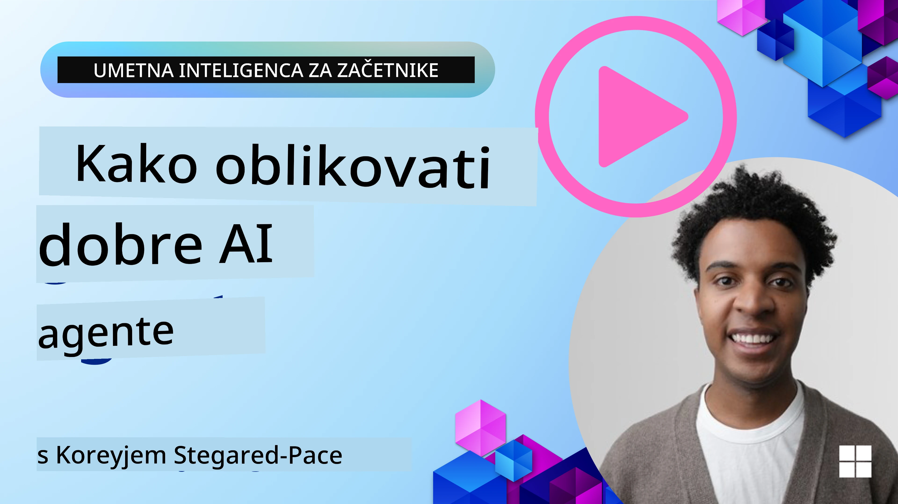
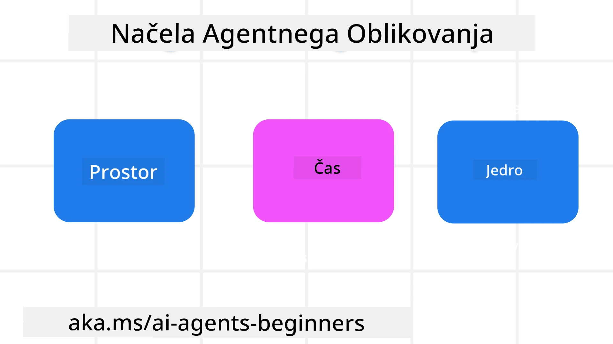

<!--
CO_OP_TRANSLATOR_METADATA:
{
  "original_hash": "d71524fe83a23829ae7a23b4031aaac8",
  "translation_date": "2025-11-13T14:31:34+00:00",
  "source_file": "03-agentic-design-patterns/README.md",
  "language_code": "sl"
}
-->

> _(Kliknite na zgornjo sliko za ogled videa te lekcije)_
# Načela oblikovanja agentov AI

## Uvod

Obstaja veliko načinov razmišljanja o gradnji sistemov AI agentov. Glede na to, da je dvoumnost značilnost in ne napaka pri oblikovanju generativne umetne inteligence, je inženirjem včasih težko ugotoviti, kje sploh začeti. Ustvarili smo niz načel oblikovanja uporabniške izkušnje, osredotočenih na človeka, da bi razvijalcem omogočili gradnjo sistemov agentov, osredotočenih na stranke, za reševanje njihovih poslovnih potreb. Ta načela oblikovanja niso predpisana arhitektura, temveč izhodišče za ekipe, ki definirajo in gradijo izkušnje z agenti.

Na splošno naj bi agenti:

- Razširili in povečali človeške sposobnosti (možganska nevihta, reševanje problemov, avtomatizacija itd.)
- Zapolnili vrzeli v znanju (pridobivanje znanja o določenih področjih, prevajanje itd.)
- Omogočili in podprli sodelovanje na način, ki ustreza našim individualnim preferencam pri delu z drugimi
- Izboljšali naše različice samih sebe (npr. življenjski trener/nadzornik nalog, pomoč pri učenju čustvene regulacije in veščin čuječnosti, gradnja odpornosti itd.)

## Ta lekcija bo obravnavala

- Kaj so načela oblikovanja agentov
- Katere smernice upoštevati pri izvajanju teh načel oblikovanja
- Primeri uporabe teh načel oblikovanja

## Cilji učenja

Po zaključku te lekcije boste lahko:

1. Razložili, kaj so načela oblikovanja agentov
2. Razložili smernice za uporabo načel oblikovanja agentov
3. Razumeli, kako zgraditi agenta z uporabo načel oblikovanja agentov

## Načela oblikovanja agentov

### Agent (Prostor)

To je okolje, v katerem agent deluje. Ta načela usmerjajo, kako oblikujemo agente za delovanje v fizičnih in digitalnih svetovih.

- **Povezovanje, ne razpadanje** – pomagajte povezovati ljudi z drugimi ljudmi, dogodki in uporabnim znanjem za omogočanje sodelovanja in povezovanja.
- Agenti pomagajo povezovati dogodke, znanje in ljudi.
- Agenti približujejo ljudi. Niso zasnovani za nadomeščanje ali zmanjševanje vrednosti ljudi.
- **Enostavno dostopni, a občasno nevidni** – agent večinoma deluje v ozadju in nas opozori le, ko je to relevantno in primerno.
  - Agent je enostavno odkriti in dostopen za pooblaščene uporabnike na katerikoli napravi ali platformi.
  - Agent podpira večmodalne vnose in izhode (zvok, glas, besedilo itd.).
  - Agent lahko brez težav prehaja med ospredjem in ozadjem; med proaktivnim in reaktivnim, odvisno od zaznavanja potreb uporabnika.
  - Agent lahko deluje v nevidni obliki, vendar je njegova pot ozadnega procesa in sodelovanje z drugimi agenti transparentno in nadzorovano s strani uporabnika.

### Agent (Čas)

To je način, kako agent deluje skozi čas. Ta načela usmerjajo, kako oblikujemo agente, ki delujejo skozi preteklost, sedanjost in prihodnost.

- **Preteklost**: Refleksija zgodovine, ki vključuje tako stanje kot kontekst.
  - Agent zagotavlja bolj relevantne rezultate na podlagi analize bogatejših zgodovinskih podatkov, ne le dogodkov, ljudi ali stanj.
  - Agent ustvarja povezave iz preteklih dogodkov in aktivno reflektira spomin za vključevanje v trenutne situacije.
- **Sedanjost**: Spodbujanje bolj kot obveščanje.
  - Agent uteleša celovit pristop k interakciji z ljudmi. Ko se zgodi dogodek, agent presega statično obvestilo ali drugo statično formalnost. Agent lahko poenostavi procese ali dinamično ustvari namige za usmerjanje pozornosti uporabnika ob pravem trenutku.
  - Agent dostavlja informacije na podlagi kontekstualnega okolja, družbenih in kulturnih sprememb ter prilagojeno namenu uporabnika.
  - Interakcija z agentom je lahko postopna, razvijajoča se v kompleksnosti, da dolgoročno opolnomoči uporabnike.
- **Prihodnost**: Prilagajanje in evolucija.
  - Agent se prilagaja različnim napravam, platformam in modalnostim.
  - Agent se prilagaja vedenju uporabnika, potrebam dostopnosti in je prosto prilagodljiv.
  - Agent se oblikuje in razvija skozi neprekinjeno interakcijo z uporabnikom.

### Agent (Jedro)

To so ključni elementi v jedru oblikovanja agenta.

- **Sprejemanje negotovosti, a vzpostavljanje zaupanja**.
  - Določena stopnja negotovosti agenta je pričakovana. Negotovost je ključni element oblikovanja agenta.
  - Zaupanje in transparentnost sta temeljni plasti oblikovanja agenta.
  - Ljudje nadzorujejo, kdaj je agent vklopljen/izklopljen, in status agenta je ves čas jasno viden.

## Smernice za izvajanje teh načel

Ko uporabljate zgoraj navedena načela oblikovanja, upoštevajte naslednje smernice:

1. **Transparentnost**: Obvestite uporabnika, da je vključen AI, kako deluje (vključno s preteklimi dejanji) in kako podati povratne informacije ter prilagoditi sistem.
2. **Nadzor**: Omogočite uporabniku prilagoditev, določanje preferenc in personalizacijo ter nadzor nad sistemom in njegovimi atributi (vključno z možnostjo pozabe).
3. **Doslednost**: Ciljajte na dosledne, večmodalne izkušnje na različnih napravah in končnih točkah. Uporabite znane elemente UI/UX, kjer je to mogoče (npr. ikona mikrofona za glasovno interakcijo) in čim bolj zmanjšajte kognitivno obremenitev uporabnika (npr. ciljte na jedrnate odgovore, vizualne pripomočke in vsebino 'Več o tem').

## Kako oblikovati potovalnega agenta z uporabo teh načel in smernic

Predstavljajte si, da oblikujete potovalnega agenta, tukaj je, kako bi lahko razmišljali o uporabi načel oblikovanja in smernic:

1. **Transparentnost** – Obvestite uporabnika, da je potovalni agent agent, ki temelji na AI. Zagotovite osnovna navodila za začetek (npr. sporočilo "Pozdravljeni", primeri pozivov). Jasno dokumentirajte to na strani izdelka. Prikažite seznam pozivov, ki jih je uporabnik podal v preteklosti. Jasno pokažite, kako podati povratne informacije (palec gor in dol, gumb Pošlji povratne informacije itd.). Jasno opredelite, ali ima agent omejitve uporabe ali teme.
2. **Nadzor** – Poskrbite, da bo jasno, kako lahko uporabnik spremeni agenta po njegovi ustvaritvi, z možnostmi, kot je sistemski poziv. Omogočite uporabniku izbiro, kako obširen je agent, njegov slog pisanja in morebitne omejitve glede tem, o katerih agent ne sme govoriti. Dovolite uporabniku ogled in brisanje povezanih datotek ali podatkov, pozivov in preteklih pogovorov.
3. **Doslednost** – Poskrbite, da bodo ikone za Deljenje poziva, dodajanje datoteke ali fotografije ter označevanje nekoga ali nečesa standardne in prepoznavne. Uporabite ikono s sponko za označevanje nalaganja/deljenja datotek z agentom ter ikono slike za označevanje nalaganja grafike.

## Primeri kode

- Python: [Okvir agenta](./code_samples/03-python-agent-framework.ipynb)
- .NET: [Okvir agenta](./code_samples/03-dotnet-agent-framework.md)

## Imate več vprašanj o vzorcih oblikovanja agentov AI?

Pridružite se [Azure AI Foundry Discord](https://aka.ms/ai-agents/discord), da se povežete z drugimi učenci, udeležite uradnih ur in dobite odgovore na svoja vprašanja o agentih AI.

## Dodatni viri

- <a href="https://openai.com" target="_blank">Prakse za upravljanje sistemov agentov AI | OpenAI</a>
- <a href="https://microsoft.com" target="_blank">Projekt HAX Toolkit - Microsoft Research</a>
- <a href="https://responsibleaitoolbox.ai" target="_blank">Orodje za odgovorno AI</a>

## Prejšnja lekcija

[Raziskovanje okvirov agentov](../02-explore-agentic-frameworks/README.md)

## Naslednja lekcija

[Vzorec oblikovanja uporabe orodij](../04-tool-use/README.md)

---

<!-- CO-OP TRANSLATOR DISCLAIMER START -->
**Omejitev odgovornosti**:  
Ta dokument je bil preveden z uporabo storitve za prevajanje AI [Co-op Translator](https://github.com/Azure/co-op-translator). Čeprav si prizadevamo za natančnost, vas prosimo, da upoštevate, da lahko avtomatizirani prevodi vsebujejo napake ali netočnosti. Izvirni dokument v njegovem maternem jeziku naj se šteje za avtoritativni vir. Za ključne informacije priporočamo profesionalni človeški prevod. Ne prevzemamo odgovornosti za morebitne nesporazume ali napačne razlage, ki izhajajo iz uporabe tega prevoda.
<!-- CO-OP TRANSLATOR DISCLAIMER END -->