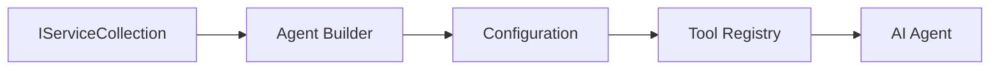

<!--
CO_OP_TRANSLATOR_METADATA:
{
  "original_hash": "bcc874e190347bd6a095aed56dc16de8",
  "translation_date": "2025-11-13T14:32:34+00:00",
  "source_file": "03-agentic-design-patterns/code_samples/03-dotnet-agent-framework.md",
  "language_code": "sl"
}
-->
# 🎨 Agentni vzorci oblikovanja z GitHub modeli (.NET)

## 📋 Cilji učenja

Ta primer prikazuje vzorce oblikovanja na ravni podjetja za gradnjo inteligentnih agentov z uporabo Microsoftovega ogrodja za agente v .NET z integracijo GitHub modelov. Naučili se boste profesionalnih vzorcev in arhitekturnih pristopov, ki omogočajo, da so agenti pripravljeni za produkcijo, vzdržljivi in razširljivi.

### Vzorci oblikovanja na ravni podjetja

- 🏭 **Tovarniški vzorec**: Standardizirano ustvarjanje agentov z vbrizgavanjem odvisnosti
- 🔧 **Graditeljski vzorec**: Tekoča konfiguracija in nastavitev agentov
- 🧵 **Vzorci za varno uporabo niti**: Upravljanje sočasnih pogovorov
- 📋 **Vzorec repozitorija**: Organizirano upravljanje orodij in zmogljivosti

## 🎯 Arhitekturne prednosti .NET

### Funkcije na ravni podjetja

- **Močno tipiziranje**: Preverjanje veljavnosti med prevajanjem in podpora IntelliSense
- **Vbrizgavanje odvisnosti**: Vgrajena integracija DI kontejnerja
- **Upravljanje konfiguracije**: Vzorci IConfiguration in Options
- **Async/Await**: Prvovrstna podpora za asinhrono programiranje

### Vzorci pripravljeni za produkcijo

- **Integracija beleženja**: Podpora za ILogger in strukturirano beleženje
- **Preverjanje zdravja**: Vgrajeno spremljanje in diagnostika
- **Preverjanje konfiguracije**: Močno tipiziranje z anotacijami podatkov
- **Upravljanje napak**: Strukturirano upravljanje izjem

## 🔧 Tehnična arhitektura

### Osnovne komponente .NET

- **Microsoft.Extensions.AI**: Poenotene abstrakcije AI storitev
- **Microsoft.Agents.AI**: Ogrodje za orkestracijo agentov na ravni podjetja
- **Integracija GitHub modelov**: Vzorci za visokozmogljive API odjemalce
- **Sistem konfiguracije**: Integracija appsettings.json in okolja

### Implementacija vzorcev oblikovanja



## 🏗️ Prikazani vzorci na ravni podjetja

### 1. **Kreacijski vzorci**

- **Tovarna agentov**: Centralizirano ustvarjanje agentov z dosledno konfiguracijo
- **Graditeljski vzorec**: Tekoči API za kompleksno konfiguracijo agentov
- **Vzorec Singleton**: Upravljanje deljenih virov in konfiguracij
- **Vbrizgavanje odvisnosti**: Ohlapna povezanost in testabilnost

### 2. **Vedenjski vzorci**

- **Vzorec strategije**: Zamenljive strategije izvajanja orodij
- **Vzorec ukaza**: Kapsulirane operacije agentov z možnostjo razveljavitve/ponovitve
- **Vzorec opazovalca**: Upravljanje življenjskega cikla agentov, ki temelji na dogodkih
- **Metoda predloge**: Standardizirani poteki izvajanja agentov

### 3. **Strukturni vzorci**

- **Vzorec adapterja**: Integracijski sloj za API GitHub modelov
- **Vzorec dekoratorja**: Izboljšanje zmogljivosti agentov
- **Vzorec fasade**: Poenostavljeni vmesniki za interakcijo z agenti
- **Vzorec proxyja**: Lenobno nalaganje in predpomnjenje za izboljšanje zmogljivosti

## 📚 Načela oblikovanja v .NET

### SOLID načela

- **Enotna odgovornost**: Vsaka komponenta ima en jasen namen
- **Odprtost/Zaprtost**: Razširljivost brez sprememb
- **Liskov substitucija**: Implementacije orodij, ki temeljijo na vmesnikih
- **Razdelitev vmesnikov**: Osredotočeni, kohezivni vmesniki
- **Inverzija odvisnosti**: Odvisnost od abstrakcij, ne konkretnih implementacij

### Čista arhitektura

- **Sloj domene**: Osnovne abstrakcije agentov in orodij
- **Sloj aplikacije**: Orkestracija agentov in poteki dela
- **Sloj infrastrukture**: Integracija GitHub modelov in zunanjih storitev
- **Sloj predstavitve**: Interakcija z uporabnikom in oblikovanje odgovorov

## 🔒 Premisleki na ravni podjetja

### Varnost

- **Upravljanje poverilnic**: Varno ravnanje z API ključi z uporabo IConfiguration
- **Preverjanje vhodnih podatkov**: Močno tipiziranje in preverjanje z anotacijami podatkov
- **Sanitizacija izhodnih podatkov**: Varno obdelovanje in filtriranje odgovorov
- **Beleženje revizij**: Celovito sledenje operacijam

### Zmogljivost

- **Asinhroni vzorci**: Nezastojne I/O operacije
- **Upravljanje povezav**: Učinkovito upravljanje HTTP odjemalcev
- **Predpomnjenje**: Predpomnjenje odgovorov za izboljšanje zmogljivosti
- **Upravljanje virov**: Pravilno odstranjevanje in čiščenje virov

### Razširljivost

- **Varnost niti**: Podpora za sočasno izvajanje agentov
- **Upravljanje virov**: Učinkovita uporaba virov
- **Upravljanje obremenitve**: Omejevanje hitrosti in obravnava preobremenitev
- **Spremljanje**: Meritve zmogljivosti in preverjanje zdravja

## 🚀 Uvedba v produkcijo

- **Upravljanje konfiguracije**: Nastavitve, specifične za okolje
- **Strategija beleženja**: Strukturirano beleženje z ID-ji za korelacijo
- **Upravljanje napak**: Globalno upravljanje izjem z ustreznim okrevanjem
- **Spremljanje**: Application Insights in števci zmogljivosti
- **Testiranje**: Vzorci za enotno testiranje, integracijsko testiranje in testiranje obremenitev

Pripravljeni na gradnjo inteligentnih agentov na ravni podjetja z .NET? Zasnujmo nekaj robustnega! 🏢✨

## 🚀 Začetek

### Predpogoji

- [.NET 10 SDK](https://dotnet.microsoft.com/download/dotnet/10.0) ali novejši
- [Dostopni žeton za API GitHub modelov](https://docs.github.com/github-models/github-models-at-scale/using-your-own-api-keys-in-github-models)

### Zahtevane okoljske spremenljivke

```bash
# zsh/bash
export GH_TOKEN=<your_github_token>
export GH_ENDPOINT=https://models.github.ai/inference
export GH_MODEL_ID=openai/gpt-5-mini
```

```powershell
# PowerShell
$env:GH_TOKEN = "<your_github_token>"
$env:GH_ENDPOINT = "https://models.github.ai/inference"
$env:GH_MODEL_ID = "openai/gpt-5-mini"
```

### Vzorec kode

Za zagon primera kode,

```bash
# zsh/bash
chmod +x ./03-dotnet-agent-framework.cs
./03-dotnet-agent-framework.cs
```

Ali z uporabo dotnet CLI:

```bash
dotnet run ./03-dotnet-agent-framework.cs
```

Oglejte si [`03-dotnet-agent-framework.cs`](../../../../03-agentic-design-patterns/code_samples/03-dotnet-agent-framework.cs) za celotno kodo.

```csharp
#!/usr/bin/dotnet run

#:package Microsoft.Extensions.AI@10.*
#:package Microsoft.Agents.AI.OpenAI@1.*-*

using System.ClientModel;
using System.ComponentModel;

using Microsoft.Agents.AI;
using Microsoft.Extensions.AI;

using OpenAI;

// Tool Function: Random Destination Generator
// This static method will be available to the agent as a callable tool
// The [Description] attribute helps the AI understand when to use this function
// This demonstrates how to create custom tools for AI agents
[Description("Provides a random vacation destination.")]
static string GetRandomDestination()
{
    // List of popular vacation destinations around the world
    // The agent will randomly select from these options
    var destinations = new List<string>
    {
        "Paris, France",
        "Tokyo, Japan",
        "New York City, USA",
        "Sydney, Australia",
        "Rome, Italy",
        "Barcelona, Spain",
        "Cape Town, South Africa",
        "Rio de Janeiro, Brazil",
        "Bangkok, Thailand",
        "Vancouver, Canada"
    };

    // Generate random index and return selected destination
    // Uses System.Random for simple random selection
    var random = new Random();
    int index = random.Next(destinations.Count);
    return destinations[index];
}

// Extract configuration from environment variables
// Retrieve the GitHub Models API endpoint, defaults to https://models.github.ai/inference if not specified
// Retrieve the model ID, defaults to openai/gpt-5-mini if not specified
// Retrieve the GitHub token for authentication, throws exception if not specified
var github_endpoint = Environment.GetEnvironmentVariable("GH_ENDPOINT") ?? "https://models.github.ai/inference";
var github_model_id = Environment.GetEnvironmentVariable("GH_MODEL_ID") ?? "openai/gpt-5-mini";
var github_token = Environment.GetEnvironmentVariable("GH_TOKEN") ?? throw new InvalidOperationException("GH_TOKEN is not set.");

// Configure OpenAI Client Options
// Create configuration options to point to GitHub Models endpoint
// This redirects OpenAI client calls to GitHub's model inference service
var openAIOptions = new OpenAIClientOptions()
{
    Endpoint = new Uri(github_endpoint)
};

// Initialize OpenAI Client with GitHub Models Configuration
// Create OpenAI client using GitHub token for authentication
// Configure it to use GitHub Models endpoint instead of OpenAI directly
var openAIClient = new OpenAIClient(new ApiKeyCredential(github_token), openAIOptions);

// Define Agent Identity and Comprehensive Instructions
// Agent name for identification and logging purposes
var AGENT_NAME = "TravelAgent";

// Detailed instructions that define the agent's personality, capabilities, and behavior
// This system prompt shapes how the agent responds and interacts with users
var AGENT_INSTRUCTIONS = """
You are a helpful AI Agent that can help plan vacations for customers.

Important: When users specify a destination, always plan for that location. Only suggest random destinations when the user hasn't specified a preference.

When the conversation begins, introduce yourself with this message:
"Hello! I'm your TravelAgent assistant. I can help plan vacations and suggest interesting destinations for you. Here are some things you can ask me:
1. Plan a day trip to a specific location
2. Suggest a random vacation destination
3. Find destinations with specific features (beaches, mountains, historical sites, etc.)
4. Plan an alternative trip if you don't like my first suggestion

What kind of trip would you like me to help you plan today?"

Always prioritize user preferences. If they mention a specific destination like "Bali" or "Paris," focus your planning on that location rather than suggesting alternatives.
""";

// Create AI Agent with Advanced Travel Planning Capabilities
// Initialize complete agent pipeline: OpenAI client → Chat client → AI agent
// Configure agent with name, detailed instructions, and available tools
// This demonstrates the .NET agent creation pattern with full configuration
AIAgent agent = openAIClient
    .GetChatClient(github_model_id)
    .CreateAIAgent(
        name: AGENT_NAME,
        instructions: AGENT_INSTRUCTIONS,
        tools: [AIFunctionFactory.Create(GetRandomDestination)]
    );

// Create New Conversation Thread for Context Management
// Initialize a new conversation thread to maintain context across multiple interactions
// Threads enable the agent to remember previous exchanges and maintain conversational state
// This is essential for multi-turn conversations and contextual understanding
AgentThread thread = agent.GetNewThread();

// Execute Agent: First Travel Planning Request
// Run the agent with an initial request that will likely trigger the random destination tool
// The agent will analyze the request, use the GetRandomDestination tool, and create an itinerary
// Using the thread parameter maintains conversation context for subsequent interactions
await foreach (var update in agent.RunStreamingAsync("Plan me a day trip", thread))
{
    await Task.Delay(10);
    Console.Write(update);
}

Console.WriteLine();

// Execute Agent: Follow-up Request with Context Awareness
// Demonstrate contextual conversation by referencing the previous response
// The agent remembers the previous destination suggestion and will provide an alternative
// This showcases the power of conversation threads and contextual understanding in .NET agents
await foreach (var update in agent.RunStreamingAsync("I don't like that destination. Plan me another vacation.", thread))
{
    await Task.Delay(10);
    Console.Write(update);
}
```

---

<!-- CO-OP TRANSLATOR DISCLAIMER START -->
**Omejitev odgovornosti**:  
Ta dokument je bil preveden z uporabo storitve za prevajanje AI [Co-op Translator](https://github.com/Azure/co-op-translator). Čeprav si prizadevamo za natančnost, vas prosimo, da upoštevate, da lahko avtomatizirani prevodi vsebujejo napake ali netočnosti. Izvirni dokument v njegovem maternem jeziku je treba obravnavati kot avtoritativni vir. Za ključne informacije priporočamo profesionalni človeški prevod. Ne prevzemamo odgovornosti za morebitne nesporazume ali napačne razlage, ki izhajajo iz uporabe tega prevoda.
<!-- CO-OP TRANSLATOR DISCLAIMER END -->