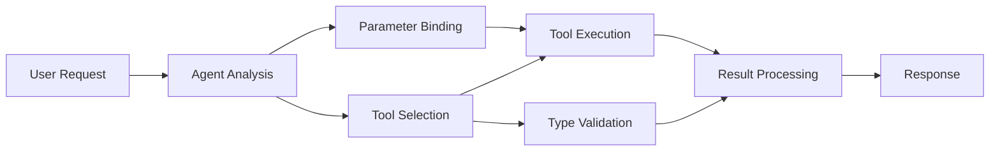

<!--
CO_OP_TRANSLATOR_METADATA:
{
  "original_hash": "91d6061e402489603f2ec8b528cae59b",
  "translation_date": "2025-11-18T18:28:56+00:00",
  "source_file": "04-tool-use/code_samples/04-dotnet-agent-framework.md",
  "language_code": "sl"
}
-->
# 🛠️ Napredno uporabo orodij z modeli GitHub (.NET)

## 📋 Cilji učenja

Ta zvezek prikazuje vzorce integracije orodij na ravni podjetja z uporabo Microsoft Agent Framework v .NET z modeli GitHub. Naučili se boste graditi napredne agente z več specializiranimi orodji, pri čemer boste izkoristili močno tipizacijo jezika C# in funkcije .NET za podjetja.

### Napredne zmogljivosti orodij, ki jih boste obvladali

- 🔧 **Arhitektura več orodij**: Gradnja agentov z več specializiranimi zmogljivostmi
- 🎯 **Tipno varno izvajanje orodij**: Izkoristite preverjanje pravilnosti med prevajanjem v jeziku C#
- 📊 **Vzorce orodij za podjetja**: Oblikovanje orodij, pripravljeno za produkcijo, in obravnavanje napak
- 🔗 **Sestavljanje orodij**: Kombiniranje orodij za kompleksne poslovne delovne tokove

## 🎯 Prednosti arhitekture orodij v .NET

### Funkcije orodij za podjetja

- **Preverjanje pravilnosti med prevajanjem**: Močna tipizacija zagotavlja pravilnost parametrov orodij
- **Vbrizgavanje odvisnosti**: Integracija IoC kontejnerja za upravljanje orodij
- **Vzorec Async/Await**: Neblokirajoče izvajanje orodij z ustreznim upravljanjem virov
- **Strukturirano beleženje**: Vgrajena integracija beleženja za spremljanje izvajanja orodij

### Vzorci, pripravljeni za produkcijo

- **Obravnavanje izjem**: Celovito upravljanje napak s tipiziranimi izjemami
- **Upravljanje virov**: Ustrezni vzorci odstranjevanja in upravljanje pomnilnika
- **Spremljanje zmogljivosti**: Vgrajene metrike in števci zmogljivosti
- **Upravljanje konfiguracije**: Tipno varna konfiguracija z validacijo

## 🔧 Tehnična arhitektura

### Osnovne komponente orodij v .NET

- **Microsoft.Extensions.AI**: Poenotena plast abstrakcije orodij
- **Microsoft.Agents.AI**: Orkestracija orodij na ravni podjetja
- **Integracija modelov GitHub**: Visoko zmogljiv API odjemalec z združevanjem povezav

### Cevovod za izvajanje orodij



## 🛠️ Kategorije orodij in vzorci

### 1. **Orodja za obdelavo podatkov**

- **Validacija vhodnih podatkov**: Močna tipizacija z anotacijami podatkov
- **Operacije transformacije**: Tipno varna pretvorba in formatiranje podatkov
- **Poslovna logika**: Orodja za izračune in analize, specifične za domeno
- **Formatiranje izhodnih podatkov**: Generiranje strukturiranih odgovorov

### 2. **Integracijska orodja**

- **API konektorji**: Integracija RESTful storitev z HttpClient
- **Orodja za baze podatkov**: Integracija Entity Framework za dostop do podatkov
- **Operacije z datotekami**: Varne operacije datotečnega sistema z validacijo
- **Zunanje storitve**: Vzorci integracije storitev tretjih oseb

### 3. **Pripomočki**

- **Obdelava besedila**: Pripomočki za manipulacijo in formatiranje nizov
- **Operacije z datumi/časi**: Kulturno občutljivi izračuni datumov/časov
- **Matematična orodja**: Natančni izračuni in statistične operacije
- **Orodja za validacijo**: Validacija poslovnih pravil in preverjanje podatkov

Pripravljeni na gradnjo agentov na ravni podjetja z zmogljivimi, tipno varnimi zmogljivostmi orodij v .NET? Zasnujmo profesionalne rešitve! 🏢⚡

## 🚀 Začetek

### Predpogoji

- [.NET 10 SDK](https://dotnet.microsoft.com/download/dotnet/10.0) ali novejši
- [Dostopni žeton za API modelov GitHub](https://docs.github.com/github-models/github-models-at-scale/using-your-own-api-keys-in-github-models)

### Zahtevane okoljske spremenljivke

```bash
# zsh/bash
export GH_TOKEN=<your_github_token>
export GH_ENDPOINT=https://models.github.ai/inference
export GH_MODEL_ID=openai/gpt-5-mini
```

```powershell
# PowerShell
$env:GH_TOKEN = "<your_github_token>"
$env:GH_ENDPOINT = "https://models.github.ai/inference"
$env:GH_MODEL_ID = "openai/gpt-5-mini"
```

### Vzorčna koda

Za zagon primerne kode,

```bash
# zsh/bash
chmod +x ./04-dotnet-agent-framework.cs
./04-dotnet-agent-framework.cs
```

Ali z uporabo dotnet CLI:

```bash
dotnet run ./04-dotnet-agent-framework.cs
```

Oglejte si [`04-dotnet-agent-framework.cs`](../../../../04-tool-use/code_samples/04-dotnet-agent-framework.cs) za celotno kodo.

```csharp
#!/usr/bin/dotnet run

#:package Microsoft.Extensions.AI@10.*
#:package Microsoft.Agents.AI.OpenAI@1.*-*

using System.ClientModel;
using System.ComponentModel;

using Microsoft.Agents.AI;
using Microsoft.Extensions.AI;

using OpenAI;

// Tool Function: Random Destination Generator
// This static method will be available to the agent as a callable tool
// The [Description] attribute helps the AI understand when to use this function
// This demonstrates how to create custom tools for AI agents
[Description("Provides a random vacation destination.")]
static string GetRandomDestination()
{
    // List of popular vacation destinations around the world
    // The agent will randomly select from these options
    var destinations = new List<string>
    {
        "Paris, France",
        "Tokyo, Japan",
        "New York City, USA",
        "Sydney, Australia",
        "Rome, Italy",
        "Barcelona, Spain",
        "Cape Town, South Africa",
        "Rio de Janeiro, Brazil",
        "Bangkok, Thailand",
        "Vancouver, Canada"
    };

    // Generate random index and return selected destination
    // Uses System.Random for simple random selection
    var random = new Random();
    int index = random.Next(destinations.Count);
    return destinations[index];
}

// Extract configuration from environment variables
// Retrieve the GitHub Models API endpoint, defaults to https://models.github.ai/inference if not specified
// Retrieve the model ID, defaults to openai/gpt-5-mini if not specified
// Retrieve the GitHub token for authentication, throws exception if not specified
var github_endpoint = Environment.GetEnvironmentVariable("GH_ENDPOINT") ?? "https://models.github.ai/inference";
var github_model_id = Environment.GetEnvironmentVariable("GH_MODEL_ID") ?? "openai/gpt-5-mini";
var github_token = Environment.GetEnvironmentVariable("GH_TOKEN") ?? throw new InvalidOperationException("GH_TOKEN is not set.");

// Configure OpenAI Client Options
// Create configuration options to point to GitHub Models endpoint
// This redirects OpenAI client calls to GitHub's model inference service
var openAIOptions = new OpenAIClientOptions()
{
    Endpoint = new Uri(github_endpoint)
};

// Initialize OpenAI Client with GitHub Models Configuration
// Create OpenAI client using GitHub token for authentication
// Configure it to use GitHub Models endpoint instead of OpenAI directly
var openAIClient = new OpenAIClient(new ApiKeyCredential(github_token), openAIOptions);

// Define Agent Identity and Comprehensive Instructions
// Agent name for identification and logging purposes
var AGENT_NAME = "TravelAgent";

// Detailed instructions that define the agent's personality, capabilities, and behavior
// This system prompt shapes how the agent responds and interacts with users
var AGENT_INSTRUCTIONS = """
You are a helpful AI Agent that can help plan vacations for customers.

Important: When users specify a destination, always plan for that location. Only suggest random destinations when the user hasn't specified a preference.

When the conversation begins, introduce yourself with this message:
"Hello! I'm your TravelAgent assistant. I can help plan vacations and suggest interesting destinations for you. Here are some things you can ask me:
1. Plan a day trip to a specific location
2. Suggest a random vacation destination
3. Find destinations with specific features (beaches, mountains, historical sites, etc.)
4. Plan an alternative trip if you don't like my first suggestion

What kind of trip would you like me to help you plan today?"

Always prioritize user preferences. If they mention a specific destination like "Bali" or "Paris," focus your planning on that location rather than suggesting alternatives.
""";

// Create AI Agent with Advanced Travel Planning Capabilities
// Initialize complete agent pipeline: OpenAI client → Chat client → AI agent
// Configure agent with name, detailed instructions, and available tools
// This demonstrates the .NET agent creation pattern with full configuration
AIAgent agent = openAIClient
    .GetChatClient(github_model_id)
    .CreateAIAgent(
        name: AGENT_NAME,
        instructions: AGENT_INSTRUCTIONS,
        tools: [AIFunctionFactory.Create(GetRandomDestination)]
    );

// Create New Conversation Thread for Context Management
// Initialize a new conversation thread to maintain context across multiple interactions
// Threads enable the agent to remember previous exchanges and maintain conversational state
// This is essential for multi-turn conversations and contextual understanding
AgentThread thread = agent.GetNewThread();

// Execute Agent: First Travel Planning Request
// Run the agent with an initial request that will likely trigger the random destination tool
// The agent will analyze the request, use the GetRandomDestination tool, and create an itinerary
// Using the thread parameter maintains conversation context for subsequent interactions
await foreach (var update in agent.RunStreamingAsync("Plan me a day trip", thread))
{
    await Task.Delay(10);
    Console.Write(update);
}

Console.WriteLine();

// Execute Agent: Follow-up Request with Context Awareness
// Demonstrate contextual conversation by referencing the previous response
// The agent remembers the previous destination suggestion and will provide an alternative
// This showcases the power of conversation threads and contextual understanding in .NET agents
await foreach (var update in agent.RunStreamingAsync("I don't like that destination. Plan me another vacation.", thread))
{
    await Task.Delay(10);
    Console.Write(update);
}
```

---

<!-- CO-OP TRANSLATOR DISCLAIMER START -->
**Omejitev odgovornosti**:  
Ta dokument je bil preveden z uporabo storitve za prevajanje z umetno inteligenco [Co-op Translator](https://github.com/Azure/co-op-translator). Čeprav si prizadevamo za natančnost, vas prosimo, da upoštevate, da lahko avtomatizirani prevodi vsebujejo napake ali netočnosti. Izvirni dokument v njegovem izvirnem jeziku je treba obravnavati kot avtoritativni vir. Za ključne informacije priporočamo profesionalni človeški prevod. Ne prevzemamo odgovornosti za morebitne nesporazume ali napačne razlage, ki izhajajo iz uporabe tega prevoda.
<!-- CO-OP TRANSLATOR DISCLAIMER END -->