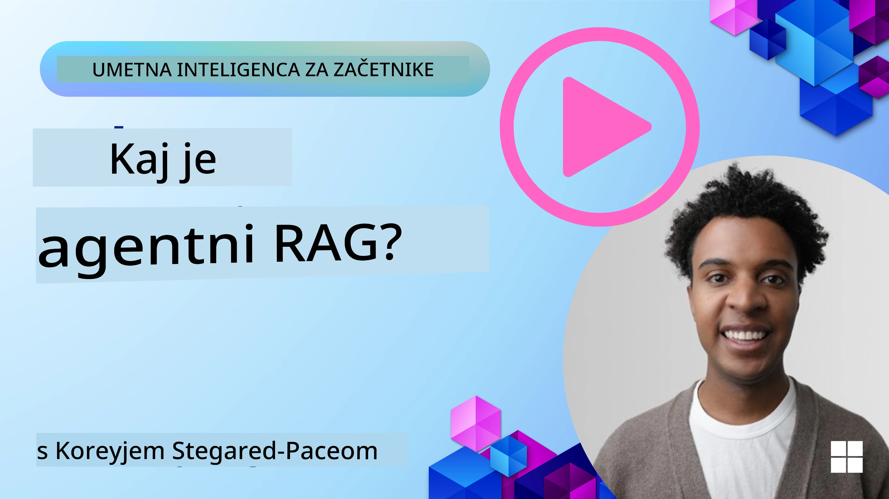
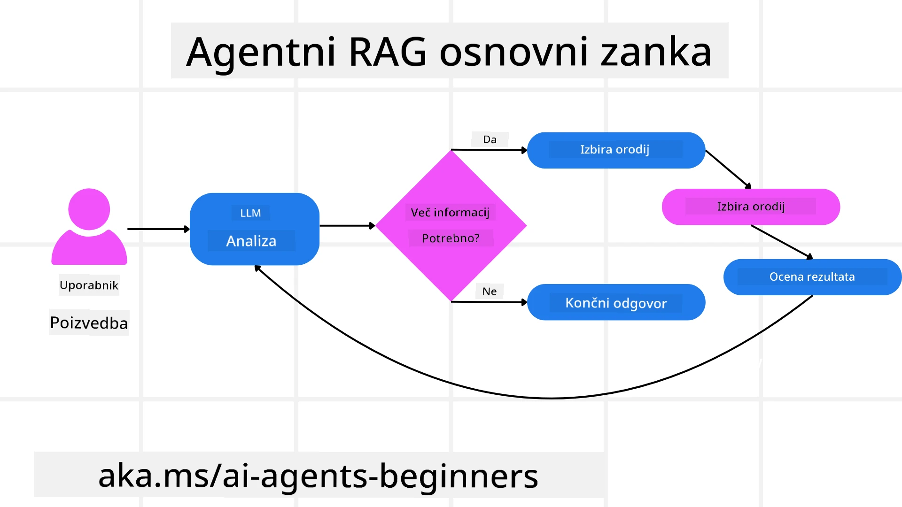
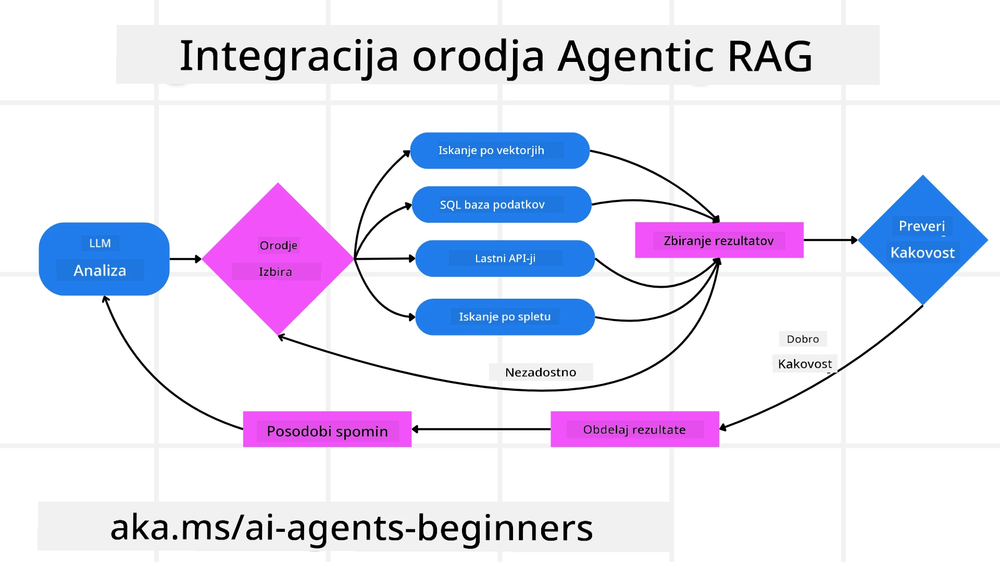
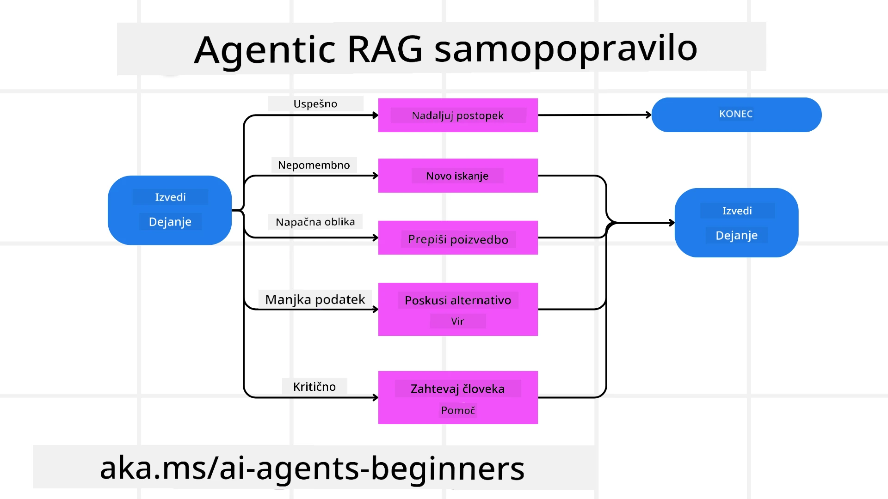
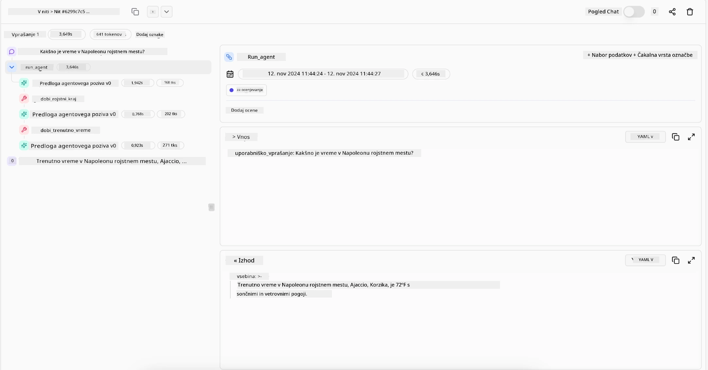

<!--
CO_OP_TRANSLATOR_METADATA:
{
  "original_hash": "0ebf6b2290db55dbf2d10cc49655523b",
  "translation_date": "2025-09-30T07:53:59+00:00",
  "source_file": "05-agentic-rag/README.md",
  "language_code": "sl"
}
-->

> _(Kliknite na zgornjo sliko za ogled videa te lekcije)_

# Agentic RAG

Ta lekcija ponuja celovit pregled paradigme Agentic Retrieval-Augmented Generation (Agentic RAG), novega pristopa v umetni inteligenci, kjer veliki jezikovni modeli (LLM) samostojno načrtujejo svoje naslednje korake, medtem ko pridobivajo informacije iz zunanjih virov. Za razliko od statičnih vzorcev "pridobivanja in nato branja" Agentic RAG vključuje iterativne klice LLM, prepletene z uporabo orodij ali funkcij ter strukturiranimi izhodi. Sistem ocenjuje rezultate, izpopolnjuje poizvedbe, po potrebi uporablja dodatna orodja in nadaljuje ta cikel, dokler ne doseže zadovoljive rešitve.

## Uvod

Ta lekcija bo obravnavala:

- **Razumevanje Agentic RAG:** Spoznajte novo paradigmo v umetni inteligenci, kjer veliki jezikovni modeli (LLM) samostojno načrtujejo svoje naslednje korake, medtem ko pridobivajo informacije iz zunanjih virov podatkov.
- **Razumevanje iterativnega pristopa Maker-Checker:** Razumite zanko iterativnih klicev LLM, prepletenih z uporabo orodij ali funkcij ter strukturiranimi izhodi, zasnovano za izboljšanje pravilnosti in obravnavo nepravilnih poizvedb.
- **Raziskovanje praktičnih aplikacij:** Prepoznajte scenarije, kjer Agentic RAG izstopa, kot so okolja, kjer je pravilnost na prvem mestu, kompleksne interakcije z bazami podatkov in podaljšani delovni tokovi.

## Cilji učenja

Po zaključku te lekcije boste znali/razumeli:

- **Razumevanje Agentic RAG:** Spoznajte novo paradigmo v umetni inteligenci, kjer veliki jezikovni modeli (LLM) samostojno načrtujejo svoje naslednje korake, medtem ko pridobivajo informacije iz zunanjih virov podatkov.
- **Iterativni pristop Maker-Checker:** Razumite koncept zanke iterativnih klicev LLM, prepletenih z uporabo orodij ali funkcij ter strukturiranimi izhodi, zasnovano za izboljšanje pravilnosti in obravnavo nepravilnih poizvedb.
- **Samostojno upravljanje procesa razmišljanja:** Razumite sposobnost sistema, da samostojno upravlja proces razmišljanja, sprejema odločitve o pristopu k problemom brez zanašanja na vnaprej določene poti.
- **Delovni tok:** Razumite, kako agentni model samostojno odloča o pridobivanju poročil o tržnih trendih, identifikaciji podatkov o konkurentih, povezovanju notranjih prodajnih metrik, sintezi ugotovitev in ocenjevanju strategije.
- **Iterativne zanke, integracija orodij in spomin:** Spoznajte zanašanje sistema na vzorec interakcije v zanki, ohranjanje stanja in spomina med koraki, da se izogne ponavljajočim se zankam in sprejema informirane odločitve.
- **Obravnavanje načinov neuspeha in samopopravljanje:** Raziskujte robustne mehanizme samopopravljanja sistema, vključno z iteracijo in ponovnim poizvedovanjem, uporabo diagnostičnih orodij ter zanašanjem na človeški nadzor.
- **Meje avtonomije:** Razumite omejitve Agentic RAG, osredotočene na avtonomijo, specifično za domeno, odvisnost od infrastrukture in spoštovanje varoval.
- **Praktični primeri uporabe in vrednost:** Prepoznajte scenarije, kjer Agentic RAG izstopa, kot so okolja, kjer je pravilnost na prvem mestu, kompleksne interakcije z bazami podatkov in podaljšani delovni tokovi.
- **Upravljanje, transparentnost in zaupanje:** Spoznajte pomen upravljanja in transparentnosti, vključno z razložljivim razmišljanjem, nadzorom pristranskosti in človeškim nadzorom.

## Kaj je Agentic RAG?

Agentic Retrieval-Augmented Generation (Agentic RAG) je nova paradigma v umetni inteligenci, kjer veliki jezikovni modeli (LLM) samostojno načrtujejo svoje naslednje korake, medtem ko pridobivajo informacije iz zunanjih virov. Za razliko od statičnih vzorcev "pridobivanja in nato branja" Agentic RAG vključuje iterativne klice LLM, prepletene z uporabo orodij ali funkcij ter strukturiranimi izhodi. Sistem ocenjuje rezultate, izpopolnjuje poizvedbe, po potrebi uporablja dodatna orodja in nadaljuje ta cikel, dokler ne doseže zadovoljive rešitve. Ta iterativni pristop "maker-checker" izboljšuje pravilnost, obravnava nepravilne poizvedbe in zagotavlja visokokakovostne rezultate.

Sistem aktivno upravlja svoj proces razmišljanja, prepisuje neuspele poizvedbe, izbira različne metode pridobivanja in integrira več orodij—kot so iskanje vektorjev v Azure AI Search, SQL baze podatkov ali prilagojeni API-ji—preden dokonča svoj odgovor. Posebna značilnost agentnega sistema je njegova sposobnost samostojnega upravljanja procesa razmišljanja. Tradicionalne implementacije RAG se zanašajo na vnaprej določene poti, medtem ko agentni sistem samostojno določa zaporedje korakov na podlagi kakovosti najdenih informacij.

## Definicija Agentic Retrieval-Augmented Generation (Agentic RAG)

Agentic Retrieval-Augmented Generation (Agentic RAG) je nova paradigma v razvoju umetne inteligence, kjer LLM ne le pridobivajo informacije iz zunanjih virov podatkov, temveč tudi samostojno načrtujejo svoje naslednje korake. Za razliko od statičnih vzorcev "pridobivanja in nato branja" ali skrbno skriptiranih zaporedij pozivov Agentic RAG vključuje zanko iterativnih klicev LLM, prepletenih z uporabo orodij ali funkcij ter strukturiranimi izhodi. Na vsakem koraku sistem ocenjuje pridobljene rezultate, odloča, ali je treba poizvedbe izpopolniti, po potrebi uporablja dodatna orodja in nadaljuje ta cikel, dokler ne doseže zadovoljive rešitve.

Ta iterativni pristop "maker-checker" je zasnovan za izboljšanje pravilnosti, obravnavo nepravilnih poizvedb v strukturirane baze podatkov (npr. NL2SQL) in zagotavljanje uravnoteženih, visokokakovostnih rezultatov. Namesto da se zanaša zgolj na skrbno zasnovane verige pozivov, sistem aktivno upravlja svoj proces razmišljanja. Lahko prepiše neuspele poizvedbe, izbere različne metode pridobivanja in integrira več orodij—kot so iskanje vektorjev v Azure AI Search, SQL baze podatkov ali prilagojeni API-ji—preden dokonča svoj odgovor. To odpravlja potrebo po preveč kompleksnih orkestracijskih okvirih. Namesto tega lahko relativno preprosta zanka "klic LLM → uporaba orodja → klic LLM → …" prinese sofisticirane in dobro utemeljene izhode.

## Samostojno upravljanje procesa razmišljanja

Posebna značilnost, ki sistem opredeljuje kot "agentni", je njegova sposobnost samostojnega upravljanja procesa razmišljanja. Tradicionalne implementacije RAG se pogosto zanašajo na ljudi, da vnaprej določijo pot za model: verigo razmišljanja, ki določa, kaj pridobiti in kdaj. 
Ko pa je sistem resnično agentni, samostojno odloča, kako pristopiti k problemu. Ne izvaja zgolj skripta; samostojno določa zaporedje korakov na podlagi kakovosti najdenih informacij. 
Na primer, če je sistemu naročeno, da ustvari strategijo lansiranja izdelka, se ne zanaša zgolj na poziv, ki podrobno opisuje celoten raziskovalni in odločevalni delovni tok. Namesto tega agentni model samostojno odloča:

1. Pridobiti poročila o trenutnih tržnih trendih z uporabo Bing Web Grounding.
2. Identificirati ustrezne podatke o konkurentih z uporabo Azure AI Search.
3. Povezati zgodovinske notranje prodajne metrike z uporabo Azure SQL Database.
4. Sintetizirati ugotovitve v kohezivno strategijo, orkestrirano prek Azure OpenAI Service.
5. Oceniti strategijo glede vrzeli ali neskladnosti, kar lahko sproži nov krog pridobivanja podatkov, če je potrebno.

Vsi ti koraki—izpopolnjevanje poizvedb, izbira virov, iteracija, dokler ni dosežen "zadovoljiv" odgovor—so odločitve modela, ne vnaprej skriptirane s strani človeka.

## Iterativne zanke, integracija orodij in spomin

Agentni sistem se zanaša na vzorec interakcije v zanki:

- **Začetni klic:** Cilj uporabnika (tj. uporabniški poziv) je predstavljen LLM.
- **Uporaba orodja:** Če model zazna manjkajoče informacije ali dvoumna navodila, izbere orodje ali metodo pridobivanja—kot je poizvedba v vektorski bazi podatkov (npr. Azure AI Search Hybrid search nad zasebnimi podatki) ali strukturiran SQL klic—za pridobitev več konteksta.
- **Ocena in izpopolnjevanje:** Po pregledu vrnjenih podatkov model odloči, ali so informacije zadostne. Če niso, izpopolni poizvedbo, preizkusi drugo orodje ali prilagodi svoj pristop.
- **Ponovi, dokler ni zadovoljen:** Ta cikel se nadaljuje, dokler model ne ugotovi, da ima dovolj jasnosti in dokazov za podajanje končnega, dobro utemeljenega odgovora.
- **Spomin in stanje:** Ker sistem ohranja stanje in spomin med koraki, se lahko spomni prejšnjih poskusov in njihovih rezultatov, izogne ponavljajočim se zankam ter sprejema bolj informirane odločitve med procesom.

Sčasoma to ustvari občutek razvijajočega se razumevanja, kar omogoča modelu, da navigira skozi kompleksne, večstopenjske naloge brez potrebe po stalnem človeškem posredovanju ali preoblikovanju poziva.

## Obravnava načinov neuspeha in samopopravljanje

Avtonomija Agentic RAG vključuje tudi robustne mehanizme samopopravljanja. Ko sistem naleti na slepe ulice—kot je pridobivanje nerelevantnih dokumentov ali nepravilne poizvedbe—lahko:

- **Iterira in ponovno poizveduje:** Namesto da vrne nizko vrednostne odgovore, model preizkusi nove strategije iskanja, prepiše poizvedbe v bazi podatkov ali pregleda alternativne nize podatkov.
- **Uporabi diagnostična orodja:** Sistem lahko uporabi dodatne funkcije, zasnovane za pomoč pri odpravljanju napak v korakih razmišljanja ali potrjevanju pravilnosti pridobljenih podatkov. Orodja, kot je Azure AI Tracing, bodo pomembna za omogočanje robustne opazljivosti in spremljanja.
- **Zanaša se na človeški nadzor:** Pri scenarijih z visokim tveganjem ali ponavljajočih se neuspehih lahko model označi negotovost in zahteva človeško usmeritev. Ko človek poda korektivne povratne informacije, jih model lahko upošteva v prihodnje.

Ta iterativen in dinamičen pristop omogoča modelu, da se nenehno izboljšuje, kar zagotavlja, da ni zgolj sistem za enkratno uporabo, temveč takšen, ki se uči iz svojih napak med določeno sejo.

## Meje avtonomije

Kljub svoji avtonomiji znotraj naloge Agentic RAG ni enakovreden umetni splošni inteligenci. Njegove "agentne" sposobnosti so omejene na orodja, vire podatkov in politike, ki jih zagotavljajo človeški razvijalci. Ne more si izmisliti svojih orodij ali preseči meja, ki so bile določene. Namesto tega odlično obvladuje dinamično orkestracijo razpoložljivih virov.
Ključne razlike od bolj naprednih oblik umetne inteligence vključujejo:

1. **Avtonomija, specifična za domeno:** Sistemi Agentic RAG so osredotočeni na doseganje ciljev, ki jih določi uporabnik, znotraj znane domene, pri čemer uporabljajo strategije, kot so prepisovanje poizvedb ali izbira orodij za izboljšanje rezultatov.
2. **Odvisnost od infrastrukture:** Zmožnosti sistema so odvisne od orodij in podatkov, ki jih integrirajo razvijalci. Brez človeškega posredovanja ne more preseči teh meja.
3. **Spoštovanje varoval:** Etične smernice, pravila skladnosti in poslovne politike ostajajo zelo pomembne. Svoboda agenta je vedno omejena z varnostnimi ukrepi in mehanizmi nadzora (upajmo?).

## Praktični primeri uporabe in vrednost

Agentic RAG izstopa v scenarijih, ki zahtevajo iterativno izpopolnjevanje in natančnost:

1. **Okolja, kjer je pravilnost na prvem mestu:** Pri preverjanju skladnosti, regulativni analizi ali pravnih raziskavah lahko agentni model večkrat preveri dejstva, konzultira več virov in prepiše poizvedbe, dokler ne poda temeljito preverjenega odgovora.
2. **Kompleksne interakcije z bazami podatkov:** Pri delu s strukturiranimi podatki, kjer poizvedbe pogosto ne uspejo ali potrebujejo prilagoditev, lahko sistem samostojno izpopolni svoje poizvedbe z uporabo Azure SQL ali Microsoft Fabric OneLake, kar zagotavlja, da končno pridobivanje ustreza namenu uporabnika.
3. **Podaljšani delovni tokovi:** Daljše seje se lahko razvijajo, ko se pojavijo nove informacije. Agentic RAG lahko nenehno vključuje nove podatke, spreminja strategije, ko se nauči več o problematičnem prostoru.

## Upravljanje, transparentnost in zaupanje

Ker ti sistemi postajajo bolj avtonomni v svojem razmišljanju, so upravljanje in transparentnost ključnega pomena:

- **Razložljivo razmišljanje:** Model lahko zagotovi revizijsko sled poizvedb, ki jih je izvedel, virov, ki jih je konzultiral, in korakov razmišljanja, ki jih je uporabil za dosego zaključka. Orodja, kot so Azure AI Content Safety in Azure AI Tracing / GenAIOps, lahko pomagajo ohranjati transparentnost in zmanjšati tveganja.
- **Nadzor pristranskosti in uravnoteženo pridobivanje:** Razvijalci lahko prilagodijo strategije pridobivanja, da zagotovijo, da so upoštevani uravnoteženi, reprezentativni viri podatkov, ter redno preverjajo izhode, da odkrijejo pristranskost ali izkrivljene vzorce z uporabo prilagojenih modelov za napredne organizacije podatkovne znanosti z uporabo Azure Machine Learning.
- **Človeški nadzor in skladnost:** Pri občutljivih nalogah ostaja človeški pregled bistven. Agentic RAG ne nadomešča človeške presoje pri odločitvah z visokim tveganjem—jo dopolnjuje z bolj temeljito preverjenimi možnostmi.

Imeti orodja, ki zagotavljajo jasen zapis dejanj, je bistveno. Brez njih je odpravljanje napak v večstopenjskem procesu lahko zelo težavno. Oglejte si naslednji primer iz Literal AI (podjetje za Chainlit) za izvedbo agenta:

## Zaključek

Agentic RAG predstavlja naravno evolucijo v načinu, kako sistemi umetne inteligence obravnavajo kompleksne, podatkovno intenzivne naloge. Z uporabo vzorca interakcije v zanki, samostojno izbiro orodij in izpopolnjevanjem poizvedb, dokler ne doseže visokokakovostnega rezultata, sistem presega statično sledenje pozivom in postane bolj prilagodljiv ter zavedajoč se konteksta. Čeprav je še vedno omejen z infrastrukturo, ki jo določijo ljudje, in etičnimi smernicami, te agentne sposobnosti omogočajo bogatejše, bolj dinamične in na koncu bolj uporabne interakcije umetne inteligence za podjetja in končne uporab
- <a href="https://ragaboutit.com/agentic-rag-a-complete-guide-to-agent-based-retrieval-augmented-generation/" target="_blank">Agentic RAG: Celoten vodnik po agentno temeljenem pridobivanju in generiranju – Novice iz generacije RAG</a>
- <a href="https://huggingface.co/learn/cookbook/agent_rag" target="_blank">Agentic RAG: pospešite svoj RAG z reformulacijo poizvedb in samopoizvedbo! Hugging Face odprtokodni AI priročnik</a>
- <a href="https://youtu.be/aQ4yQXeB1Ss?si=2HUqBzHoeB5tR04U" target="_blank">Dodajanje agentnih slojev v RAG</a>
- <a href="https://www.youtube.com/watch?v=zeAyuLc_f3Q&t=244s" target="_blank">Prihodnost asistentov za znanje: Jerry Liu</a>
- <a href="https://www.youtube.com/watch?v=AOSjiXP1jmQ" target="_blank">Kako zgraditi agentne RAG sisteme</a>
- <a href="https://ignite.microsoft.com/sessions/BRK102?source=sessions" target="_blank">Uporaba storitve Azure AI Foundry Agent za skaliranje vaših AI agentov</a>

### Akademski članki

- <a href="https://arxiv.org/abs/2303.17651" target="_blank">2303.17651 Self-Refine: Iterativno izboljševanje s samopovratnimi informacijami</a>
- <a href="https://arxiv.org/abs/2303.11366" target="_blank">2303.11366 Reflexion: Jezikovni agenti z verbalnim okrepljenim učenjem</a>
- <a href="https://arxiv.org/abs/2305.11738" target="_blank">2305.11738 CRITIC: Veliki jezikovni modeli se lahko sami popravijo z interaktivnim kritiziranjem orodij</a>
- <a href="https://arxiv.org/abs/2501.09136" target="_blank">2501.09136 Agentno pridobivanje in generiranje: Pregled agentnega RAG</a>

## Prejšnja lekcija

[Vzorec oblikovanja uporabe orodij](../04-tool-use/README.md)

## Naslednja lekcija

[Gradnja zaupanja vrednih AI agentov](../06-building-trustworthy-agents/README.md)

---

**Omejitev odgovornosti**:  
Ta dokument je bil preveden z uporabo storitve AI za prevajanje [Co-op Translator](https://github.com/Azure/co-op-translator). Čeprav si prizadevamo za natančnost, vas prosimo, da upoštevate, da lahko avtomatizirani prevodi vsebujejo napake ali netočnosti. Izvirni dokument v njegovem maternem jeziku naj se šteje za avtoritativni vir. Za ključne informacije priporočamo profesionalni človeški prevod. Ne prevzemamo odgovornosti za morebitne nesporazume ali napačne razlage, ki bi nastale zaradi uporabe tega prevoda.