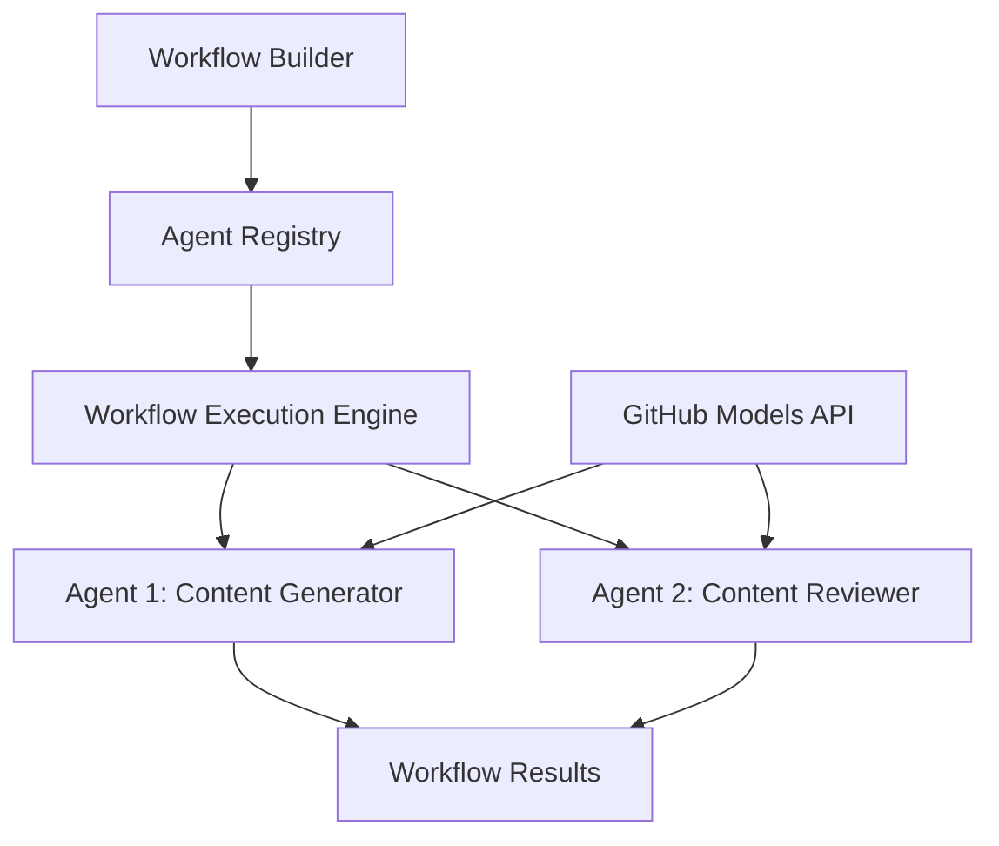

<!--
CO_OP_TRANSLATOR_METADATA:
{
  "original_hash": "034158688d0a45aae06dcbb21b0da5ae",
  "translation_date": "2025-11-11T13:00:20+00:00",
  "source_file": "08-multi-agent/code_samples/workflows-agent-framework/dotNET/01.dotnet-agent-framework-workflow-ghmodel-basic.md",
  "language_code": "sl"
}
-->
# 🔄 Osnovni delovni tokovi agentov z modeli GitHub (.NET)

## 📋 Vadnica za orkestracijo delovnih tokov

Ta zvezek prikazuje, kako zgraditi napredne **delovne tokove agentov** z uporabo Microsoft Agent Framework za .NET in modeli GitHub. Naučili se boste ustvariti večstopenjske poslovne procese, kjer AI agenti sodelujejo za dosego kompleksnih nalog prek strukturiranih vzorcev orkestracije.

## 🎯 Cilji učenja

### 🏗️ **Osnove arhitekture delovnih tokov**
- **Graditelj delovnih tokov**: Oblikovanje in orkestracija kompleksnih večstopenjskih AI procesov
- **Koordinacija agentov**: Koordinacija več specializiranih agentov znotraj delovnih tokov
- **Integracija modelov GitHub**: Uporaba storitve za sklepanje AI modelov GitHub v delovnih tokovih
- **Vizualno oblikovanje delovnih tokov**: Ustvarjanje in vizualizacija struktur delovnih tokov za boljše razumevanje

### 🔄 **Vzorce orkestracije procesov**
- **Sekvenčna obdelava**: Povezovanje več nalog agentov v logičnem zaporedju
- **Upravljanje stanja**: Ohranjanje konteksta in pretoka podatkov med fazami delovnega toka
- **Obravnava napak**: Implementacija robustnega okrevanja po napakah in odpornosti delovnega toka
- **Optimizacija zmogljivosti**: Oblikovanje učinkovitih delovnih tokov za operacije na ravni podjetja

### 🏢 **Uporaba delovnih tokov v podjetjih**
- **Avtomatizacija poslovnih procesov**: Avtomatizacija kompleksnih organizacijskih delovnih tokov
- **Pipeline za produkcijo vsebine**: Uredniški delovni tokovi s fazami pregleda in odobritve
- **Avtomatizacija storitev za stranke**: Večstopenjsko reševanje poizvedb strank
- **Delovni tokovi za obdelavo podatkov**: ETL delovni tokovi z AI-podprto transformacijo

## ⚙️ Predpogoji in nastavitev

### 📦 **Potrebni NuGet paketi**

Ta demonstracija delovnega toka uporablja več ključnih .NET paketov:

```xml
<!-- Core AI Framework -->
<PackageReference Include="Microsoft.Extensions.AI" Version="9.9.0" />

<!-- Agent Framework (Local Development) -->
<!-- Microsoft.Agents.AI.dll - Core agent abstractions -->
<!-- Microsoft.Agents.AI.OpenAI.dll - OpenAI/GitHub Models integration -->

<!-- Configuration and Environment -->
<PackageReference Include="DotNetEnv" Version="3.1.1" />
```

### 🔑 **Konfiguracija modelov GitHub**

**Nastavitev okolja (.env datoteka):**
```env
GITHUB_TOKEN=your_github_personal_access_token
GITHUB_ENDPOINT=https://models.inference.ai.azure.com
GITHUB_MODEL_ID=gpt-4o-mini
```

**Dostop do modelov GitHub:**
1. Prijavite se za modele GitHub (trenutno v predogledu)
2. Ustvarite osebni dostopni žeton z dovoljenji za dostop do modelov
3. Konfigurirajte okoljske spremenljivke, kot je prikazano zgoraj

### 🏗️ **Pregled arhitekture delovnega toka**



**Ključne komponente:**
- **WorkflowBuilder**: Glavni orkestracijski motor za oblikovanje delovnih tokov
- **AIAgent**: Posamezni specializirani agenti s specifičnimi zmožnostmi
- **GitHub Models Client**: Integracija storitve za sklepanje AI modelov
- **Execution Context**: Upravljanje stanja in pretoka podatkov med fazami delovnega toka

## 🎨 **Vzorce oblikovanja delovnih tokov v podjetjih**

### 📝 **Delovni tok za produkcijo vsebine**
```
User Request → Content Generation → Quality Review → Final Output
```

### 🔍 **Pipeline za obdelavo dokumentov**
```
Document Input → Analysis → Extraction → Validation → Structured Output
```

### 💼 **Delovni tok za poslovno inteligenco**
```
Data Collection → Processing → Analysis → Report Generation → Distribution
```

### 🤝 **Avtomatizacija storitev za stranke**
```
Customer Inquiry → Classification → Processing → Response Generation → Follow-up
```

## 🏢 **Prednosti za podjetja**

### 🎯 **Zanesljivost in skalabilnost**
- **Deterministična izvedba**: Dosledni, ponovljivi rezultati delovnih tokov
- **Okrevanje po napakah**: Eleganten način obravnave napak v kateri koli fazi delovnega toka
- **Spremljanje zmogljivosti**: Sledenje metrikam izvedbe in priložnostim za optimizacijo
- **Upravljanje virov**: Učinkovita dodelitev in uporaba virov AI modelov

### 🔒 **Varnost in skladnost**
- **Varna avtentikacija**: Avtentikacija na osnovi žetonov GitHub za dostop do API-ja
- **Revizijske sledi**: Popolno beleženje izvedbe delovnih tokov in odločilnih točk
- **Nadzor dostopa**: Granularna dovoljenja za izvedbo in spremljanje delovnih tokov
- **Zasebnost podatkov**: Varno ravnanje z občutljivimi informacijami skozi delovne tokove

### 📊 **Opazljivost in upravljanje**
- **Vizualno oblikovanje delovnih tokov**: Jasna predstavitev procesnih tokov in odvisnosti
- **Spremljanje izvedbe**: Sledenje napredku in zmogljivosti delovnih tokov v realnem času
- **Poročanje o napakah**: Podrobna analiza napak in zmožnosti odpravljanja težav
- **Analitika zmogljivosti**: Metri za optimizacijo in načrtovanje kapacitet

Začnimo z gradnjo vašega prvega AI delovnega toka, pripravljenega za podjetje! 🚀

## 💻 Zagon kode

Celotna implementacija je na voljo v `01.dotnet-agent-framework-workflow-ghmodel-basic.cs`. Ta datoteka prikazuje:

1. **Konfiguracija okolja** - Nalaganje poverilnic modelov GitHub iz `.env` datoteke
2. **Nastavitev OpenAI odjemalca** - Konfiguracija odjemalca za uporabo končne točke modelov GitHub
3. **Ustvarjanje agentov** - Definiranje specializiranih agentov (Front Desk in Concierge)
4. **Graditelj delovnih tokov** - Ustvarjanje večagentnega delovnega toka s sekvenčno obdelavo
5. **Izvedba delovnega toka** - Zagon delovnega toka s pretočnimi rezultati

### 🚀 Zagon primera

```bash
# Make the script executable (Unix/Linux/macOS)
chmod +x 01.dotnet-agent-framework-workflow-ghmodel-basic.cs

# Run the workflow
./01.dotnet-agent-framework-workflow-ghmodel-basic.cs
```

Ali na Windows:
```powershell
dotnet run 01.dotnet-agent-framework-workflow-ghmodel-basic.cs
```

### 📝 Pričakovani rezultat

Delovni tok bo:
1. Sprejel vašo zahtevo za potovalno destinacijo ("Rad bi šel v Pariz")
2. Agent Front Desk poda začetno priporočilo
3. Agent Concierge pregleda in izpopolni priporočilo
4. Končni rezultat prikaže celoten tok pogovora

### 🔧 Prilagoditev

Delovni tok lahko prilagodite tako, da:
- Spremenite navodila agentom za spremembo njihovega vedenja
- Dodate več agentov za ustvarjanje kompleksnih večstopenjskih delovnih tokov
- Spremenite uporabniško sporočilo za testiranje različnih scenarijev
- Prilagodite robove delovnega toka za ustvarjanje različnih vzorcev izvedbe

---

<!-- CO-OP TRANSLATOR DISCLAIMER START -->
**Omejitev odgovornosti**:  
Ta dokument je bil preveden z uporabo storitve za prevajanje z umetno inteligenco [Co-op Translator](https://github.com/Azure/co-op-translator). Čeprav si prizadevamo za natančnost, vas prosimo, da upoštevate, da lahko avtomatizirani prevodi vsebujejo napake ali netočnosti. Izvirni dokument v njegovem maternem jeziku naj se šteje za avtoritativni vir. Za ključne informacije priporočamo profesionalni človeški prevod. Ne odgovarjamo za morebitne nesporazume ali napačne razlage, ki bi nastale zaradi uporabe tega prevoda.
<!-- CO-OP TRANSLATOR DISCLAIMER END -->