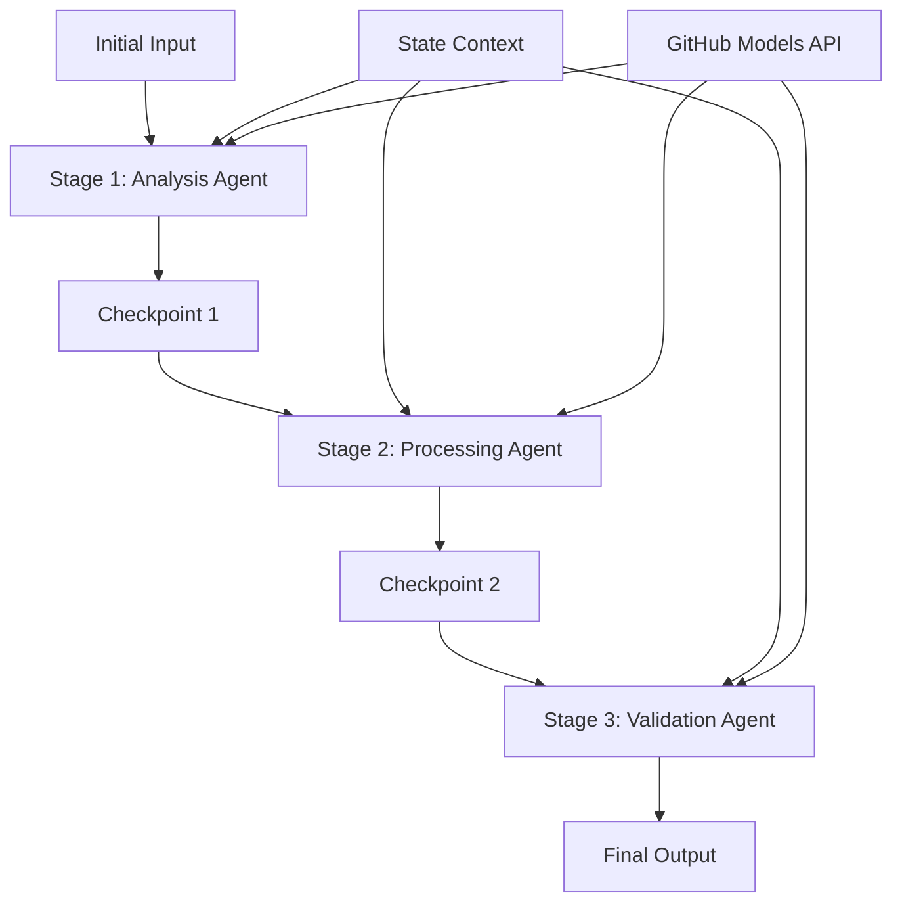

<!--
CO_OP_TRANSLATOR_METADATA:
{
  "original_hash": "1be9c8dcbd79a02d33d2c138684c1394",
  "translation_date": "2025-11-11T14:05:51+00:00",
  "source_file": "08-multi-agent/code_samples/workflows-agent-framework/dotNET/02.dotnet-agent-framework-workflow-ghmodel-sequential.md",
  "language_code": "sl"
}
-->
# ⏩ Zaporedni delovni tokovi agentov z modeli GitHub (.NET)

## 📋 Napredni vodič za zaporedno obdelavo

Ta zvezek prikazuje **vzorce zaporednih delovnih tokov** z uporabo Microsoftovega ogrodja Agent za .NET in modelov GitHub. Naučili se boste, kako zgraditi napredne, korak za korakom obdelovalne cevovode, kjer agenti delujejo v določenem vrstnem redu, pri čemer vsak korak temelji na rezultatih prejšnjega koraka.

## 🎯 Cilji učenja

### 🔄 **Arhitektura zaporedne obdelave**
- **Oblikovanje linearnega delovnega toka**: Ustvarite korak za korakom obdelovalne cevovode z jasnimi odvisnostmi
- **Upravljanje stanja**: Ohranite kontekst in tok podatkov skozi faze zaporednega delovnega toka
- **Integracija modelov GitHub**: Uporabite GitHubove AI modele v večstopenjskih .NET delovnih tokovih
- **Vzorcev za podjetniške cevovode**: Zgradite proizvodno pripravljene sisteme za zaporedno obdelavo

### 🏗️ **Napredni zaporedni vzorci**
- **Obdelava s kontrolnimi točkami**: Uvedite validacijske kontrolne točke med fazami delovnega toka
- **Ohranjanje konteksta**: Ohranite stanje in akumulirano znanje skozi vse faze
- **Prenos napak**: Obvladujte napake elegantno v verigah zaporedne obdelave
- **Optimizacija zmogljivosti**: Učinkovita zaporedna izvedba z minimalnimi stroški

### 🏢 **Podjetniške zaporedne aplikacije**
- **Cevovod za obdelavo dokumentov**: Večstopenjska analiza, transformacija in validacija dokumentov
- **Delovni tokovi za zagotavljanje kakovosti**: Zaporedni pregledi, validacije in odobritve
- **Cevovod za produkcijo vsebine**: Raziskovanje → Pisanje → Urejanje → Pregled → Objavljanje
- **Avtomatizacija poslovnih procesov**: Večstopenjski poslovni delovni tokovi z jasnimi odvisnostmi med fazami

## ⚙️ Predpogoji in nastavitev

### 📦 **Potrebni NuGet paketi**

Bistveni paketi za .NET zaporedne delovne tokove:

```xml
<!-- Core AI Framework -->
<PackageReference Include="Microsoft.Extensions.AI" Version="9.9.0" />

<!-- Client Model Abstractions -->
<PackageReference Include="System.ClientModel" Version="1.6.1.0" />

<!-- Azure Identity and Async LINQ Support -->
<PackageReference Include="Azure.Identity" Version="1.15.0" />
<PackageReference Include="System.Linq.Async" Version="6.0.3" />

<!-- Local Agent Framework References -->
<!-- Microsoft.Agents.AI.dll - Core agent abstractions -->
<!-- Microsoft.Agents.AI.OpenAI.dll - GitHub Models integration -->
```

### 🔑 **Konfiguracija modelov GitHub**

**Nastavitev okolja (.env datoteka):**
```env
GITHUB_TOKEN=your_github_personal_access_token
GITHUB_ENDPOINT=https://models.inference.ai.azure.com
GITHUB_MODEL_ID=gpt-4o-mini
```

**Upravljanje konfiguracije:**
```csharp
// Load environment variables securely
Env.Load("../../../.env");
var githubToken = Environment.GetEnvironmentVariable("GITHUB_TOKEN");
var githubEndpoint = Environment.GetEnvironmentVariable("GITHUB_ENDPOINT");
var modelId = Environment.GetEnvironmentVariable("GITHUB_MODEL_ID");
```

### 🏗️ **Arhitektura zaporednega delovnega toka**



**Ključne komponente:**
- **Zaporedni agenti**: Specializirani agenti za vsako fazo obdelave
- **Kontekst stanja**: Ohranja akumulirane podatke in odločitve skozi faze
- **Kontrolne točke**: Validacijske točke med fazami za zagotavljanje kakovosti in doslednosti
- **Odjemalec modelov GitHub**: Dosleden dostop do AI modelov skozi vse faze delovnega toka

## 🎨 **Vzorci oblikovanja zaporednih delovnih tokov**

### 📝 **Cevovod za obdelavo dokumentov**
```
Raw Document → Content Extraction → Analysis → Validation → Structured Output
```

### 🎯 **Delovni tok za ustvarjanje vsebine**
```
Brief/Requirements → Research → Content Creation → Review → Final Polish
```

### 🔍 **Cevovod za zagotavljanje kakovosti**
```
Initial Review → Technical Validation → Compliance Check → Final Approval
```

### 💼 **Delovni tok za poslovno inteligenco**
```
Data Collection → Processing → Analysis → Report Generation → Distribution
```

## 🏢 **Prednosti zaporednih delovnih tokov za podjetja**

### 🎯 **Zanesljivost in kakovost**
- **Deterministična obdelava**: Dosledni, ponovljivi rezultati skozi strukturirane faze
- **Kontrolne točke kakovosti**: Validacijske točke zagotavljajo kakovost na vsaki stopnji
- **Izolacija napak**: Težave v eni fazi se ne prenesejo na naslednje faze
- **Sledljivost**: Popolno sledenje odločitvam in transformacijam na vsaki stopnji

### 📈 **Razširljivost in zmogljivost**
- **Modularna zasnova**: Vsako fazo je mogoče optimizirati neodvisno
- **Upravljanje virov**: Učinkovita dodelitev virov AI modelov skozi faze
- **Optimizacija stanja**: Minimalen prenos stanja med fazami za optimalno zmogljivost
- **Skupine vzporednih faz**: Več zaporednih delovnih tokov lahko teče vzporedno

### 🔒 **Varnost in skladnost**
- **Varnost na ravni faze**: Različne varnostne politike za različne faze obdelave
- **Validacija podatkov**: Zagotovite integriteto podatkov in skladnost na vsaki kontrolni točki
- **Nadzor dostopa**: Granularna dovoljenja za različne faze delovnega toka
- **Regulativna skladnost**: Izpolnjevanje regulativnih zahtev skozi strukturirano obdelavo

### 📊 **Spremljanje in analitika**
- **Metrične na ravni faze**: Spremljanje zmogljivosti za vsako fazo delovnega toka
- **Identifikacija ozkih grl**: Prepoznajte in optimizirajte počasne faze
- **Metrične kakovosti**: Spremljajte kakovost in stopnje uspešnosti na vsaki stopnji
- **Optimizacija procesov**: Nenehno izboljševanje na podlagi analitike na ravni faze

Zgradimo robustne zaporedne AI obdelovalne cevovode! 🚀

## 💻 Zagon kode

Celotna implementacija je na voljo v `02.dotnet-agent-framework-workflow-ghmodel-sequential.cs`. Ta datoteka prikazuje **tristopenjski delovni tok analize pohištva**:

1. **Faza 1 - Prodajni agent**: Analizira slike pohištva in poda predloge za nakup
2. **Faza 2 - Cenovni agent**: Ponuja podrobne cenovne razčlenitve in proračunske možnosti
3. **Faza 3 - Agent za ponudbe**: Ustvari profesionalni dokument ponudbe v Markdown formatu

### 🏗️ **Arhitektura delovnega toka**

```
Image Input → Sales Analysis → Price Estimation → Quote Generation → Final Output
```

Vsak agent:
- Prejme izhod iz prejšnje faze kot kontekst
- Nadgradi prejšnjo analizo s specializiranim znanjem
- Ohranja kontinuiteto delovnega toka z upravljanjem stanja

### 🚀 Zagon primera

**Predpogoji:**
- Postavite sliko pohištva na `../imgs/home.png` (ali posodobite spremenljivko `imgPath`)
- Konfigurirajte svojo `.env` datoteko s poverilnicami modelov GitHub

```bash
# Make the script executable (Unix/Linux/macOS)
chmod +x 02.dotnet-agent-framework-workflow-ghmodel-sequential.cs

# Run the sequential workflow
./02.dotnet-agent-framework-workflow-ghmodel-sequential.cs
```

Ali na Windows:
```powershell
dotnet run 02.dotnet-agent-framework-workflow-ghmodel-sequential.cs
```

### 📝 Pričakovani izhod

Delovni tok bo:
1. **Prodajni agent**: Identificiral pohištvene predmete s slike in podal priporočila
2. **Cenovni agent**: Dodal podrobno cenovno analizo s proračunskimi razredi in nakupnimi priporočili
3. **Agent za ponudbe**: Ustvaril formatiran dokument ponudbe z vsemi sintetiziranimi informacijami

Končni izhod bo celovita, profesionalna ponudba za pohištvo, ki temelji na analizi slike.

### 🔧 Možnosti prilagoditve

**Spremenite vedenje agenta:**
```csharp
// Adjust agent instructions to change their focus
const string SalesAgentInstructions = "Your custom instructions...";
```

**Spremenite zaporedni tok:**
```csharp
// Add or reorder workflow stages
var workflow = new WorkflowBuilder(salesagent)
    .AddEdge(salesagent, priceagent)
    .AddEdge(priceagent, quoteagent)
    .AddEdge(quoteagent, newAgent)  // Add another stage
    .Build();
```

**Uporabite drugačen vhod:**
```csharp
// Process text instead of images
ChatMessage userMessage = new ChatMessage(ChatRole.User, [
    new TextContent("Analyze pricing for a modern living room set")
]);
```

### 🎯 Resnične aplikacije

Ta zaporedni vzorec je idealen za:
- **E-trgovino**: Analiza izdelkov → Cenitev → Generiranje ponudbe
- **Nepremičnine**: Analiza nepremičnin → Vrednotenje → Ustvarjanje oglasa
- **Zavarovanje**: Analiza zahtevkov → Ocena → Generiranje ponudbe
- **Ustvarjanje vsebine**: Raziskovanje → Pisanje → Urejanje → Objavljanje

### 🔍 Razumevanje toka stanja

Vsak agent v zaporedju prejme:
- **Originalni vhod**: Začetno uporabniško sporočilo (slika + besedilo)
- **Izhode prejšnjih agentov**: Vse odgovore prejšnjih agentov v zgodovini pogovora
- **Akumulirani kontekst**: Celotno stanje, ohranjeno skozi delovni tok

To omogoča napredno večstopenjsko obdelavo, kjer vsak agent gradi na celovitem kontekstu vseh prejšnjih faz.

---

<!-- CO-OP TRANSLATOR DISCLAIMER START -->
**Omejitev odgovornosti**:  
Ta dokument je bil preveden z uporabo storitve za prevajanje AI [Co-op Translator](https://github.com/Azure/co-op-translator). Čeprav si prizadevamo za natančnost, vas prosimo, da upoštevate, da lahko avtomatizirani prevodi vsebujejo napake ali netočnosti. Izvirni dokument v njegovem maternem jeziku naj se šteje za avtoritativni vir. Za ključne informacije je priporočljivo profesionalno človeško prevajanje. Ne odgovarjamo za morebitne nesporazume ali napačne razlage, ki izhajajo iz uporabe tega prevoda.
<!-- CO-OP TRANSLATOR DISCLAIMER END -->