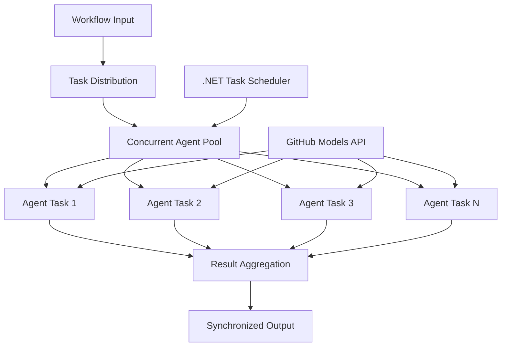

<!--
CO_OP_TRANSLATOR_METADATA:
{
  "original_hash": "b9c6e32c9b5f2fed20b6916984440d88",
  "translation_date": "2025-11-11T13:33:37+00:00",
  "source_file": "08-multi-agent/code_samples/workflows-agent-framework/dotNET/03.dotnet-agent-framework-workflow-ghmodel-concurrent.md",
  "language_code": "sl"
}
-->
# ⚡ Sočasni delovni tokovi agentov z modeli GitHub (.NET)

## 📋 Vadnica za visokozmogljivo vzporedno obdelavo

Ta zvezek prikazuje **vzorce sočasnih delovnih tokov** z uporabo Microsoft Agent Framework za .NET in modelov GitHub. Naučili se boste, kako zgraditi visokozmogljive delovne tokove za vzporedno obdelavo, ki maksimizirajo prepustnost z istočasnim izvajanjem več AI agentov ob ohranjanju koordinacije in doslednosti podatkov.

## 🎯 Cilji učenja

### 🚀 **Osnove sočasne obdelave**
- **Istočasno izvajanje agentov**: Istočasno izvajanje več AI agentov za maksimalno zmogljivost
- **Vzorec Async/Await**: Uporaba asinhronega programskega modela .NET za učinkovito sočasnost
- **Integracija modelov GitHub**: Koordinacija več sočasnih klicev storitve za sklepanje modelov GitHub
- **Upravljanje virov**: Učinkovito upravljanje virov modelov AI pri sočasnih operacijah

### 🏗️ **Napredna arhitektura sočasnosti**
- **Vzporednost na osnovi nalog**: Uporaba knjižnice Task Parallel Library .NET za optimalno sočasno izvajanje
- **Vzorec sinhronizacije**: Koordinacija sočasnih agentov ob izogibanju tekmovalnim pogojem
- **Uravnoteženje obremenitve**: Učinkovita razdelitev dela med razpoložljivo zmogljivost sočasne obdelave
- **Odpornost na napake**: Obvladovanje posameznih napak agentov brez zaustavitve celotnega delovnega toka

### 🏢 **Sočasne aplikacije za podjetja**
- **Obdelava dokumentov z velikim obsegom**: Istočasna obdelava več dokumentov
- **Analiza vsebine v realnem času**: Sočasna analiza dohodnih podatkovnih tokov
- **Optimizacija obdelave serij**: Maksimizacija prepustnosti za obdelavo podatkov v velikem obsegu
- **Multimodalna analiza**: Vzporedna obdelava različnih vrst in formatov vsebine

## ⚙️ Predpogoji in nastavitev

### 📦 **Potrebni paketi NuGet**

Bistveni paketi za visokozmogljive sočasne delovne tokove:

```xml
<!-- Core AI Framework with Async Support -->
<PackageReference Include="Microsoft.Extensions.AI" Version="9.9.0" />

<!-- Client Model Abstractions for API Communication -->
<PackageReference Include="System.ClientModel" Version="1.6.1.0" />

<!-- Azure Identity and Async LINQ for Advanced Operations -->
<PackageReference Include="Azure.Identity" Version="1.15.0" />
<PackageReference Include="System.Linq.Async" Version="6.0.3" />

<!-- Local Agent Framework References -->
<!-- Microsoft.Agents.AI.dll - Core agent abstractions with async support -->
<!-- Microsoft.Agents.AI.OpenAI.dll - GitHub Models integration with concurrency -->
```

### 🔑 **Konfiguracija modelov GitHub**

**Nastavitev okolja (.env datoteka):**
```env
GITHUB_TOKEN=your_github_personal_access_token
GITHUB_ENDPOINT=https://models.inference.ai.azure.com
GITHUB_MODEL_ID=gpt-4o-mini
```

**Premisleki o sočasni obdelavi:**
```csharp
// Configure for concurrent operations
var clientOptions = new OpenAIClientOptions()
{
    Endpoint = new Uri(githubEndpoint),
    // Configure connection pooling for concurrent requests
    NetworkTimeout = TimeSpan.FromMinutes(5)
};
```

### 🏗️ **Arhitektura sočasnega delovnega toka**



**Ključne komponente:**
- **Knjižnica Task Parallel Library**: Vgrajena podpora .NET za sočasne operacije
- **Bazen agentov**: Več instanc agentov za vzporedno obdelavo
- **Združevanje rezultatov**: Koordinacija in združevanje rezultatov sočasnih agentov
- **Točke sinhronizacije**: Zagotavljanje doslednosti podatkov pri sočasnih operacijah

## 🎨 **Vzorec oblikovanja sočasnih delovnih tokov**

### 🔍 **Vzporedno raziskovanje in analiza**
```
Research Topic → Concurrent Research Agents → Result Synthesis → Final Report
```

### 📊 **Obdelava podatkov iz več virov**
```
Data Sources → Parallel Processing Agents → Data Integration → Unified Output
```

### 🎭 **Cevovod za generiranje vsebine**
```
Content Requirements → Concurrent Content Generators → Quality Review → Final Content
```

### 🔄 **Obdelava Fan-Out/Fan-In**
```
Single Input → Multiple Concurrent Processors → Result Aggregation → Single Output
```

## 🏢 **Prednosti zmogljivosti za podjetja**

### ⚡ **Prepustnost in razširljivost**
- **Linearno skaliranje zmogljivosti**: Dodajte več sočasnih agentov za povečanje prepustnosti
- **Izkoristek virov**: Maksimalna učinkovitost razpoložljive zmogljivosti modelov AI
- **Zmanjšan čas obdelave**: Znatno zmanjšanje časa z vzporednim izvajanjem
- **Elastično skaliranje**: Dinamično prilagajanje števila sočasnih agentov glede na obremenitev

### 🛡️ **Zanesljivost in odpornost**
- **Izolacija napak**: Posamezne napake agentov ne vplivajo na druge sočasne operacije
- **Postopno poslabšanje**: Sistem deluje naprej z zmanjšano zmogljivostjo agentov
- **Obnovitev po napakah**: Samodejni mehanizmi ponovnega poskusa za neuspele sočasne operacije
- **Razdelitev obremenitve**: Enakomerna razdelitev dela med razpoložljive agente

### 📊 **Spremljanje zmogljivosti**
- **Metrične sočasne izvedbe**: Sledenje zmogljivosti vseh vzporednih operacij
- **Analitika uporabe virov**: Spremljanje uporabe CPU, pomnilnika in omrežja
- **Analiza prepustnosti**: Merjenje učinkovitostnih pridobitev zaradi sočasne obdelave
- **Odkrivanje ozkih grl**: Identifikacija in odprava omejitev zmogljivosti

### 🔧 **Razvoj in operacije**
- **Asinhroni programski model**: Uporaba zrelih vzorcev async/await v .NET
- **Koordinacija nalog**: Vgrajeno upravljanje in koordinacija nalog
- **Obravnava izjem**: Celovito obravnavanje napak pri sočasnih operacijah
- **Podpora za odpravljanje napak**: Orodja za odpravljanje napak v Visual Studio za sočasne delovne tokove

Zgradimo visokozmogljive sočasne AI delovne tokove z .NET! 🚀

## 💻 Zagon kode

Celotna implementacija je na voljo v `03.dotnet-agent-framework-workflow-ghmodel-concurrent.cs`. Ta datoteka prikazuje **sočasni delovni tok Fan-Out/Fan-In** za načrtovanje potovanj:

### 🏗️ **Arhitektura delovnega toka**

```
User Request → ConcurrentStartExecutor → [Researcher Agent || Planner Agent] → ConcurrentAggregationExecutor → Final Output
```

**Ključne komponente:**

1. **ConcurrentStartExecutor**: Istočasno pošlje zahtevo uporabnika vsem agentom
2. **Raziskovalni agent**: Istočasno analizira destinacije in znamenitosti
3. **Načrtovalni agent**: Istočasno ustvari podrobne načrte potovanja
4. **ConcurrentAggregationExecutor**: Zbira in združuje rezultate obeh agentov

### 🎯 **Vzorec Fan-Out/Fan-In**

Ta delovni tok prikazuje klasični vzorec **Fan-Out/Fan-In**:
- **Fan-Out**: Ena vhodna zahteva se istočasno pošlje več agentom
- **Sočasna obdelava**: Več agentov istočasno dela na isti nalogi
- **Fan-In**: Rezultati vseh agentov se zberejo in združijo v en izhod

### 🚀 Zagon primera

```bash
# Make the script executable (Unix/Linux/macOS)
chmod +x 03.dotnet-agent-framework-workflow-ghmodel-concurrent.cs

# Run the concurrent workflow
./03.dotnet-agent-framework-workflow-ghmodel-concurrent.cs
```

Ali na Windows:
```powershell
dotnet run 03.dotnet-agent-framework-workflow-ghmodel-concurrent.cs
```

### 📝 Pričakovani izhod

Delovni tok bo:
1. **Pošiljanje zahteve**: Pošlje "Načrtuj potovanje v Seattle decembra" obema agentoma
2. **Sočasna obdelava**: Oba agenta delata istočasno:
   - Raziskovalec identificira znamenitosti in podrobnosti
   - Načrtovalec ustvari itinerar in logistiko
3. **Združevanje**: Združi oba odgovora v celovit izhod
4. **Prikaz rezultatov**: Prikaže združen načrt potovanja z vsemi informacijami

### 🔧 Možnosti prilagoditve

**Dodaj več sočasnih agentov:**
```csharp
// Create additional specialized agents
AIAgent budgetAgent = openAIClient.GetChatClient(github_model_id).CreateAIAgent(
    name: "Budget-Agent", instructions: "Calculate travel costs...");

// Add to fan-out
var workflow = new WorkflowBuilder(startExecutor)
    .AddFanOutEdge(startExecutor, targets: [researcherAgent, plannerAgent, budgetAgent])
    .AddFanInEdge(aggregationExecutor, sources: [researcherAgent, plannerAgent, budgetAgent])
    .WithOutputFrom(aggregationExecutor)
    .Build();

// Update aggregation count
if (this._messages.Count == 3) { ... }
```

**Spremeni navodila za agente:**
```csharp
const string ResearcherAgentInstructions = "Your custom instructions for research...";
const string PlanAgentInstructions = "Your custom instructions for planning...";
```

**Spremeni nalogo:**
```csharp
StreamingRun run = await InProcessExecution.StreamAsync(
    workflow, 
    "Plan a European vacation for 2 weeks in summer"
);
```

### 🎯 Resnične aplikacije

Ta vzorec sočasnosti je idealen za:
- **Ustvarjanje vsebine**: Več piscev istočasno ustvarja različne odseke
- **Pregled kode**: Več pregledovalcev analizira kodo z različnih vidikov
- **Raziskave trga**: Vzporedna analiza različnih tržnih segmentov
- **Obdelava dokumentov**: Sočasno pridobivanje, analiza in validacija
- **Analiza z več perspektivami**: Pridobivanje različnih pogledov na isti vhod

### 🔍 Razumevanje prilagojenih izvajalcev

**ConcurrentStartExecutor:**
- Implementira `IMessageHandler<string>` za sprejemanje vhodnih nizov
- Istočasno pošlje sporočila vsem povezanim agentom
- Pošlje `TurnToken` za sprožitev sočasne obdelave

**ConcurrentAggregationExecutor:**
- Implementira `IMessageHandler<ChatMessage>` za sprejemanje odgovorov agentov
- Zbira sporočila na način, ki je varen za več niti
- Združi, ko prispejo vsi pričakovani odgovori
- Ustvari končni izhod z uporabo `context.YieldOutputAsync()`

### ⚡ Prednosti zmogljivosti

**Sočasno vs zaporedno:**
- Zaporedno: Agent1 (30s) → Agent2 (30s) = **60 sekund skupaj**
- Sočasno: Agent1 (30s) || Agent2 (30s) = **30 sekund skupaj**

**Izboljšanje prepustnosti**: Do N× hitreje za N sočasnih agentov (odvisno od obremenitve in virov)

### 🛡️ Obravnava napak

Delovni tok obravnava posamezne napake agentov brez težav:
- Če en agent odpove, drugi nadaljujejo obdelavo
- Združevalnik lahko implementira logiko časovne omejitve
- Po potrebi se lahko vrnejo delni rezultati

### 📊 Napredne funkcije

**Dinamično število agentov:**
Spremenite logiko združevanja za podporo spremenljivemu številu agentov:

```csharp
private int _expectedAgentCount;
private readonly List<ChatMessage> _messages = [];

public async ValueTask HandleAsync(ChatMessage message, IWorkflowContext context)
{
    this._messages.Add(message);
    if (this._messages.Count == _expectedAgentCount)
    {
        // Process aggregation
    }
}
```

Ta vzorec sočasnega delovnega toka je bistven za gradnjo visokozmogljivih, razširljivih sistemov AI agentov!

---

<!-- CO-OP TRANSLATOR DISCLAIMER START -->
**Omejitev odgovornosti**:  
Ta dokument je bil preveden z uporabo storitve AI za prevajanje [Co-op Translator](https://github.com/Azure/co-op-translator). Čeprav si prizadevamo za natančnost, vas prosimo, da upoštevate, da lahko avtomatizirani prevodi vsebujejo napake ali netočnosti. Izvirni dokument v njegovem maternem jeziku naj se šteje za avtoritativni vir. Za ključne informacije priporočamo profesionalni človeški prevod. Ne odgovarjamo za morebitne nesporazume ali napačne razlage, ki izhajajo iz uporabe tega prevoda.
<!-- CO-OP TRANSLATOR DISCLAIMER END -->