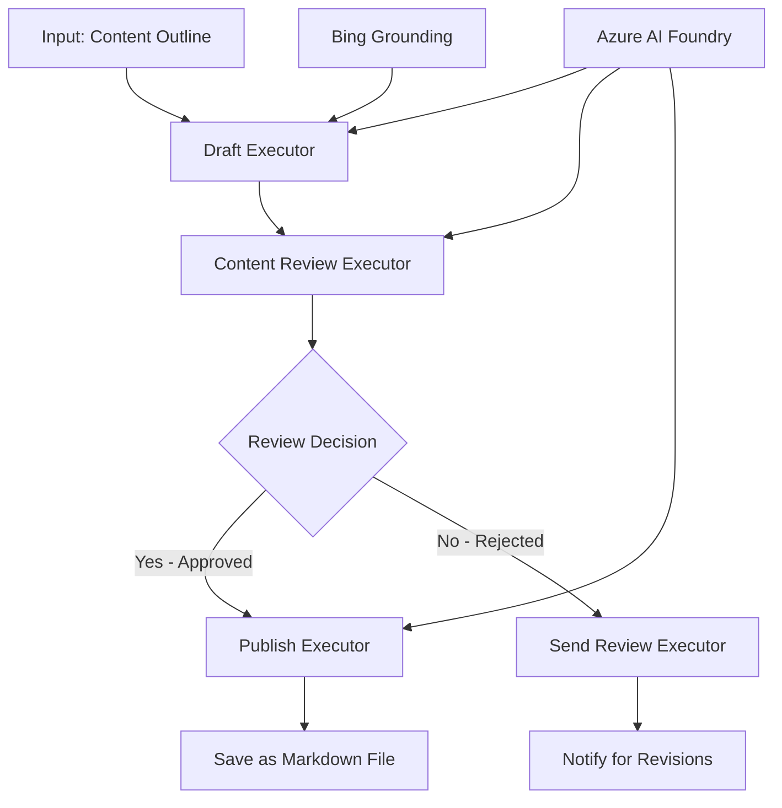

<!--
CO_OP_TRANSLATOR_METADATA:
{
  "original_hash": "8abd335151cee553293b637ee3d80d10",
  "translation_date": "2025-11-11T12:32:46+00:00",
  "source_file": "08-multi-agent/code_samples/workflows-agent-framework/dotNET/04.dotnet-agent-framework-workflow-aifoundry-condition.md",
  "language_code": "sl"
}
-->
# 🔀 Pogojni delovni tokovi agentov z Azure AI Foundry (.NET)

## 📋 Vadnica za inteligentne delovne tokove na podlagi odločitev

Ta zvezek prikazuje **vzorce pogojnih delovnih tokov** z uporabo Azure AI Foundry in Microsoft Agent Framework za .NET. Naučili se boste, kako zgraditi napredne delovne tokove, ki temeljijo na odločitvah, in inteligentno usmerjajo obdelavo na podlagi analize AI, poslovnih pravil ter dinamičnih pogojev za avtomatizacijo na ravni podjetja.

## 🎯 Cilji učenja

### 🧠 **Arhitektura inteligentnih odločitev**
- **Implementacija pogojne logike**: Zgradite kompleksna drevesa odločitev z več točkami razvejanja
- **Usmerjanje na podlagi AI**: Uporabite modele Azure AI Foundry za sprejemanje inteligentnih odločitev o usmerjanju
- **Dinamična prilagoditev delovnega toka**: Spremenite vedenje delovnega toka na podlagi analize in pogojev med izvajanjem
- **Integracija poslovnih pravil**: Vključite poslovno logiko in zahteve skladnosti v delovne tokove

### 🔀 **Napredni vzorci pogojnih odločitev**
- **Odločanje na podlagi več kriterijev**: Ocenite več dejavnikov za odločitve o usmerjanju
- **Obdelava, ki se zaveda konteksta**: Sprejemajte odločitve na podlagi akumuliranega konteksta in zgodovine delovnega toka
- **Prilagodljiva sprememba delovnega toka**: Dinamično prilagodite poti obdelave na podlagi pogojev v realnem času
- **Integracija pogonskega sistema pravil**: Implementirajte napredne pogonske sisteme poslovnih pravil v delovne tokove

### 🏢 **Pogojne aplikacije na ravni podjetja**
- **Razvrščanje in usmerjanje dokumentov**: Samodejno razvrščanje in usmerjanje dokumentov v ustrezne delovne tokove
- **Razvrščanje storitev za stranke**: Inteligentno usmerjanje povpraševanj strank v specializirane ekipe za obravnavo
- **Obdelava skladnosti in tveganj**: Uporaba različnih procesov validacije in pregleda na podlagi ocene tveganja
- **Delovni tokovi za zagotavljanje kakovosti**: Usmerjanje vsebine skozi ustrezne procese pregleda na podlagi meril kakovosti

## ⚙️ Predpogoji in nastavitev

### 📦 **Potrebni NuGet paketi**

Napredni paketi za obdelavo pogojnih delovnih tokov:

```xml
<!-- Core AI Framework -->
<PackageReference Include="Microsoft.Extensions.AI" Version="9.9.0" />

<!-- Azure AI Agents with Persistent State -->
<PackageReference Include="Azure.AI.Agents.Persistent" Version="1.2.0-beta.5" />

<!-- Azure Identity and Utilities -->
<PackageReference Include="Azure.Identity" Version="1.15.0" />
<PackageReference Include="System.Linq.Async" Version="6.0.3" />
<PackageReference Include="DotNetEnv" Version="3.1.1" />

<!-- Local Workflow Framework References -->
<!-- Microsoft.Agents.Workflows.dll - Advanced workflow orchestration -->
<!-- Microsoft.Agents.AI.AzureAI.dll - Azure AI Foundry integration -->
<!-- Microsoft.Agents.AI.dll - Core agent abstractions -->
```

### 🔑 **Konfiguracija Azure AI Foundry**

**Potrebni Azure viri:**
- Delovni prostor Azure AI Foundry z modeli za pogojno obdelavo
- Naročnina na Azure z ustreznimi kvotami in dovoljenji za računalniške vire
- Nameščeni AI modeli za sprejemanje odločitev in analizo vsebine
- (Neobvezno) Povezava z Bing Search API za zmožnosti utemeljevanja

**Konfiguracija okolja (.env datoteka):**
```env
# Azure AI Foundry Configuration
AZURE_AI_PROJECT_ENDPOINT=https://your-project.cognitiveservices.azure.com/
BING_CONNECTION_ID=your-bing-connection-id
```

**Nastavitev avtentikacije:**
```csharp
// Azure CLI or Managed Identity authentication
using Azure.Identity;
var credential = new AzureCliCredential();

// Load environment configuration
DotNetEnv.Env.Load("../../../.env");
```

### 🏗️ **Arhitektura pogojnega delovnega toka**



**Ključne komponente:**
- **Draft Executor**: AI agent, ki ustvarja začetne osnutke vsebine iz orisov
- **Content Review Executor**: AI agent, ki ocenjuje kakovost in skladnost osnutkov
- **Conditional Routing**: Logika odločanja, ki usmerja na podlagi rezultatov pregleda
- **Poti za objavo/pregled**: Ločene poti obdelave za odobreno in zavrnjeno vsebino
- **Upravljanje stanja**: Ohranja kontekst vsebine in pregleda skozi celoten delovni tok

## 🎨 **Vzorci oblikovanja pogojnih delovnih tokov**

### 📋 **Produkcija vsebine z vrati kakovosti**
```
Outline → Draft Creation → Quality Review → {Approve: Publish | Reject: Revise}
```

### 🎯 **Obdelava dokumentov na podlagi tveganja**
```
Document → Risk Assessment → {Low: Standard | High: Enhanced Review}
```

### 🔍 **Inteligentno usmerjanje storitev za stranke**
```
Customer Query → Analysis → {Simple: FAQ Bot | Complex: Human Agent}
```

### 💼 **Delovni tokovi, ki temeljijo na skladnosti**
```
Content → Compliance Check → {Pass: Publish | Fail: Legal Review}
```

## 🏢 **Prednosti pogojnih delovnih tokov na ravni podjetja**

### 🎯 **Inteligentna avtomatizacija**
- **Pametno sprejemanje odločitev**: Odločitve o usmerjanju na podlagi analize vsebine in konteksta
- **Prilagodljiva obdelava**: Delovni tokovi, ki se samodejno prilagajajo spreminjajočim se pogojem
- **Uveljavljanje poslovnih pravil**: Samodejna uporaba kompleksne poslovne logike in politik
- **Usmerjanje, ki se zaveda konteksta**: Odločitve na podlagi celotne zgodovine delovnega toka in akumuliranega konteksta

### 📈 **Operativna odličnost**
- **Optimizirana dodelitev virov**: Usmerjanje dela k najbolj ustreznim strokovnjakom in procesom
- **Zmanjšanje ročnega posredovanja**: Avtomatizirano sprejemanje odločitev zmanjšuje potrebo po človeškem usmerjanju
- **Hitrejši časi reševanja**: Neposredno usmerjanje k ustrezni strokovnosti in zmogljivostim obdelave
- **Dosledna uporaba**: Enotna uporaba poslovnih pravil in kriterijev odločanja

### 🛡️ **Upravljanje tveganj in skladnosti**
- **Samodejna ocena tveganja**: AI-podprta ocena vsebine in ravni tveganja situacije
- **Uveljavljanje skladnosti**: Samodejno usmerjanje skozi zahtevane regulativne procese
- **Uporaba varnostnih protokolov**: Izboljšani varnostni ukrepi, uporabljeni na podlagi ocene tveganja
- **Vzdrževanje revizijske sledi**: Popolna dokumentacija odločitev o usmerjanju in njihove utemeljitve

### 📊 **Analitika in stalne izboljšave**
- **Analitika odločitev**: Sledenje učinkovitosti in natančnosti odločitev o usmerjanju
- **Prepoznavanje vzorcev**: Identifikacija trendov in vzorcev v odločitvah o usmerjanju skozi čas
- **Optimizacija zmogljivosti**: Stalne izboljšave kriterijev odločanja in učinkovitosti usmerjanja
- **Poslovna inteligenca**: Vpogledi v značilnosti vsebine in zahteve obdelave

### 🔧 **Tehnična odličnost**
- **Vztrajno upravljanje stanja**: Ohranjanje kompleksnega stanja skozi izvajanje delovnega toka
- **Razširljiva arhitektura**: Obvladovanje zahtev po obdelavi velikega obsega pogojnih procesov
- **Zmožnosti integracije**: Brezhibna integracija z obstoječimi poslovnimi sistemi in procesi
- **Sledenje in opazovanje**: Celovito spremljanje zmogljivosti delovnega toka in odločitev

Zgradimo inteligentne, odločitveno usmerjene delovne tokove za podjetja z .NET! 🚀

## 💻 Zagon kode

Celotna implementacija je na voljo v datoteki `04.dotnet-agent-framework-workflow-aifoundry-condition.cs`. Ta prikazuje **delovni tok produkcije vsebine z vrati kakovosti**:

### 🏗️ **Arhitektura delovnega toka**

```
Content Outline → Draft Creation → Quality Review → Conditional Routing:
                                                      ├─ Approved (>200 words) → Publish
                                                      └─ Rejected (<200 words) → Review Notification
```

**Agenti v delovnem toku:**
1. **Evangelist Agent**: Ustvari osnutke vadnic iz orisov z Bing utemeljevanjem
2. **Content Reviewer Agent**: Ocenjuje kakovost osnutkov (število besed, popolnost)
3. **Publisher Agent**: Shrani odobreno vsebino kot Markdown datoteke z žigom časa

**Prilagojeni izvajalci:**
1. **DraftExecutor**: Orkestrira ustvarjanje osnutkov
2. **ContentReviewExecutor**: Izvaja oceno kakovosti
3. **PublishExecutor**: Upravlja objavo odobrene vsebine
4. **SendReviewExecutor**: Upravlja obvestila o zavrnjeni vsebini

### 🚀 Zagon primera

**Predpogoji:**
- Konfiguriran delovni prostor Azure AI Foundry
- Avtentikacija prek Azure CLI (`az login`)
- (Neobvezno) Povezava z Bing Search za utemeljevanje

```bash
# Make the script executable (Unix/Linux/macOS)
chmod +x 04.dotnet-agent-framework-workflow-aifoundry-condition.cs

# Run the conditional workflow
./04.dotnet-agent-framework-workflow-aifoundry-condition.cs
```

Ali na Windows:
```powershell
dotnet run 04.dotnet-agent-framework-workflow-aifoundry-condition.cs
```

### 📝 Pričakovani izhod

Delovni tok bo:
1. **Ustvaril agente**: Inicializiral tri specializirane agente Azure AI Foundry
2. **Ustvaril osnutek**: Evangelist agent ustvari osnutek vadnice iz orisa
3. **Pregledal vsebino**: Content Reviewer oceni kakovost osnutka
4. **Pogojno usmerjanje**:
   - **Če odobreno (>200 besed)**: Publish executor shrani kot Markdown datoteko
   - **Če zavrnjeno (<200 besed)**: Send review executor pošlje obvestilo o pregledu
5. **Prikazal rezultate**: Prikaže končni izid delovnega toka

### 🔧 Možnosti prilagoditve

**Spremenite kriterije pregleda:**
```csharp
const string ContentReviewerInstructions = @"
You are a content reviewer...
1. Check if content is more than 500 words (instead of 200)
2. Verify technical accuracy
3. Ensure proper formatting
...";
```

**Dodajte več pogojnih poti:**
```csharp
var workflow = new WorkflowBuilder(draftExecutor)
    .AddEdge(draftExecutor, contentReviewerExecutor)
    .AddEdge(contentReviewerExecutor, publishExecutor, condition: GetCondition("Excellent"))
    .AddEdge(contentReviewerExecutor, editExecutor, condition: GetCondition("Good"))
    .AddEdge(contentReviewerExecutor, sendReviewerExecutor, condition: GetCondition("Poor"))
    .Build();
```

**Spremenite zahteve za vsebino:**
```csharp
string OUTLINE_Content = @"
# Your Custom Topic
## Section 1
https://your-reference-url
## Section 2
...
";
```

### 🎯 Resnične aplikacije

Ta vzorec pogojnega delovnega toka je idealen za:
- **Sisteme za upravljanje vsebine**: Avtomatizirani uredniški delovni tokovi z vrati kakovosti
- **Obdelavo dokumentov**: Usmerjanje dokumentov na podlagi razvrščanja in skladnosti
- **Podpora strankam**: Inteligentno usmerjanje zahtevkov na podlagi kompleksnosti in nujnosti
- **Pravni pregled**: Usmerjanje pogodb na podlagi ocene tveganja in vrednosti
- **HR procesi**: Usmerjanje prijav skozi ustrezne delovne tokove za pregled

### 🔍 Razumevanje pogojne logike

**Funkcija pogoja:**
```csharp
public Func<object?, bool> GetCondition(string expectedResult) =>
    reviewResult => reviewResult is ReviewResult review && review.Result == expectedResult;
```

Ta funkcija ustvari predikat, ki:
1. Preveri, ali je rezultat tipa `ReviewResult`
2. Primerja lastnost `Result` z pričakovano vrednostjo
3. Vrne true/false za določitev usmerjanja

**Poti delovnega toka s pogoji:**
```csharp
.AddEdge(contentReviewerExecutor, publishExecutor, condition: GetCondition("Yes"))
.AddEdge(contentReviewerExecutor, sendReviewerExecutor, condition: GetCondition("No"))
```

### 📊 Napredne funkcije

**Validacija JSON sheme:**
Delovni tok uporablja JSON sheme za zagotavljanje strukturiranih odgovorov:

```csharp
// Define response structure
public class ReviewResult
{
    [JsonPropertyName("review_result")]
    public string Result { get; set; } = string.Empty;
    
    [JsonPropertyName("reason")]
    public string Reason { get; set; } = string.Empty;
    
    [JsonPropertyName("draft_content")]
    public string DraftContent { get; set; } = string.Empty;
}

// Apply to agent
ResponseFormat = ChatResponseFormat.ForJsonSchema(
    AIJsonUtilities.CreateJsonSchema(typeof(ReviewResult)), 
    "ReviewResult", 
    "Review Result From DraftContent"
)
```

**Integracija Bing utemeljevanja:**
Evangelist agent uporablja Bing utemeljevanje za dostop do informacij v realnem času:

```csharp
var bingGroundingConfig = new BingGroundingSearchConfiguration(bing_conn_id);
BingGroundingToolDefinition bingGroundingTool = new(
    new BingGroundingSearchToolParameters([bingGroundingConfig])
);
```

To omogoča agentu, da sledi URL-jem v orisu in pridobi aktualne informacije.

### 🛡️ Upravljanje napak

Delovni tok vključuje robustno upravljanje napak za zavrnjeno vsebino:
- Napake pregleda sprožijo alternativno pot
- Obvestila zagotavljajo jasne razloge za zavrnitev
- Vsebina je ohranjena za revizijo

### 🔄 Razširitev delovnega toka

**Dodajte zanko za revizijo:**
Ustvarite povratno zanko, ki samodejno ponovno ustvari osnutek vsebine:

```csharp
.AddEdge(contentReviewerExecutor, publishExecutor, condition: GetCondition("Yes"))
.AddEdge(contentReviewerExecutor, draftExecutor, condition: GetCondition("No")) // Loop back
```

**Implementirajte večstopenjski pregled:**
Dodajte več stopenj pregleda z različnimi kriteriji:

```csharp
.AddEdge(draftExecutor, technicalReviewer)
.AddEdge(technicalReviewer, editorialReviewer, condition: GetCondition("TechPass"))
.AddEdge(editorialReviewer, publishExecutor, condition: GetCondition("EditPass"))
```

Ta vzorec pogojnega delovnega toka zagotavlja osnovo za gradnjo naprednih, inteligentnih avtomatizacijskih sistemov na ravni podjetja! 🚀

---

<!-- CO-OP TRANSLATOR DISCLAIMER START -->
**Omejitev odgovornosti**:  
Ta dokument je bil preveden z uporabo storitve za prevajanje AI [Co-op Translator](https://github.com/Azure/co-op-translator). Čeprav si prizadevamo za natančnost, vas prosimo, da upoštevate, da lahko avtomatizirani prevodi vsebujejo napake ali netočnosti. Izvirni dokument v njegovem maternem jeziku je treba obravnavati kot avtoritativni vir. Za ključne informacije priporočamo profesionalni človeški prevod. Ne odgovarjamo za morebitna nesporazumevanja ali napačne razlage, ki izhajajo iz uporabe tega prevoda.
<!-- CO-OP TRANSLATOR DISCLAIMER END -->