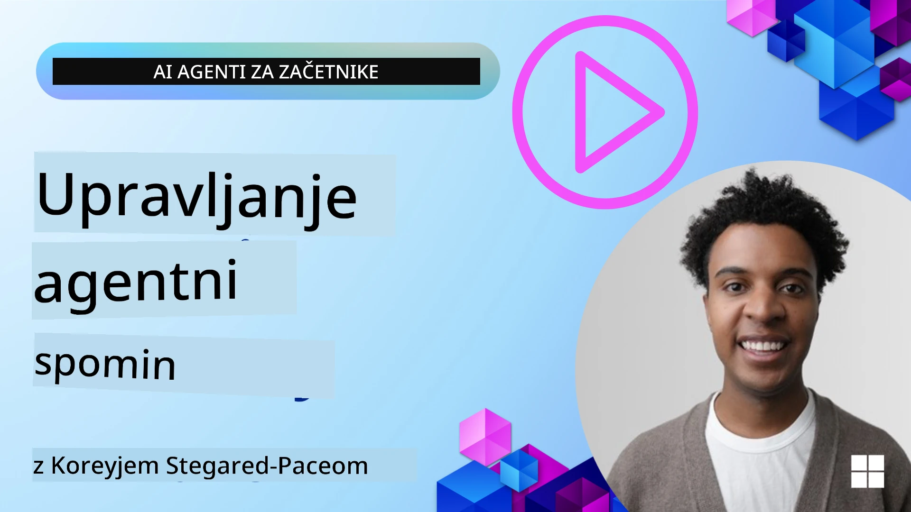

<!--
CO_OP_TRANSLATOR_METADATA:
{
  "original_hash": "a1d90991499ad697c4ad24decaf36968",
  "translation_date": "2025-12-09T12:53:37+00:00",
  "source_file": "13-agent-memory/README.md",
  "language_code": "sl"
}
-->
# Spomin za AI agente

Ko govorimo o edinstvenih prednostih ustvarjanja AI agentov, sta glavni temi: sposobnost uporabe orodij za dokončanje nalog in sposobnost izboljševanja skozi čas. Spomin je temelj za ustvarjanje samopoboljšujočih agentov, ki lahko uporabnikom zagotavljajo boljše izkušnje.

V tej lekciji bomo raziskali, kaj spomin pomeni za AI agente, kako ga lahko upravljamo in uporabljamo v korist naših aplikacij.

## Uvod

Ta lekcija bo zajemala:

• **Razumevanje spomina AI agenta**: Kaj je spomin in zakaj je ključen za agente.

• **Implementacija in shranjevanje spomina**: Praktične metode za dodajanje spominskih zmogljivosti vašim AI agentom, s poudarkom na kratkoročnem in dolgoročnem spominu.

• **Ustvarjanje samopoboljšujočih AI agentov**: Kako spomin omogoča agentom, da se učijo iz preteklih interakcij in se izboljšujejo skozi čas.

## Razpoložljive implementacije

Ta lekcija vključuje dve obsežni vadnici v obliki zvezkov:

• **[13-agent-memory.ipynb](./13-agent-memory.ipynb)**: Implementira spomin z uporabo Mem0 in Azure AI Search s Semantic Kernel ogrodjem.

• **[13-agent-memory-cognee.ipynb](./13-agent-memory-cognee.ipynb)**: Implementira strukturiran spomin z uporabo Cognee, ki samodejno gradi graf znanja, podprt z vektorji, vizualizira graf in omogoča inteligentno iskanje.

## Cilji učenja

Po zaključku te lekcije boste znali:

• **Razlikovati med različnimi vrstami spomina AI agenta**, vključno z delovnim, kratkoročnim in dolgoročnim spominom, ter specializiranimi oblikami, kot sta osebnostni in epizodni spomin.

• **Implementirati in upravljati kratkoročni in dolgoročni spomin za AI agente** z uporabo Semantic Kernel ogrodja, z orodji, kot so Mem0, Cognee, Whiteboard memory, in integracijo z Azure AI Search.

• **Razumeti načela samopoboljšujočih AI agentov** in kako robustni sistemi za upravljanje spomina prispevajo k stalnemu učenju in prilagajanju.

## Razumevanje spomina AI agenta

V svojem bistvu **spomin za AI agente pomeni mehanizme, ki jim omogočajo shranjevanje in priklic informacij**. Te informacije lahko vključujejo specifične podrobnosti o pogovoru, uporabniške preference, pretekla dejanja ali celo naučene vzorce.

Brez spomina so AI aplikacije pogosto brez stanja, kar pomeni, da se vsaka interakcija začne znova. To vodi do ponavljajoče in frustrirajoče uporabniške izkušnje, kjer agent "pozabi" prejšnji kontekst ali preference.

### Zakaj je spomin pomemben?

Inteligenca agenta je tesno povezana z njegovo sposobnostjo priklica in uporabe preteklih informacij. Spomin omogoča agentom, da so:

• **Reflektivni**: Učijo se iz preteklih dejanj in rezultatov.

• **Interaktivni**: Ohranjajo kontekst med tekočim pogovorom.

• **Proaktivni in reaktivni**: Predvidevajo potrebe ali se ustrezno odzivajo na podlagi zgodovinskih podatkov.

• **Avtonomni**: Delujejo bolj neodvisno z uporabo shranjenega znanja.

Cilj implementacije spomina je narediti agente bolj **zanesljive in sposobne**.

### Vrste spomina

#### Delovni spomin

Pomislite na to kot na kos papirja za beležke, ki ga agent uporablja med eno samo nalogo ali miselnim procesom. Vsebuje takojšnje informacije, potrebne za izračun naslednjega koraka.

Za AI agente delovni spomin pogosto zajema najpomembnejše informacije iz pogovora, tudi če je celotna zgodovina klepeta dolga ali skrajšana. Osredotoča se na ključne elemente, kot so zahteve, predlogi, odločitve in dejanja.

**Primer delovnega spomina**

Pri agentu za rezervacijo potovanj bi delovni spomin lahko zajel trenutno zahtevo uporabnika, na primer "Želim rezervirati potovanje v Pariz". Ta specifična zahteva je v agentovem neposrednem kontekstu za vodenje trenutne interakcije.

#### Kratkoročni spomin

Ta vrsta spomina ohranja informacije za trajanje enega pogovora ali seje. To je kontekst trenutnega klepeta, ki agentu omogoča, da se sklicuje na prejšnje korake v dialogu.

**Primer kratkoročnega spomina**

Če uporabnik vpraša: "Koliko bi stal let v Pariz?" in nato nadaljuje z: "Kaj pa nastanitev tam?", kratkoročni spomin zagotavlja, da agent ve, da "tam" pomeni "Pariz" v istem pogovoru.

#### Dolgoročni spomin

To so informacije, ki trajajo skozi več pogovorov ali sej. Omogoča agentom, da si zapomnijo uporabniške preference, zgodovinske interakcije ali splošno znanje skozi daljša obdobja. To je pomembno za personalizacijo.

**Primer dolgoročnega spomina**

Dolgoročni spomin bi lahko shranil, da "Ben uživa v smučanju in dejavnostih na prostem, ima rad kavo z razgledom na gore in se želi izogniti zahtevnim smučarskim progah zaradi pretekle poškodbe". Te informacije, pridobljene iz prejšnjih interakcij, vplivajo na priporočila v prihodnjih sejah načrtovanja potovanj, kar jih naredi zelo personalizirane.

#### Osebnostni spomin

Ta specializirana vrsta spomina pomaga agentu razviti dosledno "osebnost" ali "vlogo". Omogoča agentu, da si zapomni podrobnosti o sebi ali svoji predvideni vlogi, kar naredi interakcije bolj tekoče in osredotočene.

**Primer osebnostnega spomina**

Če je agent za potovanja zasnovan kot "strokovnjak za načrtovanje smučarskih izletov", bi osebnostni spomin lahko okrepil to vlogo, kar bi vplivalo na njegove odgovore, da se uskladijo s tonom in znanjem strokovnjaka.

#### Epizodni spomin

Ta spomin shranjuje zaporedje korakov, ki jih agent izvede med zapleteno nalogo, vključno z uspehi in neuspehi. To je kot spominjanje specifičnih "epizod" ali preteklih izkušenj za učenje iz njih.

**Primer epizodnega spomina**

Če je agent poskušal rezervirati določen let, vendar je to spodletelo zaradi nedostopnosti, bi epizodni spomin lahko zabeležil ta neuspeh, kar bi agentu omogočilo, da poskusi alternativne lete ali uporabnika obvesti o težavi na bolj informiran način med naslednjim poskusom.

#### Spomin na entitete

To vključuje pridobivanje in zapomnitev specifičnih entitet (kot so ljudje, kraji ali stvari) in dogodkov iz pogovorov. Omogoča agentu, da zgradi strukturirano razumevanje ključnih elementov, o katerih se razpravlja.

**Primer spomina na entitete**

Iz pogovora o preteklem potovanju bi agent lahko pridobil "Pariz", "Eifflov stolp" in "večerja v restavraciji Le Chat Noir" kot entitete. V prihodnji interakciji bi agent lahko priklical "Le Chat Noir" in ponudil, da tam ponovno rezervira mizo.

#### Strukturiran RAG (Retrieval Augmented Generation)

Čeprav je RAG širša tehnika, je "strukturiran RAG" izpostavljen kot močna tehnologija spomina. Izvleče goste, strukturirane informacije iz različnih virov (pogovori, e-pošta, slike) in jih uporablja za izboljšanje natančnosti, priklica in hitrosti odgovorov. Za razliko od klasičnega RAG, ki se zanaša zgolj na semantično podobnost, strukturiran RAG deluje s prirojeno strukturo informacij.

**Primer strukturiranega RAG**

Namesto da bi zgolj ujemal ključne besede, bi strukturiran RAG lahko analiziral podrobnosti leta (destinacija, datum, čas, letalska družba) iz e-pošte in jih shranil na strukturiran način. To omogoča natančna vprašanja, kot je "Kateri let sem rezerviral za Pariz v torek?"

## Implementacija in shranjevanje spomina

Implementacija spomina za AI agente vključuje sistematičen proces **upravljanja spomina**, ki vključuje generiranje, shranjevanje, priklic, integracijo, posodabljanje in celo "pozabljanje" (ali brisanje) informacij. Priklic je še posebej ključni vidik.

### Specializirana orodja za spomin

#### Mem0

Eden od načinov za shranjevanje in upravljanje spomina agenta je uporaba specializiranih orodij, kot je Mem0. Mem0 deluje kot trajen sloj spomina, ki agentom omogoča priklic pomembnih interakcij, shranjevanje uporabniških preferenc in dejanskega konteksta ter učenje iz uspehov in neuspehov skozi čas. Ideja je, da se agenti brez stanja spremenijo v agente s stanjem.

Deluje skozi **dvofazni spominski proces: ekstrakcija in posodobitev**. Najprej se sporočila, dodana v nit agenta, pošljejo v storitev Mem0, ki uporablja Large Language Model (LLM) za povzetek zgodovine pogovora in pridobivanje novih spominov. Nato faza posodobitve, ki jo poganja LLM, določi, ali je treba te spomine dodati, spremeniti ali izbrisati, in jih shrani v hibridno podatkovno shrambo, ki lahko vključuje vektorske, grafične in ključ-vrednostne baze podatkov. Ta sistem podpira tudi različne vrste spomina in lahko vključuje grafični spomin za upravljanje odnosov med entitetami.

#### Cognee

Drugi močan pristop je uporaba **Cognee**, odprtokodnega semantičnega spomina za AI agente, ki pretvarja strukturirane in nestrukturirane podatke v poizvedljive grafe znanja, podprte z vektorji. Cognee zagotavlja **dvo-skladiščno arhitekturo**, ki združuje iskanje po vektorski podobnosti z grafičnimi odnosi, kar agentom omogoča razumevanje ne le, katere informacije so podobne, ampak tudi, kako so koncepti med seboj povezani.

Odlikuje se pri **hibridnem priklicu**, ki združuje vektorsko podobnost, grafično strukturo in LLM razmišljanje - od iskanja surovih delov do vprašanj, ki upoštevajo graf. Sistem vzdržuje **živi spomin**, ki se razvija in raste, hkrati pa ostaja poizvedljiv kot en povezan graf, ki podpira tako kratkoročni kontekst seje kot dolgoročni trajni spomin.

Vadnica Cognee ([13-agent-memory-cognee.ipynb](./13-agent-memory-cognee.ipynb)) prikazuje gradnjo te enotne plasti spomina s praktičnimi primeri vnosa raznolikih virov podatkov, vizualizacije grafa znanja in poizvedovanja z različnimi strategijami iskanja, prilagojenimi specifičnim potrebam agenta.

### Shranjevanje spomina z RAG

Poleg specializiranih orodij za spomin, kot je Mem0, lahko uporabite robustne iskalne storitve, kot je **Azure AI Search kot zaledje za shranjevanje in priklic spominov**, še posebej za strukturiran RAG.

To omogoča, da so odgovori vašega agenta utemeljeni z vašimi lastnimi podatki, kar zagotavlja bolj relevantne in natančne odgovore. Azure AI Search se lahko uporablja za shranjevanje uporabniških spominov o potovanjih, katalogov izdelkov ali katerega koli drugega znanja, specifičnega za določeno področje.

Azure AI Search podpira zmogljivosti, kot je **strukturiran RAG**, ki odlično izvleče in prikliče goste, strukturirane informacije iz velikih naborov podatkov, kot so zgodovine pogovorov, e-pošta ali celo slike. To zagotavlja "nadčloveško natančnost in priklic" v primerjavi s tradicionalnimi pristopi razdeljevanja besedila in vektorizacije.

## Ustvarjanje samopoboljšujočih AI agentov

Pogost vzorec za samopoboljšujoče agente vključuje uvedbo **"agenta znanja"**. Ta ločen agent opazuje glavni pogovor med uporabnikom in primarnim agentom. Njegova vloga je:

1. **Prepoznati dragocene informacije**: Določiti, ali je kateri koli del pogovora vreden shranjevanja kot splošno znanje ali specifična uporabniška preferenca.

2. **Izvleči in povzeti**: Destilirati bistveno učenje ali preferenco iz pogovora.

3. **Shranjevanje v bazo znanja**: Shraniti te izvlečene informacije, pogosto v vektorsko bazo podatkov, da jih je mogoče priklicati kasneje.

4. **Dopolniti prihodnje poizvedbe**: Ko uporabnik sproži novo poizvedbo, agent znanja prikliče ustrezne shranjene informacije in jih doda uporabnikovemu pozivu, kar zagotavlja ključen kontekst primarnemu agentu (podobno kot RAG).

### Optimizacije za spomin

• **Upravljanje zakasnitve**: Da bi se izognili upočasnjevanju uporabniških interakcij, se lahko sprva uporabi cenejši, hitrejši model za hitro preverjanje, ali je informacija vredna shranjevanja ali priklica, pri čemer se bolj zapleten proces ekstrakcije/priklica sproži le, ko je to potrebno.

• **Vzdrževanje baze znanja**: Za rastočo bazo znanja se lahko manj pogosto uporabljene informacije premaknejo v "hladno shrambo" za upravljanje stroškov.

## Imate več vprašanj o spominu agenta?

Pridružite se [Azure AI Foundry Discord](https://aka.ms/ai-agents/discord), da se povežete z drugimi učenci, obiščete uradne ure in dobite odgovore na svoja vprašanja o AI agentih.

---

<!-- CO-OP TRANSLATOR DISCLAIMER START -->
**Omejitev odgovornosti**:  
Ta dokument je bil preveden z uporabo storitve AI prevajanja [Co-op Translator](https://github.com/Azure/co-op-translator). Čeprav si prizadevamo za natančnost, vas prosimo, da upoštevate, da lahko avtomatizirani prevodi vsebujejo napake ali netočnosti. Izvirni dokument v njegovem maternem jeziku je treba obravnavati kot avtoritativni vir. Za ključne informacije priporočamo profesionalni človeški prevod. Ne prevzemamo odgovornosti za morebitne nesporazume ali napačne razlage, ki izhajajo iz uporabe tega prevoda.
<!-- CO-OP TRANSLATOR DISCLAIMER END -->