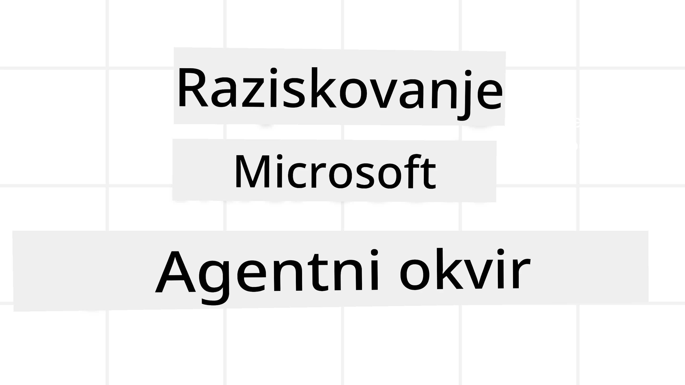
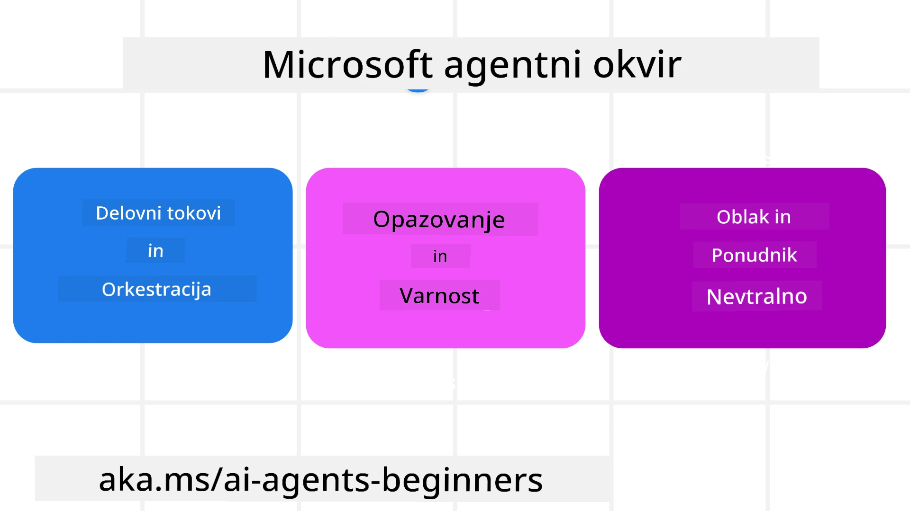
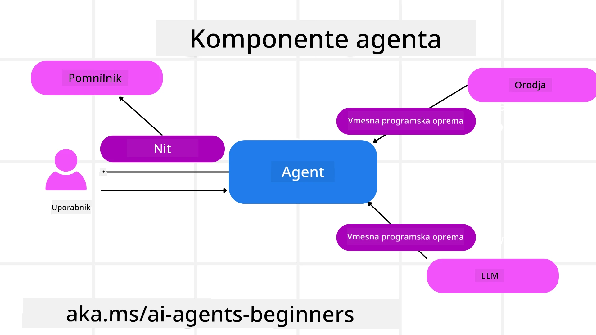

<!--
CO_OP_TRANSLATOR_METADATA:
{
  "original_hash": "19c4dab375acbc733855cc7f2f04edbc",
  "translation_date": "2025-10-02T06:50:58+00:00",
  "source_file": "14-microsoft-agent-framework/README.md",
  "language_code": "sl"
}
-->
# Raziskovanje Microsoft Agent Framework



### Uvod

Ta lekcija bo zajemala:

- Razumevanje Microsoft Agent Framework: Ključne značilnosti in vrednost  
- Raziskovanje ključnih konceptov Microsoft Agent Framework
- Primerjava MAF s Semantic Kernel in AutoGen: Vodnik za migracijo

## Cilji učenja

Po zaključku te lekcije boste znali:

- Zgraditi produkcijsko pripravljene AI agente z uporabo Microsoft Agent Framework
- Uporabiti ključne funkcije Microsoft Agent Framework za vaše agentne primere uporabe
- Migrirati in integrirati obstoječe agentne okvire in orodja  

## Primeri kode 

Primeri kode za [Microsoft Agent Framework (MAF)](https://aka.ms/ai-agents-beginners/agent-framewrok) so na voljo v tem repozitoriju pod datotekami `xx-python-agent-framework` in `xx-dotnet-agent-framework`.

## Razumevanje Microsoft Agent Framework



[Microsoft Agent Framework (MAF)](https://aka.ms/ai-agents-beginners/agent-framewrok) temelji na izkušnjah in spoznanjih iz Semantic Kernel in AutoGen. Ponuja prilagodljivost za obravnavo širokega spektra agentnih primerov uporabe, ki jih najdemo tako v produkcijskih kot raziskovalnih okoljih, vključno z:

- **Sekvenčno orkestracijo agentov** v scenarijih, kjer so potrebni korak za korakom delovni tokovi.
- **Sočasno orkestracijo** v scenarijih, kjer morajo agenti opraviti naloge hkrati.
- **Orkestracijo skupinskega klepeta** v scenarijih, kjer agenti sodelujejo pri eni nalogi.
- **Predajo nalog** v scenarijih, kjer agenti predajajo nalogo drug drugemu, ko so podnaloge zaključene.
- **Magnetno orkestracijo** v scenarijih, kjer upravljalni agent ustvarja in spreminja seznam nalog ter koordinira podagente za dokončanje naloge.

Za dostavo AI agentov v produkciji MAF vključuje tudi funkcije za:

- **Opazljivost** z uporabo OpenTelemetry, kjer je vsako dejanje AI agenta, vključno z uporabo orodij, koraki orkestracije, razmišljanjem in spremljanjem zmogljivosti, vidno prek nadzornih plošč Azure AI Foundry.
- **Varnost** z gostovanjem agentov na Azure AI Foundry, ki vključuje varnostne kontrole, kot so dostop na podlagi vlog, obravnava zasebnih podatkov in vgrajena varnost vsebine.
- **Vzdržljivost** saj lahko agentne niti in delovni tokovi začasno ustavijo, nadaljujejo in se obnovijo po napakah, kar omogoča dolgotrajne procese.
- **Nadzor** saj so podprti delovni tokovi s človeškim nadzorom, kjer so naloge označene kot potrebne za odobritev s strani človeka.

Microsoft Agent Framework je osredotočen tudi na interoperabilnost z:

- **Neodvisnostjo od oblaka** - Agenti lahko delujejo v kontejnerjih, lokalno in na različnih oblakih.
- **Neodvisnostjo od ponudnika** - Agenti se lahko ustvarijo prek vašega izbranega SDK, vključno z Azure OpenAI in OpenAI.
- **Integracijo odprtih standardov** - Agenti lahko uporabljajo protokole, kot sta Agent-to-Agent (A2A) in Model Context Protocol (MCP), za odkrivanje in uporabo drugih agentov in orodij.
- **Vtičniki in konektorji** - Povezave se lahko vzpostavijo s podatkovnimi in pomnilniškimi storitvami, kot so Microsoft Fabric, SharePoint, Pinecone in Qdrant.

Poglejmo, kako se te funkcije uporabljajo pri nekaterih ključnih konceptih Microsoft Agent Framework.

## Ključni koncepti Microsoft Agent Framework

### Agenti



**Ustvarjanje agentov**

Ustvarjanje agentov se izvede z definiranjem storitve sklepanja (LLM ponudnik), niza navodil, ki jih AI agent sledi, in dodeljenega `imena`:

```python
agent = AzureOpenAIChatClient(credential=AzureCliCredential()).create_agent( instructions="You are good at recommending trips to customers based on their preferences.", name="TripRecommender" )
```

Zgornji primer uporablja `Azure OpenAI`, vendar je mogoče agente ustvariti z različnimi storitvami, vključno z `Azure AI Foundry Agent Service`:

```python
AzureAIAgentClient(async_credential=credential).create_agent( name="HelperAgent", instructions="You are a helpful assistant." ) as agent
```

OpenAI `Responses`, `ChatCompletion` API-ji

```python
agent = OpenAIResponsesClient().create_agent( name="WeatherBot", instructions="You are a helpful weather assistant.", )
```

```python
agent = OpenAIChatClient().create_agent( name="HelpfulAssistant", instructions="You are a helpful assistant.", )
```

ali oddaljenimi agenti z uporabo protokola A2A:

```python
agent = A2AAgent( name=agent_card.name, description=agent_card.description, agent_card=agent_card, url="https://your-a2a-agent-host" )
```

**Zagon agentov**

Agenti se zaženejo z metodama `.run` ali `.run_stream` za odgovore brez pretakanja ali s pretakanjem.

```python
result = await agent.run("What are good places to visit in Amsterdam?")
print(result.text)
```

```python
async for update in agent.run_stream("What are the good places to visit in Amsterdam?"):
    if update.text:
        print(update.text, end="", flush=True)

```

Vsak zagon agenta lahko vključuje možnosti za prilagoditev parametrov, kot so `max_tokens`, ki jih agent uporablja, `tools`, ki jih agent lahko kliče, in celo `model`, ki ga agent uporablja.

To je uporabno v primerih, kjer so za dokončanje uporabnikove naloge potrebni specifični modeli ali orodja.

**Orodja**

Orodja je mogoče definirati tako pri definiranju agenta:

```python
def get_attractions( location: Annotated[str, Field(description="The location to get the top tourist attractions for")], ) -> str: """Get the top tourist attractions for a given location.""" return f"The top attractions for {location} are." 


# When creating a ChatAgent directly 

agent = ChatAgent( chat_client=OpenAIChatClient(), instructions="You are a helpful assistant", tools=[get_attractions]

```

kot tudi pri zagonu agenta:

```python

result1 = await agent.run( "What's the best place to visit in Seattle?", tools=[get_attractions] # Tool provided for this run only )
```

**Agentne niti**

Agentne niti se uporabljajo za obravnavo pogovorov z več obrati. Niti je mogoče ustvariti bodisi z:

- Uporabo `get_new_thread()`, ki omogoča, da se nit shrani skozi čas
- Samodejnim ustvarjanjem niti pri zagonu agenta, kjer nit obstaja le med trenutnim zagonom.

Za ustvarjanje niti koda izgleda takole:

```python
# Create a new thread. 
thread = agent.get_new_thread() # Run the agent with the thread. 
response = await agent.run("Hello, I am here to help you book travel. Where would you like to go?", thread=thread)

```

Nit lahko nato serializirate za shranjevanje za kasnejšo uporabo:

```python
# Create a new thread. 
thread = agent.get_new_thread() 

# Run the agent with the thread. 

response = await agent.run("Hello, how are you?", thread=thread) 

# Serialize the thread for storage. 

serialized_thread = await thread.serialize() 

# Deserialize the thread state after loading from storage. 

resumed_thread = await agent.deserialize_thread(serialized_thread)
```

**Agentno vmesno programsko opremo**

Agenti komunicirajo z orodji in LLM-ji za dokončanje uporabnikovih nalog. V določenih scenarijih želimo izvesti ali spremljati interakcije med temi koraki. Agentno vmesno programsko opremo nam to omogoča prek:

*Funkcijske vmesne programske opreme*

Ta vmesna programska oprema omogoča izvedbo dejanja med agentom in funkcijo/orodjem, ki ga bo klical. Primer uporabe bi bil, ko želite beležiti klic funkcije.

V spodnji kodi `next` določa, ali naj se pokliče naslednja vmesna programska oprema ali dejanska funkcija.

```python
async def logging_function_middleware(
    context: FunctionInvocationContext,
    next: Callable[[FunctionInvocationContext], Awaitable[None]],
) -> None:
    """Function middleware that logs function execution."""
    # Pre-processing: Log before function execution
    print(f"[Function] Calling {context.function.name}")

    # Continue to next middleware or function execution
    await next(context)

    # Post-processing: Log after function execution
    print(f"[Function] {context.function.name} completed")
```

*Vmesna programska oprema za klepet*

Ta vmesna programska oprema omogoča izvedbo ali beleženje dejanja med agentom in zahtevami med LLM.

Vsebuje pomembne informacije, kot so `messages`, ki se pošiljajo AI storitvi.

```python
async def logging_chat_middleware(
    context: ChatContext,
    next: Callable[[ChatContext], Awaitable[None]],
) -> None:
    """Chat middleware that logs AI interactions."""
    # Pre-processing: Log before AI call
    print(f"[Chat] Sending {len(context.messages)} messages to AI")

    # Continue to next middleware or AI service
    await next(context)

    # Post-processing: Log after AI response
    print("[Chat] AI response received")

```

**Agentni pomnilnik**

Kot je obravnavano v lekciji `Agentic Memory`, je pomnilnik pomemben element za omogočanje agentu delovanja v različnih kontekstih. MAF ponuja več različnih vrst pomnilnikov:

*Pomnilnik v aplikaciji*

To je pomnilnik, shranjen v nitih med delovanjem aplikacije.

```python
# Create a new thread. 
thread = agent.get_new_thread() # Run the agent with the thread. 
response = await agent.run("Hello, I am here to help you book travel. Where would you like to go?", thread=thread)
```

*Trajna sporočila*

Ta pomnilnik se uporablja pri shranjevanju zgodovine pogovorov med različnimi sejami. Definiran je z uporabo `chat_message_store_factory`:

```python
from agent_framework import ChatMessageStore

# Create a custom message store
def create_message_store():
    return ChatMessageStore()

agent = ChatAgent(
    chat_client=OpenAIChatClient(),
    instructions="You are a Travel assistant.",
    chat_message_store_factory=create_message_store
)

```

*Dinamični pomnilnik*

Ta pomnilnik se doda kontekstu pred zagonom agentov. Ti pomnilniki se lahko shranijo v zunanje storitve, kot je mem0:

```python
from agent_framework.mem0 import Mem0Provider

# Using Mem0 for advanced memory capabilities
memory_provider = Mem0Provider(
    api_key="your-mem0-api-key",
    user_id="user_123",
    application_id="my_app"
)

agent = ChatAgent(
    chat_client=OpenAIChatClient(),
    instructions="You are a helpful assistant with memory.",
    context_providers=memory_provider
)

```

**Opazljivost agentov**

Opazljivost je pomembna za gradnjo zanesljivih in vzdržljivih agentnih sistemov. MAF se integrira z OpenTelemetry za zagotavljanje sledenja in merilnikov za boljšo opazljivost.

```python
from agent_framework.observability import get_tracer, get_meter

tracer = get_tracer()
meter = get_meter()
with tracer.start_as_current_span("my_custom_span"):
    # do something
    pass
counter = meter.create_counter("my_custom_counter")
counter.add(1, {"key": "value"})
```

### Delovni tokovi

MAF ponuja delovne tokove, ki so vnaprej določeni koraki za dokončanje naloge in vključujejo AI agente kot komponente teh korakov.

Delovni tokovi so sestavljeni iz različnih komponent, ki omogočajo boljši nadzorni tok. Delovni tokovi omogočajo tudi **orkestracijo več agentov** in **kontrolne točke** za shranjevanje stanj delovnega toka.

Osnovne komponente delovnega toka so:

**Izvajalci**

Izvajalci prejmejo vhodna sporočila, opravijo dodeljene naloge in nato ustvarijo izhodno sporočilo. To premika delovni tok proti dokončanju večje naloge. Izvajalci so lahko AI agenti ali prilogena logika.

**Povezave**

Povezave se uporabljajo za definiranje toka sporočil v delovnem toku. Te so lahko:

*Neposredne povezave* - Enostavne povezave ena na ena med izvajalci:

```python
from agent_framework import WorkflowBuilder

builder = WorkflowBuilder()
builder.add_edge(source_executor, target_executor)
builder.set_start_executor(source_executor)
workflow = builder.build()
```

*Pogojne povezave* - Aktivirane, ko je izpolnjen določen pogoj. Na primer, ko hotelske sobe niso na voljo, lahko izvajalec predlaga druge možnosti.

*Povezave z izbiro primera* - Usmerjajo sporočila k različnim izvajalcem glede na določene pogoje. Na primer, če ima potovalni kupec prednostni dostop, se njegove naloge obravnavajo prek drugega delovnega toka.

*Razdeljene povezave* - Pošljejo eno sporočilo več ciljem.

*Združene povezave* - Zberejo več sporočil od različnih izvajalcev in jih pošljejo enemu cilju.

**Dogodki**

Za boljšo opazljivost delovnih tokov MAF ponuja vgrajene dogodke za izvajanje, vključno z:

- `WorkflowStartedEvent`  - Začetek izvajanja delovnega toka
- `WorkflowOutputEvent` - Delovni tok ustvari izhod
- `WorkflowErrorEvent` - Delovni tok naleti na napako
- `ExecutorInvokeEvent`  - Izvajalec začne obdelavo
- `ExecutorCompleteEvent`  - Izvajalec zaključi obdelavo
- `RequestInfoEvent` - Izdana je zahteva

## Migracija iz drugih okvirov (Semantic Kernel in AutoGen)

### Razlike med MAF in Semantic Kernel

**Poenostavljeno ustvarjanje agentov**

Semantic Kernel zahteva ustvarjanje primerka jedra za vsakega agenta. MAF uporablja poenostavljen pristop z uporabo razširitev za glavne ponudnike.

```python
agent = AzureOpenAIChatClient(credential=AzureCliCredential()).create_agent( instructions="You are good at reccomending trips to customers based on their preferences.", name="TripRecommender" )
```

**Ustvarjanje niti agentov**

Semantic Kernel zahteva ročno ustvarjanje niti. V MAF je agentu neposredno dodeljena nit.

```python
thread = agent.get_new_thread() # Run the agent with the thread. 
```

**Registracija orodij**

V Semantic Kernel se orodja registrirajo v jedru, ki se nato posreduje agentu. V MAF se orodja registrirajo neposredno med procesom ustvarjanja agenta.

```python
agent = ChatAgent( chat_client=OpenAIChatClient(), instructions="You are a helpful assistant", tools=[get_attractions]
```

### Razlike med MAF in AutoGen

**Ekipe proti delovnim tokovom**

`Ekipe` so struktura dogodkov za dejavnosti, ki jih vodijo dogodki z agenti v AutoGen. MAF uporablja `Delovne tokove`, ki usmerjajo podatke k izvajalcem prek arhitekture na osnovi grafov.

**Ustvarjanje orodij**

AutoGen uporablja `FunctionTool` za ovijanje funkcij, ki jih agenti kličejo. MAF uporablja @ai_function, ki deluje podobno, vendar samodejno sklepa sheme za vsako funkcijo.

**Obnašanje agentov**

Agenti so v AutoGen privzeto agenti z enim obratom, razen če je `max_tool_iterations` nastavljen na višjo vrednost. V MAF je `ChatAgent` privzeto večobratni, kar pomeni, da bo še naprej klical orodja, dokler naloga uporabnika ni dokončana.

## Primeri kode 

Primeri kode za Microsoft Agent Framework so na voljo v tem repozitoriju pod datotekami `xx-python-agent-framework` in `xx-dotnet-agent-framework`.

## Imate več vprašanj o Microsoft Agent Framework?

Pridružite se [Azure AI Foundry Discord](https://aka.ms/ai-agents/discord), kjer lahko spoznate druge učence, se udeležite uradnih ur in dobite odgovore na vprašanja o AI agentih.

---

**Omejitev odgovornosti**:  
Ta dokument je bil preveden z uporabo storitve AI za prevajanje [Co-op Translator](https://github.com/Azure/co-op-translator). Čeprav si prizadevamo za natančnost, vas prosimo, da upoštevate, da lahko avtomatizirani prevodi vsebujejo napake ali netočnosti. Izvirni dokument v njegovem izvirnem jeziku je treba obravnavati kot avtoritativni vir. Za ključne informacije priporočamo profesionalni človeški prevod. Ne prevzemamo odgovornosti za morebitna nesporazumevanja ali napačne razlage, ki izhajajo iz uporabe tega prevoda.