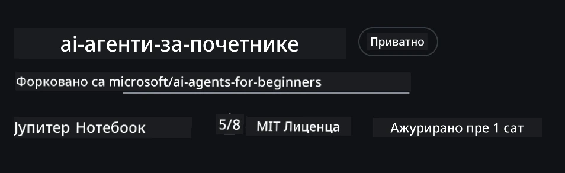
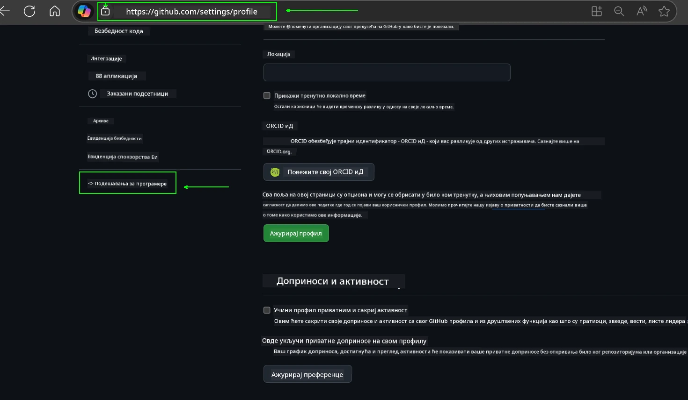
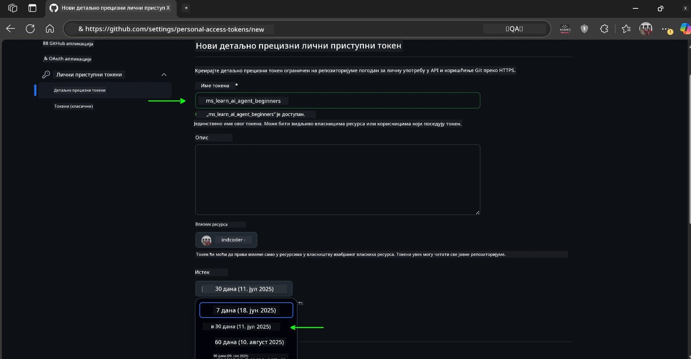
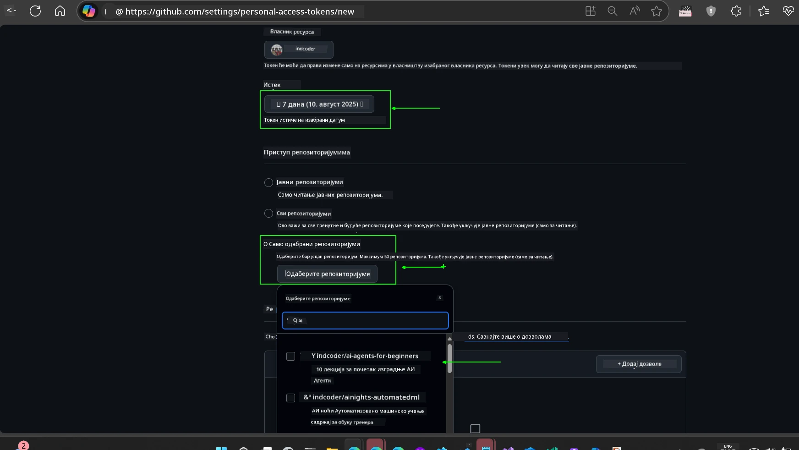
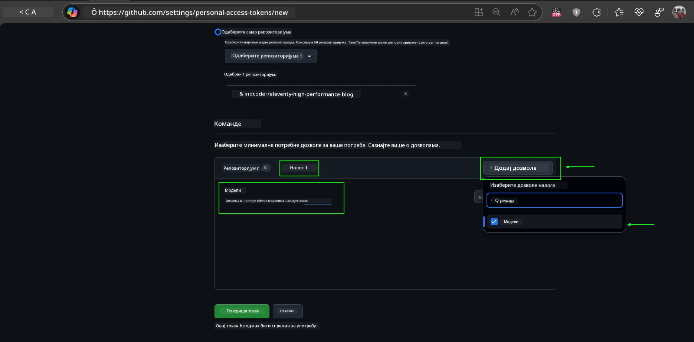
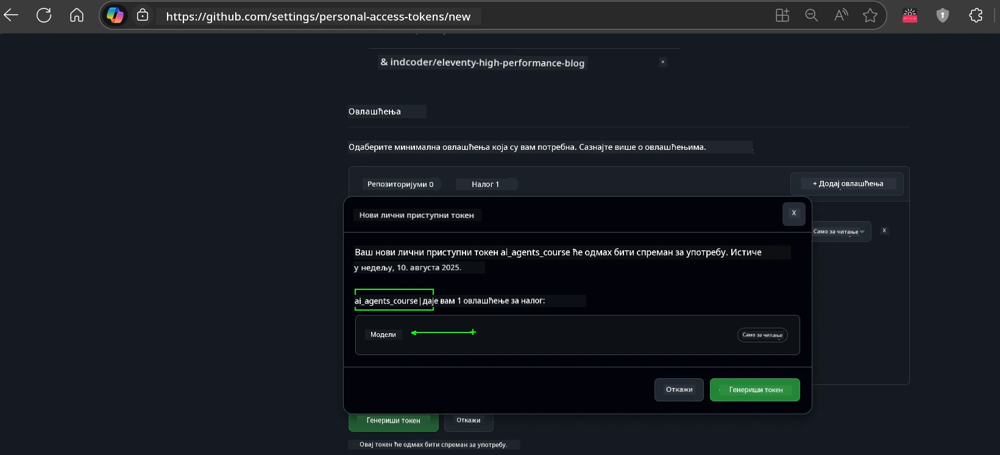
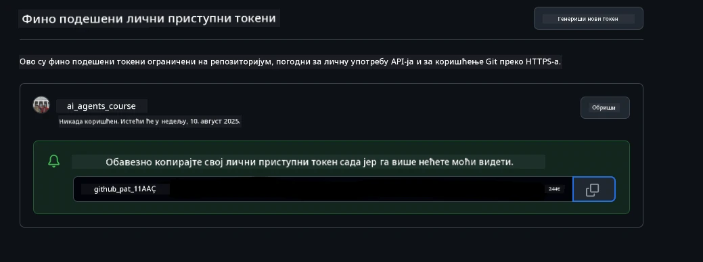
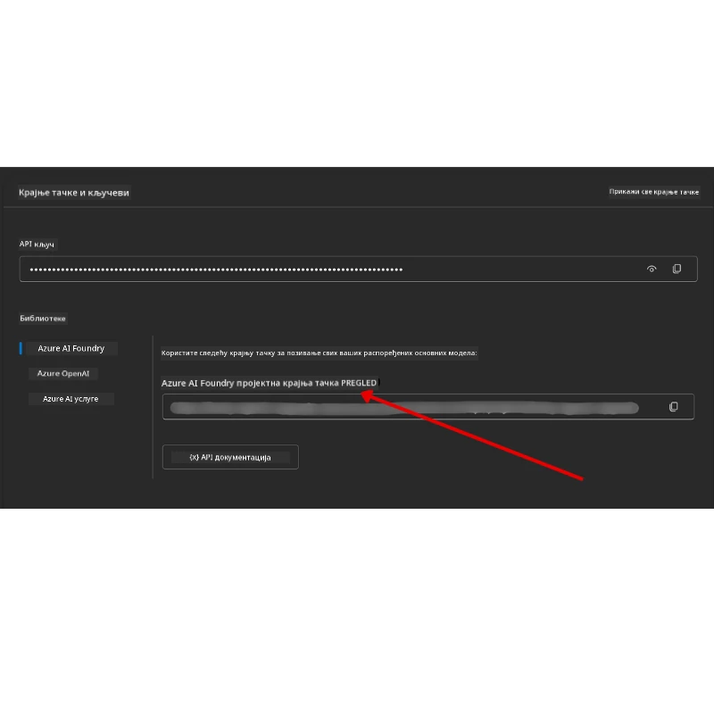

<!--
CO_OP_TRANSLATOR_METADATA:
{
  "original_hash": "63b1a8f6e840df15934935b728e569f0",
  "translation_date": "2025-12-03T15:02:01+00:00",
  "source_file": "00-course-setup/README.md",
  "language_code": "sr"
}
-->
# Подешавање курса

## Увод

Ова лекција ће обухватити како да покренете узорке кода из овог курса.

## Придружите се другим учесницима и добијте помоћ

Пре него што почнете са клонирањем вашег репозиторијума, придружите се [AI Agents For Beginners Discord каналу](https://aka.ms/ai-agents/discord) да добијете помоћ око подешавања, поставите питања о курсу или се повежете са другим учесницима.

## Клонирајте или форкујте овај репозиторијум

Да бисте започели, клонирајте или форкујте GitHub репозиторијум. Ово ће направити вашу верзију материјала курса како бисте могли да покрећете, тестирате и прилагођавате код!

Ово можете урадити кликом на линк за <a href="https://github.com/microsoft/ai-agents-for-beginners/fork" target="_blank">форковање репозиторијума</a>.

Сада би требало да имате своју форковану верзију овог курса на следећем линку:



### Плитко клонирање (препоручено за радионице / Codespaces)

  >Цео репозиторијум може бити велики (~3 GB) када преузмете целу историју и све датотеке. Ако само присуствујете радионици или вам треба само неколико фасцикли лекција, плитко клонирање (или делимично клонирање) избегава већину тог преузимања скраћивањем историје и/или прескакањем блобова.

#### Брзо плитко клонирање — минимална историја, све датотеке

Замените `<your-username>` у наредним командама са URL-ом вашег форка (или URL-ом оригиналног репозиторијума ако то преферирате).

Да клонирате само најновију историју комита (мало преузимање):

```bash|powershell
git clone --depth 1 https://github.com/<your-username>/ai-agents-for-beginners.git
```

Да клонирате одређену грану:

```bash|powershell
git clone --depth 1 --branch <branch-name> https://github.com/<your-username>/ai-agents-for-beginners.git
```

#### Делимично (спарсно) клонирање — минимални блобови + само изабране фасцикле

Ово користи делимично клонирање и спарсно-чекаут (захтева Git 2.25+ и препоручује се модерни Git са подршком за делимично клонирање):

```bash|powershell
git clone --depth 1 --filter=blob:none --sparse https://github.com/<your-username>/ai-agents-for-beginners.git
```

Уђите у фасциклу репозиторијума:

```bash|powershell
cd ai-agents-for-beginners
```

Затим наведите које фасцикле желите (пример испод показује две фасцикле):

```bash|powershell
git sparse-checkout set 00-course-setup 01-intro-to-ai-agents
```

Након клонирања и провере датотека, ако вам требају само датотеке и желите да ослободите простор (без историје гита), обришите метаподатке репозиторијума (💀неповратно — изгубићете све функције Git-а: нема комита, повлачења, гурања или приступа историји).

```bash
# zsh/bash
rm -rf .git
```

```powershell
# ПоверШел
Remove-Item -Recurse -Force .git
```

#### Коришћење GitHub Codespaces (препоручено за избегавање локалних великих преузимања)

- Направите нови Codespace за овај репозиторијум преко [GitHub UI](https://github.com/codespaces).  

- У терминалу новоотвореног Codespace-а, покрените једну од команди за плитко/делимично клонирање изнад да бисте довели само фасцикле лекција које су вам потребне у Codespace workspace.
- Опционо: након клонирања у Codespaces, уклоните .git да бисте ослободили додатни простор (погледајте команде за уклањање изнад).
- Напомена: Ако преферирате да директно отворите репозиторијум у Codespaces (без додатног клонирања), имајте на уму да ће Codespaces конструисати devcontainer окружење и можда ће ипак обезбедити више него што вам је потребно. Клонирање плитке копије у свеж Codespace даје вам више контроле над употребом диска.

#### Савети

- Увек замените URL за клонирање са вашим форком ако желите да уређујете/комитујете.
- Ако касније будете требали више историје или датотека, можете их преузети или прилагодити спарсно-чекаут да укључите додатне фасцикле.

## Покретање кода

Овај курс нуди серију Jupyter Notebook-а које можете покренути да бисте стекли практично искуство у изградњи AI агената.

Узорци кода користе:

**Захтева GitHub налог - бесплатно**:

1) Semantic Kernel Agent Framework + GitHub Models Marketplace. Ознака (semantic-kernel.ipynb)
2) AutoGen Framework + GitHub Models Marketplace. Ознака (autogen.ipynb)

**Захтева Azure претплату**:

3) Azure AI Foundry + Azure AI Agent Service. Ознака (azureaiagent.ipynb)

Охрабрујемо вас да испробате све три врсте примера да видите који вам најбоље одговара.

Коју год опцију да изаберете, она ће одредити које кораке подешавања треба да следите у наставку:

## Захтеви

- Python 3.12+
  - **НАПОМЕНА**: Ако немате Python3.12 инсталиран, уверите се да сте га инсталирали. Затим направите ваш venv користећи python3.12 да бисте осигурали да су исправне верзије инсталиране из датотеке requirements.txt.
  
    >Пример

    Направите Python venv фасциклу:

    ```bash|powershell
    python -m venv venv
    ```

    Затим активирајте venv окружење за:

    ```bash
    # zsh/bash
    source venv/bin/activate
    ```
  
    ```dos
    # Command Prompt for Windows
    venv\Scripts\activate
    ```

- .NET 10+: За узорке кода који користе .NET, уверите се да сте инсталирали [.NET 10 SDK](https://dotnet.microsoft.com/download/dotnet/10.0) или новији. Затим проверите вашу инсталирану верзију .NET SDK-а:

    ```bash|powershell
    dotnet --list-sdks
    ```

- GitHub налог - За приступ GitHub Models Marketplace
- Azure претплата - За приступ Azure AI Foundry
- Azure AI Foundry налог - За приступ Azure AI Agent Service

У корену овог репозиторијума укључили смо датотеку `requirements.txt` која садржи све потребне Python пакете за покретање узорака кода.

Можете их инсталирати покретањем следеће команде у вашем терминалу у корену репозиторијума:

```bash|powershell
pip install -r requirements.txt
```

Препоручујемо креирање Python виртуелног окружења да бисте избегли било какве конфликте и проблеме.

## Подешавање VSCode-а

Уверите се да користите исправну верзију Python-а у VSCode-у.


## Подешавање за узорке који користе GitHub моделе 

### Корак 1: Преузмите ваш GitHub Personal Access Token (PAT)

Овај курс користи GitHub Models Marketplace, који пружа бесплатан приступ моделима великог језика (LLMs) које ћете користити за изградњу AI агената.

Да бисте користили GitHub моделе, потребно је да направите [GitHub Personal Access Token](https://docs.github.com/en/authentication/keeping-your-account-and-data-secure/managing-your-personal-access-tokens).

Ово можете урадити тако што ћете отићи на <a href="https://github.com/settings/personal-access-tokens" target="_blank">подешавања личних приступних токена</a> у вашем GitHub налогу.

Молимо вас да следите [Принцип најмање привилегије](https://docs.github.com/en/get-started/learning-to-code/storing-your-secrets-safely) приликом креирања вашег токена. То значи да треба да дате токену само дозволе које су му потребне за покретање узорака кода у овом курсу.

1. Изаберите опцију `Fine-grained tokens` на левој страни екрана тако што ћете отићи на **Developer settings**.

   

   Затим изаберите `Generate new token`.

   

2. Унесите описно име за ваш токен које одражава његову сврху, чинећи га лако препознатљивим касније.

    🔐 Препорука за трајање токена

    Препоручено трајање: 30 дана  
    За сигурнији приступ, можете се одлучити за краћи период—као што је 7 дана 🛡️  
    То је одличан начин да поставите лични циљ и завршите курс док је ваш ентузијазам за учење висок 🚀.

    

3. Ограничите опсег токена на ваш форк овог репозиторијума.

    

4. Ограничите дозволе токена: Под **Permissions**, кликните на **Account** таб, и кликните на дугме "+ Add permissions". Појавиће се падајући мени. Молимо вас да потражите **Models** и означите поље за то.

    

5. Потврдите потребне дозволе пре него што генеришете токен. 

6. Пре него што генеришете токен, уверите се да сте спремни да га сачувате на сигурном месту као што је менаџер лозинки, јер неће бити поново приказан након креирања. 

Копирајте ваш нови токен који сте управо креирали. Сада ћете га додати у вашу `.env` датотеку укључену у овај курс.

### Корак 2: Направите вашу `.env` датотеку

Да бисте направили вашу `.env` датотеку, покрените следећу команду у вашем терминалу.

```bash
# zsh/bash
cp .env.example .env
```

```powershell
# ПоверШел
Copy-Item .env.example .env
```

Ово ће копирати пример датотеке и направити `.env` у вашем директоријуму где попуњавате вредности за променљиве окружења.

Са вашим копираним токеном, отворите `.env` датотеку у вашем омиљеном текст едитору и налепите ваш токен у поље `GITHUB_TOKEN`.


Сада би требало да можете да покренете узорке кода из овог курса.

## Подешавање за узорке који користе Azure AI Foundry и Azure AI Agent Service

### Корак 1: Преузмите ваш Azure Project Endpoint

Пратите кораке за креирање хаба и пројекта у Azure AI Foundry који се налазе овде: [Hub resources overview](https://learn.microsoft.com/azure/ai-foundry/concepts/ai-resources)

Када креирате ваш пројекат, потребно је да преузмете стринг за повезивање вашег пројекта.

Ово можете урадити тако што ћете отићи на **Overview** страницу вашег пројекта у Azure AI Foundry порталу.



### Корак 2: Направите вашу `.env` датотеку

Да бисте направили вашу `.env` датотеку, покрените следећу команду у вашем терминалу.

```bash
# zsh/bash
cp .env.example .env
```

```powershell
# ПоверШел
Copy-Item .env.example .env
```

Ово ће копирати пример датотеке и направити `.env` у вашем директоријуму где попуњавате вредности за променљиве окружења.

Са вашим копираним токеном, отворите `.env` датотеку у вашем омиљеном текст едитору и налепите ваш токен у поље `PROJECT_ENDPOINT`.

### Корак 3: Пријавите се на Azure

Као најбољу праксу за безбедност, користићемо [аутентификацију без кључа](https://learn.microsoft.com/azure/developer/ai/keyless-connections?tabs=csharp%2Cazure-cli?WT.mc_id=academic-105485-koreyst) за аутентификацију на Azure OpenAI са Microsoft Entra ID. 

Затим, отворите терминал и покрените `az login --use-device-code` да се пријавите на ваш Azure налог.

Када се пријавите, изаберите вашу претплату у терминалу.

## Додатне променљиве окружења - Azure Search и Azure OpenAI 

За лекцију Agentic RAG - Лекција 5 - постоје узорци који користе Azure Search и Azure OpenAI.

Ако желите да покренете ове узорке, потребно је да додате следеће променљиве окружења у вашу `.env` датотеку:

### Overview Page (Project)

- `AZURE_SUBSCRIPTION_ID` - Проверите **Project details** на **Overview** страници вашег пројекта.

- `AZURE_AI_PROJECT_NAME` - Погледајте врх **Overview** странице вашег пројекта.

- `AZURE_OPENAI_SERVICE` - Пронађите ово у **Included capabilities** табу за **Azure OpenAI Service** на **Overview** страници.

### Management Center

- `AZURE_OPENAI_RESOURCE_GROUP` - Идите на **Project properties** на **Overview** страници **Management Center**.

- `GLOBAL_LLM_SERVICE` - Под **Connected resources**, пронађите име везе **Azure AI Services**. Ако није наведено, проверите **Azure portal** под вашом ресурсном групом за име ресурса AI Services.

### Models + Endpoints Page

- `AZURE_OPENAI_EMBEDDING_DEPLOYMENT_NAME` - Изаберите ваш модел за уграђивање (нпр. `text-embedding-ada-002`) и забележите **Deployment name** из детаља модела.

- `AZURE_OPENAI_CHAT_DEPLOYMENT_NAME` - Изаберите ваш модел за ћаскање (нпр. `gpt-4o-mini`) и забележите **Deployment name** из детаља модела.

### Azure Portal

- `AZURE_OPENAI_ENDPOINT` - Потражите **Azure AI services**, кликните на њега, затим идите на **Resource Management**, **Keys and Endpoint**, скролујте до "Azure OpenAI endpoints", и копирајте онај који каже "Language APIs".

- `AZURE_OPENAI_API_KEY` - Са истог екрана, копирајте KEY 1 или KEY 2.

- `AZURE_SEARCH_SERVICE_ENDPOINT` - Пронађите ваш **Azure AI Search** ресурс, кликните на њега, и погледајте **Overview**.

- `AZURE_SEARCH_API_KEY` - Затим идите на **Settings** и затим **Keys** да копирате примарни или секундарни администраторски кључ.

### External Webpage

- `AZURE_OPENAI_API_VERSION` - Посетите страницу [API version lifecycle](https://learn.microsoft.com/azure/ai-services/openai/api-version-deprecation#latest-ga-api-release) под **Latest GA API release**.

### Подешавање аутентификације без кључа

Уместо да хардкодујете ваше акредитиве, користићемо везу без кључа са Azure OpenAI. Да бисмо то урадили, увешћемо `DefaultAzureCredential` и касније позвати функцију `DefaultAzureCredential` да добијемо акредитиве.

```python
# Пајтон
from azure.identity import DefaultAzureCredential, InteractiveBrowserCredential
```

## Заглавили сте негде?
Ако имате било каквих проблема са покретањем ове поставке, придружите се нашем <a href="https://discord.gg/kzRShWzttr" target="_blank">Azure AI Community Discord</a> или <a href="https://github.com/microsoft/ai-agents-for-beginners/issues?WT.mc_id=academic-105485-koreyst" target="_blank">отворите проблем</a>.

## Следећи час

Сада сте спремни да покренете код за овај курс. Срећно у учењу више о свету AI агената!

[Увод у AI агенте и њихове случајеве употребе](../01-intro-to-ai-agents/README.md)

---

<!-- CO-OP TRANSLATOR DISCLAIMER START -->
**Одрицање од одговорности**:  
Овај документ је преведен коришћењем услуге за превођење вештачке интелигенције [Co-op Translator](https://github.com/Azure/co-op-translator). Иако се трудимо да обезбедимо тачност, молимо вас да имате у виду да аутоматски преводи могу садржати грешке или нетачности. Оригинални документ на изворном језику треба сматрати ауторитативним извором. За критичне информације препоручује се професионални превод од стране људи. Не сносимо одговорност за било каква погрешна тумачења или неспоразуме који могу произаћи из коришћења овог превода.
<!-- CO-OP TRANSLATOR DISCLAIMER END -->