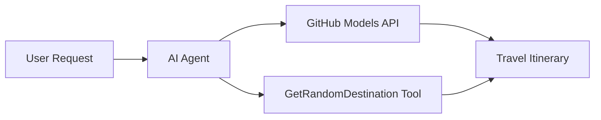

<!--
CO_OP_TRANSLATOR_METADATA:
{
  "original_hash": "5f351412e934f0833c8c821a0a60efaf",
  "translation_date": "2025-11-13T14:12:20+00:00",
  "source_file": "01-intro-to-ai-agents/code_samples/01-dotnet-agent-framework.md",
  "language_code": "sr"
}
-->
# 🌍 AI туристички агент са Microsoft Agent Framework (.NET)

## 📋 Преглед сценарија

Овај пример показује како да направите интелигентног агента за планирање путовања користећи Microsoft Agent Framework за .NET. Агенат може аутоматски генерисати персонализоване планове једнодневних излета за насумичне дестинације широм света.

### Кључне могућности:

- 🎲 **Насумичан избор дестинације**: Користи прилагођени алат за одабир места за одмор
- 🗺️ **Интелигентно планирање путовања**: Креира детаљне планове путовања по данима
- 🔄 **Стриминг у реалном времену**: Подржава тренутне и стриминг одговоре
- 🛠️ **Интеграција прилагођених алата**: Показује како проширити могућности агента

## 🔧 Техничка архитектура

### Основне технологије

- **Microsoft Agent Framework**: Најновија .NET имплементација за развој AI агената
- **Интеграција GitHub модела**: Користи GitHub-ову услугу за инференцију AI модела
- **Компатибилност са OpenAI API**: Ослања се на OpenAI клијентске библиотеке са прилагођеним крајњим тачкама
- **Сигурна конфигурација**: Управљање API кључевима засновано на окружењу

### Кључне компоненте

1. **AIAgent**: Главни оркестратор агента који управља током разговора
2. **Прилагођени алати**: Функција `GetRandomDestination()` доступна агенту
3. **Chat Client**: Интерфејс за разговор подржан GitHub моделима
4. **Подршка за стриминг**: Способност генерисања одговора у реалном времену

### Шема интеграције



## 🚀 Почетак рада

### Предуслови

- [.NET 10 SDK](https://dotnet.microsoft.com/download/dotnet/10.0) или новији
- [GitHub Models API приступни токен](https://docs.github.com/github-models/github-models-at-scale/using-your-own-api-keys-in-github-models)

### Потребне променљиве окружења

```bash
# zsh/bash
export GH_TOKEN=<your_github_token>
export GH_ENDPOINT=https://models.github.ai/inference
export GH_MODEL_ID=openai/gpt-5-mini
```

```powershell
# PowerShell
$env:GH_TOKEN = "<your_github_token>"
$env:GH_ENDPOINT = "https://models.github.ai/inference"
$env:GH_MODEL_ID = "openai/gpt-5-mini"
```

### Пример кода

Да бисте покренули пример кода,

```bash
# zsh/bash
chmod +x ./01-dotnet-agent-framework.cs
./01-dotnet-agent-framework.cs
```

Или користећи dotnet CLI:

```bash
dotnet run ./01-dotnet-agent-framework.cs
```

Погледајте [`01-dotnet-agent-framework.cs`](../../../../01-intro-to-ai-agents/code_samples/01-dotnet-agent-framework.cs) за комплетан код.

```csharp
#!/usr/bin/dotnet run

#:package Microsoft.Extensions.AI@9.*
#:package Microsoft.Agents.AI.OpenAI@1.*-*

using System.ClientModel;
using System.ComponentModel;

using Microsoft.Agents.AI;
using Microsoft.Extensions.AI;

using OpenAI;

// Tool Function: Random Destination Generator
// This static method will be available to the agent as a callable tool
// The [Description] attribute helps the AI understand when to use this function
// This demonstrates how to create custom tools for AI agents
[Description("Provides a random vacation destination.")]
static string GetRandomDestination()
{
    // List of popular vacation destinations around the world
    // The agent will randomly select from these options
    var destinations = new List<string>
    {
        "Paris, France",
        "Tokyo, Japan",
        "New York City, USA",
        "Sydney, Australia",
        "Rome, Italy",
        "Barcelona, Spain",
        "Cape Town, South Africa",
        "Rio de Janeiro, Brazil",
        "Bangkok, Thailand",
        "Vancouver, Canada"
    };

    // Generate random index and return selected destination
    // Uses System.Random for simple random selection
    var random = new Random();
    int index = random.Next(destinations.Count);
    return destinations[index];
}

// Extract configuration from environment variables
// Retrieve the GitHub Models API endpoint, defaults to https://models.github.ai/inference if not specified
// Retrieve the model ID, defaults to openai/gpt-5-mini if not specified
// Retrieve the GitHub token for authentication, throws exception if not specified
var github_endpoint = Environment.GetEnvironmentVariable("GH_ENDPOINT") ?? "https://models.github.ai/inference";
var github_model_id = Environment.GetEnvironmentVariable("GH_MODEL_ID") ?? "openai/gpt-5-mini";
var github_token = Environment.GetEnvironmentVariable("GH_TOKEN") ?? throw new InvalidOperationException("GH_TOKEN is not set.");

// Configure OpenAI Client Options
// Create configuration options to point to GitHub Models endpoint
// This redirects OpenAI client calls to GitHub's model inference service
var openAIOptions = new OpenAIClientOptions()
{
    Endpoint = new Uri(github_endpoint)
};

// Initialize OpenAI Client with GitHub Models Configuration
// Create OpenAI client using GitHub token for authentication
// Configure it to use GitHub Models endpoint instead of OpenAI directly
var openAIClient = new OpenAIClient(new ApiKeyCredential(github_token), openAIOptions);

// Create AI Agent with Travel Planning Capabilities
// Initialize OpenAI client, get chat client for specified model, and create AI agent
// Configure agent with travel planning instructions and random destination tool
// The agent can now plan trips using the GetRandomDestination function
AIAgent agent = openAIClient
    .GetChatClient(github_model_id)
    .CreateAIAgent(
        instructions: "You are a helpful AI Agent that can help plan vacations for customers at random destinations",
        tools: [AIFunctionFactory.Create(GetRandomDestination)]
    );

// Execute Agent: Plan a Day Trip
// Run the agent with streaming enabled for real-time response display
// Shows the agent's thinking and response as it generates the content
// Provides better user experience with immediate feedback
await foreach (var update in agent.RunStreamingAsync("Plan me a day trip"))
{
    await Task.Delay(10);
    Console.Write(update);
}
```

## 🎓 Кључни закључци

1. **Архитектура агента**: Microsoft Agent Framework пружа чист, типски сигуран приступ за изградњу AI агената у .NET
2. **Интеграција алата**: Функције означене са `[Description]` атрибутима постају доступни алати за агента
3. **Управљање конфигурацијом**: Променљиве окружења и сигурно руковање акредитивима следе најбоље праксе .NET-а
4. **Компатибилност са OpenAI**: Интеграција GitHub модела функционише беспрекорно кроз OpenAI-компатибилне API-је

## 🔗 Додатни ресурси

- [Microsoft Agent Framework документација](https://learn.microsoft.com/agent-framework)
- [GitHub Models Marketplace](https://github.com/marketplace?type=models)
- [Microsoft.Extensions.AI](https://learn.microsoft.com/dotnet/ai/microsoft-extensions-ai)
- [.NET апликације у једној датотеци](https://devblogs.microsoft.com/dotnet/announcing-dotnet-run-app)

---

<!-- CO-OP TRANSLATOR DISCLAIMER START -->
**Одрицање од одговорности**:  
Овај документ је преведен коришћењем услуге за превођење помоћу вештачке интелигенције [Co-op Translator](https://github.com/Azure/co-op-translator). Иако се трудимо да обезбедимо тачност, молимо вас да имате у виду да аутоматски преводи могу садржати грешке или нетачности. Оригинални документ на његовом изворном језику треба сматрати ауторитативним извором. За критичне информације препоручује се професионални превод од стране људи. Не преузимамо одговорност за било каква погрешна тумачења или неспоразуме који могу настати услед коришћења овог превода.
<!-- CO-OP TRANSLATOR DISCLAIMER END -->