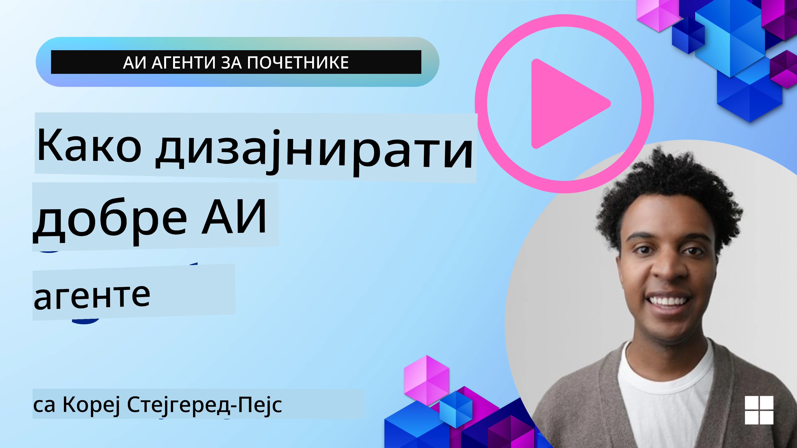
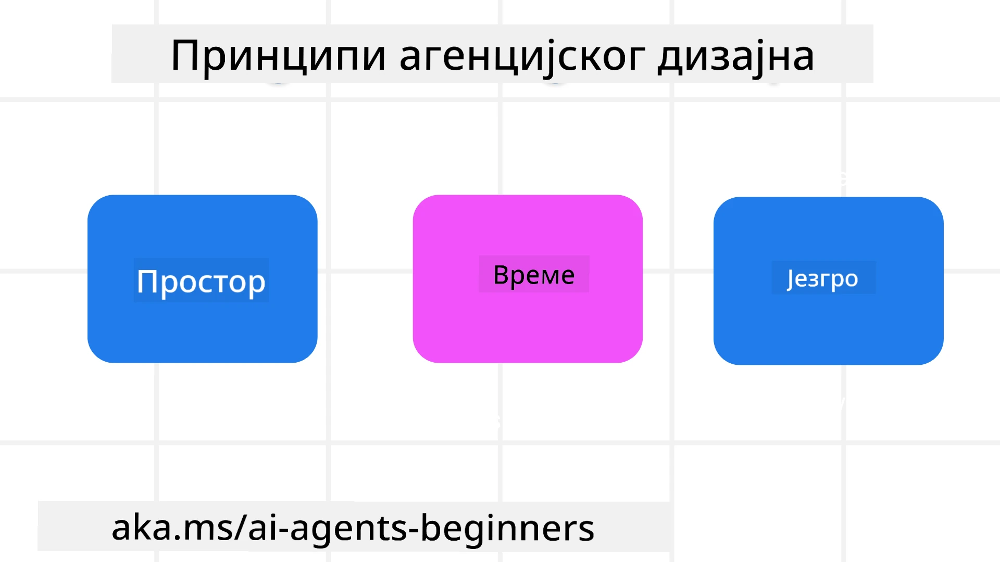

<!--
CO_OP_TRANSLATOR_METADATA:
{
  "original_hash": "d71524fe83a23829ae7a23b4031aaac8",
  "translation_date": "2025-11-13T14:19:13+00:00",
  "source_file": "03-agentic-design-patterns/README.md",
  "language_code": "sr"
}
-->

> _(Кликните на слику изнад да бисте погледали видео овог часа)_
# Принципи дизајна агентских AI система

## Увод

Постоји много начина да се размишља о изградњи агентских AI система. С обзиром на то да је двосмисленост карактеристика, а не грешка у дизајну генеративне AI, понекад је инжењерима тешко да схвате одакле уопште почети. Направили смо скуп принципа дизајна усмерених на корисника како бисмо омогућили програмерима да изграде агентске системе усмерене на клијенте који решавају њихове пословне потребе. Ови принципи дизајна нису прописана архитектура, већ полазна тачка за тимове који дефинишу и развијају искуства са агентима.

Уопштено, агенти би требало да:

- Прошире и унапреде људске капацитете (размишљање, решавање проблема, аутоматизација итд.)
- Попуне празнине у знању (упознај ме са новим областима знања, превод итд.)
- Олакшају и подрже сарадњу на начин који нама као појединцима одговара
- Учине нас бољим верзијама самих себе (нпр. животни тренер/организатор задатака, помажући нам да научимо емоционалну регулацију и вештине свесности, изградњу отпорности итд.)

## Овај час ће обухватити

- Шта су принципи дизајна агентских система
- Које смернице треба пратити приликом примене ових принципа дизајна
- Примери коришћења принципа дизајна

## Циљеви учења

Након завршетка овог часа, моћи ћете да:

1. Објасните шта су принципи дизајна агентских система
2. Објасните смернице за коришћење принципа дизајна агентских система
3. Разумете како изградити агента користећи принципе дизајна агентских система

## Принципи дизајна агентских система

### Агент (Простор)

Ово је окружење у коме агент функционише. Ови принципи информишу како дизајнирамо агенте за ангажовање у физичким и дигиталним световима.

- **Повезивање, а не раздвајање** – помозите људима да се повежу са другим људима, догађајима и применљивим знањем како би омогућили сарадњу и повезаност.
- Агенти помажу у повезивању догађаја, знања и људи.
- Агенти приближавају људе једне другима. Они нису дизајнирани да замене или умање људе.
- **Лако доступни, али повремено невидљиви** – агент углавном функционише у позадини и само нас подсећа када је то релевантно и прикладно.
  - Агент је лако открити и доступан је овлашћеним корисницима на било ком уређају или платформи.
  - Агент подржава мултимодалне уносе и излазе (звук, глас, текст итд.).
  - Агент може беспрекорно прелазити између предњег и позадинског плана; између проактивног и реактивног, у зависности од потреба корисника.
  - Агент може функционисати у невидљивом облику, али је његов процес у позадини и сарадња са другим агентима транспарентна и под контролом корисника.

### Агент (Време)

Ово је начин на који агент функционише током времена. Ови принципи информишу како дизајнирамо агенте који интерагују кроз прошлост, садашњост и будућност.

- **Прошлост**: Рефлексија на историју која укључује и стање и контекст.
  - Агент пружа релевантније резултате на основу анализе богатијих историјских података, а не само догађаја, људи или стања.
  - Агент ствара везе из прошлих догађаја и активно рефлектује на меморију како би се ангажовао у тренутним ситуацијама.
- **Сада**: Подстицање више него обавештавање.
  - Агент представља свеобухватан приступ интеракцији са људима. Када се догађај догоди, агент иде даље од статичног обавештења или друге статичне формалности. Агент може поједноставити токове или динамички генерисати сигнале како би усмерио пажњу корисника у правом тренутку.
  - Агент испоручује информације на основу контекстуалног окружења, друштвених и културних промена и прилагођава их намери корисника.
  - Интеракција са агентом може бити постепена, еволуирајући/растући у сложености како би оснажила кориснике на дуге стазе.
- **Будућност**: Прилагођавање и еволуција.
  - Агент се прилагођава различитим уређајима, платформама и модалитетима.
  - Агент се прилагођава понашању корисника, потребама приступачности и слободно је прилагодљив.
  - Агент се обликује и еволуира кроз континуирану интеракцију са корисником.

### Агент (Језгро)

Ово су кључни елементи у језгру дизајна агента.

- **Прихватите неизвесност, али успоставите поверење**.
  - Одређени ниво неизвесности агента је очекиван. Неизвесност је кључни елемент дизајна агента.
  - Поверење и транспарентност су основни слојеви дизајна агента.
  - Људи контролишу када је агент укључен/искључен, а статус агента је увек јасно видљив.

## Смернице за примену ових принципа

Када користите претходне принципе дизајна, користите следеће смернице:

1. **Транспарентност**: Обавестите корисника да је AI укључен, како функционише (укључујући прошле акције) и како дати повратне информације и модификовати систем.
2. **Контрола**: Омогућите кориснику да прилагоди, специфицира преференције и персонализује, и има контролу над системом и његовим атрибутима (укључујући могућност заборава).
3. **Конзистентност**: Тежите конзистентним, мултимодалним искуствима на различитим уређајима и крајњим тачкама. Користите познате UI/UX елементе где је могуће (нпр. икона микрофона за гласовну интеракцију) и смањите когнитивно оптерећење корисника што је више могуће (нпр. тежите концизним одговорима, визуелним помагалима и садржају „Сазнај више“).

## Како дизајнирати агента за путовања користећи ове принципе и смернице

Замислите да дизајнирате агента за путовања, ево како можете размишљати о коришћењу принципа дизајна и смерница:

1. **Транспарентност** – Обавестите корисника да је агент за путовања AI-омогућен агент. Пружите основна упутства како започети (нпр. порука „Здраво“, пример упита). Јасно документујте ово на страници производа. Прикажите листу упита које је корисник поставио у прошлости. Јасно објасните како дати повратне информације (палац горе и доле, дугме „Пошаљи повратне информације“ итд.). Јасно артикулишите ако агент има ограничења у коришћењу или темама.
2. **Контрола** – Уверите се да је јасно како корисник може модификовати агента након што је креиран, са стварима као што је системски упит. Омогућите кориснику да изабере колико ће агент бити детаљан, његов стил писања и било какве резерве о томе о чему агент не би требало да говори. Дозволите кориснику да прегледа и обрише било које повезане датотеке или податке, упите и прошле разговоре.
3. **Конзистентност** – Уверите се да су иконе за дељење упита, додавање датотеке или фотографије и означавање некога или нечега стандардне и препознатљиве. Користите икону спајалице за означавање отпремања/дељења датотека са агентом, и икону слике за означавање отпремања графике.

## Пример кода

- Python: [Agent Framework](./code_samples/03-python-agent-framework.ipynb)
- .NET: [Agent Framework](./code_samples/03-dotnet-agent-framework.md)

## Имате још питања о дизајнерским обрасцима за агентске AI системе?

Придружите се [Azure AI Foundry Discord](https://aka.ms/ai-agents/discord) да бисте се повезали са другим ученицима, присуствовали консултацијама и добили одговоре на ваша питања о AI агентима.

## Додатни ресурси

- <a href="https://openai.com" target="_blank">Практике за управљање агентским AI системима | OpenAI</a>
- <a href="https://microsoft.com" target="_blank">Пројекат HAX Toolkit - Microsoft Research</a>
- <a href="https://responsibleaitoolbox.ai" target="_blank">Responsible AI Toolbox</a>

## Претходни час

[Истраживање оквира за агенте](../02-explore-agentic-frameworks/README.md)

## Следећи час

[Образац дизајна за коришћење алата](../04-tool-use/README.md)

---

<!-- CO-OP TRANSLATOR DISCLAIMER START -->
**Одрицање од одговорности**:  
Овај документ је преведен помоћу услуге за превођење вештачке интелигенције [Co-op Translator](https://github.com/Azure/co-op-translator). Иако настојимо да обезбедимо тачност, молимо вас да имате у виду да аутоматски преводи могу садржати грешке или нетачности. Оригинални документ на његовом изворном језику треба сматрати ауторитативним извором. За критичне информације препоручује се професионални превод од стране људи. Не преузимамо одговорност за било каква погрешна тумачења или неспоразуме који могу настати услед коришћења овог превода.
<!-- CO-OP TRANSLATOR DISCLAIMER END -->