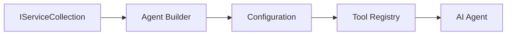

<!--
CO_OP_TRANSLATOR_METADATA:
{
  "original_hash": "bcc874e190347bd6a095aed56dc16de8",
  "translation_date": "2025-11-13T14:20:33+00:00",
  "source_file": "03-agentic-design-patterns/code_samples/03-dotnet-agent-framework.md",
  "language_code": "sr"
}
-->
# 🎨 Агентски дизајн шаблони са GitHub моделима (.NET)

## 📋 Циљеви учења

Овај пример демонстрира дизајн шаблоне на нивоу предузећа за изградњу интелигентних агената користећи Microsoft Agent Framework у .NET-у са интеграцијом GitHub модела. Научићете професионалне шаблоне и архитектонске приступе који чине агенте спремним за продукцију, одрживим и скалабилним.

### Дизајн шаблони за предузећа

- 🏭 **Фабрички шаблон**: Стандардизовано креирање агената са убризгавањем зависности
- 🔧 **Градитељски шаблон**: Флуентна конфигурација и подешавање агената
- 🧵 **Шаблони за безбедност нити**: Управљање конверзацијама у исто време
- 📋 **Репозиторијум шаблон**: Организовано управљање алатима и могућностима

## 🎯 Архитектонске предности .NET-а

### Карактеристике за предузећа

- **Јака типизација**: Валидација у време компилације и подршка за IntelliSense
- **Убризгавање зависности**: Интеграција са уграђеним DI контејнером
- **Управљање конфигурацијом**: IConfiguration и Options шаблони
- **Async/Await**: Првокласна подршка за асинхроно програмирање

### Шаблони спремни за продукцију

- **Интеграција логовања**: ILogger и подршка за структурирано логовање
- **Провере здравља**: Уграђено праћење и дијагностика
- **Валидација конфигурације**: Јака типизација са анотацијама података
- **Руковање грешкама**: Структурирано управљање изузецима

## 🔧 Техничка архитектура

### Основне .NET компоненте

- **Microsoft.Extensions.AI**: Уједињене апстракције AI услуга
- **Microsoft.Agents.AI**: Оквир за оркестрацију агената на нивоу предузећа
- **Интеграција GitHub модела**: Шаблони за API клијенте високих перформанси
- **Систем конфигурације**: Интеграција appsettings.json и окружења

### Имплементација дизајн шаблона



## 🏗️ Демонстрирани шаблони за предузећа

### 1. **Креациони шаблони**

- **Фабрика агената**: Централизовано креирање агената са конзистентном конфигурацијом
- **Градитељски шаблон**: Флуентни API за сложену конфигурацију агената
- **Шаблон синглтона**: Управљање заједничким ресурсима и конфигурацијом
- **Убризгавање зависности**: Слабо повезивање и тестабилност

### 2. **Понашалачки шаблони**

- **Стратегијски шаблон**: Заменљиве стратегије извршавања алата
- **Командни шаблон**: Инкапсулиране операције агената са undo/redo
- **Шаблон посматрача**: Управљање животним циклусом агента засновано на догађајима
- **Шаблон методе шаблона**: Стандардизовани токови извршавања агената

### 3. **Структурални шаблони**

- **Адаптер шаблон**: Слој интеграције GitHub Models API-ја
- **Декоратор шаблон**: Унапређење могућности агента
- **Фасадни шаблон**: Поједностављени интерфејси за интеракцију са агентима
- **Прокси шаблон**: Лењо учитавање и кеширање ради перформанси

## 📚 Дизајнерски принципи .NET-а

### SOLID принципи

- **Једна одговорност**: Свака компонента има јасну сврху
- **Отворено/затворено**: Прошириво без модификације
- **Лисковљева супституција**: Имплементације алата засноване на интерфејсима
- **Сегрегација интерфејса**: Фокусирани, кохезивни интерфејси
- **Инверзија зависности**: Ослањање на апстракције, а не на конкретне имплементације

### Чиста архитектура

- **Слој домена**: Основне апстракције агената и алата
- **Слој апликације**: Оркестрација агената и токови рада
- **Слој инфраструктуре**: Интеграција GitHub модела и спољашњих услуга
- **Слој презентације**: Интеракција са корисником и форматирање одговора

## 🔒 Разматрања за предузећа

### Безбедност

- **Управљање акредитивима**: Сигурно руковање API кључевима са IConfiguration
- **Валидација уноса**: Јака типизација и валидација са анотацијама података
- **Санитизација излаза**: Сигурна обрада и филтрирање одговора
- **Логовање ревизије**: Свеобухватно праћење операција

### Перформансе

- **Асинхрони шаблони**: Неблокирајуће I/O операције
- **Пул конекција**: Ефикасно управљање HTTP клијентима
- **Кеширање**: Кеширање одговора ради побољшања перформанси
- **Управљање ресурсима**: Правилно ослобађање и чишћење ресурса

### Скалабилност

- **Безбедност нити**: Подршка за истовремено извршавање агената
- **Пул ресурса**: Ефикасно коришћење ресурса
- **Управљање оптерећењем**: Ограничење брзине и руковање притиском
- **Мониторинг**: Метрике перформанси и провере здравља

## 🚀 Продукционо распоређивање

- **Управљање конфигурацијом**: Подешавања специфична за окружење
- **Стратегија логовања**: Структурирано логовање са ID-јевима корелације
- **Руковање грешкама**: Глобално руковање изузецима са правилним опоравком
- **Мониторинг**: Application Insights и бројачи перформанси
- **Тестирање**: Шаблони за јединичне тестове, интеграционе тестове и тестове оптерећења

Спремни да изградите интелигентне агенте на нивоу предузећа са .NET-ом? Хајде да архитектујемо нешто робусно! 🏢✨

## 🚀 Почетак

### Предуслови

- [.NET 10 SDK](https://dotnet.microsoft.com/download/dotnet/10.0) или новији
- [GitHub Models API приступни токен](https://docs.github.com/github-models/github-models-at-scale/using-your-own-api-keys-in-github-models)

### Потребне променљиве окружења

```bash
# zsh/bash
export GH_TOKEN=<your_github_token>
export GH_ENDPOINT=https://models.github.ai/inference
export GH_MODEL_ID=openai/gpt-5-mini
```

```powershell
# PowerShell
$env:GH_TOKEN = "<your_github_token>"
$env:GH_ENDPOINT = "https://models.github.ai/inference"
$env:GH_MODEL_ID = "openai/gpt-5-mini"
```

### Пример кода

Да бисте покренули пример кода,

```bash
# zsh/bash
chmod +x ./03-dotnet-agent-framework.cs
./03-dotnet-agent-framework.cs
```

Или користећи dotnet CLI:

```bash
dotnet run ./03-dotnet-agent-framework.cs
```

Погледајте [`03-dotnet-agent-framework.cs`](../../../../03-agentic-design-patterns/code_samples/03-dotnet-agent-framework.cs) за комплетан код.

```csharp
#!/usr/bin/dotnet run

#:package Microsoft.Extensions.AI@10.*
#:package Microsoft.Agents.AI.OpenAI@1.*-*

using System.ClientModel;
using System.ComponentModel;

using Microsoft.Agents.AI;
using Microsoft.Extensions.AI;

using OpenAI;

// Tool Function: Random Destination Generator
// This static method will be available to the agent as a callable tool
// The [Description] attribute helps the AI understand when to use this function
// This demonstrates how to create custom tools for AI agents
[Description("Provides a random vacation destination.")]
static string GetRandomDestination()
{
    // List of popular vacation destinations around the world
    // The agent will randomly select from these options
    var destinations = new List<string>
    {
        "Paris, France",
        "Tokyo, Japan",
        "New York City, USA",
        "Sydney, Australia",
        "Rome, Italy",
        "Barcelona, Spain",
        "Cape Town, South Africa",
        "Rio de Janeiro, Brazil",
        "Bangkok, Thailand",
        "Vancouver, Canada"
    };

    // Generate random index and return selected destination
    // Uses System.Random for simple random selection
    var random = new Random();
    int index = random.Next(destinations.Count);
    return destinations[index];
}

// Extract configuration from environment variables
// Retrieve the GitHub Models API endpoint, defaults to https://models.github.ai/inference if not specified
// Retrieve the model ID, defaults to openai/gpt-5-mini if not specified
// Retrieve the GitHub token for authentication, throws exception if not specified
var github_endpoint = Environment.GetEnvironmentVariable("GH_ENDPOINT") ?? "https://models.github.ai/inference";
var github_model_id = Environment.GetEnvironmentVariable("GH_MODEL_ID") ?? "openai/gpt-5-mini";
var github_token = Environment.GetEnvironmentVariable("GH_TOKEN") ?? throw new InvalidOperationException("GH_TOKEN is not set.");

// Configure OpenAI Client Options
// Create configuration options to point to GitHub Models endpoint
// This redirects OpenAI client calls to GitHub's model inference service
var openAIOptions = new OpenAIClientOptions()
{
    Endpoint = new Uri(github_endpoint)
};

// Initialize OpenAI Client with GitHub Models Configuration
// Create OpenAI client using GitHub token for authentication
// Configure it to use GitHub Models endpoint instead of OpenAI directly
var openAIClient = new OpenAIClient(new ApiKeyCredential(github_token), openAIOptions);

// Define Agent Identity and Comprehensive Instructions
// Agent name for identification and logging purposes
var AGENT_NAME = "TravelAgent";

// Detailed instructions that define the agent's personality, capabilities, and behavior
// This system prompt shapes how the agent responds and interacts with users
var AGENT_INSTRUCTIONS = """
You are a helpful AI Agent that can help plan vacations for customers.

Important: When users specify a destination, always plan for that location. Only suggest random destinations when the user hasn't specified a preference.

When the conversation begins, introduce yourself with this message:
"Hello! I'm your TravelAgent assistant. I can help plan vacations and suggest interesting destinations for you. Here are some things you can ask me:
1. Plan a day trip to a specific location
2. Suggest a random vacation destination
3. Find destinations with specific features (beaches, mountains, historical sites, etc.)
4. Plan an alternative trip if you don't like my first suggestion

What kind of trip would you like me to help you plan today?"

Always prioritize user preferences. If they mention a specific destination like "Bali" or "Paris," focus your planning on that location rather than suggesting alternatives.
""";

// Create AI Agent with Advanced Travel Planning Capabilities
// Initialize complete agent pipeline: OpenAI client → Chat client → AI agent
// Configure agent with name, detailed instructions, and available tools
// This demonstrates the .NET agent creation pattern with full configuration
AIAgent agent = openAIClient
    .GetChatClient(github_model_id)
    .CreateAIAgent(
        name: AGENT_NAME,
        instructions: AGENT_INSTRUCTIONS,
        tools: [AIFunctionFactory.Create(GetRandomDestination)]
    );

// Create New Conversation Thread for Context Management
// Initialize a new conversation thread to maintain context across multiple interactions
// Threads enable the agent to remember previous exchanges and maintain conversational state
// This is essential for multi-turn conversations and contextual understanding
AgentThread thread = agent.GetNewThread();

// Execute Agent: First Travel Planning Request
// Run the agent with an initial request that will likely trigger the random destination tool
// The agent will analyze the request, use the GetRandomDestination tool, and create an itinerary
// Using the thread parameter maintains conversation context for subsequent interactions
await foreach (var update in agent.RunStreamingAsync("Plan me a day trip", thread))
{
    await Task.Delay(10);
    Console.Write(update);
}

Console.WriteLine();

// Execute Agent: Follow-up Request with Context Awareness
// Demonstrate contextual conversation by referencing the previous response
// The agent remembers the previous destination suggestion and will provide an alternative
// This showcases the power of conversation threads and contextual understanding in .NET agents
await foreach (var update in agent.RunStreamingAsync("I don't like that destination. Plan me another vacation.", thread))
{
    await Task.Delay(10);
    Console.Write(update);
}
```

---

<!-- CO-OP TRANSLATOR DISCLAIMER START -->
**Одрицање од одговорности**:  
Овај документ је преведен помоћу услуге за превођење вештачке интелигенције [Co-op Translator](https://github.com/Azure/co-op-translator). Иако настојимо да обезбедимо тачност, молимо вас да имате у виду да аутоматски преводи могу садржати грешке или нетачности. Оригинални документ на његовом изворном језику треба сматрати ауторитативним извором. За критичне информације препоручује се професионални превод од стране људи. Не преузимамо одговорност за било каква погрешна тумачења или неспоразуме који могу настати услед коришћења овог превода.
<!-- CO-OP TRANSLATOR DISCLAIMER END -->