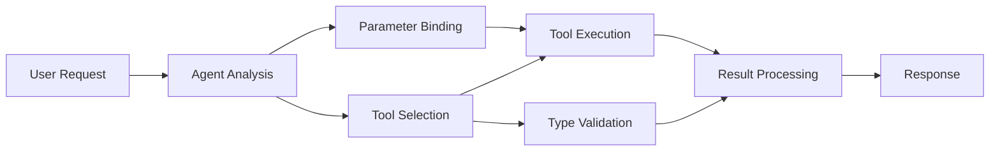

<!--
CO_OP_TRANSLATOR_METADATA:
{
  "original_hash": "91d6061e402489603f2ec8b528cae59b",
  "translation_date": "2025-11-18T18:23:29+00:00",
  "source_file": "04-tool-use/code_samples/04-dotnet-agent-framework.md",
  "language_code": "sr"
}
-->
# 🛠️ Напредна употреба алата са GitHub моделима (.NET)

## 📋 Циљеви учења

Овај приручник демонстрира интеграционе шаблоне алата на нивоу предузећа користећи Microsoft Agent Framework у .NET-у са GitHub моделима. Научићете како да изградите софистициране агенте са више специјализованих алата, користећи снажну типизацију C# и предузетничке карактеристике .NET-а.

### Напредне способности алата које ћете савладати

- 🔧 **Архитектура са више алата**: Изградња агената са више специјализованих могућности
- 🎯 **Извршавање алата са типском сигурношћу**: Искоришћавање C# провере у време компилације
- 📊 **Шаблони алата за предузећа**: Дизајн алата спреман за производњу и руковање грешкама
- 🔗 **Композиција алата**: Комбиновање алата за сложене пословне токове

## 🎯 Предности архитектуре алата у .NET-у

### Карактеристике алата за предузећа

- **Провера у време компилације**: Снажна типизација осигурава исправност параметара алата
- **Убризгавање зависности**: Интеграција IoC контејнера за управљање алатима
- **Асинхрони шаблони**: Неблокирајуће извршавање алата уз правилно управљање ресурсима
- **Структурисано логовање**: Уграђена интеграција логовања за праћење извршавања алата

### Шаблони спремни за производњу

- **Руковање изузецима**: Свеобухватно управљање грешкама са типизованим изузецима
- **Управљање ресурсима**: Правилни шаблони за ослобађање ресурса и управљање меморијом
- **Праћење перформанси**: Уграђене метрике и бројачи перформанси
- **Управљање конфигурацијом**: Типски сигурна конфигурација са провером исправности

## 🔧 Техничка архитектура

### Основне компоненте алата у .NET-у

- **Microsoft.Extensions.AI**: Јединствени слој апстракције алата
- **Microsoft.Agents.AI**: Оркестрација алата на нивоу предузећа
- **Интеграција GitHub модела**: Клијент API високих перформанси са управљањем конекцијама

### Цевовод за извршавање алата



## 🛠️ Категорије и шаблони алата

### 1. **Алатке за обраду података**

- **Провера улазних података**: Снажна типизација са анотацијама података
- **Операције трансформације**: Типски сигурна конверзија и форматирање података
- **Пословна логика**: Алатке за доменско специфичне прорачуне и анализе
- **Форматирање излазних података**: Генерисање структурисаних одговора

### 2. **Интеграционе алатке**

- **API конектори**: Интеграција RESTful сервиса са HttpClient-ом
- **Алатке за базу података**: Интеграција Entity Framework-а за приступ подацима
- **Операције са датотекама**: Сигурне операције са фајл системом уз проверу исправности
- **Спољне услуге**: Шаблони интеграције услуга трећих страна

### 3. **Помоћне алатке**

- **Обрада текста**: Манипулација стринговима и форматирање
- **Операције са датумима/временом**: Културно свесни прорачуни датума и времена
- **Математичке алатке**: Прецизни прорачуни и статистичке операције
- **Алатке за проверу исправности**: Провера пословних правила и верификација података

Спремни да изградите агенте на нивоу предузећа са моћним, типски сигурним могућностима алата у .NET-у? Хајде да архитектурамо професионална решења! 🏢⚡

## 🚀 Почетак

### Предуслови

- [.NET 10 SDK](https://dotnet.microsoft.com/download/dotnet/10.0) или новији
- [GitHub Models API приступни токен](https://docs.github.com/github-models/github-models-at-scale/using-your-own-api-keys-in-github-models)

### Потребне променљиве окружења

```bash
# zsh/bash
export GH_TOKEN=<your_github_token>
export GH_ENDPOINT=https://models.github.ai/inference
export GH_MODEL_ID=openai/gpt-5-mini
```

```powershell
# PowerShell
$env:GH_TOKEN = "<your_github_token>"
$env:GH_ENDPOINT = "https://models.github.ai/inference"
$env:GH_MODEL_ID = "openai/gpt-5-mini"
```

### Пример кода

Да бисте покренули пример кода,

```bash
# zsh/bash
chmod +x ./04-dotnet-agent-framework.cs
./04-dotnet-agent-framework.cs
```

Или користећи dotnet CLI:

```bash
dotnet run ./04-dotnet-agent-framework.cs
```

Погледајте [`04-dotnet-agent-framework.cs`](../../../../04-tool-use/code_samples/04-dotnet-agent-framework.cs) за комплетан код.

```csharp
#!/usr/bin/dotnet run

#:package Microsoft.Extensions.AI@10.*
#:package Microsoft.Agents.AI.OpenAI@1.*-*

using System.ClientModel;
using System.ComponentModel;

using Microsoft.Agents.AI;
using Microsoft.Extensions.AI;

using OpenAI;

// Tool Function: Random Destination Generator
// This static method will be available to the agent as a callable tool
// The [Description] attribute helps the AI understand when to use this function
// This demonstrates how to create custom tools for AI agents
[Description("Provides a random vacation destination.")]
static string GetRandomDestination()
{
    // List of popular vacation destinations around the world
    // The agent will randomly select from these options
    var destinations = new List<string>
    {
        "Paris, France",
        "Tokyo, Japan",
        "New York City, USA",
        "Sydney, Australia",
        "Rome, Italy",
        "Barcelona, Spain",
        "Cape Town, South Africa",
        "Rio de Janeiro, Brazil",
        "Bangkok, Thailand",
        "Vancouver, Canada"
    };

    // Generate random index and return selected destination
    // Uses System.Random for simple random selection
    var random = new Random();
    int index = random.Next(destinations.Count);
    return destinations[index];
}

// Extract configuration from environment variables
// Retrieve the GitHub Models API endpoint, defaults to https://models.github.ai/inference if not specified
// Retrieve the model ID, defaults to openai/gpt-5-mini if not specified
// Retrieve the GitHub token for authentication, throws exception if not specified
var github_endpoint = Environment.GetEnvironmentVariable("GH_ENDPOINT") ?? "https://models.github.ai/inference";
var github_model_id = Environment.GetEnvironmentVariable("GH_MODEL_ID") ?? "openai/gpt-5-mini";
var github_token = Environment.GetEnvironmentVariable("GH_TOKEN") ?? throw new InvalidOperationException("GH_TOKEN is not set.");

// Configure OpenAI Client Options
// Create configuration options to point to GitHub Models endpoint
// This redirects OpenAI client calls to GitHub's model inference service
var openAIOptions = new OpenAIClientOptions()
{
    Endpoint = new Uri(github_endpoint)
};

// Initialize OpenAI Client with GitHub Models Configuration
// Create OpenAI client using GitHub token for authentication
// Configure it to use GitHub Models endpoint instead of OpenAI directly
var openAIClient = new OpenAIClient(new ApiKeyCredential(github_token), openAIOptions);

// Define Agent Identity and Comprehensive Instructions
// Agent name for identification and logging purposes
var AGENT_NAME = "TravelAgent";

// Detailed instructions that define the agent's personality, capabilities, and behavior
// This system prompt shapes how the agent responds and interacts with users
var AGENT_INSTRUCTIONS = """
You are a helpful AI Agent that can help plan vacations for customers.

Important: When users specify a destination, always plan for that location. Only suggest random destinations when the user hasn't specified a preference.

When the conversation begins, introduce yourself with this message:
"Hello! I'm your TravelAgent assistant. I can help plan vacations and suggest interesting destinations for you. Here are some things you can ask me:
1. Plan a day trip to a specific location
2. Suggest a random vacation destination
3. Find destinations with specific features (beaches, mountains, historical sites, etc.)
4. Plan an alternative trip if you don't like my first suggestion

What kind of trip would you like me to help you plan today?"

Always prioritize user preferences. If they mention a specific destination like "Bali" or "Paris," focus your planning on that location rather than suggesting alternatives.
""";

// Create AI Agent with Advanced Travel Planning Capabilities
// Initialize complete agent pipeline: OpenAI client → Chat client → AI agent
// Configure agent with name, detailed instructions, and available tools
// This demonstrates the .NET agent creation pattern with full configuration
AIAgent agent = openAIClient
    .GetChatClient(github_model_id)
    .CreateAIAgent(
        name: AGENT_NAME,
        instructions: AGENT_INSTRUCTIONS,
        tools: [AIFunctionFactory.Create(GetRandomDestination)]
    );

// Create New Conversation Thread for Context Management
// Initialize a new conversation thread to maintain context across multiple interactions
// Threads enable the agent to remember previous exchanges and maintain conversational state
// This is essential for multi-turn conversations and contextual understanding
AgentThread thread = agent.GetNewThread();

// Execute Agent: First Travel Planning Request
// Run the agent with an initial request that will likely trigger the random destination tool
// The agent will analyze the request, use the GetRandomDestination tool, and create an itinerary
// Using the thread parameter maintains conversation context for subsequent interactions
await foreach (var update in agent.RunStreamingAsync("Plan me a day trip", thread))
{
    await Task.Delay(10);
    Console.Write(update);
}

Console.WriteLine();

// Execute Agent: Follow-up Request with Context Awareness
// Demonstrate contextual conversation by referencing the previous response
// The agent remembers the previous destination suggestion and will provide an alternative
// This showcases the power of conversation threads and contextual understanding in .NET agents
await foreach (var update in agent.RunStreamingAsync("I don't like that destination. Plan me another vacation.", thread))
{
    await Task.Delay(10);
    Console.Write(update);
}
```

---

<!-- CO-OP TRANSLATOR DISCLAIMER START -->
**Одрицање од одговорности**:  
Овај документ је преведен коришћењем услуге за аутоматски превод [Co-op Translator](https://github.com/Azure/co-op-translator). Иако се трудимо да обезбедимо тачност, молимо вас да имате у виду да аутоматски преводи могу садржати грешке или нетачности. Оригинални документ на изворном језику треба сматрати ауторитативним извором. За критичне информације препоручује се професионални превод од стране људи. Не сносимо одговорност за било каква погрешна тумачења или неспоразуме који могу произаћи из коришћења овог превода.
<!-- CO-OP TRANSLATOR DISCLAIMER END -->