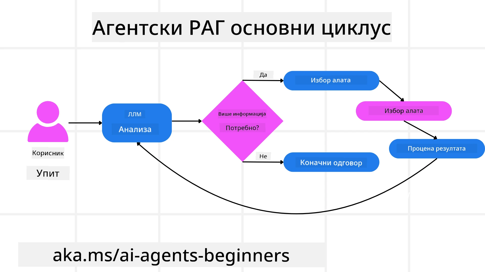
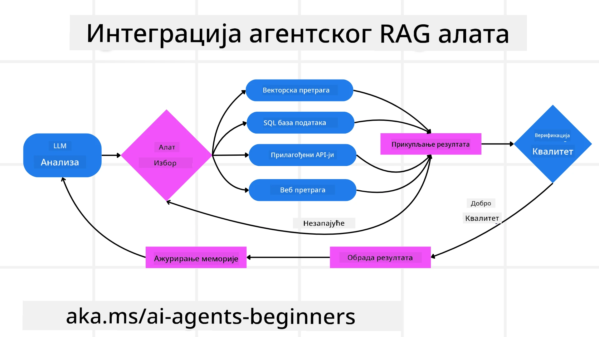

<!--
CO_OP_TRANSLATOR_METADATA:
{
  "original_hash": "0ebf6b2290db55dbf2d10cc49655523b",
  "translation_date": "2025-09-30T07:49:54+00:00",
  "source_file": "05-agentic-rag/README.md",
  "language_code": "sr"
}
-->

> _(Кликните на слику изнад да бисте погледали видео лекције)_

# Агентски RAG

Ова лекција пружа свеобухватан преглед Агентског Ретривал-Аугментед Генератион (Agentic RAG), новог АИ парадигма у којем велики језички модели (LLMs) аутономно планирају своје наредне кораке док прикупљају информације из спољашњих извора. За разлику од статичких образаца „претражи па прочитај“, Agentic RAG укључује итеративне позиве LLM-у, испреплетене са позивима алатима или функцијама и структурираним излазима. Систем процењује резултате, усавршава упите, позива додатне алате ако је потребно и наставља овај циклус док не постигне задовољавајуће решење.

## Увод

Ова лекција ће обухватити:

- **Разумевање Agentic RAG-а:** Упознајте се са новим парадигмом у АИ где велики језички модели (LLMs) аутономно планирају своје наредне кораке док прикупљају информације из спољашњих извора података.
- **Схватање итеративног Maker-Checker стила:** Разумите циклус итеративних позива LLM-у, испреплетених са позивима алатима или функцијама и структурираним излазима, дизајнираних да побољшају тачност и реше неисправне упите.
- **Истраживање практичних примена:** Идентификујте сценарије у којима Agentic RAG блиста, као што су окружења где је тачност приоритет, сложене интеракције са базама података и проширени токови рада.

## Циљеви учења

Након завршетка ове лекције, знаћете како да/разумете:

- **Разумевање Agentic RAG-а:** Упознајте се са новим парадигмом у АИ где велики језички модели (LLMs) аутономно планирају своје наредне кораке док прикупљају информације из спољашњих извора података.
- **Итеративни Maker-Checker стил:** Схватите концепт циклуса итеративних позива LLM-у, испреплетених са позивима алатима или функцијама и структурираним излазима, дизајнираних да побољшају тачност и реше неисправне упите.
- **Присвајање процеса размишљања:** Разумите способност система да самостално управља процесом размишљања, доносећи одлуке о приступу проблемима без ослањања на унапред дефинисане путеве.
- **Ток рада:** Разумите како агентски модел самостално одлучује да прикупља извештаје о тржишним трендовима, идентификује податке о конкурентима, корелира интерне продајне метрике, синтетише налазе и процењује стратегију.
- **Итеративни циклуси, интеграција алата и меморија:** Упознајте се са ослањањем система на образац интеракције у циклусима, одржавајући стање и меморију током корака како би избегли понављајуће циклусе и доносили информисане одлуке.
- **Руковање модовима неуспеха и самокорекција:** Истражите робусне механизме самокорекције система, укључујући итерацију и поновно упитивање, коришћење дијагностичких алата и ослањање на људски надзор.
- **Границе аутономије:** Разумите ограничења Agentic RAG-а, са фокусом на доменску аутономију, зависност од инфраструктуре и поштовање заштитних мера.
- **Практични случајеви употребе и вредност:** Идентификујте сценарије у којима Agentic RAG блиста, као што су окружења где је тачност приоритет, сложене интеракције са базама података и проширени токови рада.
- **Управљање, транспарентност и поверење:** Упознајте се са значајем управљања и транспарентности, укључујући објашњиво размишљање, контролу пристрасности и људски надзор.

## Шта је Agentic RAG?

Agentic Retrieval-Augmented Generation (Agentic RAG) је нови АИ парадигм у којем велики језички модели (LLMs) аутономно планирају своје наредне кораке док прикупљају информације из спољашњих извора. За разлику од статичких образаца „претражи па прочитај“, Agentic RAG укључује итеративне позиве LLM-у, испреплетене са позивима алатима или функцијама и структурираним излазима. Систем процењује резултате, усавршава упите, позива додатне алате ако је потребно и наставља овај циклус док не постигне задовољавајуће решење. Ова итеративна „maker-checker“ метода побољшава тачност, решава неисправне упите и осигурава висококвалитетне резултате.

Систем активно управља својим процесом размишљања, преписујући неуспеле упите, бирајући различите методе претраживања и интегришући више алата—као што су векторско претраживање у Azure AI Search, SQL базе података или прилагођени API-ји—пре него што финализује свој одговор. Карактеристика која разликује агентски систем је његова способност да самостално управља процесом размишљања. Традиционалне RAG имплементације ослањају се на унапред дефинисане путеве, али агентски систем аутономно одређује редослед корака на основу квалитета информација које проналази.

## Дефинисање Agentic Retrieval-Augmented Generation (Agentic RAG)

Agentic Retrieval-Augmented Generation (Agentic RAG) је нови парадигм у развоју АИ где LLM-ови не само да прикупљају информације из спољашњих извора података већ и аутономно планирају своје наредне кораке. За разлику од статичких образаца „претражи па прочитај“ или пажљиво скриптованих секвенци упита, Agentic RAG укључује циклус итеративних позива LLM-у, испреплетених са позивима алатима или функцијама и структурираним излазима. На сваком кораку, систем процењује добијене резултате, одлучује да ли да усаврши упите, позива додатне алате ако је потребно и наставља овај циклус док не постигне задовољавајуће решење.

Ова итеративна „maker-checker“ метода рада дизајнирана је да побољша тачност, реши неисправне упите ка структурираним базама података (нпр. NL2SQL) и осигура уравнотежене, висококвалитетне резултате. Уместо да се ослања искључиво на пажљиво осмишљене ланце упита, систем активно управља својим процесом размишљања. Може да препише неуспеле упите, изабере различите методе претраживања и интегрише више алата—као што су векторско претраживање у Azure AI Search, SQL базе података или прилагођени API-ји—пре него што финализује свој одговор. Ово уклања потребу за превише сложеним оркестрационим оквирима. Уместо тога, релативно једноставан циклус „позив LLM-у → коришћење алата → позив LLM-у → …“ може дати софистициране и добро утемељене излазе.

## Управљање процесом размишљања

Карактеристика која чини систем „агентским“ је његова способност да самостално управља процесом размишљања. Традиционалне RAG имплементације често зависе од људи који унапред дефинишу пут за модел: ланац размишљања који одређује шта да се прикупи и када.  
Али када је систем заиста агентски, он интерно одлучује како да приступи проблему. Не извршава само скрипту; аутономно одређује редослед корака на основу квалитета информација које проналази.  
На пример, ако се од њега тражи да креира стратегију за лансирање производа, он се не ослања искључиво на упит који детаљно описује цео процес истраживања и доношења одлука. Уместо тога, агентски модел самостално одлучује да:

1. Прикупи извештаје о тренутним тржишним трендовима користећи Bing Web Grounding.
2. Идентификује релевантне податке о конкурентима користећи Azure AI Search.
3. Корелира историјске интерне продајне метрике користећи Azure SQL Database.
4. Синтетише налазе у кохезивну стратегију оркестрирану преко Azure OpenAI Service.
5. Процени стратегију у потрази за празнинама или недоследностима, иницирајући још један круг прикупљања података ако је потребно.  

Сви ови кораци—усавршавање упита, одабир извора, итерација док не буде „задовољан“ одговором—одлучује модел, а не човек који је унапред дефинисао кораке.

## Итеративни циклуси, интеграција алата и меморија

Агентски систем се ослања на образац интеракције у циклусима:

- **Почетни позив:** Циљ корисника (тј. кориснички упит) се представља LLM-у.
- **Позив алата:** Ако модел идентификује недостајуће информације или нејасна упутства, бира алат или метод претраживања—као што је упит у векторску базу података (нпр. Azure AI Search Hybrid претрага над приватним подацима) или структурирани SQL позив—да би прикупио више контекста.
- **Процена и усавршавање:** Након прегледа добијених података, модел одлучује да ли су информације довољне. Ако нису, усавршава упит, испробава други алат или прилагођава свој приступ.
- **Понављање док не буде задовољан:** Овај циклус се наставља док модел не утврди да има довољно јасноће и доказа да пружи коначан, добро образложен одговор.
- **Меморија и стање:** Пошто систем одржава стање и меморију током корака, може се сетити претходних покушаја и њихових исхода, избегавајући понављајуће циклусе и доносећи информисаније одлуке како напредује.

Током времена, ово ствара осећај еволуирајућег разумевања, омогућавајући моделу да се креће кроз сложене, вишестепене задатке без потребе за сталном људском интервенцијом или преобликовањем упита.

## Руковање модовима неуспеха и самокорекција

Аутономија Agentic RAG-а такође укључује робусне механизме самокорекције. Када систем наиђе на ћорсокак—као што је прикупљање ирелевантних докумената или сусретање са неисправним упитима—може:

- **Итерација и поновно упитивање:** Уместо да врати одговоре ниске вредности, модел покушава нове стратегије претраживања, преписује упите ка базама података или истражује алтернативне скупове података.
- **Коришћење дијагностичких алата:** Систем може позвати додатне функције дизајниране да му помогну у отклањању грешака у корацима размишљања или потврди тачност прикупљених података. Алатке као што је Azure AI Tracing биће важне за омогућавање робусне видљивости и праћења.
- **Ослањање на људски надзор:** За задатке високог ризика или у случајевима поновљених неуспеха, модел може означити несигурност и затражити људско вођење. Када човек пружи корективне повратне информације, модел може укључити ту лекцију у будућем раду.

Ова итеративна и динамична метода омогућава моделу да се континуирано побољшава, осигуравајући да није само систем за једнократну употребу, већ онај који учи из својих грешака током одређене сесије.

## Границе аутономије

Упркос својој аутономији у оквиру задатка, Agentic RAG није аналоган вештачкој општој интелигенцији. Његове „агентске“ способности су ограничене на алате, изворе података и политике које су обезбедили људски програмери. Не може измишљати сопствене алате или излазити изван граница домена које су постављене. Уместо тога, одликује се динамичким оркестрирањем расположивих ресурса.  
Кључне разлике у односу на напредније облике АИ укључују:

1. **Доменска аутономија:** Agentic RAG системи су фокусирани на постизање циљева које је дефинисао корисник унутар познатог домена, користећи стратегије као што су преписивање упита или одабир алата за побољшање резултата.
2. **Зависност од инфраструктуре:** Способности система зависе од алата и података које су интегрисали програмери. Не може превазићи те границе без људске интервенције.
3. **Поштовање заштитних мера:** Етичке смернице, правила усклађености и пословне политике остају веома важне. Слобода агента је увек ограничена безбедносним мерама и механизмима надзора (надамо се?).

## Практични случајеви употребе и вредност

Agentic RAG блиста у сценаријима који захтевају итеративно усавршавање и прецизност:

1. **Окружења где је тачност приоритет:** У проверама усклађености, регулаторним анализама или правним истраживањима, агентски модел може више пута проверавати чињенице, консултовати више извора и преписивати упите док не произведе темељно проверен одговор.
2. **Сложене интеракције са базама података:** Када се ради са структурираним подацима где упити често могу да не успеју или захтевају прилагођавање, систем може аутономно усавршавати своје упите користећи Azure SQL или Microsoft Fabric OneLake, осигуравајући да коначни резултат одговара намери корисника.
3. **Проширени токови рада:** Дужи токови рада могу се развијати како се појављују нове информације. Agentic RAG може континуирано укључивати нове податке, мењајући стратегије како сазнаје више о простору проблема.

## Управљање, транспарентност и поверење

Како ови системи постају аутономнији
- <a href="https://ragaboutit.com/agentic-rag-a-complete-guide-to-agent-based-retrieval-augmented-generation/" target="_blank">Агентски RAG: Комплетан водич за агентски приступ унапређеном генерисању – Вести из света RAG</a>
- <a href="https://huggingface.co/learn/cookbook/agent_rag" target="_blank">Агентски RAG: убрзајте свој RAG уз помоћ реформулације упита и самосталног упита! Hugging Face Open-Source AI Кувар</a>
- <a href="https://youtu.be/aQ4yQXeB1Ss?si=2HUqBzHoeB5tR04U" target="_blank">Додавање агентских слојева у RAG</a>
- <a href="https://www.youtube.com/watch?v=zeAyuLc_f3Q&t=244s" target="_blank">Будућност асистената за знање: Џери Лиу</a>
- <a href="https://www.youtube.com/watch?v=AOSjiXP1jmQ" target="_blank">Како изградити агентске RAG системе</a>
- <a href="https://ignite.microsoft.com/sessions/BRK102?source=sessions" target="_blank">Коришћење Azure AI Foundry Agent Service за скалирање ваших AI агената</a>

### Академски радови

- <a href="https://arxiv.org/abs/2303.17651" target="_blank">2303.17651 Self-Refine: Итерирајуће усавршавање уз самосталну повратну информацију</a>
- <a href="https://arxiv.org/abs/2303.11366" target="_blank">2303.11366 Reflexion: Језички агенти са вербалним учењем путем појачања</a>
- <a href="https://arxiv.org/abs/2305.11738" target="_blank">2305.11738 CRITIC: Велики језички модели могу се самокориговати уз интерактивно критиковање алатима</a>
- <a href="https://arxiv.org/abs/2501.09136" target="_blank">2501.09136 Агентско унапређено генерисање: Преглед агентског RAG</a>

## Претходна лекција

[Шаблон за дизајн коришћења алата](../04-tool-use/README.md)

## Наредна лекција

[Изградња поузданих AI агената](../06-building-trustworthy-agents/README.md)

---

**Одрицање од одговорности**:  
Овај документ је преведен коришћењем услуге за превођење помоћу вештачке интелигенције [Co-op Translator](https://github.com/Azure/co-op-translator). Иако настојимо да обезбедимо тачност, молимо вас да имате у виду да аутоматски преводи могу садржати грешке или нетачности. Оригинални документ на изворном језику треба сматрати ауторитативним извором. За критичне информације препоручује се професионални превод од стране људи. Не сносимо одговорност за било каква погрешна тумачења или неспоразуме који могу произаћи из коришћења овог превода.