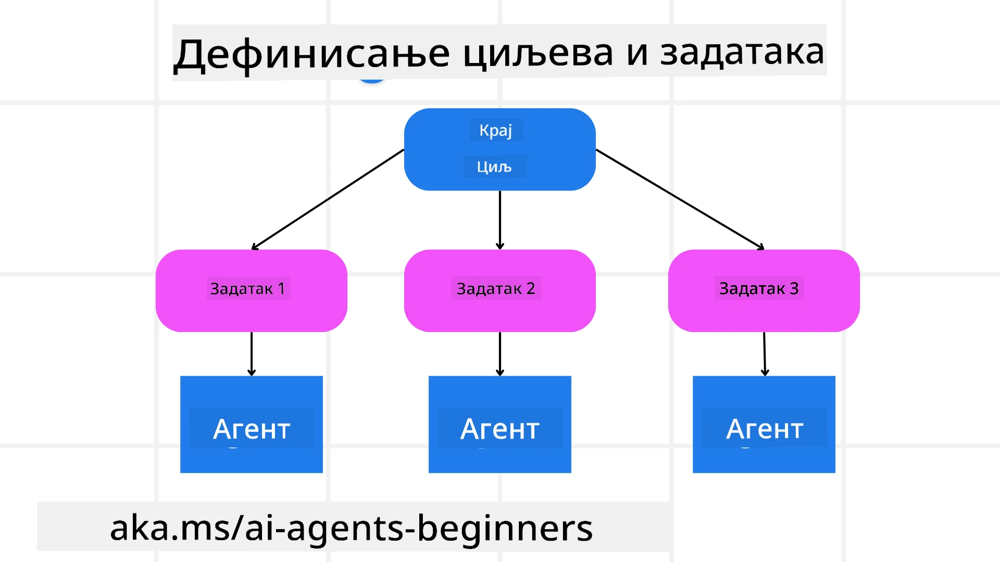

<!--
CO_OP_TRANSLATOR_METADATA:
{
  "original_hash": "43069833a0412210ad5c3cc93d9c2146",
  "translation_date": "2025-09-18T15:44:42+00:00",
  "source_file": "07-planning-design/README.md",
  "language_code": "sr"
}
-->
[](https://youtu.be/kPfJ2BrBCMY?si=9pYpPXp0sSbK91Dr)

> _(Кликните на слику изнад да бисте погледали видео овог часа)_

# Планирање дизајна

## Увод

Овај час ће обухватити:

* Дефинисање јасног општег циља и разлагање сложеног задатка на управљиве задатке.
* Коришћење структурисаног излаза за поузданије и машински читљиве одговоре.
* Примена приступа заснованог на догађајима за управљање динамичким задацима и неочекиваним уносима.

## Циљеви учења

Након завршетка овог часа, имаћете разумевање о:

* Идентификовању и постављању општег циља за AI агента, осигуравајући да јасно зна шта треба да постигне.
* Разлагању сложеног задатка на управљиве подзадатке и организовању у логичан редослед.
* Опремању агената правим алатима (нпр. алати за претрагу или алати за анализу података), одлучивању када и како их користити, и управљању неочекиваним ситуацијама које се јављају.
* Процени резултата подзадатака, мерењу учинка и итерацији акција ради побољшања коначног резултата.

## Дефинисање општег циља и разлагање задатка



Већина задатака из стварног света је превише сложена да би се решавала у једном кораку. AI агенту је потребан концизан циљ који ће водити његово планирање и акције. На пример, размотрите циљ:

    "Генеришите тродневни план путовања."

Иако је једноставно изречен, и даље захтева прецизирање. Што је циљ јаснији, то боље агент (и било који људски сарадници) могу да се фокусирају на постизање правог резултата, као што је креирање свеобухватног плана са опцијама за летове, препорукама за хотеле и предлозима активности.

### Разлагање задатка

Велики или сложени задаци постају управљивији када се поделе на мање, циљно оријентисане подзадатке.  
За пример плана путовања, можете разложити циљ на:

* Резервација летова
* Резервација хотела
* Изнајмљивање аутомобила
* Персонализација

Сваки подзадатак може бити решен од стране посебних агената или процеса. Један агент може бити специјализован за претрагу најбољих понуда за летове, други за резервацију хотела, и тако даље. Координирајући или „низводни“ агент може затим саставити ове резултате у један кохезиван план за крајњег корисника.

Овај модуларни приступ такође омогућава постепена побољшања. На пример, можете додати специјализоване агенте за препоруке хране или предлоге локалних активности и временом усавршавати план путовања.

### Структурисан излаз

Модели великог језика (LLMs) могу генерисати структурисан излаз (нпр. JSON) који је лакши за парсирање и обраду од стране низводних агената или услуга. Ово је посебно корисно у контексту више агената, где можемо деловати на овим задацима након што се добије излаз планирања. Погледајте ово за брз преглед.

Следећи Python код приказује једноставан агент за планирање који разлаже циљ на подзадатке и генерише структурисан план:

```python
from pydantic import BaseModel
from enum import Enum
from typing import List, Optional, Union
import json
import os
from typing import Optional
from pprint import pprint
from autogen_core.models import UserMessage, SystemMessage, AssistantMessage
from autogen_ext.models.azure import AzureAIChatCompletionClient
from azure.core.credentials import AzureKeyCredential

class AgentEnum(str, Enum):
    FlightBooking = "flight_booking"
    HotelBooking = "hotel_booking"
    CarRental = "car_rental"
    ActivitiesBooking = "activities_booking"
    DestinationInfo = "destination_info"
    DefaultAgent = "default_agent"
    GroupChatManager = "group_chat_manager"

# Travel SubTask Model
class TravelSubTask(BaseModel):
    task_details: str
    assigned_agent: AgentEnum  # we want to assign the task to the agent

class TravelPlan(BaseModel):
    main_task: str
    subtasks: List[TravelSubTask]
    is_greeting: bool

client = AzureAIChatCompletionClient(
    model="gpt-4o-mini",
    endpoint="https://models.inference.ai.azure.com",
    # To authenticate with the model you will need to generate a personal access token (PAT) in your GitHub settings.
    # Create your PAT token by following instructions here: https://docs.github.com/en/authentication/keeping-your-account-and-data-secure/managing-your-personal-access-tokens
    credential=AzureKeyCredential(os.environ["GITHUB_TOKEN"]),
    model_info={
        "json_output": False,
        "function_calling": True,
        "vision": True,
        "family": "unknown",
    },
)

# Define the user message
messages = [
    SystemMessage(content="""You are an planner agent.
    Your job is to decide which agents to run based on the user's request.
                      Provide your response in JSON format with the following structure:
{'main_task': 'Plan a family trip from Singapore to Melbourne.',
 'subtasks': [{'assigned_agent': 'flight_booking',
               'task_details': 'Book round-trip flights from Singapore to '
                               'Melbourne.'}
    Below are the available agents specialised in different tasks:
    - FlightBooking: For booking flights and providing flight information
    - HotelBooking: For booking hotels and providing hotel information
    - CarRental: For booking cars and providing car rental information
    - ActivitiesBooking: For booking activities and providing activity information
    - DestinationInfo: For providing information about destinations
    - DefaultAgent: For handling general requests""", source="system"),
    UserMessage(
        content="Create a travel plan for a family of 2 kids from Singapore to Melboune", source="user"),
]

response = await client.create(messages=messages, extra_create_args={"response_format": 'json_object'})

response_content: Optional[str] = response.content if isinstance(
    response.content, str) else None
if response_content is None:
    raise ValueError("Response content is not a valid JSON string" )

pprint(json.loads(response_content))

# # Ensure the response content is a valid JSON string before loading it
# response_content: Optional[str] = response.content if isinstance(
#     response.content, str) else None
# if response_content is None:
#     raise ValueError("Response content is not a valid JSON string")

# # Print the response content after loading it as JSON
# pprint(json.loads(response_content))

# Validate the response content with the MathReasoning model
# TravelPlan.model_validate(json.loads(response_content))
```

### Агент за планирање са оркестрацијом више агената

У овом примеру, Семантички рутер агент прима кориснички захтев (нпр. "Потребан ми је план за хотел за моје путовање.").

Планер затим:

* Прима план за хотел: Планер узима корисничку поруку и, на основу системског упутства (укључујући детаље доступних агената), генерише структурисан план путовања.
* Наводи агенте и њихове алате: Регистар агената садржи листу агената (нпр. за летове, хотеле, изнајмљивање аутомобила и активности) заједно са функцијама или алатима које нуде.
* Упућује план одговарајућим агентима: У зависности од броја подзадатака, планер или директно шаље поруку посвећеном агенту (за сценарије са једним задатком) или координира преко менаџера групног чета за сарадњу више агената.
* Сажима резултат: На крају, планер сажима генерисани план ради јасноће.  
Следећи Python код илуструје ове кораке:

```python

from pydantic import BaseModel

from enum import Enum
from typing import List, Optional, Union

class AgentEnum(str, Enum):
    FlightBooking = "flight_booking"
    HotelBooking = "hotel_booking"
    CarRental = "car_rental"
    ActivitiesBooking = "activities_booking"
    DestinationInfo = "destination_info"
    DefaultAgent = "default_agent"
    GroupChatManager = "group_chat_manager"

# Travel SubTask Model

class TravelSubTask(BaseModel):
    task_details: str
    assigned_agent: AgentEnum # we want to assign the task to the agent

class TravelPlan(BaseModel):
    main_task: str
    subtasks: List[TravelSubTask]
    is_greeting: bool
import json
import os
from typing import Optional

from autogen_core.models import UserMessage, SystemMessage, AssistantMessage
from autogen_ext.models.openai import AzureOpenAIChatCompletionClient

# Create the client with type-checked environment variables

client = AzureOpenAIChatCompletionClient(
    azure_deployment=os.getenv("AZURE_OPENAI_DEPLOYMENT_NAME"),
    model=os.getenv("AZURE_OPENAI_DEPLOYMENT_NAME"),
    api_version=os.getenv("AZURE_OPENAI_API_VERSION"),
    azure_endpoint=os.getenv("AZURE_OPENAI_ENDPOINT"),
    api_key=os.getenv("AZURE_OPENAI_API_KEY"),
)

from pprint import pprint

# Define the user message

messages = [
    SystemMessage(content="""You are an planner agent.
    Your job is to decide which agents to run based on the user's request.
    Below are the available agents specialized in different tasks:
    - FlightBooking: For booking flights and providing flight information
    - HotelBooking: For booking hotels and providing hotel information
    - CarRental: For booking cars and providing car rental information
    - ActivitiesBooking: For booking activities and providing activity information
    - DestinationInfo: For providing information about destinations
    - DefaultAgent: For handling general requests""", source="system"),
    UserMessage(content="Create a travel plan for a family of 2 kids from Singapore to Melbourne", source="user"),
]

response = await client.create(messages=messages, extra_create_args={"response_format": TravelPlan})

# Ensure the response content is a valid JSON string before loading it

response_content: Optional[str] = response.content if isinstance(response.content, str) else None
if response_content is None:
    raise ValueError("Response content is not a valid JSON string")

# Print the response content after loading it as JSON

pprint(json.loads(response_content))
```

Шта следи је излаз из претходног кода, а затим можете користити овај структурисан излаз за упућивање на `assigned_agent` и сажимање плана путовања за крајњег корисника.

```json
{
    "is_greeting": "False",
    "main_task": "Plan a family trip from Singapore to Melbourne.",
    "subtasks": [
        {
            "assigned_agent": "flight_booking",
            "task_details": "Book round-trip flights from Singapore to Melbourne."
        },
        {
            "assigned_agent": "hotel_booking",
            "task_details": "Find family-friendly hotels in Melbourne."
        },
        {
            "assigned_agent": "car_rental",
            "task_details": "Arrange a car rental suitable for a family of four in Melbourne."
        },
        {
            "assigned_agent": "activities_booking",
            "task_details": "List family-friendly activities in Melbourne."
        },
        {
            "assigned_agent": "destination_info",
            "task_details": "Provide information about Melbourne as a travel destination."
        }
    ]
}
```

Пример нотебоок-а са претходним кодом доступан је [овде](07-autogen.ipynb).

### Итеративно планирање

Неки задаци захтевају интеракцију или поновно планирање, где исход једног подзадатка утиче на следећи. На пример, ако агент открије неочекивани формат података приликом резервације летова, можда ће морати да прилагоди своју стратегију пре него што пређе на резервацију хотела.

Поред тога, повратна информација корисника (нпр. одлука да се изабере ранији лет) може покренути делимично поновно планирање. Овај динамички, итеративни приступ осигурава да коначно решење буде усклађено са стварним ограничењима и променљивим корисничким преференцијама.

Пример кода:

```python
from autogen_core.models import UserMessage, SystemMessage, AssistantMessage
#.. same as previous code and pass on the user history, current plan
messages = [
    SystemMessage(content="""You are a planner agent to optimize the
    Your job is to decide which agents to run based on the user's request.
    Below are the available agents specialized in different tasks:
    - FlightBooking: For booking flights and providing flight information
    - HotelBooking: For booking hotels and providing hotel information
    - CarRental: For booking cars and providing car rental information
    - ActivitiesBooking: For booking activities and providing activity information
    - DestinationInfo: For providing information about destinations
    - DefaultAgent: For handling general requests""", source="system"),
    UserMessage(content="Create a travel plan for a family of 2 kids from Singapore to Melbourne", source="user"),
    AssistantMessage(content=f"Previous travel plan - {TravelPlan}", source="assistant")
]
# .. re-plan and send the tasks to respective agents
```

За свеобухватније планирање погледајте Magnetic One за решавање сложених задатака.

## Резиме

У овом чланку смо погледали пример како можемо креирати планер који може динамички изабрати доступне дефинисане агенте. Излаз планера разлаже задатке и додељује агенте како би могли бити извршени. Претпоставља се да агенти имају приступ функцијама/алатима који су потребни за обављање задатка. Поред агената, можете укључити и друге шаблоне као што су рефлексија, сажимач и ротација чета ради додатног прилагођавања.

## Додатни ресурси

AutoGen Magnetic One - Општи систем више агената за решавање сложених задатака који је постигао импресивне резултате на више изазовних бенчмаркова за агенте. Референца:

У овој имплементацији оркестратор креира план специфичан за задатак и делегира те задатке доступним агентима. Поред планирања, оркестратор такође користи механизам праћења за надгледање напретка задатка и поновно планирање по потреби.

### Имате још питања о шаблону за планирање?

Придружите се [Azure AI Foundry Discord](https://aka.ms/ai-agents/discord) да бисте се упознали са другим ученицима, присуствовали консултацијама и добили одговоре на ваша питања о AI агентима.

## Претходни час

[Изградња поузданих AI агената](../06-building-trustworthy-agents/README.md)

## Следећи час

[Шаблон дизајна више агената](../08-multi-agent/README.md)

---

**Одрицање од одговорности**:  
Овај документ је преведен коришћењем услуге за превођење помоћу вештачке интелигенције [Co-op Translator](https://github.com/Azure/co-op-translator). Иако се трудимо да обезбедимо тачност, молимо вас да имате у виду да аутоматски преводи могу садржати грешке или нетачности. Оригинални документ на његовом изворном језику треба сматрати ауторитативним извором. За критичне информације препоручује се професионални превод од стране људи. Не преузимамо одговорност за било каква погрешна тумачења или неспоразуме који могу настати услед коришћења овог превода.