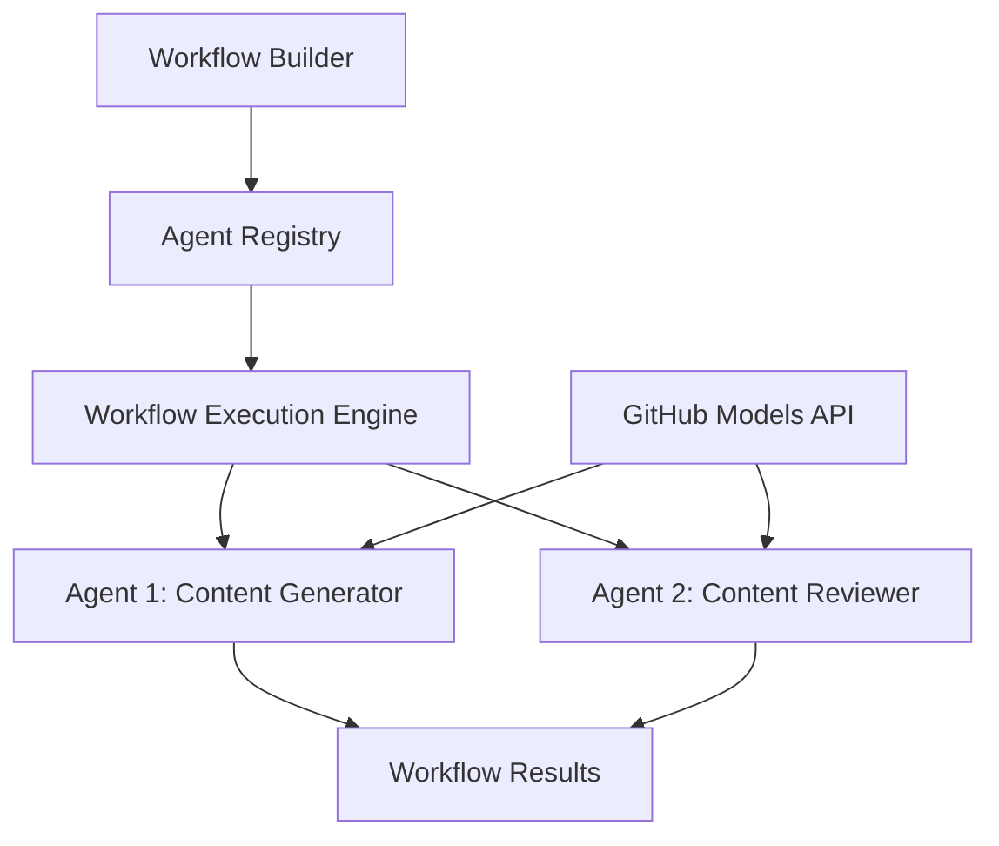

<!--
CO_OP_TRANSLATOR_METADATA:
{
  "original_hash": "034158688d0a45aae06dcbb21b0da5ae",
  "translation_date": "2025-11-11T12:59:16+00:00",
  "source_file": "08-multi-agent/code_samples/workflows-agent-framework/dotNET/01.dotnet-agent-framework-workflow-ghmodel-basic.md",
  "language_code": "sr"
}
-->
# 🔄 Основни радни токови агената са GitHub моделима (.NET)

## 📋 Туторијал за оркестрацију радних токова

Овај приручник показује како да изградите сложене **радне токове агената** користећи Microsoft Agent Framework за .NET и GitHub моделе. Научићете како да креирате вишестепене пословне процесе где AI агенти сарађују како би постигли сложене задатке кроз структурисане обрасце оркестрације.

## 🎯 Циљеви учења

### 🏗️ **Основе архитектуре радних токова**
- **Креатор радних токова**: Дизајнирајте и оркестрирајте сложене вишестепене AI процесе
- **Координација агената**: Координишите више специјализованих агената унутар радних токова
- **Интеграција GitHub модела**: Искористите GitHub услугу за инференцију AI модела у радним токовима
- **Визуелни дизајн радних токова**: Креирајте и визуализујте структуре радних токова ради бољег разумевања

### 🔄 **Обрасци оркестрације процеса**
- **Секвенцијална обрада**: Повежите више задатака агената у логичком редоследу
- **Управљање стањем**: Одржавајте контекст и ток података кроз фазе радног тока
- **Руковање грешкама**: Примените робусно опорављање од грешака и отпорност радног тока
- **Оптимизација перформанси**: Дизајнирајте ефикасне радне токове за операције на нивоу предузећа

### 🏢 **Примене радних токова у предузећима**
- **Аутоматизација пословних процеса**: Аутоматизујте сложене организационе радне токове
- **Производни процес садржаја**: Уреднички радни токови са фазама прегледа и одобрења
- **Аутоматизација корисничке службе**: Вишестепено решавање упита корисника
- **Радни токови обраде података**: ETL радни токови са AI-подржаном трансформацијом

## ⚙️ Предуслови и подешавање

### 📦 **Потребни NuGet пакети**

Ова демонстрација радног тока користи неколико кључних .NET пакета:

```xml
<!-- Core AI Framework -->
<PackageReference Include="Microsoft.Extensions.AI" Version="9.9.0" />

<!-- Agent Framework (Local Development) -->
<!-- Microsoft.Agents.AI.dll - Core agent abstractions -->
<!-- Microsoft.Agents.AI.OpenAI.dll - OpenAI/GitHub Models integration -->

<!-- Configuration and Environment -->
<PackageReference Include="DotNetEnv" Version="3.1.1" />
```

### 🔑 **Конфигурација GitHub модела**

**Подешавање окружења (.env датотека):**
```env
GITHUB_TOKEN=your_github_personal_access_token
GITHUB_ENDPOINT=https://models.inference.ai.azure.com
GITHUB_MODEL_ID=gpt-4o-mini
```

**Приступ GitHub моделима:**
1. Пријавите се за GitHub моделе (тренутно у прегледу)
2. Генеришите лични приступни токен са дозволама за приступ моделима
3. Конфигуришите променљиве окружења као што је приказано изнад

### 🏗️ **Преглед архитектуре радног тока**



**Кључне компоненте:**
- **WorkflowBuilder**: Главни мотор за оркестрацију и дизајн радних токова
- **AIAgent**: Појединачни специјализовани агенти са специфичним способностима
- **GitHub Models Client**: Интеграција услуге инференције AI модела
- **Execution Context**: Управља стањем и током података између фаза радног тока

## 🎨 **Обрасци дизајна радних токова у предузећима**

### 📝 **Радни ток производње садржаја**
```
User Request → Content Generation → Quality Review → Final Output
```

### 🔍 **Цевовод за обраду докумената**
```
Document Input → Analysis → Extraction → Validation → Structured Output
```

### 💼 **Радни ток пословне интелигенције**
```
Data Collection → Processing → Analysis → Report Generation → Distribution
```

### 🤝 **Аутоматизација корисничке службе**
```
Customer Inquiry → Classification → Processing → Response Generation → Follow-up
```

## 🏢 **Предности за предузећа**

### 🎯 **Поузданост и скалабилност**
- **Детерминистичка извршења**: Конзистентни, поновљиви резултати радних токова
- **Опоравак од грешака**: Грациозно руковање неуспесима у било којој фази радног тока
- **Праћење перформанси**: Пратите метрике извршења и могућности оптимизације
- **Управљање ресурсима**: Ефикасна алокација и коришћење ресурса AI модела

### 🔒 **Безбедност и усаглашеност**
- **Сигурна аутентификација**: Аутентификација заснована на GitHub токенима за приступ API-ју
- **Трагови ревизије**: Комплетно бележење извршења радних токова и тачака одлучивања
- **Контрола приступа**: Детаљне дозволе за извршење и праћење радних токова
- **Приватност података**: Сигурно руковање осетљивим информацијама кроз радне токове

### 📊 **Прегледност и управљање**
- **Визуелни дизајн радних токова**: Јасна репрезентација токова процеса и зависности
- **Праћење извршења**: Праћење напретка и перформанси радног тока у реалном времену
- **Извештавање о грешкама**: Детаљна анализа грешака и могућности за отклањање
- **Аналитика перформанси**: Метрике за оптимизацију и планирање капацитета

Хајде да изградимо ваш први AI радни ток спреман за предузеће! 🚀

## 💻 Покретање кода

Комплетна имплементација је доступна у `01.dotnet-agent-framework-workflow-ghmodel-basic.cs`. Ова датотека демонстрира:

1. **Конфигурација окружења** - Учитавање GitHub Models акредитива из `.env` датотеке
2. **Подешавање OpenAI клијента** - Конфигурисање клијента за коришћење GitHub Models крајње тачке
3. **Креирање агента** - Дефинисање специјализованих агената (Front Desk и Concierge)
4. **Креатор радних токова** - Креирање радног тока са више агената и секвенцијалном обрадом
5. **Извршење радног тока** - Покретање радног тока са стриминг резултатима

### 🚀 Покретање примера

```bash
# Make the script executable (Unix/Linux/macOS)
chmod +x 01.dotnet-agent-framework-workflow-ghmodel-basic.cs

# Run the workflow
./01.dotnet-agent-framework-workflow-ghmodel-basic.cs
```

Или на Windows-у:
```powershell
dotnet run 01.dotnet-agent-framework-workflow-ghmodel-basic.cs
```

### 📝 Очекивани резултат

Радни ток ће:
1. Прихватити ваш захтев за путовање ("Желео бих да идем у Париз")
2. Агенти Front Desk дају почетну препоруку
3. Агенти Concierge прегледају и унапређују препоруку
4. Коначни резултат приказује комплетан ток разговора

### 🔧 Прилагођавање

Можете прилагодити радни ток тако што ћете:
- Мењати упутства агената да бисте променили њихово понашање
- Додати више агената за креирање сложених вишестепених радних токова
- Променити поруку корисника да бисте тестирали различите сценарије
- Прилагодити ивице радног тока за креирање различитих образаца извршења

---

<!-- CO-OP TRANSLATOR DISCLAIMER START -->
**Одрицање од одговорности**:  
Овај документ је преведен помоћу услуге за превођење уз помоћ вештачке интелигенције [Co-op Translator](https://github.com/Azure/co-op-translator). Иако настојимо да обезбедимо тачност, молимо вас да имате у виду да аутоматски преводи могу садржати грешке или нетачности. Оригинални документ на изворном језику треба сматрати меродавним извором. За критичне информације препоручује се професионални превод од стране људи. Не преузимамо одговорност за било каква погрешна тумачења или неспоразуме који могу настати услед коришћења овог превода.
<!-- CO-OP TRANSLATOR DISCLAIMER END -->