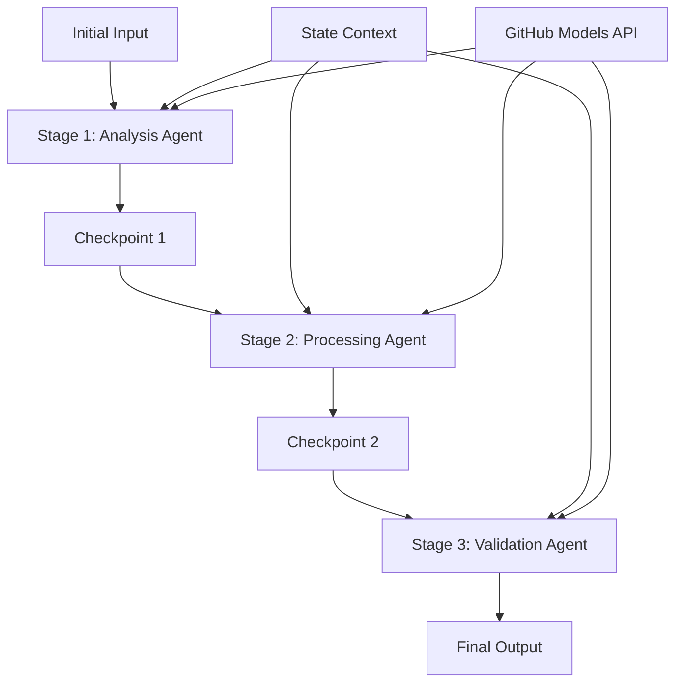

<!--
CO_OP_TRANSLATOR_METADATA:
{
  "original_hash": "1be9c8dcbd79a02d33d2c138684c1394",
  "translation_date": "2025-11-11T14:04:31+00:00",
  "source_file": "08-multi-agent/code_samples/workflows-agent-framework/dotNET/02.dotnet-agent-framework-workflow-ghmodel-sequential.md",
  "language_code": "sr"
}
-->
# ⏩ Секвенцијални токови рада агената са GitHub моделима (.NET)

## 📋 Напредни туторијал за секвенцијалну обраду

Овај приручник демонстрира **шаблоне секвенцијалног тока рада** користећи Microsoft Agent Framework за .NET и GitHub моделе. Научићете како да изградите сложене, корак-по-корак обрадне цевоводе где агенти извршавају задатке одређеним редоследом, при чему свака фаза надограђује резултате претходне фазе.

## 🎯 Циљеви учења

### 🔄 **Архитектура секвенцијалне обраде**
- **Дизајн линеарног тока рада**: Креирајте корак-по-корак обрадне цевоводе са јасним зависностима
- **Управљање стањем**: Одржавајте контекст и ток података кроз фазе секвенцијалног тока рада
- **Интеграција GitHub модела**: Искористите GitHub AI моделе у вишестепеним .NET токовима рада
- **Шаблони за предузећа**: Изградите производне системе за секвенцијалну обраду

### 🏗️ **Напредни секвенцијални шаблони**
- **Обрада са контролним тачкама**: Примените тачке валидације између фаза тока рада
- **Очување контекста**: Одржавајте стање и акумулирано знање кроз све фазе
- **Пренос грешака**: Руковање неуспесима на елегантан начин у секвенцијалним ланцима обраде
- **Оптимизација перформанси**: Ефикасно секвенцијално извршавање са минималним оптерећењем

### 🏢 **Секвенцијалне апликације за предузећа**
- **Цевовод за обраду докумената**: Вишестепена анализа, трансформација и валидација докумената
- **Токови рада за контролу квалитета**: Секвенцијални преглед, валидација и процеси одобравања
- **Цевовод за производњу садржаја**: Истраживање → Писање → Уређивање → Преглед → Објављивање
- **Аутоматизација пословних процеса**: Вишестепени пословни токови рада са јасним зависностима фаза

## ⚙️ Предуслови и подешавање

### 📦 **Потребни NuGet пакети**

Основни пакети за .NET секвенцијалне токове рада:

```xml
<!-- Core AI Framework -->
<PackageReference Include="Microsoft.Extensions.AI" Version="9.9.0" />

<!-- Client Model Abstractions -->
<PackageReference Include="System.ClientModel" Version="1.6.1.0" />

<!-- Azure Identity and Async LINQ Support -->
<PackageReference Include="Azure.Identity" Version="1.15.0" />
<PackageReference Include="System.Linq.Async" Version="6.0.3" />

<!-- Local Agent Framework References -->
<!-- Microsoft.Agents.AI.dll - Core agent abstractions -->
<!-- Microsoft.Agents.AI.OpenAI.dll - GitHub Models integration -->
```

### 🔑 **Конфигурација GitHub модела**

**Подешавање окружења (.env датотека):**
```env
GITHUB_TOKEN=your_github_personal_access_token
GITHUB_ENDPOINT=https://models.inference.ai.azure.com
GITHUB_MODEL_ID=gpt-4o-mini
```

**Управљање конфигурацијом:**
```csharp
// Load environment variables securely
Env.Load("../../../.env");
var githubToken = Environment.GetEnvironmentVariable("GITHUB_TOKEN");
var githubEndpoint = Environment.GetEnvironmentVariable("GITHUB_ENDPOINT");
var modelId = Environment.GetEnvironmentVariable("GITHUB_MODEL_ID");
```

### 🏗️ **Архитектура секвенцијалног тока рада**



**Кључне компоненте:**
- **Секвенцијални агенти**: Специјализовани агенти за сваку фазу обраде
- **Контекст стања**: Одржава акумулиране податке и одлуке кроз фазе
- **Контролне тачке**: Тачке валидације између фаза за осигурање квалитета и конзистентности
- **GitHub Models Client**: Конзистентан приступ AI моделима кроз све фазе тока рада

## 🎨 **Шаблони дизајна секвенцијалног тока рада**

### 📝 **Цевовод за обраду докумената**
```
Raw Document → Content Extraction → Analysis → Validation → Structured Output
```

### 🎯 **Ток рада за креирање садржаја**
```
Brief/Requirements → Research → Content Creation → Review → Final Polish
```

### 🔍 **Цевовод за контролу квалитета**
```
Initial Review → Technical Validation → Compliance Check → Final Approval
```

### 💼 **Ток рада за пословну интелигенцију**
```
Data Collection → Processing → Analysis → Report Generation → Distribution
```

## 🏢 **Предности секвенцијалног тока рада за предузећа**

### 🎯 **Поузданост и квалитет**
- **Детерминистичка обрада**: Конзистентни, поновљиви резултати кроз структуриране фазе
- **Контролне тачке квалитета**: Тачке валидације осигуравају квалитет у свакој фази
- **Изолација грешака**: Проблеми у једној фази не преносе се на наредне фазе
- **Трагови ревизије**: Комплетно праћење одлука и трансформација у свакој фази

### 📈 **Скалабилност и перформансе**
- **Модуларни дизајн**: Свака фаза може бити оптимизована независно
- **Управљање ресурсима**: Ефикасна алокација ресурса AI модела кроз фазе
- **Оптимизација стања**: Минималан пренос стања између фаза за оптималне перформансе
- **Паралелне групе фаза**: Више секвенцијалних токова рада може се извршавати паралелно

### 🔒 **Безбедност и усклађеност**
- **Безбедност на нивоу фазе**: Различите безбедносне политике за различите фазе обраде
- **Валидација података**: Осигурање интегритета података и усклађености на свакој контролној тачки
- **Контрола приступа**: Детаљне дозволе за различите фазе тока рада
- **Регулаторна усклађеност**: Испуњавање регулаторних захтева кроз структурисану обраду

### 📊 **Мониторинг и аналитика**
- **Метрике на нивоу фазе**: Праћење перформанси за сваку фазу тока рада
- **Идентификација уских грла**: Препознавање и оптимизација спорих фаза
- **Метрике квалитета**: Праћење квалитета и стопе успеха у свакој фази
- **Оптимизација процеса**: Континуирано унапређење засновано на аналитикама на нивоу фазе

Хајде да изградимо робусне секвенцијалне AI цевоводе за обраду! 🚀

## 💻 Покретање кода

Комплетна имплементација је доступна у `02.dotnet-agent-framework-workflow-ghmodel-sequential.cs`. Овај фајл демонстрира **тростепени ток рада за анализу намештаја**:

1. **Фаза 1 - Агенти продаје**: Анализирају слике намештаја и пружају предлоге за куповину
2. **Фаза 2 - Агенти за цене**: Пружају детаљне анализе цена и опције буџета
3. **Фаза 3 - Агенти за понуде**: Генеришу професионални документ понуде у Markdown формату

### 🏗️ **Архитектура тока рада**

```
Image Input → Sales Analysis → Price Estimation → Quote Generation → Final Output
```

Сваки агент:
- Прима излаз из претходне фазе као контекст
- Надограђује претходну анализу са специјализованим знањем
- Одржава континуитет тока рада кроз управљање стањем

### 🚀 Покретање примера

**Предуслови:**
- Поставите слику намештаја на `../imgs/home.png` (или ажурирајте променљиву `imgPath`)
- Конфигуришите своју `.env` датотеку са GitHub Models акредитивима

```bash
# Make the script executable (Unix/Linux/macOS)
chmod +x 02.dotnet-agent-framework-workflow-ghmodel-sequential.cs

# Run the sequential workflow
./02.dotnet-agent-framework-workflow-ghmodel-sequential.cs
```

Или на Windows-у:
```powershell
dotnet run 02.dotnet-agent-framework-workflow-ghmodel-sequential.cs
```

### 📝 Очекивани излаз

Ток рада ће:
1. **Агенти продаје**: Идентификовати ставке намештаја са слике и пружити препоруке
2. **Агенти за цене**: Додати детаљну анализу цена са нивоима буџета и препорукама за куповину
3. **Агенти за понуде**: Генерисати форматиран документ понуде са синтетизованим информацијама

Коначни излаз ће бити свеобухватна, професионална понуда за намештај заснована на анализи слике.

### 🔧 Опције прилагођавања

**Измените понашање агента:**
```csharp
// Adjust agent instructions to change their focus
const string SalesAgentInstructions = "Your custom instructions...";
```

**Промените секвенцијални ток:**
```csharp
// Add or reorder workflow stages
var workflow = new WorkflowBuilder(salesagent)
    .AddEdge(salesagent, priceagent)
    .AddEdge(priceagent, quoteagent)
    .AddEdge(quoteagent, newAgent)  // Add another stage
    .Build();
```

**Користите различит улаз:**
```csharp
// Process text instead of images
ChatMessage userMessage = new ChatMessage(ChatRole.User, [
    new TextContent("Analyze pricing for a modern living room set")
]);
```

### 🎯 Апликације у стварном свету

Овај секвенцијални шаблон је идеалан за:
- **Е-трговину**: Анализа производа → Цене → Генерисање понуде
- **Некретнине**: Анализа некретнина → Процена вредности → Креирање огласа
- **Осигурање**: Анализа захтева → Процена → Генерисање понуде
- **Креирање садржаја**: Истраживање → Писање → Уређивање → Објављивање

### 🔍 Разумевање тока стања

Сваки агент у секвенци прима:
- **Оригинални улаз**: Почетну поруку корисника (слика + текст)
- **Излазе претходних агената**: Све претходне одговоре агената у историји разговора
- **Акумулирани контекст**: Комплетно стање одржавано током целог тока рада

Ово омогућава сложену вишестепену обраду где сваки агент надограђује свеобухватни контекст из свих претходних фаза.

---

<!-- CO-OP TRANSLATOR DISCLAIMER START -->
**Одрицање од одговорности**:  
Овај документ је преведен коришћењем услуге за превођење помоћу вештачке интелигенције [Co-op Translator](https://github.com/Azure/co-op-translator). Иако настојимо да обезбедимо тачност, молимо вас да имате у виду да аутоматски преводи могу садржати грешке или нетачности. Оригинални документ на његовом изворном језику треба сматрати ауторитативним извором. За критичне информације препоручује се професионални превод од стране људи. Не преузимамо одговорност за било каква погрешна тумачења или неспоразуме који могу настати услед коришћења овог превода.
<!-- CO-OP TRANSLATOR DISCLAIMER END -->