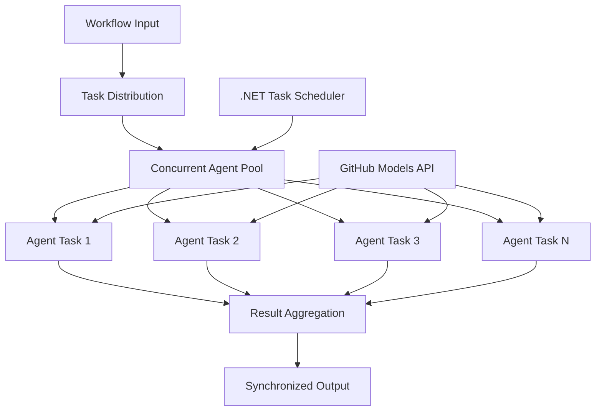

<!--
CO_OP_TRANSLATOR_METADATA:
{
  "original_hash": "b9c6e32c9b5f2fed20b6916984440d88",
  "translation_date": "2025-11-11T13:32:12+00:00",
  "source_file": "08-multi-agent/code_samples/workflows-agent-framework/dotNET/03.dotnet-agent-framework-workflow-ghmodel-concurrent.md",
  "language_code": "sr"
}
-->
# ⚡ Конкурентни радни токови агената са GitHub моделима (.NET)

## 📋 Туторијал за обраду података високе перформансе

Овај приручник демонстрира **шаблоне конкурентних радних токова** користећи Microsoft Agent Framework за .NET и GitHub моделе. Научићете како да изградите радне токове високе перформансе за паралелну обраду који максимизирају пропусност извршавањем више AI агената истовремено уз одржавање координације и конзистентности података.

## 🎯 Циљеви учења

### 🚀 **Основе конкурентне обраде**
- **Паралелно извршавање агената**: Покрените више AI агената истовремено за максималне перформансе
- **Async/Await шаблони**: Искористите .NET модел асинхроног програмирања за ефикасну конкурентност
- **Интеграција са GitHub моделима**: Координишите више истовремених позива на GitHub AI сервис за инференцију модела
- **Управљање ресурсима**: Ефикасно управљање ресурсима AI модела током конкурентних операција

### 🏗️ **Напредна архитектура конкурентности**
- **Паралелизам заснован на задацима**: Користите .NET Task Parallel Library за оптимално конкурентно извршавање
- **Шаблони синхронизације**: Координишите конкурентне агенте уз избегавање трка услова
- **Расподела оптерећења**: Ефикасно расподелите рад на доступни капацитет за конкурентну обраду
- **Толеранција на грешке**: Руковање неуспесима појединачних агената без заустављања целог радног тока

### 🏢 **Конкурентне апликације за предузећа**
- **Обрада докумената великог обима**: Обрада више докумената истовремено
- **Анализа садржаја у реалном времену**: Конкурентна анализа долазних токова података
- **Оптимизација серијске обраде**: Максимизирање пропусности за обраду података великог обима
- **Мултимодална анализа**: Паралелна обрада различитих типова и формата садржаја

## ⚙️ Предуслови и подешавање

### 📦 **Потребни NuGet пакети**

Основни пакети за радне токове високе перформансе:

```xml
<!-- Core AI Framework with Async Support -->
<PackageReference Include="Microsoft.Extensions.AI" Version="9.9.0" />

<!-- Client Model Abstractions for API Communication -->
<PackageReference Include="System.ClientModel" Version="1.6.1.0" />

<!-- Azure Identity and Async LINQ for Advanced Operations -->
<PackageReference Include="Azure.Identity" Version="1.15.0" />
<PackageReference Include="System.Linq.Async" Version="6.0.3" />

<!-- Local Agent Framework References -->
<!-- Microsoft.Agents.AI.dll - Core agent abstractions with async support -->
<!-- Microsoft.Agents.AI.OpenAI.dll - GitHub Models integration with concurrency -->
```

### 🔑 **Конфигурација GitHub модела**

**Подешавање окружења (.env датотека):**
```env
GITHUB_TOKEN=your_github_personal_access_token
GITHUB_ENDPOINT=https://models.inference.ai.azure.com
GITHUB_MODEL_ID=gpt-4o-mini
```

**Разматрања за конкурентну обраду:**
```csharp
// Configure for concurrent operations
var clientOptions = new OpenAIClientOptions()
{
    Endpoint = new Uri(githubEndpoint),
    // Configure connection pooling for concurrent requests
    NetworkTimeout = TimeSpan.FromMinutes(5)
};
```

### 🏗️ **Архитектура конкурентног радног тока**



**Кључне компоненте:**
- **Task Parallel Library**: Уграђена подршка .NET-а за конкурентне операције
- **Пул агената**: Више инстанци агената за паралелну обраду
- **Агрегација резултата**: Координација и спајање резултата конкурентних агената
- **Тачке синхронизације**: Осигурање конзистентности података током конкурентних операција

## 🎨 **Шаблони дизајна конкурентних радних токова**

### 🔍 **Паралелно истраживање и анализа**
```
Research Topic → Concurrent Research Agents → Result Synthesis → Final Report
```

### 📊 **Обрада података из више извора**
```
Data Sources → Parallel Processing Agents → Data Integration → Unified Output
```

### 🎭 **Цевовод за генерисање садржаја**
```
Content Requirements → Concurrent Content Generators → Quality Review → Final Content
```

### 🔄 **Fan-Out/Fan-In обрада**
```
Single Input → Multiple Concurrent Processors → Result Aggregation → Single Output
```

## 🏢 **Предности перформанси за предузећа**

### ⚡ **Пропусност и скалабилност**
- **Линеарно скалирање перформанси**: Додајте више конкурентних агената за повећање пропусности
- **Искоришћење ресурса**: Максимална ефикасност доступног капацитета AI модела
- **Смањено време обраде**: Значајно смањење времена кроз паралелно извршавање
- **Еластично скалирање**: Динамично прилагођавање броја конкурентних агената на основу оптерећења

### 🛡️ **Поузданост и отпорност**
- **Изолација грешака**: Неуспеси појединачних агената не утичу на друге конкурентне операције
- **Грациозно деградирање**: Систем наставља са радом уз смањени капацитет агената
- **Опоравак од грешака**: Аутоматски механизми за поновно покретање неуспелих конкурентних операција
- **Расподела оптерећења**: Уједначена расподела рада на доступне агенте

### 📊 **Праћење перформанси**
- **Метрике конкурентног извршавања**: Праћење перформанси свих паралелних операција
- **Аналитика коришћења ресурса**: Праћење употребе CPU-а, меморије и мреже
- **Анализа пропусности**: Мерење добитака у ефикасности од конкурентне обраде
- **Детекција уских грла**: Идентификација и решавање ограничења перформанси

### 🔧 **Развој и операције**
- **Асинхрони модел програмирања**: Искористите зреле async/await шаблоне .NET-а
- **Координација задатака**: Уграђене могућности управљања и координације задатака
- **Руковање изузецима**: Комплетно руковање грешкама за конкурентне операције
- **Подршка за дебаговање**: Алатке за дебаговање у Visual Studio-у за конкурентне радне токове

Хајде да изградимо конкурентне AI радне токове високе перформансе са .NET-ом! 🚀

## 💻 Покретање кода

Комплетна имплементација је доступна у `03.dotnet-agent-framework-workflow-ghmodel-concurrent.cs`. Овај фајл демонстрира **Fan-Out/Fan-In конкурентни радни ток** за планирање путовања:

### 🏗️ **Архитектура радног тока**

```
User Request → ConcurrentStartExecutor → [Researcher Agent || Planner Agent] → ConcurrentAggregationExecutor → Final Output
```

**Кључне компоненте:**

1. **ConcurrentStartExecutor**: Истовремено шаље кориснички захтев свим агентима
2. **Researcher Agent**: Анализира дестинације и атракције паралелно
3. **Planner Agent**: Креира детаљне планове путовања паралелно
4. **ConcurrentAggregationExecutor**: Прикупља и спаја резултате оба агента

### 🎯 **Fan-Out/Fan-In шаблон**

Овај радни ток демонстрира класични **Fan-Out/Fan-In** шаблон:
- **Fan-Out**: Једна улазна порука се истовремено шаље више агената
- **Конкурентна обрада**: Више агената ради паралелно на истом задатку
- **Fan-In**: Резултати свих агената се прикупљају и агрегирају у један излаз

### 🚀 Покретање примера

```bash
# Make the script executable (Unix/Linux/macOS)
chmod +x 03.dotnet-agent-framework-workflow-ghmodel-concurrent.cs

# Run the concurrent workflow
./03.dotnet-agent-framework-workflow-ghmodel-concurrent.cs
```

Или на Windows-у:
```powershell
dotnet run 03.dotnet-agent-framework-workflow-ghmodel-concurrent.cs
```

### 📝 Очекивани резултат

Радни ток ће:
1. **Ширити захтев**: Послати "Испланирај путовање у Сијетл у децембру" оба агента
2. **Конкурентна обрада**: Оба агента раде истовремено:
   - Истраживач идентификује атракције и детаље
   - Планер креира итинерар и логистику
3. **Агрегација**: Комбинује оба одговора у свеобухватан излаз
4. **Приказ резултата**: Приказује спојени план путовања са свим информацијама

### 🔧 Опције прилагођавања

**Додајте више конкурентних агената:**
```csharp
// Create additional specialized agents
AIAgent budgetAgent = openAIClient.GetChatClient(github_model_id).CreateAIAgent(
    name: "Budget-Agent", instructions: "Calculate travel costs...");

// Add to fan-out
var workflow = new WorkflowBuilder(startExecutor)
    .AddFanOutEdge(startExecutor, targets: [researcherAgent, plannerAgent, budgetAgent])
    .AddFanInEdge(aggregationExecutor, sources: [researcherAgent, plannerAgent, budgetAgent])
    .WithOutputFrom(aggregationExecutor)
    .Build();

// Update aggregation count
if (this._messages.Count == 3) { ... }
```

**Измените инструкције агента:**
```csharp
const string ResearcherAgentInstructions = "Your custom instructions for research...";
const string PlanAgentInstructions = "Your custom instructions for planning...";
```

**Промените задатак:**
```csharp
StreamingRun run = await InProcessExecution.StreamAsync(
    workflow, 
    "Plan a European vacation for 2 weeks in summer"
);
```

### 🎯 Апликације у стварном свету

Овај конкурентни шаблон је идеалан за:
- **Креирање садржаја**: Више писаца истовремено креира различите секције
- **Преглед кода**: Више рецензената анализира код из различитих перспектива
- **Истраживање тржишта**: Паралелна анализа различитих сегмената тржишта
- **Обрада докумената**: Конкурентно издвајање, анализа и валидација
- **Анализа из више перспектива**: Добијање различитих погледа на исти улаз

### 🔍 Разумевање прилагођених извршилаца

**ConcurrentStartExecutor:**
- Имплементира `IMessageHandler<string>` за прихватање улазног текста
- Шири поруке свим повезаним агентима
- Шаље `TurnToken` за покретање конкурентне обраде

**ConcurrentAggregationExecutor:**
- Имплементира `IMessageHandler<ChatMessage>` за примање одговора агената
- Прикупља поруке на начин безбедан за више нити
- Агрегира када стигну сви очекивани одговори
- Даје коначни излаз користећи `context.YieldOutputAsync()`

### ⚡ Предности перформанси

**Конкурентно vs секвенцијално:**
- Секвенцијално: Agent1 (30s) → Agent2 (30s) = **60 секунди укупно**
- Конкурентно: Agent1 (30s) || Agent2 (30s) = **30 секунди укупно**

**Побољшање пропусности**: До N× брже за N конкурентних агената (у зависности од оптерећења и ресурса)

### 🛡️ Руковање грешкама

Радни ток руководи неуспесима појединачних агената грациозно:
- Ако један агент не успе, остали настављају са обрадом
- Агрегатор може имплементирати логику временског ограничења
- Делимични резултати могу бити враћени ако је потребно

### 📊 Напредне функције

**Динамичан број агената:**
Измените логику агрегације да подржи променљив број агената:

```csharp
private int _expectedAgentCount;
private readonly List<ChatMessage> _messages = [];

public async ValueTask HandleAsync(ChatMessage message, IWorkflowContext context)
{
    this._messages.Add(message);
    if (this._messages.Count == _expectedAgentCount)
    {
        // Process aggregation
    }
}
```

Овај шаблон конкурентног радног тока је суштински за изградњу AI агентских система високе перформансе и скалабилности!

---

<!-- CO-OP TRANSLATOR DISCLAIMER START -->
**Одрицање од одговорности**:  
Овај документ је преведен помоћу услуге за превођење вештачке интелигенције [Co-op Translator](https://github.com/Azure/co-op-translator). Иако настојимо да обезбедимо тачност, молимо вас да имате у виду да аутоматски преводи могу садржати грешке или нетачности. Оригинални документ на његовом изворном језику треба сматрати ауторитативним извором. За критичне информације препоручује се професионални превод од стране људи. Не преузимамо одговорност за било каква погрешна тумачења или неспоразуме који могу настати услед коришћења овог превода.
<!-- CO-OP TRANSLATOR DISCLAIMER END -->