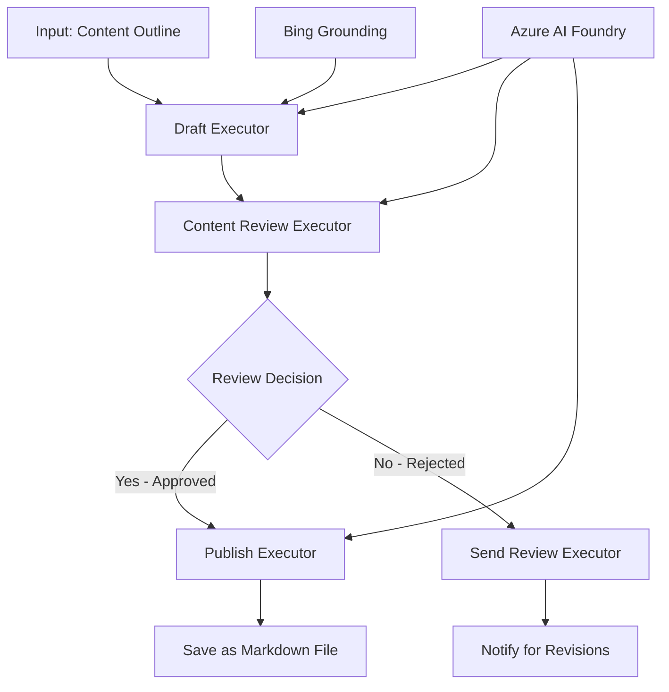

<!--
CO_OP_TRANSLATOR_METADATA:
{
  "original_hash": "8abd335151cee553293b637ee3d80d10",
  "translation_date": "2025-11-11T12:31:06+00:00",
  "source_file": "08-multi-agent/code_samples/workflows-agent-framework/dotNET/04.dotnet-agent-framework-workflow-aifoundry-condition.md",
  "language_code": "sr"
}
-->
# 🔀 Условни токови рада агената са Azure AI Foundry (.NET)

## 📋 Туторијал за интелигентне токове рада засноване на одлукама

Овај нотес демонстрира **шаблоне условних токова рада** користећи Azure AI Foundry и Microsoft Agent Framework за .NET. Научићете како да изградите сложене токове рада засноване на одлукама који интелигентно усмеравају обраду на основу AI анализе, пословних правила и динамичких услова за аутоматизацију на нивоу предузећа.

## 🎯 Циљеви учења

### 🧠 **Архитектура интелигентних одлука**
- **Имплементација условне логике**: Изградите сложена стабла одлука са више тачака разгранавања
- **Усмерење засновано на AI**: Користите моделе Azure AI Foundry за доношење интелигентних одлука о усмеравању
- **Динамичка адаптација токова рада**: Модификујте понашање токова рада на основу анализе у реалном времену и услова
- **Интеграција пословних правила**: Укључите пословну логику и захтеве усклађености у токове рада

### 🔀 **Напредни условни шаблони**
- **Доношење одлука на основу више критеријума**: Процените више фактора за одлуке о усмеравању
- **Обрада свесна контекста**: Доношење одлука на основу акумулираног контекста и историје токова рада
- **Адаптивна модификација токова рада**: Динамичко прилагођавање путева обраде на основу услова у реалном времену
- **Интеграција механизма правила**: Имплементирајте сложене механизме пословних правила унутар токова рада

### 🏢 **Условне апликације за предузећа**
- **Класификација и усмеравање докумената**: Аутоматски класификујте и усмеравајте документе у одговарајуће токове рада
- **Тријажа корисничке подршке**: Интелигентно усмеравање упита корисника ка специјализованим тимовима
- **Обрада усклађености и ризика**: Примените различите процесе валидације и прегледа на основу процене ризика
- **Токови рада за осигурање квалитета**: Усмеравајте садржај кроз одговарајуће процесе прегледа на основу метрика квалитета

## ⚙️ Предуслови и подешавање

### 📦 **Потребни NuGet пакети**

Напредни пакети за обраду условних токова рада:

```xml
<!-- Core AI Framework -->
<PackageReference Include="Microsoft.Extensions.AI" Version="9.9.0" />

<!-- Azure AI Agents with Persistent State -->
<PackageReference Include="Azure.AI.Agents.Persistent" Version="1.2.0-beta.5" />

<!-- Azure Identity and Utilities -->
<PackageReference Include="Azure.Identity" Version="1.15.0" />
<PackageReference Include="System.Linq.Async" Version="6.0.3" />
<PackageReference Include="DotNetEnv" Version="3.1.1" />

<!-- Local Workflow Framework References -->
<!-- Microsoft.Agents.Workflows.dll - Advanced workflow orchestration -->
<!-- Microsoft.Agents.AI.AzureAI.dll - Azure AI Foundry integration -->
<!-- Microsoft.Agents.AI.dll - Core agent abstractions -->
```

### 🔑 **Конфигурација Azure AI Foundry**

**Потребни Azure ресурси:**
- Azure AI Foundry радно окружење са моделима за условну обраду
- Azure претплата са одговарајућим квотама за рачунарство и дозволама
- Деплојовани AI модели за доношење одлука и анализу садржаја
- (Опционо) Bing Search API веза за могућности засноване на информацијама

**Конфигурација окружења (.env датотека):**
```env
# Azure AI Foundry Configuration
AZURE_AI_PROJECT_ENDPOINT=https://your-project.cognitiveservices.azure.com/
BING_CONNECTION_ID=your-bing-connection-id
```

**Подешавање аутентификације:**
```csharp
// Azure CLI or Managed Identity authentication
using Azure.Identity;
var credential = new AzureCliCredential();

// Load environment configuration
DotNetEnv.Env.Load("../../../.env");
```

### 🏗️ **Архитектура условних токова рада**



**Кључне компоненте:**
- **Draft Executor**: AI агент који креира почетне нацрте садржаја из оквира
- **Content Review Executor**: AI агент који процењује квалитет и усклађеност нацрта
- **Conditional Routing**: Логика одлуке која усмерава на основу резултата прегледа
- **Путеви објављивања/прегледа**: Одвојени путеви обраде за одобрен и одбијен садржај
- **Управљање стањем**: Одржава контекст садржаја и прегледа током целог тока рада

## 🎨 **Шаблони дизајна условних токова рада**

### 📋 **Продукција садржаја са контролним тачкама квалитета**
```
Outline → Draft Creation → Quality Review → {Approve: Publish | Reject: Revise}
```

### 🎯 **Обрада докумената заснована на ризику**
```
Document → Risk Assessment → {Low: Standard | High: Enhanced Review}
```

### 🔍 **Интелигентно усмеравање корисничке подршке**
```
Customer Query → Analysis → {Simple: FAQ Bot | Complex: Human Agent}
```

### 💼 **Токови рада засновани на усклађености**
```
Content → Compliance Check → {Pass: Publish | Fail: Legal Review}
```

## 🏢 **Предности условних токова рада за предузећа**

### 🎯 **Интелигентна аутоматизација**
- **Паметно доношење одлука**: Одлуке о усмеравању засноване на анализи садржаја и контексту
- **Адаптивна обрада**: Токови рада који се аутоматски прилагођавају променљивим условима
- **Примена пословних правила**: Аутоматска примена сложене пословне логике и политика
- **Усмерење свесно контекста**: Одлуке засноване на целокупној историји токова рада и акумулираном контексту

### 📈 **Оперативна изврсност**
- **Оптимизована алокација ресурса**: Усмеравање рада ка најприкладнијим стручњацима и процесима
- **Смањена ручна интервенција**: Аутоматско доношење одлука минимизира потребу за људским усмеравањем
- **Брже време решавања**: Директно усмеравање ка одговарајућој експертизи и могућностима обраде
- **Доследна примена**: Уједначена примена пословних правила и критеријума одлуке

### 🛡️ **Управљање ризиком и усклађеност**
- **Аутоматска процена ризика**: AI-подржана евалуација садржаја и нивоа ризика ситуације
- **Примена усклађености**: Аутоматско усмеравање кроз потребне регулаторне процесе
- **Примена безбедносних протокола**: Побољшане мере безбедности примењене на основу процене ризика
- **Одржавање трага ревизије**: Комплетна документација одлука о усмеравању и разлога

### 📊 **Аналитика и континуирано побољшање**
- **Аналитика одлука**: Праћење ефикасности и тачности одлука о усмеравању
- **Препознавање шаблона**: Идентификација трендова и шаблона у одлукама о усмеравању током времена
- **Оптимизација перформанси**: Континуирано побољшање критеријума одлуке и ефикасности усмеравања
- **Пословна интелигенција**: Увид у карактеристике садржаја и захтеве обраде

### 🔧 **Техничка изврсност**
- **Управљање сложеним стањем**: Одржавање сложеног стања током извршења токова рада
- **Скалабилна архитектура**: Обрада великог обима захтева за условну обраду
- **Могућности интеграције**: Беспрекорна интеграција са постојећим пословним системима и процесима
- **Праћење и посматрање**: Свеобухватно праћење перформанси токова рада и одлука

Хајде да изградимо интелигентне, одлукама вођене токове рада за предузећа са .NET! 🚀

## 💻 Покретање кода

Комплетна имплементација је доступна у `04.dotnet-agent-framework-workflow-aifoundry-condition.cs`. Ово демонстрира **ток рада продукције садржаја са контролним тачкама квалитета**:

### 🏗️ **Архитектура токова рада**

```
Content Outline → Draft Creation → Quality Review → Conditional Routing:
                                                      ├─ Approved (>200 words) → Publish
                                                      └─ Rejected (<200 words) → Review Notification
```

**Агенти у току рада:**
1. **Evangelist Agent**: Креира нацрте туторијала из оквира уз Bing grounding
2. **Content Reviewer Agent**: Процењује квалитет нацрта (број речи, комплетност)
3. **Publisher Agent**: Чува одобрен садржај као Markdown датотеке са временским ознакама

**Прилагођени извршиоци:**
1. **DraftExecutor**: Оркестрира креирање нацрта
2. **ContentReviewExecutor**: Врши процену квалитета
3. **PublishExecutor**: Обрађује објављивање одобреног садржаја
4. **SendReviewExecutor**: Управља обавештењима о одбијеном садржају

### 🚀 Покретање примера

**Предуслови:**
- Конфигурисано Azure AI Foundry радно окружење
- Azure CLI аутентификација (`az login`)
- (Опционо) Bing Search веза за grounding

```bash
# Make the script executable (Unix/Linux/macOS)
chmod +x 04.dotnet-agent-framework-workflow-aifoundry-condition.cs

# Run the conditional workflow
./04.dotnet-agent-framework-workflow-aifoundry-condition.cs
```

Или на Windows-у:
```powershell
dotnet run 04.dotnet-agent-framework-workflow-aifoundry-condition.cs
```

### 📝 Очекивани резултат

Ток рада ће:
1. **Креирати агенте**: Иницијализовати три специјализована Azure AI Foundry агента
2. **Генерисати нацрт**: Evangelist агент креира нацрт туторијала из оквира
3. **Прегледати садржај**: Content Reviewer процењује квалитет нацрта
4. **Условно усмеравање**:
   - **Ако је одобрено (>200 речи)**: Publish извршилац чува као Markdown датотеку
   - **Ако је одбијено (<200 речи)**: Send Review извршилац шаље обавештење о прегледу
5. **Приказати резултате**: Приказати коначни исход токова рада

### 🔧 Опције прилагођавања

**Модификујте критеријуме прегледа:**
```csharp
const string ContentReviewerInstructions = @"
You are a content reviewer...
1. Check if content is more than 500 words (instead of 200)
2. Verify technical accuracy
3. Ensure proper formatting
...";
```

**Додајте више условних путева:**
```csharp
var workflow = new WorkflowBuilder(draftExecutor)
    .AddEdge(draftExecutor, contentReviewerExecutor)
    .AddEdge(contentReviewerExecutor, publishExecutor, condition: GetCondition("Excellent"))
    .AddEdge(contentReviewerExecutor, editExecutor, condition: GetCondition("Good"))
    .AddEdge(contentReviewerExecutor, sendReviewerExecutor, condition: GetCondition("Poor"))
    .Build();
```

**Промените захтеве за садржај:**
```csharp
string OUTLINE_Content = @"
# Your Custom Topic
## Section 1
https://your-reference-url
## Section 2
...
";
```

### 🎯 Примена у стварном свету

Овај шаблон условног тока рада идеалан је за:
- **Системе за управљање садржајем**: Аутоматизовани уреднички токови рада са контролним тачкама квалитета
- **Обраду докумената**: Усмеравање докумената на основу класификације и усклађености
- **Корисничку подршку**: Интелигентно усмеравање тикета на основу сложености и хитности
- **Правни преглед**: Усмеравање уговора на основу процене ризика и вредности
- **HR процесе**: Усмеравање апликација кроз одговарајуће процесе скрининга

### 🔍 Разумевање условне логике

**Функција услова:**
```csharp
public Func<object?, bool> GetCondition(string expectedResult) =>
    reviewResult => reviewResult is ReviewResult review && review.Result == expectedResult;
```

Ова функција креира предикат који:
1. Проверава да ли је резултат типа `ReviewResult`
2. Упоређује својство `Result` са очекиваном вредношћу
3. Враћа true/false за одређивање усмеравања

**Ивице токова рада са условима:**
```csharp
.AddEdge(contentReviewerExecutor, publishExecutor, condition: GetCondition("Yes"))
.AddEdge(contentReviewerExecutor, sendReviewerExecutor, condition: GetCondition("No"))
```

### 📊 Напредне функције

**Валидација JSON шеме:**
Ток рада користи JSON шеме за осигурање структурираних одговора:

```csharp
// Define response structure
public class ReviewResult
{
    [JsonPropertyName("review_result")]
    public string Result { get; set; } = string.Empty;
    
    [JsonPropertyName("reason")]
    public string Reason { get; set; } = string.Empty;
    
    [JsonPropertyName("draft_content")]
    public string DraftContent { get; set; } = string.Empty;
}

// Apply to agent
ResponseFormat = ChatResponseFormat.ForJsonSchema(
    AIJsonUtilities.CreateJsonSchema(typeof(ReviewResult)), 
    "ReviewResult", 
    "Review Result From DraftContent"
)
```

**Интеграција Bing grounding-а:**
Evangelist агент користи Bing grounding за приступ информацијама у реалном времену:

```csharp
var bingGroundingConfig = new BingGroundingSearchConfiguration(bing_conn_id);
BingGroundingToolDefinition bingGroundingTool = new(
    new BingGroundingSearchToolParameters([bingGroundingConfig])
);
```

Ово омогућава агенту да прати URL-ове у оквиру и извлачи актуелне информације.

### 🛡️ Обрада грешака

Ток рада укључује робусну обраду грешака за одбијен садржај:
- Неуспеси прегледа покрећу алтернативни пут
- Обавештења пружају јасне разлоге за одбијање
- Садржај се чува за ревизију

### 🔄 Проширење токова рада

**Додајте петљу за ревизију:**
Креирајте петљу за повратне информације која аутоматски поново креира нацрт садржаја:

```csharp
.AddEdge(contentReviewerExecutor, publishExecutor, condition: GetCondition("Yes"))
.AddEdge(contentReviewerExecutor, draftExecutor, condition: GetCondition("No")) // Loop back
```

**Имплементирајте вишениво прегледа:**
Додајте више фаза прегледа са различитим критеријумима:

```csharp
.AddEdge(draftExecutor, technicalReviewer)
.AddEdge(technicalReviewer, editorialReviewer, condition: GetCondition("TechPass"))
.AddEdge(editorialReviewer, publishExecutor, condition: GetCondition("EditPass"))
```

Овај шаблон условног тока рада пружа основу за изградњу сложених, интелигентних система аутоматизације за предузећа! 🚀

---

<!-- CO-OP TRANSLATOR DISCLAIMER START -->
**Одрицање од одговорности**:  
Овај документ је преведен коришћењем услуге за превођење помоћу вештачке интелигенције [Co-op Translator](https://github.com/Azure/co-op-translator). Иако се трудимо да обезбедимо тачност, молимо вас да имате у виду да аутоматски преводи могу садржати грешке или нетачности. Оригинални документ на његовом изворном језику треба сматрати ауторитативним извором. За критичне информације препоручује се професионални превод од стране људи. Не преузимамо одговорност за било каква погрешна тумачења или неспоразуме који могу настати услед коришћења овог превода.
<!-- CO-OP TRANSLATOR DISCLAIMER END -->