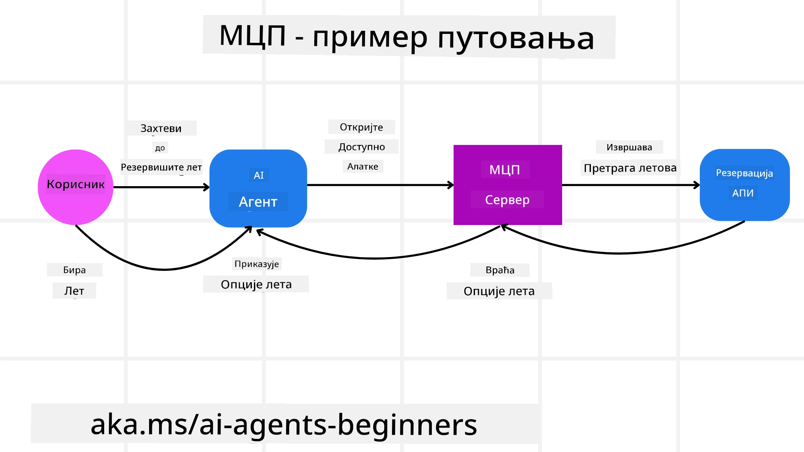
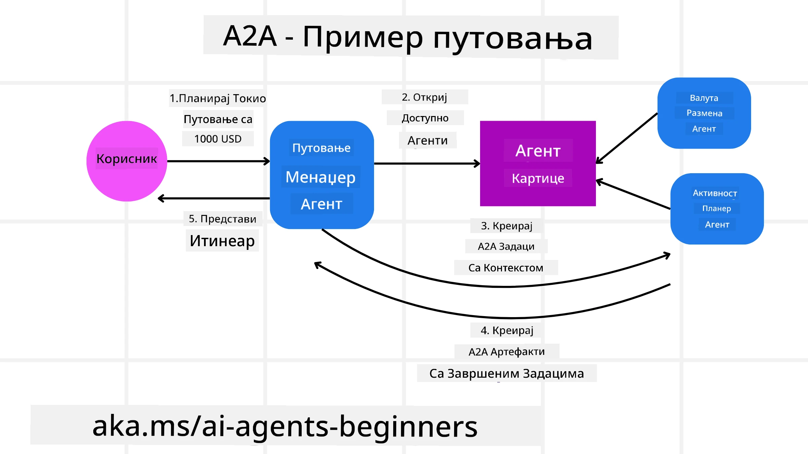
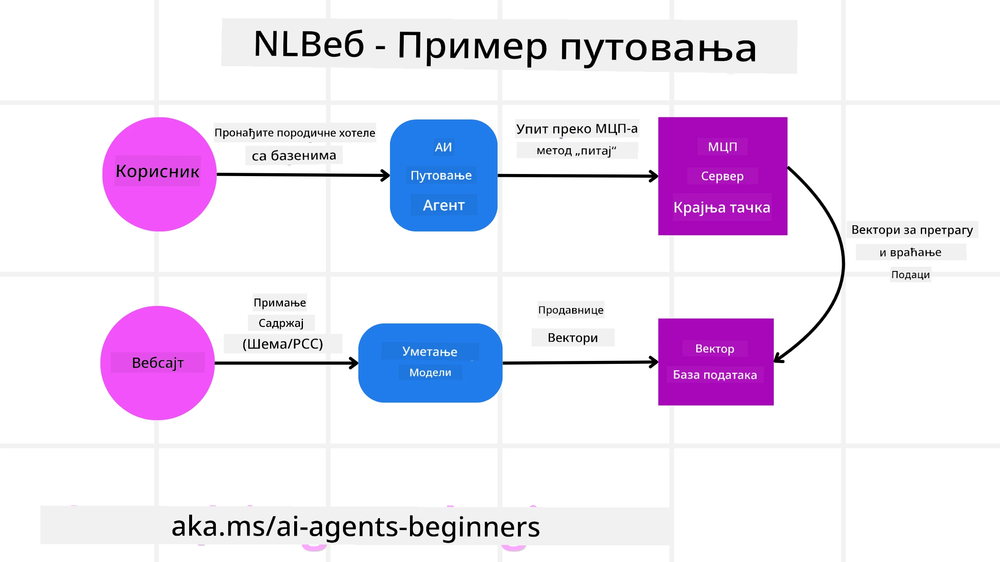

<!--
CO_OP_TRANSLATOR_METADATA:
{
  "original_hash": "aff92c6f019b4627ca9399c6e3882e17",
  "translation_date": "2025-09-18T15:40:17+00:00",
  "source_file": "11-agentic-protocols/README.md",
  "language_code": "sr"
}
-->
# Коришћење агентских протокола (MCP, A2A и NLWeb)

> _(Кликните на слику изнад да бисте погледали видео лекцију)_

Како употреба AI агената расте, тако расте и потреба за протоколима који обезбеђују стандардизацију, сигурност и подршку за отворене иновације. У овој лекцији покрићемо три протокола која имају за циљ да задовоље ову потребу - Model Context Protocol (MCP), Agent to Agent (A2A) и Natural Language Web (NLWeb).

## Увод

У овој лекцији ћемо обрадити:

• Како **MCP** омогућава AI агентима приступ спољашњим алатима и подацима ради испуњавања корисничких задатака.

• Како **A2A** омогућава комуникацију и сарадњу између различитих AI агената.

• Како **NLWeb** доноси интерфејсе природног језика на било коју веб страницу, омогућавајући AI агентима да открију и интерагују са садржајем.

## Циљеви учења

• **Идентификовати** основну сврху и предности MCP, A2A и NLWeb у контексту AI агената.

• **Објаснити** како сваки протокол олакшава комуникацију и интеракцију између LLM-ова, алата и других агената.

• **Препознати** различите улоге које сваки протокол игра у изградњи сложених агентских система.

## Model Context Protocol

**Model Context Protocol (MCP)** је отворени стандард који пружа стандардизован начин за апликације да обезбеде контекст и алате за LLM-ове. Ово омогућава "универзални адаптер" за различите изворе података и алате којима AI агенти могу приступити на конзистентан начин.

Хајде да погледамо компоненте MCP-а, предности у поређењу са директним коришћењем API-ја и пример како AI агенти могу користити MCP сервер.

### Основне компоненте MCP-а

MCP функционише на **клијент-сервер архитектури**, а основне компоненте су:

• **Хостови** су LLM апликације (на пример, уређивач кода као што је VSCode) које иницирају везе са MCP сервером.

• **Клијенти** су компоненте унутар хост апликације које одржавају један-на-један везе са серверима.

• **Сервери** су лагани програми који излажу одређене могућности.

Протокол укључује три основна примитива која представљају могућности MCP сервера:

• **Алати**: То су одвојене акције или функције које AI агент може позвати да изврши одређену радњу. На пример, сервис за временску прогнозу може излагати алат "добиј временску прогнозу", или е-трговински сервер може излагати алат "купи производ". MCP сервери оглашавају име, опис и шему улазних/излазних података за сваки алат у својој листи могућности.

• **Ресурси**: То су подаци или документи који MCP сервер може обезбедити, а клијенти их могу преузети на захтев. Примери укључују садржај датотека, записе из базе података или лог фајлове. Ресурси могу бити текстуални (као што су код или JSON) или бинарни (као што су слике или PDF-ови).

• **Подсетници**: То су унапред дефинисани шаблони који пружају предложене подсетнике, омогућавајући сложеније токове рада.

### Предности MCP-а

MCP нуди значајне предности за AI агенте:

• **Динамичко откривање алата**: Агенти могу динамички добити листу доступних алата са сервера заједно са описима њихове функције. Ово је супротно традиционалним API-јевима, који често захтевају статичко кодирање за интеграције, што значи да свака промена API-ја захтева ажурирање кода. MCP нуди приступ "интегриши једном", што доводи до веће прилагодљивости.

• **Интероперабилност између LLM-ова**: MCP функционише са различитим LLM-овима, пружајући флексибилност за промену основних модела ради боље перформансе.

• **Стандардизована сигурност**: MCP укључује стандардни метод аутентификације, побољшавајући скалабилност приликом додавања приступа додатним MCP серверима. Ово је једноставније од управљања различитим кључевима и типовима аутентификације за различите традиционалне API-је.

### MCP Пример

Замислите да корисник жели да резервише лет користећи AI асистента који је покренут MCP-ом.

1. **Повезивање**: AI асистент (MCP клијент) се повезује са MCP сервером који обезбеђује авио-компанија.

2. **Откривање алата**: Клијент пита MCP сервер авио-компаније, "Које алате имате на располагању?" Сервер одговара са алатима као што су "претражи летове" и "резервиши летове".

3. **Позивање алата**: Затим питате AI асистента, "Молим те, претражи лет од Портланда до Хонолулуа." AI асистент, користећи свој LLM, идентификује да треба да позове алат "претражи летове" и прослеђује релевантне параметре (полазак, одредиште) MCP серверу.

4. **Извршење и одговор**: MCP сервер, који делује као омотач, прави стварни позив на интерни API за резервацију авио-компаније. Затим добија информације о лету (нпр. JSON податке) и шаље их назад AI асистенту.

5. **Додатна интеракција**: AI асистент представља опције летова. Када изаберете лет, асистент може позвати алат "резервиши лет" на истом MCP серверу, завршавајући резервацију.

## Agent-to-Agent Protocol (A2A)

Док MCP фокусира на повезивање LLM-ова са алатима, **Agent-to-Agent (A2A) протокол** иде корак даље омогућавајући комуникацију и сарадњу између различитих AI агената. A2A повезује AI агенте из различитих организација, окружења и технолошких платформи ради испуњавања заједничког задатка.

Размотрићемо компоненте и предности A2A, као и пример како би се могао применити у нашој апликацији за путовања.

### Основне компоненте A2A

A2A се фокусира на омогућавање комуникације између агената и њихову сарадњу ради испуњавања подзадатка корисника. Свака компонента протокола доприноси овоме:

#### Картица агента

Слично као што MCP сервер дели листу алата, картица агента садржи:
- Име агента.
- **Опис општих задатака** које обавља.
- **Листу специфичних вештина** са описима како би други агенти (или чак људски корисници) разумели када и зашто би желели да позову тог агента.
- **Тренутни URL крајње тачке** агента.
- **Верзију** и **могућности** агента, као што су стримовање одговора и пуш нотификације.

#### Извршилац агента

Извршилац агента је одговоран за **преношење контекста корисничког разговора удаљеном агенту**, јер удаљени агент треба ово да би разумео задатак који треба да се обави. У A2A серверу, агент користи свој Large Language Model (LLM) за анализу долазних захтева и извршавање задатака користећи своје интерне алате.

#### Артефакт

Када удаљени агент заврши тражени задатак, његов радни производ се креира као артефакт. Артефакт **садржи резултат рада агента**, **опис онога што је завршено**, и **текстуални контекст** који је послат кроз протокол. Након што је артефакт послат, веза са удаљеним агентом се затвара док поново не буде потребна.

#### Ред догађаја

Ова компонента се користи за **руковање ажурирањима и преношење порука**. Посебно је важна у продукцији за агентске системе како би се спречило затварање везе између агената пре него што се задатак заврши, посебно када време завршетка задатка може бити дуже.

### Предности A2A

• **Побољшана сарадња**: Омогућава агентима из различитих добављача и платформи да интерагују, деле контекст и раде заједно, олакшавајући беспрекорну аутоматизацију између традиционално неповезаних система.

• **Флексибилност у избору модела**: Сваки A2A агент може одлучити који LLM користи за обраду својих захтева, омогућавајући оптимизоване или фино подешене моделе по агенту, за разлику од једне LLM везе у неким MCP сценаријима.

• **Уграђена аутентификација**: Аутентификација је директно интегрисана у A2A протокол, пружајући робустан оквир за сигурност интеракција агената.

### A2A Пример

Проширимо наш сценарио резервације путовања, али овог пута користећи A2A.

1. **Кориснички захтев мулти-агенту**: Корисник интерагује са "Путничким агентом" A2A клијентом/агентом, можда рекавши: "Молим те, резервиши цело путовање за Хонолулу за следећу недељу, укључујући летове, хотел и изнајмљивање аутомобила."

2. **Оркестрација од стране путничког агента**: Путнички агент прима овај сложени захтев. Користи свој LLM да размисли о задатку и одреди да треба да интерагује са другим специјализованим агентима.

3. **Комуникација између агената**: Путнички агент затим користи A2A протокол да се повеже са нижим агентима, као што су "Авио агент", "Хотелски агент" и "Агент за изнајмљивање аутомобила" које су креирале различите компаније.

4. **Делегирано извршење задатка**: Путнички агент шаље специфичне задатке овим специјализованим агентима (нпр. "Пронађи летове за Хонолулу," "Резервиши хотел," "Изнајми аутомобил"). Сваки од ових специјализованих агената, који покрећу своје LLM-ове и користе своје алате (који могу бити MCP сервери сами по себи), обавља свој специфични део резервације.

5. **Консолидовани одговор**: Када сви нижим агенти заврше своје задатке, путнички агент компилира резултате (детаље о лету, потврду хотела, резервацију аутомобила) и шаље свеобухватан, разговорни одговор назад кориснику.

## Natural Language Web (NLWeb)

Веб странице су дуго биле примарни начин за кориснике да приступе информацијама и подацима на интернету.

Хајде да погледамо различите компоненте NLWeb-а, предности NLWeb-а и пример како наш NLWeb функционише кроз нашу апликацију за путовања.

### Компоненте NLWeb-а

- **NLWeb апликација (основни код услуге)**: Систем који обрађује питања на природном језику. Повезује различите делове платформе ради креирања одговора. Можете га замислити као **мотор који покреће функције природног језика** веб странице.

- **NLWeb протокол**: Ово је **основни сет правила за интеракцију на природном језику** са веб страницом. Враћа одговоре у JSON формату (често користећи Schema.org). Његова сврха је да створи једноставну основу за "AI веб," на исти начин као што је HTML омогућио дељење докумената на мрежи.

- **MCP сервер (Model Context Protocol крајња тачка)**: Сваки NLWeb систем такође функционише као **MCP сервер**. То значи да може **делити алате (као што је метода "питај") и податке** са другим AI системима. У пракси, ово чини садржај и могућности веб странице употребљивим за AI агенте, омогућавајући веб страници да постане део ширег "екосистема агената."

- **Модели за уграђивање**: Ови модели се користе за **претварање садржаја веб странице у нумеричке репрезентације зване вектори** (уграђивања). Ови вектори хватају значење на начин који рачунари могу упоређивати и претраживати. Чувају се у посебној бази података, а корисници могу изабрати који модел за уграђивање желе да користе.

- **Векторска база података (механизам за преузимање)**: Ова база података **чува уграђивања садржаја веб странице**. Када неко постави питање, NLWeb проверава векторску базу података да брзо пронађе најрелевантније информације. Даје брзу листу могућих одговора, рангираних по сличности. NLWeb ради са различитим системима за складиштење вектора као што су Qdrant, Snowflake, Milvus, Azure AI Search и Elasticsearch.

### NLWeb Пример

Размотримо нашу веб страницу за резервацију путовања, али овог пута, она је покренута NLWeb-ом.

1. **Унос података**: Постојећи каталози производа веб странице за путовања (нпр. листе летова, описи хотела, туристички пакети) се форматирају користећи Schema.org или учитавају преко RSS фидова. Алатке NLWeb-а уносе ове структуриране податке, креирају уграђивања и чувају их у локалној или удаљеној векторској бази података.

2. **Питање на природном језику (човек)**: Корисник посећује веб страницу и, уместо да прегледа меније, уноси у интерфејс за разговор: "Пронађи ми хотел прилагођен породицама у Хонолулуу са базеном за следећу недељу."

3. **Обрада NLWeb-а**: NLWeb апликација прима овај упит. Шаље упит LLM-у ради разумевања и истовремено претражује своју векторску базу података за релевантне листе хотела.

4. **Прецизни резултати**: LLM помаже у интерпретацији резултата претраге из базе података, идентификује најбоље подударности на основу критеријума "прилагођен породицама," "базен" и "Хонолулу," и затим форматира од

---

**Одрицање од одговорности**:  
Овај документ је преведен коришћењем услуге за превођење помоћу вештачке интелигенције [Co-op Translator](https://github.com/Azure/co-op-translator). Иако се трудимо да обезбедимо тачност, молимо вас да имате у виду да аутоматски преводи могу садржати грешке или нетачности. Оригинални документ на његовом изворном језику треба сматрати ауторитативним извором. За критичне информације препоручује се професионални превод од стране људи. Не преузимамо одговорност за било каква погрешна тумачења или неспоразуме који могу настати услед коришћења овог превода.