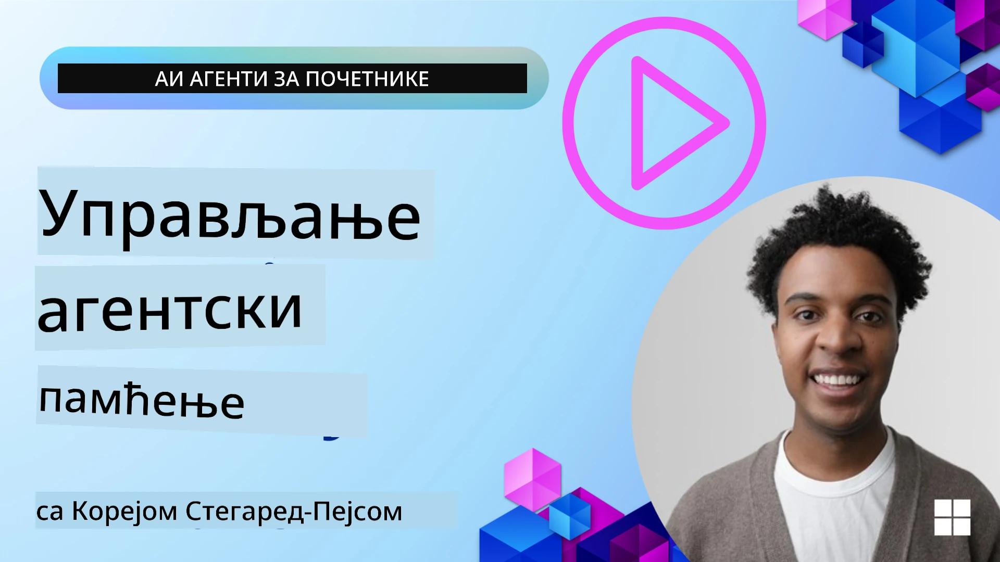

<!--
CO_OP_TRANSLATOR_METADATA:
{
  "original_hash": "a1d90991499ad697c4ad24decaf36968",
  "translation_date": "2025-12-09T12:49:51+00:00",
  "source_file": "13-agent-memory/README.md",
  "language_code": "sr"
}
-->
# Меморија за AI агенте 

Када говоримо о јединственим предностима креирања AI агената, углавном се дискутује о две ствари: могућност позивања алата за обављање задатака и способност побољшања током времена. Меморија је основа за креирање агента који се сам побољшава и који може пружити боље искуство нашим корисницима.

У овом лекцији, погледаћемо шта је меморија за AI агенте и како можемо управљати њом и користити је за добробит наших апликација.

## Увод

Ова лекција ће обухватити:

• **Разумевање меморије AI агента**: Шта је меморија и зашто је она суштинска за агенте.

• **Имплементација и складиштење меморије**: Практичне методе за додавање способности меморије вашим AI агентима, са фокусом на краткорочну и дугорочну меморију.

• **Прављење AI агената који се сами побољшавају**: Како меморија омогућава агентима да уче из претходних интеракција и побољшавају се током времена.

## Доступне имплементације

Ова лекција укључује два свеобухватна туторијала у облику нотебоок-а:

• **[13-agent-memory.ipynb](./13-agent-memory.ipynb)**: Имплементира меморију користећи Mem0 и Azure AI Search са Semantic Kernel оквиром

• **[13-agent-memory-cognee.ipynb](./13-agent-memory-cognee.ipynb)**: Имплементира структурисану меморију користећи Cognee, аутоматски градећи граф знања подржан ембедингом, визуализујући граф и интелигентно претражујући

## Циљеви учења

Након завршетка ове лекције, знаћете како да:

• **Разликујете различите типове меморије AI агента**, укључујући радну, краткорочну и дугорочну меморију, као и специјализоване форме попут меморије личности и епизодне меморије.

• **Имплементирате и управљате краткорочном и дугорочном меморијом за AI агенте** користећи Semantic Kernel оквир, уз коришћење алата као што су Mem0, Cognee, Whiteboard меморија и интеграцију са Azure AI Search.

• **Разумете принципе иза AI агената који се сами побољшавају** и како робусни системи управљања меморијом доприносе континуираном учењу и адаптацији.

## Разумевање меморије AI агента

У својој суштини, **меморија за AI агенте односи се на механизме који им омогућавају да задрже и призову информације**. Ове информације могу бити специфични детаљи о разговору, корисничке преференције, претходне акције или чак научени обрасци.

Без меморије, AI апликације су често без стања, што значи да свака интеракција почиње од нуле. Ово доводи до поновљеног и фрустрирајућег корисничког искуства где агент "заборавља" претходни контекст или преференције.

### Зашто је меморија важна?

Интелигенција агента је дубоко повезана са његовом способношћу да се присети и искористи претходне информације. Меморија омогућава агентима да буду:

• **Рефлексивни**: Учење из претходних акција и исхода.

• **Интерактивни**: Одржавање контекста током текућег разговора.

• **Проактивни и реактивни**: Предвиђање потреба или одговарање на основу историјских података.

• **Аутономни**: Рад више независно ослањајући се на сачувано знање.

Циљ имплементације меморије је да агенти постану више **поуздани и способни**.

### Типови меморије

#### Радна меморија

Замислите ово као комад папира за белешке који агент користи током једног, текућег задатка или процеса размишљања. Она држи непосредне информације потребне за израчунавање следећег корака.

За AI агенте, радна меморија често хвата најрелевантније информације из разговора, чак и ако је цела историја чета дуга или скраћена. Фокусира се на издвајање кључних елемената као што су захтеви, предлози, одлуке и акције.

**Пример радне меморије**

У агенту за резервацију путовања, радна меморија може да ухвати тренутни захтев корисника, као што је "Желим да резервишем путовање у Париз". Овај специфичан захтев се држи у непосредном контексту агента како би водио текућу интеракцију.

#### Краткорочна меморија

Овај тип меморије задржава информације током трајања једног разговора или сесије. То је контекст текућег чета, омогућавајући агенту да се позове на претходне кораке у дијалогу.

**Пример краткорочне меморије**

Ако корисник пита, "Колико би коштао лет за Париз?" а затим настави са "Шта је са смештајем тамо?", краткорочна меморија осигурава да агент зна да "тамо" се односи на "Париз" у истом разговору.

#### Дугорочна меморија

Ово су информације које трају током више разговора или сесија. Омогућава агентима да памте корисничке преференције, историјске интеракције или опште знање током дужег периода. Ово је важно за персонализацију.

**Пример дугорочне меморије**

Дугорочна меморија може да чува да "Бен ужива у скијању и активностима на отвореном, воли кафу са погледом на планину и жели да избегне напредне скијашке стазе због претходне повреде". Ове информације, научене из претходних интеракција, утичу на препоруке у будућим сесијама планирања путовања, чинећи их веома персонализованим.

#### Меморија личности

Овај специјализовани тип меморије помаже агенту да развије доследну "личност" или "персону". Омогућава агенту да памти детаље о себи или својој намењеној улози, чинећи интеракције течнијим и фокусиранијим.

**Пример меморије личности**
Ако је агент за путовања дизајниран да буде "стручњак за планирање скијања", меморија личности може да ојача ову улогу, утичући на његове одговоре да се ускладе са тоном и знањем стручњака.

#### Радна/епизодна меморија

Ова меморија чува низ корака које агент предузима током сложеног задатка, укључујући успехе и неуспехе. То је као памћење специфичних "епизода" или претходних искустава ради учења из њих.

**Пример епизодне меморије**

Ако је агент покушао да резервише одређени лет, али није успео због недоступности, епизодна меморија може да забележи овај неуспех, омогућавајући агенту да проба алтернативне летове или да обавести корисника о проблему на информисанији начин током следећег покушаја.

#### Меморија ентитета

Ово укључује издвајање и памћење специфичних ентитета (као што су људи, места или ствари) и догађаја из разговора. Омогућава агенту да изгради структурисано разумевање кључних елемената о којима се говори.

**Пример меморије ентитета**

Из разговора о претходном путовању, агент може да издвоји "Париз", "Ајфелов торањ" и "вечера у ресторану Le Chat Noir" као ентитете. У будућој интеракцији, агент би могао да се присети "Le Chat Noir" и понуди да направи нову резервацију тамо.

#### Структурисани RAG (Retrieval Augmented Generation)

Док је RAG шира техника, "Структурисани RAG" се истиче као моћна технологија меморије. Он издваја густе, структурисане информације из различитих извора (разговора, имејлова, слика) и користи их за побољшање прецизности, присећања и брзине у одговорима. За разлику од класичног RAG-а који се ослања искључиво на семантичку сличност, Структурисани RAG ради са унутрашњом структуром информација.

**Пример структурисаног RAG-а**

Уместо да само упоређује кључне речи, Структурисани RAG може да анализира детаље лета (одредиште, датум, време, авио-компанија) из имејла и складишти их на структурисан начин. Ово омогућава прецизна питања као што је "Који лет сам резервисао за Париз у уторак?"

## Имплементација и складиштење меморије

Имплементација меморије за AI агенте укључује систематски процес **управљања меморијом**, који обухвата генерисање, складиштење, преузимање, интеграцију, ажурирање, па чак и "заборављање" (или брисање) информација. Преузимање је посебно кључан аспект.

### Специјализовани алати за меморију

#### Mem0

Један од начина за складиштење и управљање меморијом агента је коришћење специјализованих алата као што је Mem0. Mem0 функционише као слој перзистентне меморије, омогућавајући агентима да се присете релевантних интеракција, складиште корисничке преференције и фактички контекст, и уче из успеха и неуспеха током времена. Идеја је да се агенти без стања претворе у агенте са стањем.

Он функционише кроз **двофазни процес меморије: екстракција и ажурирање**. Прво, поруке додате у нит агента се шаљу Mem0 сервису, који користи Large Language Model (LLM) за сумирање историје разговора и издвајање нових меморија. Након тога, фаза ажурирања вођена LLM-ом одређује да ли да дода, измени или избрише те меморије, складиштећи их у хибридној бази података која може укључивати векторске, графичке и key-value базе података. Овај систем такође подржава различите типове меморије и може укључити графичку меморију за управљање односима између ентитета.

#### Cognee

Још један моћан приступ је коришћење **Cognee**, отвореног кода за семантичку меморију AI агената који трансформише структурисане и неструктурисане податке у графове знања који се могу претраживати, подржане ембедингом. Cognee пружа **архитектуру двоструког складишта** која комбинује претрагу по векторској сличности са графичким односима, омогућавајући агентима да разумеју не само које информације су сличне, већ и како се концепти међусобно односе.

Он се истиче у **хибридном преузимању** које комбинује векторску сличност, графичку структуру и LLM резоновање - од претраге сирових делова до одговарања на питања свесних графа. Систем одржава **живу меморију** која се развија и расте док остаје претражива као један повезан граф, подржавајући и краткорочни контекст сесије и дугорочну перзистентну меморију.

Туторијал Cognee нотебоок-а ([13-agent-memory-cognee.ipynb](./13-agent-memory-cognee.ipynb)) демонстрира изградњу овог јединственог слоја меморије, са практичним примерима уноса различитих извора података, визуализације графа знања и претраживања са различитим стратегијама претраге прилагођеним специфичним потребама агента.

### Складиштење меморије са RAG

Поред специјализованих алата за меморију као што је Mem0, можете искористити робусне услуге претраге као што је **Azure AI Search као позадину за складиштење и преузимање меморија**, посебно за структурисани RAG.

Ово вам омогућава да заснујете одговоре вашег агента на сопственим подацима, осигуравајући релевантније и прецизније одговоре. Azure AI Search може се користити за складиштење корисничких меморија о путовањима, каталога производа или било ког другог доменског знања.

Azure AI Search подржава могућности као што је **структурисани RAG**, који се истиче у издвајању и преузимању густих, структурисаних информација из великих скупова података као што су историје разговора, имејлови или чак слике. Ово пружа "суперхуману прецизност и присећање" у поређењу са традиционалним приступима текстуалног сегментирања и ембединга.

## Прављење AI агената који се сами побољшавају

Уобичајени образац за агенте који се сами побољшавају укључује увођење **"агента знања"**. Овај посебан агент посматра главни разговор између корисника и примарног агента. Његова улога је да:

1. **Идентификује вредне информације**: Одреди да ли је било који део разговора вредан чувања као опште знање или специфична корисничка преференција.

2. **Издвоји и сумира**: Дестилује суштинско учење или преференцију из разговора.

3. **Складишти у базу знања**: Перзистира издвојене информације, често у векторској бази података, како би се касније могле преузети.

4. **Допуни будуће упите**: Када корисник иницира нови упит, агент знања преузима релевантне сачуване информације и додаје их корисничком упиту, пружајући кључни контекст примарном агенту (слично RAG-у).

### Оптимизације за меморију

• **Управљање кашњењем**: Да би се избегло успоравање интеракција са корисником, јефтинији, бржи модел може се користити у почетку за брзо проверавање да ли је информација вредна чувања или преузимања, а сложенији процес екстракције/преузимања се позива само када је неопходно.

• **Одржавање базе знања**: За растућу базу знања, ређе коришћене информације могу се преместити у "хладно складиштење" ради управљања трошковима.

## Имате још питања о меморији агента?

Придружите се [Azure AI Foundry Discord](https://aka.ms/ai-agents/discord) да се повежете са другим ученицима, присуствујете радним часов

---

<!-- CO-OP TRANSLATOR DISCLAIMER START -->
**Одрицање од одговорности**:  
Овај документ је преведен коришћењем услуге за превођење помоћу вештачке интелигенције [Co-op Translator](https://github.com/Azure/co-op-translator). Иако се трудимо да обезбедимо тачност, молимо вас да имате у виду да аутоматски преводи могу садржати грешке или нетачности. Оригинални документ на изворном језику треба сматрати меродавним извором. За критичне информације препоручује се професионални превод од стране људи. Не преузимамо одговорност за било каква погрешна тумачења или неспоразуме који могу настати услед коришћења овог превода.
<!-- CO-OP TRANSLATOR DISCLAIMER END -->