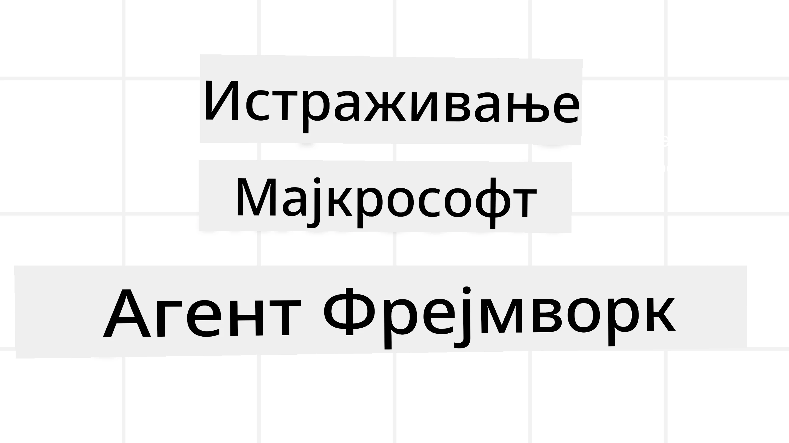
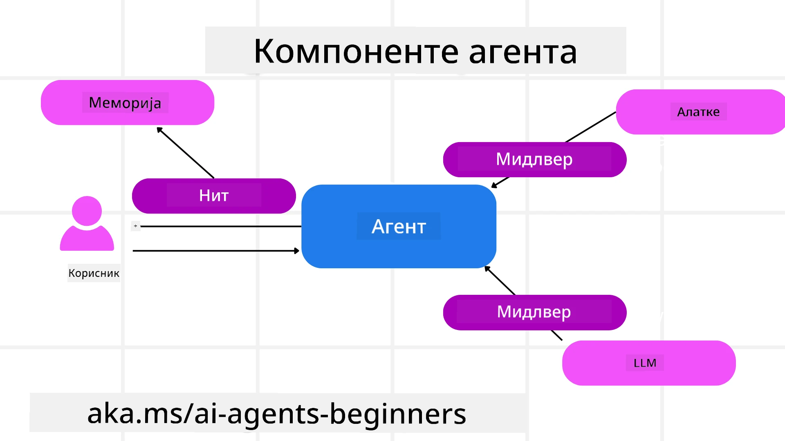

<!--
CO_OP_TRANSLATOR_METADATA:
{
  "original_hash": "19c4dab375acbc733855cc7f2f04edbc",
  "translation_date": "2025-10-02T06:49:39+00:00",
  "source_file": "14-microsoft-agent-framework/README.md",
  "language_code": "sr"
}
-->
# Истраживање Microsoft Agent Framework-а



### Увод

Ова лекција обухвата:

- Разумевање Microsoft Agent Framework-а: Кључне карактеристике и вредност  
- Истраживање основних концепата Microsoft Agent Framework-а
- Поређење MAF-а са Semantic Kernel-ом и AutoGen-ом: Водич за миграцију

## Циљеви учења

Након завршетка ове лекције, знаћете како да:

- Направите AI агенте спремне за производњу користећи Microsoft Agent Framework
- Примените основне карактеристике Microsoft Agent Framework-а на своје агентске случајеве употребе
- Мигрирате и интегришете постојеће агентске оквире и алате  

## Примери кода 

Примери кода за [Microsoft Agent Framework (MAF)](https://aka.ms/ai-agents-beginners/agent-framewrok) могу се наћи у овом репозиторијуму у датотекама `xx-python-agent-framework` и `xx-dotnet-agent-framework`.

## Разумевање Microsoft Agent Framework-а


[Microsoft Agent Framework (MAF)](https://aka.ms/ai-agents-beginners/agent-framewrok) је изграђен на основу искуства и научених лекција из Semantic Kernel-а и AutoGen-а. Пружа флексибилност за решавање широког спектра агентских случајева употребе у производним и истраживачким окружењима, укључујући:

- **Оркестрацију секвенцијалних агената** у сценаријима где су потребни корак-по-корак радни токови.
- **Конкурентну оркестрацију** у сценаријима где агенти треба да заврше задатке истовремено.
- **Оркестрацију групног чета** у сценаријима где агенти могу сарађивати на једном задатку.
- **Оркестрацију предаје** у сценаријима где агенти предају задатак један другом након завршетка подзадатака.
- **Магнетну оркестрацију** у сценаријима где менаџерски агент креира и модификује листу задатака и управља координацијом подагената за завршетак задатка.

Да би испоручио AI агенте у производњи, MAF укључује карактеристике за:

- **Посматрање** кроз употребу OpenTelemetry-а, где се свака акција AI агента, укључујући позиве алата, кораке оркестрације, токове резоновања и праћење перформанси, може пратити кроз Azure AI Foundry контролне табле.
- **Безбедност** хостовањем агената нативно на Azure AI Foundry-у, који укључује контроле безбедности као што су приступ заснован на улогама, руковање приватним подацима и уграђена безбедност садржаја.
- **Трајност** јер агентски токови и радни токови могу паузирати, наставити и опоравити се од грешака, што омогућава дуготрајне процесе.
- **Контролу** јер су подржани радни токови са људском интервенцијом, где се задаци означавају као они који захтевају људско одобрење.

Microsoft Agent Framework је такође фокусиран на интероперабилност кроз:

- **Независност од облака** - Агенти могу радити у контејнерима, локално и на различитим облацима.
- **Независност од провајдера** - Агенти се могу креирати преко вашег омиљеног SDK-а, укључујући Azure OpenAI и OpenAI.
- **Интеграцију отворених стандарда** - Агенти могу користити протоколе као што су Agent-to-Agent (A2A) и Model Context Protocol (MCP) за откривање и коришћење других агената и алата.
- **Плагине и конекторе** - Могуће је повезивање са сервисима за податке и меморију као што су Microsoft Fabric, SharePoint, Pinecone и Qdrant.

Хајде да погледамо како се ове карактеристике примењују на неке од основних концепата Microsoft Agent Framework-а.

## Основни концепти Microsoft Agent Framework-а

### Агенти



**Креирање агената**

Креирање агента се врши дефинисањем сервиса за инференцију (LLM провајдер), скупа инструкција које AI агент треба да прати и додељивањем `имена`:

```python
agent = AzureOpenAIChatClient(credential=AzureCliCredential()).create_agent( instructions="You are good at recommending trips to customers based on their preferences.", name="TripRecommender" )
```

Горњи пример користи `Azure OpenAI`, али агенти се могу креирати користећи различите сервисе, укључујући `Azure AI Foundry Agent Service`:

```python
AzureAIAgentClient(async_credential=credential).create_agent( name="HelperAgent", instructions="You are a helpful assistant." ) as agent
```

OpenAI `Responses`, `ChatCompletion` API-је

```python
agent = OpenAIResponsesClient().create_agent( name="WeatherBot", instructions="You are a helpful weather assistant.", )
```

```python
agent = OpenAIChatClient().create_agent( name="HelpfulAssistant", instructions="You are a helpful assistant.", )
```

или удаљене агенте користећи A2A протокол:

```python
agent = A2AAgent( name=agent_card.name, description=agent_card.description, agent_card=agent_card, url="https://your-a2a-agent-host" )
```

**Покретање агената**

Агенти се покрећу коришћењем метода `.run` или `.run_stream` за одговоре без стриминга или са стримингом.

```python
result = await agent.run("What are good places to visit in Amsterdam?")
print(result.text)
```

```python
async for update in agent.run_stream("What are the good places to visit in Amsterdam?"):
    if update.text:
        print(update.text, end="", flush=True)

```

Сваки покренути агент може имати опције за прилагођавање параметара као што су `max_tokens` које агент користи, `tools` које агент може позвати, па чак и сам `model` који се користи за агента.

Ово је корисно у случајевима где су потребни специфични модели или алати за завршетак корисничког задатка.

**Алатке**

Алатке се могу дефинисати и приликом дефинисања агента:

```python
def get_attractions( location: Annotated[str, Field(description="The location to get the top tourist attractions for")], ) -> str: """Get the top tourist attractions for a given location.""" return f"The top attractions for {location} are." 


# When creating a ChatAgent directly 

agent = ChatAgent( chat_client=OpenAIChatClient(), instructions="You are a helpful assistant", tools=[get_attractions]

```

и такође приликом покретања агента:

```python

result1 = await agent.run( "What's the best place to visit in Seattle?", tools=[get_attractions] # Tool provided for this run only )
```

**Токови агента**

Токови агента се користе за руковање разговорима са више обртаја. Токови се могу креирати на два начина:

- Коришћењем `get_new_thread()` који омогућава да се ток сачува током времена
- Аутоматским креирањем тока приликом покретања агента, где ток траје само током тренутног покретања.

Да бисте креирали ток, код изгледа овако:

```python
# Create a new thread. 
thread = agent.get_new_thread() # Run the agent with the thread. 
response = await agent.run("Hello, I am here to help you book travel. Where would you like to go?", thread=thread)

```

Затим можете серијализовати ток да би се сачувао за каснију употребу:

```python
# Create a new thread. 
thread = agent.get_new_thread() 

# Run the agent with the thread. 

response = await agent.run("Hello, how are you?", thread=thread) 

# Serialize the thread for storage. 

serialized_thread = await thread.serialize() 

# Deserialize the thread state after loading from storage. 

resumed_thread = await agent.deserialize_thread(serialized_thread)
```

**Средњи слој агента**

Агенти интерагују са алатима и LLM-овима да би завршили корисничке задатке. У одређеним сценаријима, желимо да извршимо или пратимо радње између ових интеракција. Средњи слој агента нам омогућава да то урадимо кроз:

*Функционални средњи слој*

Овај средњи слој нам омогућава да извршимо радњу између агента и функције/алата који ће позвати. Пример када би се ово користило је када желите да урадите неко логовање позива функције.

У коду испод `next` дефинише да ли треба позвати следећи средњи слој или стварну функцију.

```python
async def logging_function_middleware(
    context: FunctionInvocationContext,
    next: Callable[[FunctionInvocationContext], Awaitable[None]],
) -> None:
    """Function middleware that logs function execution."""
    # Pre-processing: Log before function execution
    print(f"[Function] Calling {context.function.name}")

    # Continue to next middleware or function execution
    await next(context)

    # Post-processing: Log after function execution
    print(f"[Function] {context.function.name} completed")
```

*Средњи слој чета*

Овај средњи слој нам омогућава да извршимо или логујемо радњу између агента и захтева између LLM-а.

Ово садржи важне информације као што су `messages` које се шаљу AI сервису.

```python
async def logging_chat_middleware(
    context: ChatContext,
    next: Callable[[ChatContext], Awaitable[None]],
) -> None:
    """Chat middleware that logs AI interactions."""
    # Pre-processing: Log before AI call
    print(f"[Chat] Sending {len(context.messages)} messages to AI")

    # Continue to next middleware or AI service
    await next(context)

    # Post-processing: Log after AI response
    print("[Chat] AI response received")

```

**Меморија агента**

Као што је обрађено у лекцији `Agentic Memory`, меморија је важан елемент који омогућава агенту да функционише у различитим контекстима. MAF нуди неколико различитих типова меморија:

*Меморија у RAM-у*

Ово је меморија која се чува у токовима током рада апликације.

```python
# Create a new thread. 
thread = agent.get_new_thread() # Run the agent with the thread. 
response = await agent.run("Hello, I am here to help you book travel. Where would you like to go?", thread=thread)
```

*Перзистентне поруке*

Ова меморија се користи када се историја разговора чува током различитих сесија. Дефинише се коришћењем `chat_message_store_factory`:

```python
from agent_framework import ChatMessageStore

# Create a custom message store
def create_message_store():
    return ChatMessageStore()

agent = ChatAgent(
    chat_client=OpenAIChatClient(),
    instructions="You are a Travel assistant.",
    chat_message_store_factory=create_message_store
)

```

*Динамичка меморија*

Ова меморија се додаје контексту пре него што се агенти покрену. Ове меморије могу се чувати у спољним сервисима као што је mem0:

```python
from agent_framework.mem0 import Mem0Provider

# Using Mem0 for advanced memory capabilities
memory_provider = Mem0Provider(
    api_key="your-mem0-api-key",
    user_id="user_123",
    application_id="my_app"
)

agent = ChatAgent(
    chat_client=OpenAIChatClient(),
    instructions="You are a helpful assistant with memory.",
    context_providers=memory_provider
)

```

**Посматрање агента**

Посматрање је важно за изградњу поузданих и одрживих агентских система. MAF се интегрише са OpenTelemetry-ом да би пружио праћење и метрике за боље посматрање.

```python
from agent_framework.observability import get_tracer, get_meter

tracer = get_tracer()
meter = get_meter()
with tracer.start_as_current_span("my_custom_span"):
    # do something
    pass
counter = meter.create_counter("my_custom_counter")
counter.add(1, {"key": "value"})
```

### Радни токови

MAF нуди радне токове који су унапред дефинисани кораци за завршетак задатка и укључују AI агенте као компоненте у тим корацима.

Радни токови се састоје од различитих компоненти које омогућавају бољу контролу тока. Радни токови такође омогућавају **оркестрацију више агената** и **чекпоинтинг** за чување стања радног тока.

Основне компоненте радног тока су:

**Извршиоци**

Извршиоци примају улазне поруке, обављају своје задатке и затим производе излазну поруку. Ово помера радни ток ка завршетку већег задатка. Извршиоци могу бити AI агенти или прилагођена логика.

**Ивице**

Ивице се користе за дефинисање тока порука у радном току. Оне могу бити:

*Директне ивице* - Једноставне један-на-један везе између извршилаца:

```python
from agent_framework import WorkflowBuilder

builder = WorkflowBuilder()
builder.add_edge(source_executor, target_executor)
builder.set_start_executor(source_executor)
workflow = builder.build()
```

*Условне ивице* - Активирају се након што је одређени услов испуњен. На пример, када су хотелске собе недоступне, извршилац може предложити друге опције.

*Switch-case ивице* - Усмеравају поруке ка различитим извршиоцима на основу дефинисаних услова. На пример, ако путнички клијент има приоритетни приступ, њихови задаци ће бити обрађени кроз други радни ток.

*Fan-out ивице* - Шаљу једну поруку ка више циљева.

*Fan-in ивице* - Прикупљају више порука од различитих извршилаца и шаљу их ка једном циљу.

**Догађаји**

Да би се обезбедило боље посматрање радних токова, MAF нуди уграђене догађаје за извршење, укључујући:

- `WorkflowStartedEvent`  - Почетак извршења радног тока
- `WorkflowOutputEvent` - Радни ток производи излаз
- `WorkflowErrorEvent` - Радни ток наилази на грешку
- `ExecutorInvokeEvent`  - Извршилац започиње обраду
- `ExecutorCompleteEvent`  - Извршилац завршава обраду
- `RequestInfoEvent` - Издаје се захтев

## Миграција са других оквира (Semantic Kernel и AutoGen)

### Разлике између MAF-а и Semantic Kernel-а

**Поједностављено креирање агента**

Semantic Kernel захтева креирање Kernel инстанце за сваког агента. MAF користи поједностављен приступ кроз екстензије за главне провајдере.

```python
agent = AzureOpenAIChatClient(credential=AzureCliCredential()).create_agent( instructions="You are good at reccomending trips to customers based on their preferences.", name="TripRecommender" )
```

**Креирање токова агента**

Semantic Kernel захтева ручно креирање токова. У MAF-у, агенту се директно додељује ток.

```python
thread = agent.get_new_thread() # Run the agent with the thread. 
```

**Регистрација алата**

У Semantic Kernel-у, алати се региструју у Kernel-у, а Kernel се затим прослеђује агенту. У MAF-у, алати се региструју директно током процеса креирања агента.

```python
agent = ChatAgent( chat_client=OpenAIChatClient(), instructions="You are a helpful assistant", tools=[get_attractions]
```

### Разлике између MAF-а и AutoGen-а

**Тимови vs Радни токови**

`Тимови` су структура за догађаје у активностима вођеним догађајима са агентима у AutoGen-у. MAF користи `Радне токове` који усмеравају податке ка извршиоцима кроз архитектуру засновану на графу.

**Креирање алата**

AutoGen користи `FunctionTool` за обмотавање функција које агенти позивају. MAF користи @ai_function који функционише слично, али такође аутоматски закључује шеме за сваку функцију.

**Понашање агента**

Агенти су агенти са једним обртајем по подразумеваном у AutoGen-у, осим ако `max_tool_iterations` није постављен на већи број. У MAF-у, `ChatAgent` је по подразумеваном мулти-обртајни, што значи да ће наставити да позива алате док кориснички задатак не буде завршен.

## Примери кода 

Примери кода за Microsoft Agent Framework могу се наћи у овом репозиторијуму у датотекама `xx-python-agent-framework` и `xx-dotnet-agent-framework`.

## Имате још питања о Microsoft Agent Framework-у?

Придружите се [Azure AI Foundry Discord](https://aka.ms/ai-agents/discord) за упознавање са другим ученицима, присуствовање радним сатима и добијање одговора на ваша питања о AI агентима.

---

**Одрицање од одговорности**:  
Овај документ је преведен помоћу услуге за превођење вештачке интелигенције [Co-op Translator](https://github.com/Azure/co-op-translator). Иако се трудимо да обезбедимо тачност, молимо вас да имате у виду да аутоматски преводи могу садржати грешке или нетачности. Оригинални документ на његовом изворном језику треба сматрати ауторитативним извором. За критичне информације препоручује се професионални превод од стране људи. Не преузимамо одговорност за било каква погрешна тумачења или неспоразуме који могу произаћи из коришћења овог превода.