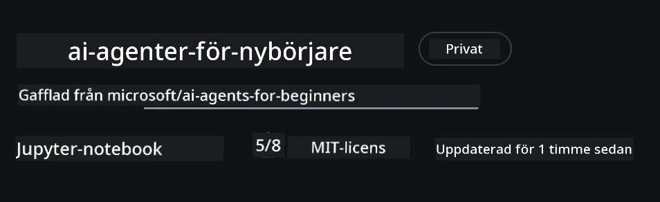
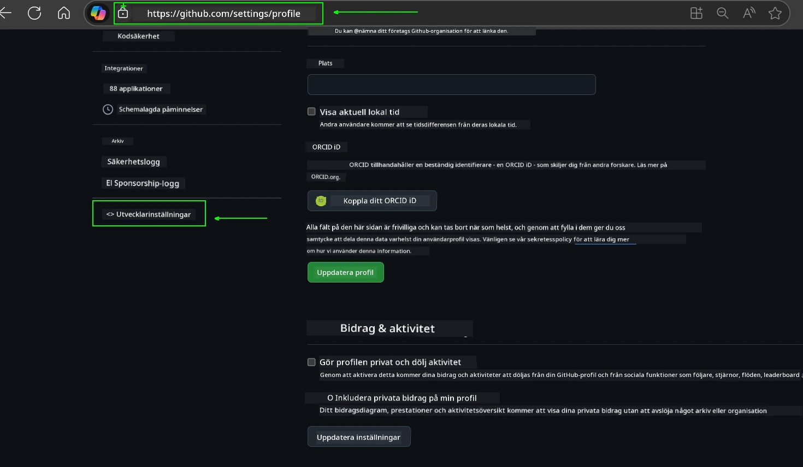
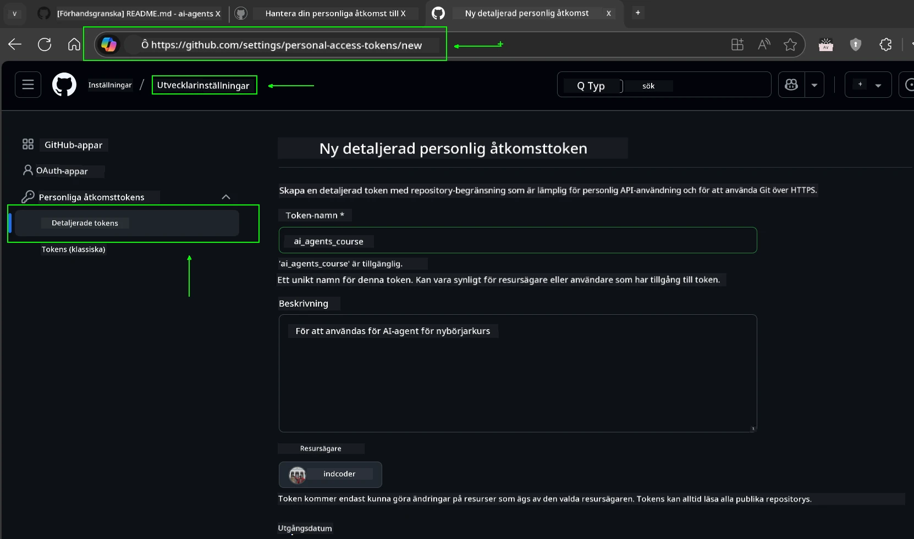
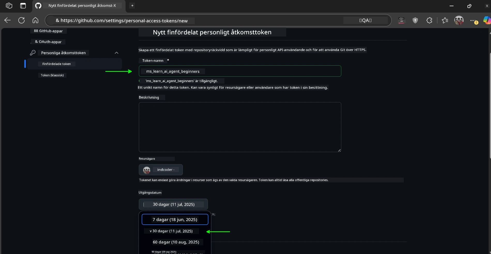
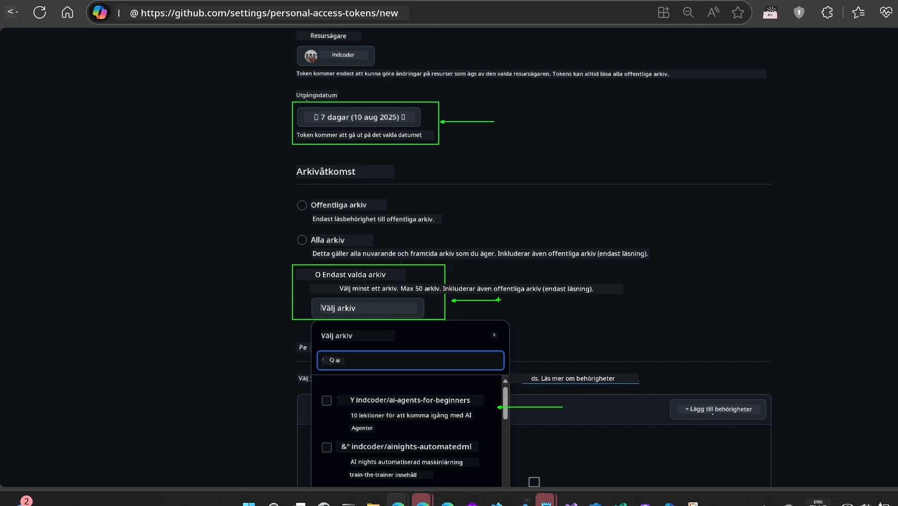
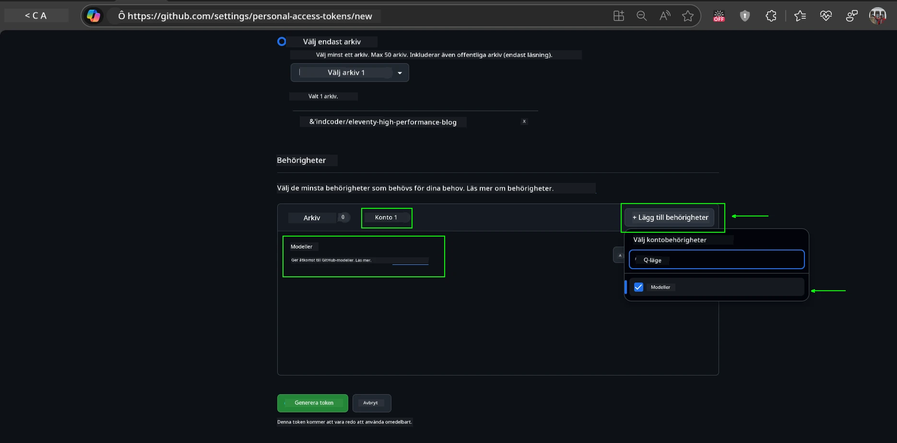
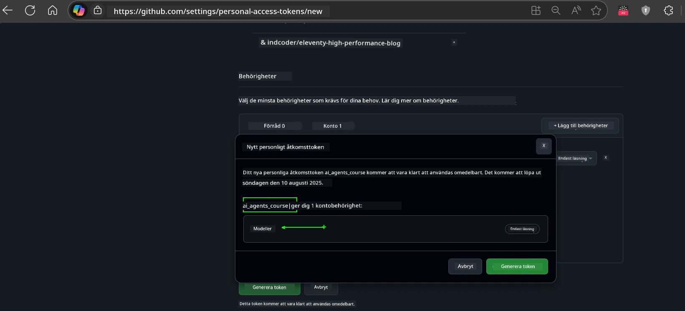
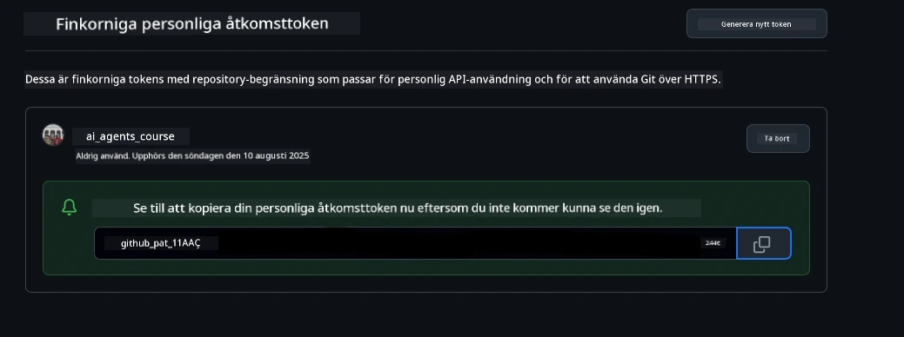
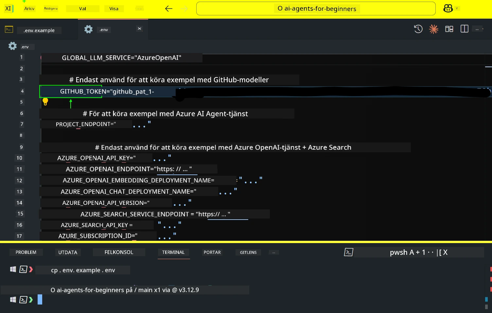

<!--
CO_OP_TRANSLATOR_METADATA:
{
  "original_hash": "63b1a8f6e840df15934935b728e569f0",
  "translation_date": "2025-12-03T14:29:51+00:00",
  "source_file": "00-course-setup/README.md",
  "language_code": "sv"
}
-->
# Kursinställning

## Introduktion

Den här lektionen kommer att täcka hur man kör kodexemplen i denna kurs.

## Gå med andra deltagare och få hjälp

Innan du börjar klona ditt repo, gå med i [AI Agents For Beginners Discord-kanalen](https://aka.ms/ai-agents/discord) för att få hjälp med inställningen, ställa frågor om kursen eller för att ansluta med andra deltagare.

## Klona eller förgrena detta repo

För att börja, klona eller förgrena GitHub-repositoriet. Detta skapar din egen version av kursmaterialet så att du kan köra, testa och justera koden!

Detta kan göras genom att klicka på länken för att <a href="https://github.com/microsoft/ai-agents-for-beginners/fork" target="_blank">förgrena repositoriet</a>

Du bör nu ha din egen förgrenade version av denna kurs på följande länk:



### Grundläggande kloning (rekommenderas för workshop / Codespaces)

  >Det fullständiga repositoriet kan vara stort (~3 GB) när du laddar ner hela historiken och alla filer. Om du bara deltar i workshopen eller endast behöver några lektionsmappar, undviker en grundläggande kloning (eller en selektiv kloning) det mesta av den nedladdningen genom att begränsa historiken och/eller hoppa över blobbar.

#### Snabb grundläggande kloning — minimal historik, alla filer

Byt ut `<your-username>` i kommandona nedan med din förgrenings-URL (eller den ursprungliga URL:en om du föredrar det).

För att klona endast den senaste commit-historiken (liten nedladdning):

```bash|powershell
git clone --depth 1 https://github.com/<your-username>/ai-agents-for-beginners.git
```

För att klona en specifik gren:

```bash|powershell
git clone --depth 1 --branch <branch-name> https://github.com/<your-username>/ai-agents-for-beginners.git
```

#### Partiell (selektiv) kloning — minimala blobbar + endast valda mappar

Detta använder partiell kloning och selektiv utcheckning (kräver Git 2.25+ och rekommenderas modern Git med stöd för partiell kloning):

```bash|powershell
git clone --depth 1 --filter=blob:none --sparse https://github.com/<your-username>/ai-agents-for-beginners.git
```

Navigera till repo-mappen:

```bash|powershell
cd ai-agents-for-beginners
```

Ange sedan vilka mappar du vill ha (exemplet nedan visar två mappar):

```bash|powershell
git sparse-checkout set 00-course-setup 01-intro-to-ai-agents
```

Efter att ha klonat och verifierat filerna, om du bara behöver filerna och vill frigöra utrymme (ingen git-historik), ta bort repositoriets metadata (💀irreversibelt — du kommer att förlora all Git-funktionalitet: inga commits, pulls, pushes eller historikåtkomst).

```bash
# zsh/bash
rm -rf .git
```

```powershell
# PowerShell
Remove-Item -Recurse -Force .git
```

#### Använda GitHub Codespaces (rekommenderas för att undvika lokala stora nedladdningar)

- Skapa en ny Codespace för detta repo via [GitHub UI](https://github.com/codespaces).  

- I terminalen för den nyss skapade Codespace, kör en av kommandona för grundläggande/selektiv kloning ovan för att endast ta in de lektionsmappar du behöver till Codespace-arbetsytan.
- Valfritt: efter kloning i Codespaces, ta bort .git för att återta extra utrymme (se borttagningskommandon ovan).
- Obs: Om du föredrar att öppna repositoriet direkt i Codespaces (utan en extra kloning), var medveten om att Codespaces kommer att konstruera utvecklingscontainer-miljön och kan fortfarande provisionera mer än du behöver. Att klona en grundläggande kopia i en ny Codespace ger dig mer kontroll över diskanvändningen.

#### Tips

- Byt alltid ut klon-URL:en med din förgrening om du vill redigera/committa.
- Om du senare behöver mer historik eller filer kan du hämta dem eller justera selektiv utcheckning för att inkludera ytterligare mappar.

## Köra koden

Denna kurs erbjuder en serie Jupyter Notebooks som du kan köra för att få praktisk erfarenhet av att bygga AI-agenter.

Kodexemplen använder antingen:

**Kräver GitHub-konto - Gratis**:

1) Semantic Kernel Agent Framework + GitHub Models Marketplace. Märkt som (semantic-kernel.ipynb)
2) AutoGen Framework + GitHub Models Marketplace. Märkt som (autogen.ipynb)

**Kräver Azure-prenumeration**:

3) Azure AI Foundry + Azure AI Agent Service. Märkt som (azureaiagent.ipynb)

Vi uppmuntrar dig att prova alla tre typer av exempel för att se vilken som fungerar bäst för dig.

Vilket alternativ du än väljer kommer att avgöra vilka installationssteg du behöver följa nedan:

## Krav

- Python 3.12+
  - **OBS**: Om du inte har Python3.12 installerat, se till att installera det. Skapa sedan din venv med python3.12 för att säkerställa att rätt versioner installeras från requirements.txt-filen.
  
    >Exempel

    Skapa Python venv-katalog:

    ```bash|powershell
    python -m venv venv
    ```

    Aktivera sedan venv-miljön för:

    ```bash
    # zsh/bash
    source venv/bin/activate
    ```
  
    ```dos
    # Command Prompt for Windows
    venv\Scripts\activate
    ```

- .NET 10+: För kodexemplen som använder .NET, se till att installera [.NET 10 SDK](https://dotnet.microsoft.com/download/dotnet/10.0) eller senare. Kontrollera sedan din installerade .NET SDK-version:

    ```bash|powershell
    dotnet --list-sdks
    ```

- Ett GitHub-konto - För åtkomst till GitHub Models Marketplace
- Azure-prenumeration - För åtkomst till Azure AI Foundry
- Azure AI Foundry-konto - För åtkomst till Azure AI Agent Service

Vi har inkluderat en `requirements.txt`-fil i roten av detta repositorium som innehåller alla nödvändiga Python-paket för att köra kodexemplen.

Du kan installera dem genom att köra följande kommando i din terminal vid roten av repositoriet:

```bash|powershell
pip install -r requirements.txt
```

Vi rekommenderar att skapa en Python-virtuell miljö för att undvika konflikter och problem.

## Installera VSCode

Se till att du använder rätt version av Python i VSCode.


## Inställning för exempel som använder GitHub-modeller 

### Steg 1: Hämta din GitHub Personal Access Token (PAT)

Denna kurs använder GitHub Models Marketplace, som ger gratis tillgång till Large Language Models (LLMs) som du kommer att använda för att bygga AI-agenter.

För att använda GitHub-modellerna måste du skapa en [GitHub Personal Access Token](https://docs.github.com/en/authentication/keeping-your-account-and-data-secure/managing-your-personal-access-tokens).

Detta kan göras genom att gå till dina <a href="https://github.com/settings/personal-access-tokens" target="_blank">inställningar för personliga åtkomsttoken</a> i ditt GitHub-konto.

Följ [Principen om minsta privilegier](https://docs.github.com/en/get-started/learning-to-code/storing-your-secrets-safely) när du skapar din token. Detta innebär att du endast ska ge token de behörigheter den behöver för att köra kodexemplen i denna kurs.

1. Välj alternativet `Fine-grained tokens` på vänster sida av skärmen genom att navigera till **Utvecklarinställningar**

   

   Välj sedan `Generate new token`.

   

2. Ange ett beskrivande namn för din token som reflekterar dess syfte, vilket gör det enkelt att identifiera senare.

    🔐 Rekommenderad tokenvaraktighet

    Rekommenderad varaktighet: 30 dagar
    För en säkrare inställning kan du välja en kortare period—som 7 dagar 🛡️
    Det är ett bra sätt att sätta ett personligt mål och slutföra kursen medan din lärandemotivation är hög 🚀.

    

3. Begränsa tokenens räckvidd till din förgrening av detta repositorium.

    

4. Begränsa tokenens behörigheter: Under **Behörigheter**, klicka på fliken **Konto**, och klicka på knappen "+ Lägg till behörigheter". En dropdown kommer att visas. Sök efter **Modeller** och markera rutan för det.

    

5. Verifiera de behörigheter som krävs innan du genererar token. 

6. Innan du genererar token, se till att du är redo att lagra token på en säker plats som ett lösenordshanteringsvalv, eftersom den inte kommer att visas igen efter att du skapat den. 

Kopiera din nya token som du just har skapat. Du kommer nu att lägga till detta i din `.env`-fil som ingår i denna kurs.

### Steg 2: Skapa din `.env`-fil

För att skapa din `.env`-fil, kör följande kommando i din terminal.

```bash
# zsh/bash
cp .env.example .env
```

```powershell
# PowerShell
Copy-Item .env.example .env
```

Detta kommer att kopiera exempel-filen och skapa en `.env` i din katalog där du fyller i värdena för miljövariablerna.

Med din token kopierad, öppna `.env`-filen i din favorittextredigerare och klistra in din token i fältet `GITHUB_TOKEN`.



Du bör nu kunna köra kodexemplen i denna kurs.

## Inställning för exempel som använder Azure AI Foundry och Azure AI Agent Service

### Steg 1: Hämta din Azure-projektendpoint

Följ stegen för att skapa en hub och projekt i Azure AI Foundry som finns här: [Hub-resurser översikt](https://learn.microsoft.com/azure/ai-foundry/concepts/ai-resources)

När du har skapat ditt projekt måste du hämta anslutningssträngen för ditt projekt.

Detta kan göras genom att gå till **Översikt**-sidan för ditt projekt i Azure AI Foundry-portalen.


### Steg 2: Skapa din `.env`-fil

För att skapa din `.env`-fil, kör följande kommando i din terminal.

```bash
# zsh/bash
cp .env.example .env
```

```powershell
# PowerShell
Copy-Item .env.example .env
```

Detta kommer att kopiera exempel-filen och skapa en `.env` i din katalog där du fyller i värdena för miljövariablerna.

Med din token kopierad, öppna `.env`-filen i din favorittextredigerare och klistra in din token i fältet `PROJECT_ENDPOINT`.

### Steg 3: Logga in på Azure

Som en säkerhetsbästa praxis kommer vi att använda [nyckellös autentisering](https://learn.microsoft.com/azure/developer/ai/keyless-connections?tabs=csharp%2Cazure-cli?WT.mc_id=academic-105485-koreyst) för att autentisera till Azure OpenAI med Microsoft Entra ID. 

Öppna sedan en terminal och kör `az login --use-device-code` för att logga in på ditt Azure-konto.

När du har loggat in, välj din prenumeration i terminalen.

## Ytterligare miljövariabler - Azure Search och Azure OpenAI 

För Agentic RAG-lektionen - Lektion 5 - finns det exempel som använder Azure Search och Azure OpenAI.

Om du vill köra dessa exempel måste du lägga till följande miljövariabler i din `.env`-fil:

### Översiktssida (Projekt)

- `AZURE_SUBSCRIPTION_ID` - Kontrollera **Projektdetaljer** på **Översikt**-sidan för ditt projekt.

- `AZURE_AI_PROJECT_NAME` - Titta högst upp på **Översikt**-sidan för ditt projekt.

- `AZURE_OPENAI_SERVICE` - Hitta detta i fliken **Inkluderade kapaciteter** för **Azure OpenAI Service** på **Översikt**-sidan.

### Hanteringscenter

- `AZURE_OPENAI_RESOURCE_GROUP` - Gå till **Projektegenskaper** på **Översikt**-sidan för **Hanteringscenter**.

- `GLOBAL_LLM_SERVICE` - Under **Anslutna resurser**, hitta anslutningsnamnet för **Azure AI Services**. Om det inte listas, kontrollera **Azure-portalen** under din resursgrupp för AI Services resursnamn.

### Modeller + Endpoints-sida

- `AZURE_OPENAI_EMBEDDING_DEPLOYMENT_NAME` - Välj din embedding-modell (t.ex. `text-embedding-ada-002`) och notera **Deploymentsnamn** från modellens detaljer.

- `AZURE_OPENAI_CHAT_DEPLOYMENT_NAME` - Välj din chat-modell (t.ex. `gpt-4o-mini`) och notera **Deploymentsnamn** från modellens detaljer.

### Azure Portal

- `AZURE_OPENAI_ENDPOINT` - Leta efter **Azure AI-tjänster**, klicka på det, gå sedan till **Resurshantering**, **Nycklar och Endpoint**, scrolla ner till "Azure OpenAI endpoints", och kopiera den som säger "Language APIs".

- `AZURE_OPENAI_API_KEY` - Från samma skärm, kopiera NYCKEL 1 eller NYCKEL 2.

- `AZURE_SEARCH_SERVICE_ENDPOINT` - Hitta din **Azure AI Search**-resurs, klicka på den, och se **Översikt**.

- `AZURE_SEARCH_API_KEY` - Gå sedan till **Inställningar** och sedan **Nycklar** för att kopiera den primära eller sekundära administratörsnyckeln.

### Extern webbsida

- `AZURE_OPENAI_API_VERSION` - Besök sidan [API-versionens livscykel](https://learn.microsoft.com/azure/ai-services/openai/api-version-deprecation#latest-ga-api-release) under **Senaste GA API-release**.

### Ställ in nyckellös autentisering

Istället för att hårdkoda dina autentiseringsuppgifter, kommer vi att använda en nyckellös anslutning med Azure OpenAI. För att göra detta, importerar vi `DefaultAzureCredential` och anropar senare funktionen `DefaultAzureCredential` för att få autentiseringen.

```python
# Python
from azure.identity import DefaultAzureCredential, InteractiveBrowserCredential
```

## Fastnat någonstans?
Om du stöter på problem med att köra denna installation, gå med i vår <a href="https://discord.gg/kzRShWzttr" target="_blank">Azure AI Community Discord</a> eller <a href="https://github.com/microsoft/ai-agents-for-beginners/issues?WT.mc_id=academic-105485-koreyst" target="_blank">skapa ett ärende</a>.

## Nästa lektion

Du är nu redo att köra koden för denna kurs. Lycka till med att lära dig mer om AI-agenter!

[Introduktion till AI-agenter och användningsområden](../01-intro-to-ai-agents/README.md)

---

<!-- CO-OP TRANSLATOR DISCLAIMER START -->
**Ansvarsfriskrivning**:  
Detta dokument har översatts med hjälp av AI-översättningstjänsten [Co-op Translator](https://github.com/Azure/co-op-translator). Även om vi strävar efter noggrannhet, bör det noteras att automatiserade översättningar kan innehålla fel eller felaktigheter. Det ursprungliga dokumentet på dess originalspråk bör betraktas som den auktoritativa källan. För kritisk information rekommenderas professionell mänsklig översättning. Vi ansvarar inte för eventuella missförstånd eller feltolkningar som uppstår vid användning av denna översättning.
<!-- CO-OP TRANSLATOR DISCLAIMER END -->