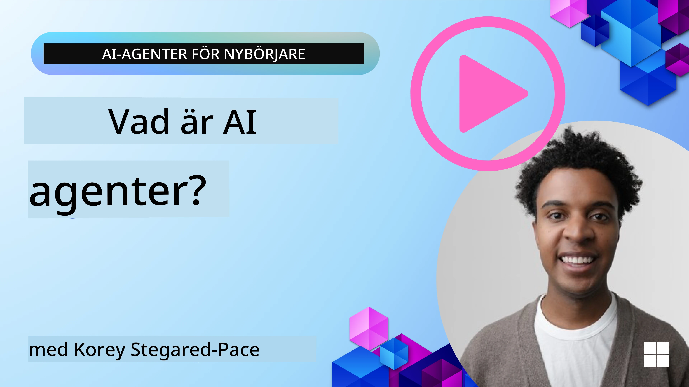
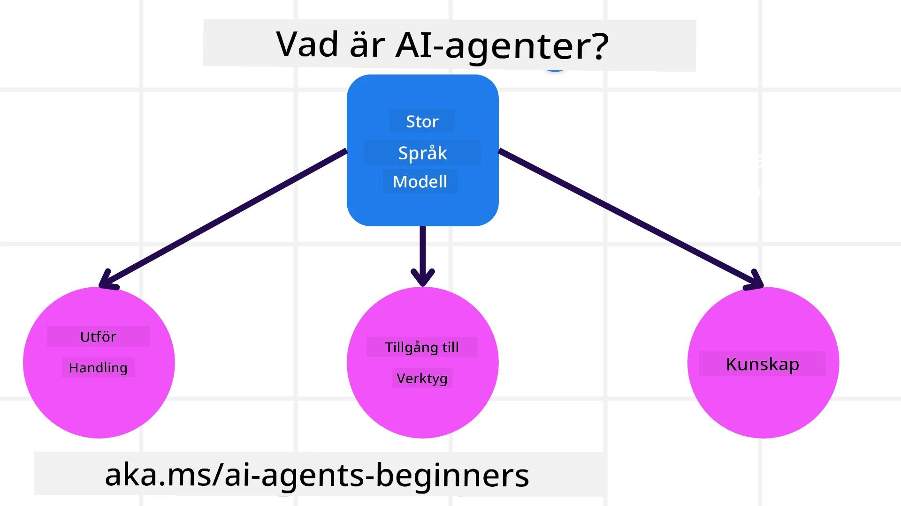

<!--
CO_OP_TRANSLATOR_METADATA:
{
  "original_hash": "cdd28bc00816d2773bb2b5968d782abc",
  "translation_date": "2025-11-11T11:19:09+00:00",
  "source_file": "01-intro-to-ai-agents/README.md",
  "language_code": "sv"
}
-->

> _(Klicka på bilden ovan för att se videon för denna lektion)_

# Introduktion till AI-agenter och användningsområden

Välkommen till kursen "AI-agenter för nybörjare"! Denna kurs ger grundläggande kunskaper och praktiska exempel för att bygga AI-agenter.

Gå med i <a href="https://discord.gg/kzRShWzttr" target="_blank">Azure AI Discord Community</a> för att träffa andra elever och AI-agentbyggare och ställa frågor om kursen.

För att börja kursen ska vi först få en bättre förståelse för vad AI-agenter är och hur vi kan använda dem i de applikationer och arbetsflöden vi bygger.

## Introduktion

Denna lektion täcker:

- Vad är AI-agenter och vilka olika typer av agenter finns det?
- Vilka användningsområden passar bäst för AI-agenter och hur kan de hjälpa oss?
- Vilka är några av de grundläggande byggstenarna när man designar agentbaserade lösningar?

## Lärandemål
Efter att ha avslutat denna lektion ska du kunna:

- Förstå AI-agentkoncept och hur de skiljer sig från andra AI-lösningar.
- Använda AI-agenter på ett effektivt sätt.
- Designa agentbaserade lösningar produktivt för både användare och kunder.

## Definition av AI-agenter och typer av AI-agenter

### Vad är AI-agenter?

AI-agenter är **system** som gör det möjligt för **Large Language Models (LLMs)** att **utföra handlingar** genom att utöka deras kapacitet genom att ge LLMs **tillgång till verktyg** och **kunskap**.

Låt oss bryta ner denna definition i mindre delar:

- **System** - Det är viktigt att tänka på agenter som ett system av många komponenter, inte bara en enskild del. På grundnivå består komponenterna i en AI-agent av:
  - **Miljö** - Det definierade utrymmet där AI-agenten verkar. Till exempel, om vi hade en AI-agent för resebokning, kan miljön vara bokningssystemet som agenten använder för att utföra uppgifter.
  - **Sensorer** - Miljöer har information och ger feedback. AI-agenter använder sensorer för att samla in och tolka denna information om miljöns aktuella tillstånd. I exemplet med resebokningsagenten kan bokningssystemet ge information som hotellens tillgänglighet eller flygpriser.
  - **Aktuatorer** - När AI-agenten har fått information om miljöns aktuella tillstånd, bestämmer den vilka åtgärder som ska vidtas för att förändra miljön. För resebokningsagenten kan det vara att boka ett tillgängligt rum åt användaren.

**Large Language Models** - Konceptet med agenter fanns redan innan LLMs skapades. Fördelen med att bygga AI-agenter med LLMs är deras förmåga att tolka mänskligt språk och data. Denna förmåga gör det möjligt för LLMs att tolka miljöinformation och definiera en plan för att förändra miljön.

**Utföra handlingar** - Utanför AI-agentens system är LLMs begränsade till situationer där handlingen är att generera innehåll eller information baserat på en användares fråga. Inom AI-agentens system kan LLMs utföra uppgifter genom att tolka användarens begäran och använda verktyg som finns tillgängliga i deras miljö.

**Tillgång till verktyg** - Vilka verktyg LLM har tillgång till definieras av 1) miljön den verkar i och 2) utvecklaren av AI-agenten. För vårt resebokningsexempel är agentens verktyg begränsade av de operationer som är tillgängliga i bokningssystemet, och/eller utvecklaren kan begränsa agentens tillgång till verktyg som gäller flyg.

**Minne+Kunskap** - Minne kan vara kortsiktigt i konversationen mellan användaren och agenten. Långsiktigt, utöver den information som tillhandahålls av miljön, kan AI-agenter också hämta kunskap från andra system, tjänster, verktyg och till och med andra agenter. I resebokningsexemplet kan denna kunskap vara information om användarens resepreferenser som finns i en kunddatabas.

### De olika typerna av agenter

Nu när vi har en allmän definition av AI-agenter, låt oss titta på några specifika typer av agenter och hur de skulle kunna tillämpas på en AI-agent för resebokning.

| **Agenttyp**                  | **Beskrivning**                                                                                                                       | **Exempel**                                                                                                                                                                                                                   |
| ----------------------------- | ------------------------------------------------------------------------------------------------------------------------------------- | ----------------------------------------------------------------------------------------------------------------------------------------------------------------------------------------------------------------------------- |
| **Enkla reflexagenter**       | Utför omedelbara handlingar baserat på fördefinierade regler.                                                                          | Reseagenten tolkar kontexten i ett e-postmeddelande och vidarebefordrar reseklagomål till kundtjänst.                                                                                                                          |
| **Modellbaserade reflexagenter** | Utför handlingar baserat på en modell av världen och förändringar i den modellen.                                                     | Reseagenten prioriterar rutter med betydande prisförändringar baserat på tillgång till historiska prisdata.                                                                                                             |
| **Målorienterade agenter**    | Skapar planer för att uppnå specifika mål genom att tolka målet och bestämma handlingar för att nå det.                                | Reseagenten bokar en resa genom att bestämma nödvändiga researrangemang (bil, kollektivtrafik, flyg) från den aktuella platsen till destinationen.                                                                                |
| **Nyttobaserade agenter**     | Beaktar preferenser och väger avvägningar numeriskt för att avgöra hur man ska uppnå mål.                                              | Reseagenten maximerar nytta genom att väga bekvämlighet mot kostnad vid bokning av resor.                                                                                                                                          |
| **Lärande agenter**           | Förbättras över tid genom att svara på feedback och justera handlingar därefter.                                                      | Reseagenten förbättras genom att använda kundfeedback från efterresesundersökningar för att göra justeringar vid framtida bokningar.                                                                                                               |
| **Hierarkiska agenter**       | Har flera agenter i ett hierarkiskt system, där högre nivåer bryter ner uppgifter i deluppgifter för lägre nivåer att utföra.          | Reseagenten avbokar en resa genom att dela upp uppgiften i deluppgifter (t.ex. avboka specifika bokningar) och låta lägre nivåer utföra dem, och rapportera tillbaka till den högre nivån.                                     |
| **Multi-Agent Systems (MAS)** | Agenter utför uppgifter självständigt, antingen samarbetande eller konkurrerande.                                                     | Samarbetsvilligt: Flera agenter bokar specifika resetjänster som hotell, flyg och underhållning. Konkurrerande: Flera agenter hanterar och konkurrerar om en delad hotellbokningskalender för att boka kunder på hotellet. |

## När ska man använda AI-agenter

I det tidigare avsnittet använde vi reseagentens användningsfall för att förklara hur de olika typerna av agenter kan användas i olika scenarier för resebokning. Vi kommer att fortsätta använda denna applikation genom hela kursen.

Låt oss titta på vilka typer av användningsområden som AI-agenter passar bäst för:

- **Öppna problem** - låta LLM avgöra vilka steg som behövs för att slutföra en uppgift eftersom det inte alltid kan hårdkodas i ett arbetsflöde.
- **Flerstegsprocesser** - uppgifter som kräver en nivå av komplexitet där AI-agenten behöver använda verktyg eller information över flera steg istället för enkel åtkomst.
- **Förbättring över tid** - uppgifter där agenten kan förbättras över tid genom att ta emot feedback från antingen sin miljö eller användare för att ge bättre nytta.

Vi täcker fler överväganden kring användning av AI-agenter i lektionen om att bygga pålitliga AI-agenter.

## Grunderna i agentbaserade lösningar

### Agentutveckling

Det första steget i att designa ett AI-agentssystem är att definiera verktyg, handlingar och beteenden. I denna kurs fokuserar vi på att använda **Azure AI Agent Service** för att definiera våra agenter. Den erbjuder funktioner som:

- Val av öppna modeller som OpenAI, Mistral och Llama
- Användning av licensierad data genom leverantörer som Tripadvisor
- Användning av standardiserade OpenAPI 3.0-verktyg

### Agentiska mönster

Kommunikation med LLMs sker genom prompts. Med tanke på AI-agenters semi-autonoma natur är det inte alltid möjligt eller nödvändigt att manuellt omformulera LLM efter en förändring i miljön. Vi använder **agentiska mönster** som gör det möjligt att prompta LLM över flera steg på ett mer skalbart sätt.

Denna kurs är uppdelad i några av de nuvarande populära agentiska mönstren.

### Agentiska ramverk

Agentiska ramverk gör det möjligt för utvecklare att implementera agentiska mönster genom kod. Dessa ramverk erbjuder mallar, plugins och verktyg för bättre samarbete mellan AI-agenter. Dessa fördelar ger möjligheter till bättre insyn och felsökning av AI-agentssystem.

I denna kurs kommer vi att utforska det forskningsdrivna AutoGen-ramverket och det produktionsklara Agent-ramverket från Semantic Kernel.

## Exempelkoder

- Python: [Agent Framework](./code_samples/01-python-agent-framework.ipynb)
- .NET: [Agent Framework](./code_samples/01-dotnet-agent-framework.md)

## Har du fler frågor om AI-agenter?

Gå med i [Azure AI Foundry Discord](https://aka.ms/ai-agents/discord) för att träffa andra elever, delta i öppet hus och få svar på dina frågor om AI-agenter.

## Föregående lektion

[Kursinställning](../00-course-setup/README.md)

## Nästa lektion

[Utforska agentiska ramverk](../02-explore-agentic-frameworks/README.md)

---

<!-- CO-OP TRANSLATOR DISCLAIMER START -->
**Ansvarsfriskrivning**:  
Detta dokument har översatts med hjälp av AI-översättningstjänsten [Co-op Translator](https://github.com/Azure/co-op-translator). Även om vi strävar efter noggrannhet, bör det noteras att automatiserade översättningar kan innehålla fel eller felaktigheter. Det ursprungliga dokumentet på dess ursprungliga språk bör betraktas som den auktoritativa källan. För kritisk information rekommenderas professionell mänsklig översättning. Vi ansvarar inte för eventuella missförstånd eller feltolkningar som uppstår vid användning av denna översättning.
<!-- CO-OP TRANSLATOR DISCLAIMER END -->