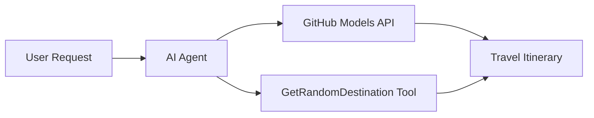

<!--
CO_OP_TRANSLATOR_METADATA:
{
  "original_hash": "5f351412e934f0833c8c821a0a60efaf",
  "translation_date": "2025-11-13T12:42:41+00:00",
  "source_file": "01-intro-to-ai-agents/code_samples/01-dotnet-agent-framework.md",
  "language_code": "sv"
}
-->
# 🌍 AI Resebyrå med Microsoft Agent Framework (.NET)

## 📋 Scenariobeskrivning

Det här exemplet visar hur man bygger en intelligent reseplaneringsagent med Microsoft Agent Framework för .NET. Agenten kan automatiskt skapa personliga dagsutflyktsplaner för slumpmässiga destinationer runt om i världen.

### Viktiga funktioner:

- 🎲 **Slumpmässigt val av destination**: Använder ett anpassat verktyg för att välja semesterorter
- 🗺️ **Intelligent reseplanering**: Skapar detaljerade dagsplaner
- 🔄 **Strömning i realtid**: Stödjer både omedelbara och strömmande svar
- 🛠️ **Integration av anpassade verktyg**: Visar hur man utökar agentens kapacitet

## 🔧 Teknisk arkitektur

### Kärnteknologier

- **Microsoft Agent Framework**: Senaste .NET-implementeringen för AI-agentutveckling
- **GitHub Models Integration**: Använder GitHubs AI-modelltjänst för inferens
- **OpenAI API-kompatibilitet**: Utnyttjar OpenAI:s klientbibliotek med anpassade slutpunkter
- **Säker konfiguration**: API-nyckelhantering baserad på miljövariabler

### Viktiga komponenter

1. **AIAgent**: Huvudagenten som hanterar konversationsflödet
2. **Anpassade verktyg**: `GetRandomDestination()`-funktionen tillgänglig för agenten
3. **Chatklient**: Konversationsgränssnitt med stöd från GitHub Models
4. **Strömningsstöd**: Kapacitet för att generera svar i realtid

### Integrationsmönster



## 🚀 Kom igång

### Förutsättningar

- [.NET 10 SDK](https://dotnet.microsoft.com/download/dotnet/10.0) eller senare
- [GitHub Models API åtkomsttoken](https://docs.github.com/github-models/github-models-at-scale/using-your-own-api-keys-in-github-models)

### Nödvändiga miljövariabler

```bash
# zsh/bash
export GH_TOKEN=<your_github_token>
export GH_ENDPOINT=https://models.github.ai/inference
export GH_MODEL_ID=openai/gpt-5-mini
```

```powershell
# PowerShell
$env:GH_TOKEN = "<your_github_token>"
$env:GH_ENDPOINT = "https://models.github.ai/inference"
$env:GH_MODEL_ID = "openai/gpt-5-mini"
```

### Exempelkod

För att köra kodexemplet,

```bash
# zsh/bash
chmod +x ./01-dotnet-agent-framework.cs
./01-dotnet-agent-framework.cs
```

Eller använd dotnet CLI:

```bash
dotnet run ./01-dotnet-agent-framework.cs
```

Se [`01-dotnet-agent-framework.cs`](../../../../01-intro-to-ai-agents/code_samples/01-dotnet-agent-framework.cs) för den kompletta koden.

```csharp
#!/usr/bin/dotnet run

#:package Microsoft.Extensions.AI@9.*
#:package Microsoft.Agents.AI.OpenAI@1.*-*

using System.ClientModel;
using System.ComponentModel;

using Microsoft.Agents.AI;
using Microsoft.Extensions.AI;

using OpenAI;

// Tool Function: Random Destination Generator
// This static method will be available to the agent as a callable tool
// The [Description] attribute helps the AI understand when to use this function
// This demonstrates how to create custom tools for AI agents
[Description("Provides a random vacation destination.")]
static string GetRandomDestination()
{
    // List of popular vacation destinations around the world
    // The agent will randomly select from these options
    var destinations = new List<string>
    {
        "Paris, France",
        "Tokyo, Japan",
        "New York City, USA",
        "Sydney, Australia",
        "Rome, Italy",
        "Barcelona, Spain",
        "Cape Town, South Africa",
        "Rio de Janeiro, Brazil",
        "Bangkok, Thailand",
        "Vancouver, Canada"
    };

    // Generate random index and return selected destination
    // Uses System.Random for simple random selection
    var random = new Random();
    int index = random.Next(destinations.Count);
    return destinations[index];
}

// Extract configuration from environment variables
// Retrieve the GitHub Models API endpoint, defaults to https://models.github.ai/inference if not specified
// Retrieve the model ID, defaults to openai/gpt-5-mini if not specified
// Retrieve the GitHub token for authentication, throws exception if not specified
var github_endpoint = Environment.GetEnvironmentVariable("GH_ENDPOINT") ?? "https://models.github.ai/inference";
var github_model_id = Environment.GetEnvironmentVariable("GH_MODEL_ID") ?? "openai/gpt-5-mini";
var github_token = Environment.GetEnvironmentVariable("GH_TOKEN") ?? throw new InvalidOperationException("GH_TOKEN is not set.");

// Configure OpenAI Client Options
// Create configuration options to point to GitHub Models endpoint
// This redirects OpenAI client calls to GitHub's model inference service
var openAIOptions = new OpenAIClientOptions()
{
    Endpoint = new Uri(github_endpoint)
};

// Initialize OpenAI Client with GitHub Models Configuration
// Create OpenAI client using GitHub token for authentication
// Configure it to use GitHub Models endpoint instead of OpenAI directly
var openAIClient = new OpenAIClient(new ApiKeyCredential(github_token), openAIOptions);

// Create AI Agent with Travel Planning Capabilities
// Initialize OpenAI client, get chat client for specified model, and create AI agent
// Configure agent with travel planning instructions and random destination tool
// The agent can now plan trips using the GetRandomDestination function
AIAgent agent = openAIClient
    .GetChatClient(github_model_id)
    .CreateAIAgent(
        instructions: "You are a helpful AI Agent that can help plan vacations for customers at random destinations",
        tools: [AIFunctionFactory.Create(GetRandomDestination)]
    );

// Execute Agent: Plan a Day Trip
// Run the agent with streaming enabled for real-time response display
// Shows the agent's thinking and response as it generates the content
// Provides better user experience with immediate feedback
await foreach (var update in agent.RunStreamingAsync("Plan me a day trip"))
{
    await Task.Delay(10);
    Console.Write(update);
}
```

## 🎓 Viktiga lärdomar

1. **Agentarkitektur**: Microsoft Agent Framework erbjuder ett rent, typ-säkert sätt att bygga AI-agenter i .NET
2. **Verktygsintegration**: Funktioner dekorerade med `[Description]`-attribut blir tillgängliga verktyg för agenten
3. **Konfigurationshantering**: Miljövariabler och säker hantering av autentiseringsuppgifter följer .NET:s bästa praxis
4. **OpenAI-kompatibilitet**: GitHub Models-integration fungerar smidigt via OpenAI-kompatibla API:er

## 🔗 Ytterligare resurser

- [Microsoft Agent Framework Dokumentation](https://learn.microsoft.com/agent-framework)
- [GitHub Models Marketplace](https://github.com/marketplace?type=models)
- [Microsoft.Extensions.AI](https://learn.microsoft.com/dotnet/ai/microsoft-extensions-ai)
- [.NET Single File Apps](https://devblogs.microsoft.com/dotnet/announcing-dotnet-run-app)

---

<!-- CO-OP TRANSLATOR DISCLAIMER START -->
**Ansvarsfriskrivning**:  
Detta dokument har översatts med hjälp av AI-översättningstjänsten [Co-op Translator](https://github.com/Azure/co-op-translator). Även om vi strävar efter noggrannhet, bör det noteras att automatiserade översättningar kan innehålla fel eller felaktigheter. Det ursprungliga dokumentet på dess modersmål bör betraktas som den auktoritativa källan. För kritisk information rekommenderas professionell mänsklig översättning. Vi ansvarar inte för eventuella missförstånd eller feltolkningar som uppstår vid användning av denna översättning.
<!-- CO-OP TRANSLATOR DISCLAIMER END -->