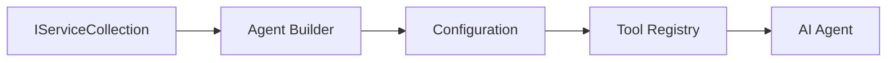

<!--
CO_OP_TRANSLATOR_METADATA:
{
  "original_hash": "bcc874e190347bd6a095aed56dc16de8",
  "translation_date": "2025-11-13T12:47:00+00:00",
  "source_file": "03-agentic-design-patterns/code_samples/03-dotnet-agent-framework.md",
  "language_code": "sv"
}
-->
# 🎨 Agentiska designmönster med GitHub-modeller (.NET)

## 📋 Inlärningsmål

Det här exemplet visar designmönster på företagsnivå för att bygga intelligenta agenter med Microsoft Agent Framework i .NET och integration med GitHub-modeller. Du kommer att lära dig professionella mönster och arkitektoniska tillvägagångssätt som gör agenter produktionsklara, underhållbara och skalbara.

### Designmönster för företag

- 🏭 **Factory Pattern**: Standardiserad agentgenerering med dependency injection
- 🔧 **Builder Pattern**: Flytande konfiguration och uppsättning av agenter
- 🧵 **Trådsäkra mönster**: Hantering av samtidiga konversationer
- 📋 **Repository Pattern**: Organiserad hantering av verktyg och funktioner

## 🎯 Arkitektoniska fördelar med .NET

### Funktioner för företag

- **Stark typning**: Validering vid kompilering och stöd för IntelliSense
- **Dependency Injection**: Inbyggd integration med DI-container
- **Konfigurationshantering**: IConfiguration och Options-mönster
- **Async/Await**: Förstklassigt stöd för asynkron programmering

### Produktionsklara mönster

- **Loggningsintegration**: ILogger och stöd för strukturerad loggning
- **Hälsokontroller**: Inbyggd övervakning och diagnostik
- **Konfigurationsvalidering**: Stark typning med dataanoteringar
- **Felfunktioner**: Strukturerad hantering av undantag

## 🔧 Teknisk arkitektur

### Centrala .NET-komponenter

- **Microsoft.Extensions.AI**: Enhetliga AI-tjänstabstraktioner
- **Microsoft.Agents.AI**: Ramverk för företagsagentorkestrering
- **GitHub Models Integration**: Högpresterande API-klientmönster
- **Konfigurationssystem**: appsettings.json och miljöintegration

### Implementering av designmönster



## 🏗️ Företagsmönster som demonstreras

### 1. **Skapandemönster**

- **Agent Factory**: Centraliserad agentgenerering med konsekvent konfiguration
- **Builder Pattern**: Flytande API för komplex agentkonfiguration
- **Singleton Pattern**: Delade resurser och konfigurationshantering
- **Dependency Injection**: Lös koppling och testbarhet

### 2. **Beteendemönster**

- **Strategy Pattern**: Utbytbara strategier för verktygsutförande
- **Command Pattern**: Inkapslade agentoperationer med ångra/gör om
- **Observer Pattern**: Händelsedriven hantering av agentens livscykel
- **Template Method**: Standardiserade arbetsflöden för agentutförande

### 3. **Strukturella mönster**

- **Adapter Pattern**: Integrationslager för GitHub Models API
- **Decorator Pattern**: Förbättring av agentens funktioner
- **Facade Pattern**: Förenklade gränssnitt för agentinteraktion
- **Proxy Pattern**: Laddning vid behov och caching för prestanda

## 📚 Designprinciper för .NET

### SOLID-principer

- **Single Responsibility**: Varje komponent har ett tydligt syfte
- **Open/Closed**: Utbyggbar utan modifiering
- **Liskov Substitution**: Implementeringar av verktyg baserade på gränssnitt
- **Interface Segregation**: Fokuserade, sammanhängande gränssnitt
- **Dependency Inversion**: Beroende av abstraktioner, inte konkretioner

### Ren arkitektur

- **Domänlager**: Kärnabstraktioner för agenter och verktyg
- **Applikationslager**: Orkestrering och arbetsflöden för agenter
- **Infrastrukturlager**: Integration med GitHub-modeller och externa tjänster
- **Presentationslager**: Användarinteraktion och formatering av svar

## 🔒 Företagsöverväganden

### Säkerhet

- **Hantering av autentiseringsuppgifter**: Säker hantering av API-nycklar med IConfiguration
- **Validering av indata**: Stark typning och validering med dataanoteringar
- **Sanering av utdata**: Säker bearbetning och filtrering av svar
- **Revisionsloggning**: Omfattande spårning av operationer

### Prestanda

- **Asynkrona mönster**: Icke-blockerande I/O-operationer
- **Anslutningspoolning**: Effektiv hantering av HTTP-klienter
- **Caching**: Caching av svar för förbättrad prestanda
- **Resurshantering**: Korrekt borttagning och städrutiner

### Skalbarhet

- **Trådsäkerhet**: Stöd för samtidiga agentutföranden
- **Resurspoolning**: Effektiv resursanvändning
- **Belastningshantering**: Begränsning av hastighet och hantering av överbelastning
- **Övervakning**: Prestandamätningar och hälsokontroller

## 🚀 Produktionsdistribution

- **Konfigurationshantering**: Miljöspecifika inställningar
- **Loggningsstrategi**: Strukturerad loggning med korrelations-ID
- **Felfunktioner**: Global hantering av undantag med korrekt återhämtning
- **Övervakning**: Application Insights och prestandaräknare
- **Testning**: Enhetstester, integrationstester och belastningstestmönster

Redo att bygga intelligenta agenter på företagsnivå med .NET? Låt oss skapa något robust! 🏢✨

## 🚀 Komma igång

### Förutsättningar

- [.NET 10 SDK](https://dotnet.microsoft.com/download/dotnet/10.0) eller högre
- [GitHub Models API-åtkomsttoken](https://docs.github.com/github-models/github-models-at-scale/using-your-own-api-keys-in-github-models)

### Nödvändiga miljövariabler

```bash
# zsh/bash
export GH_TOKEN=<your_github_token>
export GH_ENDPOINT=https://models.github.ai/inference
export GH_MODEL_ID=openai/gpt-5-mini
```

```powershell
# PowerShell
$env:GH_TOKEN = "<your_github_token>"
$env:GH_ENDPOINT = "https://models.github.ai/inference"
$env:GH_MODEL_ID = "openai/gpt-5-mini"
```

### Exempelkod

För att köra kodexemplet,

```bash
# zsh/bash
chmod +x ./03-dotnet-agent-framework.cs
./03-dotnet-agent-framework.cs
```

Eller med hjälp av dotnet CLI:

```bash
dotnet run ./03-dotnet-agent-framework.cs
```

Se [`03-dotnet-agent-framework.cs`](../../../../03-agentic-design-patterns/code_samples/03-dotnet-agent-framework.cs) för den kompletta koden.

```csharp
#!/usr/bin/dotnet run

#:package Microsoft.Extensions.AI@10.*
#:package Microsoft.Agents.AI.OpenAI@1.*-*

using System.ClientModel;
using System.ComponentModel;

using Microsoft.Agents.AI;
using Microsoft.Extensions.AI;

using OpenAI;

// Tool Function: Random Destination Generator
// This static method will be available to the agent as a callable tool
// The [Description] attribute helps the AI understand when to use this function
// This demonstrates how to create custom tools for AI agents
[Description("Provides a random vacation destination.")]
static string GetRandomDestination()
{
    // List of popular vacation destinations around the world
    // The agent will randomly select from these options
    var destinations = new List<string>
    {
        "Paris, France",
        "Tokyo, Japan",
        "New York City, USA",
        "Sydney, Australia",
        "Rome, Italy",
        "Barcelona, Spain",
        "Cape Town, South Africa",
        "Rio de Janeiro, Brazil",
        "Bangkok, Thailand",
        "Vancouver, Canada"
    };

    // Generate random index and return selected destination
    // Uses System.Random for simple random selection
    var random = new Random();
    int index = random.Next(destinations.Count);
    return destinations[index];
}

// Extract configuration from environment variables
// Retrieve the GitHub Models API endpoint, defaults to https://models.github.ai/inference if not specified
// Retrieve the model ID, defaults to openai/gpt-5-mini if not specified
// Retrieve the GitHub token for authentication, throws exception if not specified
var github_endpoint = Environment.GetEnvironmentVariable("GH_ENDPOINT") ?? "https://models.github.ai/inference";
var github_model_id = Environment.GetEnvironmentVariable("GH_MODEL_ID") ?? "openai/gpt-5-mini";
var github_token = Environment.GetEnvironmentVariable("GH_TOKEN") ?? throw new InvalidOperationException("GH_TOKEN is not set.");

// Configure OpenAI Client Options
// Create configuration options to point to GitHub Models endpoint
// This redirects OpenAI client calls to GitHub's model inference service
var openAIOptions = new OpenAIClientOptions()
{
    Endpoint = new Uri(github_endpoint)
};

// Initialize OpenAI Client with GitHub Models Configuration
// Create OpenAI client using GitHub token for authentication
// Configure it to use GitHub Models endpoint instead of OpenAI directly
var openAIClient = new OpenAIClient(new ApiKeyCredential(github_token), openAIOptions);

// Define Agent Identity and Comprehensive Instructions
// Agent name for identification and logging purposes
var AGENT_NAME = "TravelAgent";

// Detailed instructions that define the agent's personality, capabilities, and behavior
// This system prompt shapes how the agent responds and interacts with users
var AGENT_INSTRUCTIONS = """
You are a helpful AI Agent that can help plan vacations for customers.

Important: When users specify a destination, always plan for that location. Only suggest random destinations when the user hasn't specified a preference.

When the conversation begins, introduce yourself with this message:
"Hello! I'm your TravelAgent assistant. I can help plan vacations and suggest interesting destinations for you. Here are some things you can ask me:
1. Plan a day trip to a specific location
2. Suggest a random vacation destination
3. Find destinations with specific features (beaches, mountains, historical sites, etc.)
4. Plan an alternative trip if you don't like my first suggestion

What kind of trip would you like me to help you plan today?"

Always prioritize user preferences. If they mention a specific destination like "Bali" or "Paris," focus your planning on that location rather than suggesting alternatives.
""";

// Create AI Agent with Advanced Travel Planning Capabilities
// Initialize complete agent pipeline: OpenAI client → Chat client → AI agent
// Configure agent with name, detailed instructions, and available tools
// This demonstrates the .NET agent creation pattern with full configuration
AIAgent agent = openAIClient
    .GetChatClient(github_model_id)
    .CreateAIAgent(
        name: AGENT_NAME,
        instructions: AGENT_INSTRUCTIONS,
        tools: [AIFunctionFactory.Create(GetRandomDestination)]
    );

// Create New Conversation Thread for Context Management
// Initialize a new conversation thread to maintain context across multiple interactions
// Threads enable the agent to remember previous exchanges and maintain conversational state
// This is essential for multi-turn conversations and contextual understanding
AgentThread thread = agent.GetNewThread();

// Execute Agent: First Travel Planning Request
// Run the agent with an initial request that will likely trigger the random destination tool
// The agent will analyze the request, use the GetRandomDestination tool, and create an itinerary
// Using the thread parameter maintains conversation context for subsequent interactions
await foreach (var update in agent.RunStreamingAsync("Plan me a day trip", thread))
{
    await Task.Delay(10);
    Console.Write(update);
}

Console.WriteLine();

// Execute Agent: Follow-up Request with Context Awareness
// Demonstrate contextual conversation by referencing the previous response
// The agent remembers the previous destination suggestion and will provide an alternative
// This showcases the power of conversation threads and contextual understanding in .NET agents
await foreach (var update in agent.RunStreamingAsync("I don't like that destination. Plan me another vacation.", thread))
{
    await Task.Delay(10);
    Console.Write(update);
}
```

---

<!-- CO-OP TRANSLATOR DISCLAIMER START -->
**Ansvarsfriskrivning**:  
Detta dokument har översatts med hjälp av AI-översättningstjänsten [Co-op Translator](https://github.com/Azure/co-op-translator). Även om vi strävar efter noggrannhet, bör det noteras att automatiserade översättningar kan innehålla fel eller felaktigheter. Det ursprungliga dokumentet på dess ursprungliga språk bör betraktas som den auktoritativa källan. För kritisk information rekommenderas professionell mänsklig översättning. Vi ansvarar inte för eventuella missförstånd eller feltolkningar som uppstår vid användning av denna översättning.
<!-- CO-OP TRANSLATOR DISCLAIMER END -->