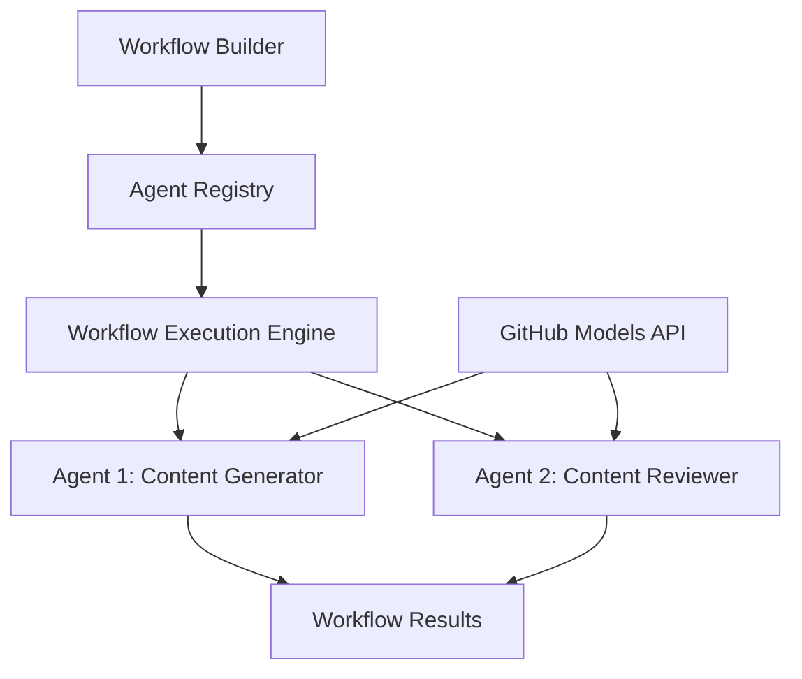

<!--
CO_OP_TRANSLATOR_METADATA:
{
  "original_hash": "034158688d0a45aae06dcbb21b0da5ae",
  "translation_date": "2025-11-11T12:50:56+00:00",
  "source_file": "08-multi-agent/code_samples/workflows-agent-framework/dotNET/01.dotnet-agent-framework-workflow-ghmodel-basic.md",
  "language_code": "sv"
}
-->
# 🔄 Grundläggande agentarbetsflöden med GitHub-modeller (.NET)

## 📋 Handledning för arbetsflödesorkestrering

Den här guiden visar hur du bygger avancerade **agentarbetsflöden** med Microsoft Agent Framework för .NET och GitHub-modeller. Du kommer att lära dig att skapa flerstegs affärsprocesser där AI-agenter samarbetar för att utföra komplexa uppgifter genom strukturerade orkestreringsmönster.

## 🎯 Inlärningsmål

### 🏗️ **Grundläggande arbetsflödesarkitektur**
- **Workflow Builder**: Designa och orkestrera komplexa flerstegs AI-processer
- **Agentkoordinering**: Samordna flera specialiserade agenter inom arbetsflöden
- **Integration med GitHub-modeller**: Utnyttja GitHubs AI-modelltjänst i arbetsflöden
- **Visuell arbetsflödesdesign**: Skapa och visualisera arbetsflödesstrukturer för bättre förståelse

### 🔄 **Processorkestreringsmönster**
- **Sekventiell bearbetning**: Koppla flera agentuppgifter i logisk ordning
- **Tillståndshantering**: Behåll kontext och dataflöde mellan arbetsflödessteg
- **Felkorrigering**: Implementera robust felåterhämtning och arbetsflödesresiliens
- **Prestandaoptimering**: Designa effektiva arbetsflöden för verksamhetskritiska operationer

### 🏢 **Arbetsflödesapplikationer för företag**
- **Automatisering av affärsprocesser**: Automatisera komplexa organisatoriska arbetsflöden
- **Innehållsproduktionspipeline**: Redaktionella arbetsflöden med granskning och godkännandesteg
- **Automatisering av kundservice**: Flerstegs lösning av kundförfrågningar
- **Databearbetningsarbetsflöden**: ETL-arbetsflöden med AI-driven transformation

## ⚙️ Förutsättningar och installation

### 📦 **Nödvändiga NuGet-paket**

Denna arbetsflödesdemonstration använder flera viktiga .NET-paket:

```xml
<!-- Core AI Framework -->
<PackageReference Include="Microsoft.Extensions.AI" Version="9.9.0" />

<!-- Agent Framework (Local Development) -->
<!-- Microsoft.Agents.AI.dll - Core agent abstractions -->
<!-- Microsoft.Agents.AI.OpenAI.dll - OpenAI/GitHub Models integration -->

<!-- Configuration and Environment -->
<PackageReference Include="DotNetEnv" Version="3.1.1" />
```

### 🔑 **Konfiguration av GitHub-modeller**

**Miljöinställningar (.env-fil):**
```env
GITHUB_TOKEN=your_github_personal_access_token
GITHUB_ENDPOINT=https://models.inference.ai.azure.com
GITHUB_MODEL_ID=gpt-4o-mini
```

**Åtkomst till GitHub-modeller:**
1. Registrera dig för GitHub-modeller (för närvarande i förhandsgranskning)
2. Generera en personlig åtkomsttoken med modellåtkomstbehörigheter
3. Konfigurera miljövariabler enligt ovan

### 🏗️ **Översikt över arbetsflödesarkitektur**



**Nyckelkomponenter:**
- **WorkflowBuilder**: Huvudorkestreringsmotor för att designa arbetsflöden
- **AIAgent**: Individuella specialiserade agenter med specifika förmågor
- **GitHub Models Client**: Integration av AI-modelltjänst
- **Execution Context**: Hanterar tillstånd och dataflöde mellan arbetsflödessteg

## 🎨 **Designmönster för företagsarbetsflöden**

### 📝 **Arbetsflöde för innehållsproduktion**
```
User Request → Content Generation → Quality Review → Final Output
```

### 🔍 **Dokumentbearbetningspipeline**
```
Document Input → Analysis → Extraction → Validation → Structured Output
```

### 💼 **Arbetsflöde för affärsintelligens**
```
Data Collection → Processing → Analysis → Report Generation → Distribution
```

### 🤝 **Automatisering av kundservice**
```
Customer Inquiry → Classification → Processing → Response Generation → Follow-up
```

## 🏢 **Fördelar för företag**

### 🎯 **Tillförlitlighet och skalbarhet**
- **Deterministisk exekvering**: Konsekventa, upprepbara arbetsflödesresultat
- **Felkorrigering**: Smidig hantering av fel i alla arbetsflödessteg
- **Prestandaövervakning**: Spåra exekveringsmetrik och optimeringsmöjligheter
- **Resurshantering**: Effektiv tilldelning och användning av AI-modellresurser

### 🔒 **Säkerhet och efterlevnad**
- **Säker autentisering**: GitHub-tokenbaserad autentisering för API-åtkomst
- **Revisionsspår**: Komplett loggning av arbetsflödesexekvering och beslutssteg
- **Åtkomstkontroll**: Granulära behörigheter för arbetsflödesexekvering och övervakning
- **Datasekretess**: Säker hantering av känslig information genom arbetsflöden

### 📊 **Observabilitet och hantering**
- **Visuell arbetsflödesdesign**: Tydlig representation av processflöden och beroenden
- **Exekveringsövervakning**: Realtidsövervakning av arbetsflödesframsteg och prestanda
- **Felrapportering**: Detaljerad felanalys och felsökningsmöjligheter
- **Prestandaanalys**: Metrik för optimering och kapacitetsplanering

Låt oss bygga ditt första företagsklara AI-arbetsflöde! 🚀

## 💻 Köra koden

Den kompletta implementeringen finns i `01.dotnet-agent-framework-workflow-ghmodel-basic.cs`. Denna fil demonstrerar:

1. **Miljökonfiguration** - Laddar GitHub-modellers autentiseringsuppgifter från `.env`-filen
2. **OpenAI-klientinställning** - Konfigurerar klienten för att använda GitHub-modellers slutpunkt
3. **Agentskapande** - Definierar specialiserade agenter (Front Desk och Concierge)
4. **Workflow Builder** - Skapar ett fleragentarbetsflöde med sekventiell bearbetning
5. **Arbetsflödesexekvering** - Kör arbetsflödet med strömmande resultat

### 🚀 Köra exemplet

```bash
# Make the script executable (Unix/Linux/macOS)
chmod +x 01.dotnet-agent-framework-workflow-ghmodel-basic.cs

# Run the workflow
./01.dotnet-agent-framework-workflow-ghmodel-basic.cs
```

Eller på Windows:
```powershell
dotnet run 01.dotnet-agent-framework-workflow-ghmodel-basic.cs
```

### 📝 Förväntat resultat

Arbetsflödet kommer att:
1. Ta emot din förfrågan om resmål ("Jag skulle vilja åka till Paris")
2. Front Desk-agenten ger en initial rekommendation
3. Concierge-agenten granskar och förbättrar rekommendationen
4. Slutresultatet visar hela konversationsflödet

### 🔧 Anpassning

Du kan anpassa arbetsflödet genom att:
- Ändra agentinstruktioner för att ändra deras beteende
- Lägga till fler agenter för att skapa komplexa flerstegs arbetsflöden
- Ändra användarmeddelandet för att testa olika scenarier
- Justera arbetsflödets kanter för att skapa olika exekveringsmönster

---

<!-- CO-OP TRANSLATOR DISCLAIMER START -->
**Ansvarsfriskrivning**:  
Detta dokument har översatts med hjälp av AI-översättningstjänsten [Co-op Translator](https://github.com/Azure/co-op-translator). Även om vi strävar efter noggrannhet, bör det noteras att automatiserade översättningar kan innehålla fel eller felaktigheter. Det ursprungliga dokumentet på dess ursprungliga språk bör betraktas som den auktoritativa källan. För kritisk information rekommenderas professionell mänsklig översättning. Vi ansvarar inte för eventuella missförstånd eller feltolkningar som uppstår vid användning av denna översättning.
<!-- CO-OP TRANSLATOR DISCLAIMER END -->