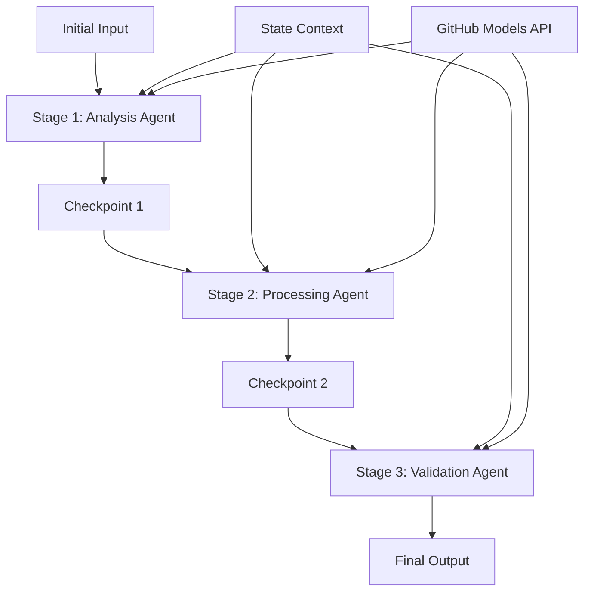

<!--
CO_OP_TRANSLATOR_METADATA:
{
  "original_hash": "1be9c8dcbd79a02d33d2c138684c1394",
  "translation_date": "2025-11-11T13:54:09+00:00",
  "source_file": "08-multi-agent/code_samples/workflows-agent-framework/dotNET/02.dotnet-agent-framework-workflow-ghmodel-sequential.md",
  "language_code": "sv"
}
-->
# ⏩ Sekventiella Agentarbetsflöden med GitHub-modeller (.NET)

## 📋 Avancerad handledning för sekventiell bearbetning

Den här guiden visar **sekventiella arbetsflödesmönster** med hjälp av Microsoft Agent Framework för .NET och GitHub-modeller. Du kommer att lära dig att bygga avancerade, steg-för-steg-bearbetningspipelines där agenter utförs i en specifik ordning, där varje steg bygger på resultaten från föregående steg.

## 🎯 Lärandemål

### 🔄 **Arkitektur för sekventiell bearbetning**
- **Linjära arbetsflödesdesign**: Skapa steg-för-steg-bearbetningspipelines med tydliga beroenden
- **Tillståndshantering**: Behåll kontext och dataflöde mellan sekventiella arbetsflödessteg
- **Integration med GitHub-modeller**: Utnyttja GitHubs AI-modeller i flerstegs .NET-arbetsflöden
- **Företagsmönster för pipelines**: Bygg produktionsklara system för sekventiell bearbetning

### 🏗️ **Avancerade sekventiella mönster**
- **Stage-Gate-bearbetning**: Implementera valideringskontroller mellan arbetsflödessteg
- **Kontextbevarande**: Behåll tillstånd och ackumulerad kunskap genom alla steg
- **Felhantering**: Hantera fel smidigt i sekventiella bearbetningskedjor
- **Prestandaoptimering**: Effektiv sekventiell exekvering med minimal overhead

### 🏢 **Företagsapplikationer för sekventiell bearbetning**
- **Dokumentbearbetningspipeline**: Flerstegs dokumentanalys, transformation och validering
- **Kvalitetssäkringsarbetsflöden**: Sekventiell granskning, validering och godkännandeprocesser
- **Innehållsproduktionspipeline**: Forskning → Skrivning → Redigering → Granskning → Publicering
- **Automatisering av affärsprocesser**: Flerstegs affärsarbetsflöden med tydliga stegberoenden

## ⚙️ Förutsättningar och installation

### 📦 **Nödvändiga NuGet-paket**

Viktiga paket för .NET-sekventiella arbetsflöden:

```xml
<!-- Core AI Framework -->
<PackageReference Include="Microsoft.Extensions.AI" Version="9.9.0" />

<!-- Client Model Abstractions -->
<PackageReference Include="System.ClientModel" Version="1.6.1.0" />

<!-- Azure Identity and Async LINQ Support -->
<PackageReference Include="Azure.Identity" Version="1.15.0" />
<PackageReference Include="System.Linq.Async" Version="6.0.3" />

<!-- Local Agent Framework References -->
<!-- Microsoft.Agents.AI.dll - Core agent abstractions -->
<!-- Microsoft.Agents.AI.OpenAI.dll - GitHub Models integration -->
```

### 🔑 **Konfiguration av GitHub-modeller**

**Miljöinställningar (.env-fil):**
```env
GITHUB_TOKEN=your_github_personal_access_token
GITHUB_ENDPOINT=https://models.inference.ai.azure.com
GITHUB_MODEL_ID=gpt-4o-mini
```

**Konfigurationshantering:**
```csharp
// Load environment variables securely
Env.Load("../../../.env");
var githubToken = Environment.GetEnvironmentVariable("GITHUB_TOKEN");
var githubEndpoint = Environment.GetEnvironmentVariable("GITHUB_ENDPOINT");
var modelId = Environment.GetEnvironmentVariable("GITHUB_MODEL_ID");
```

### 🏗️ **Arkitektur för sekventiella arbetsflöden**



**Nyckelkomponenter:**
- **Sekventiella agenter**: Specialiserade agenter för varje bearbetningssteg
- **Tillståndskontext**: Behåller ackumulerad data och beslut genom stegen
- **Kontrollpunkter**: Valideringspunkter mellan steg för att säkerställa kvalitet och konsistens
- **GitHub Models-klient**: Konsistent AI-modellåtkomst genom alla arbetsflödessteg

## 🎨 **Designmönster för sekventiella arbetsflöden**

### 📝 **Dokumentbearbetningspipeline**
```
Raw Document → Content Extraction → Analysis → Validation → Structured Output
```

### 🎯 **Arbetsflöde för innehållsskapande**
```
Brief/Requirements → Research → Content Creation → Review → Final Polish
```

### 🔍 **Kvalitetssäkringspipeline**
```
Initial Review → Technical Validation → Compliance Check → Final Approval
```

### 💼 **Arbetsflöde för affärsintelligens**
```
Data Collection → Processing → Analysis → Report Generation → Distribution
```

## 🏢 **Fördelar med sekventiella arbetsflöden i företag**

### 🎯 **Tillförlitlighet och kvalitet**
- **Deterministisk bearbetning**: Konsekventa, upprepbara resultat genom strukturerade steg
- **Kvalitetskontroller**: Valideringspunkter säkerställer kvalitet vid varje steg
- **Felisolering**: Problem i ett steg sprids inte till efterföljande steg
- **Revisionsspår**: Fullständig spårning av beslut och transformationer vid varje steg

### 📈 **Skalbarhet och prestanda**
- **Modulär design**: Varje steg kan optimeras oberoende
- **Resurshantering**: Effektiv fördelning av AI-modellresurser mellan steg
- **Optimering av tillstånd**: Minimal överföring av tillstånd mellan steg för optimal prestanda
- **Parallella steggrupper**: Flera sekventiella arbetsflöden kan köras parallellt

### 🔒 **Säkerhet och efterlevnad**
- **Säkerhet på stegnivå**: Olika säkerhetspolicyer för olika bearbetningssteg
- **Datavalidering**: Säkerställ dataintegritet och efterlevnad vid varje kontrollpunkt
- **Åtkomstkontroll**: Granulära behörigheter för olika arbetsflödessteg
- **Regulatorisk efterlevnad**: Uppfyll regulatoriska krav genom strukturerad bearbetning

### 📊 **Övervakning och analys**
- **Mätvärden på stegnivå**: Prestandaövervakning för varje arbetsflödessteg
- **Identifiering av flaskhalsar**: Identifiera och optimera långsamma steg
- **Kvalitetsmätningar**: Spåra kvalitet och framgångsgrad vid varje steg
- **Processoptimering**: Kontinuerlig förbättring baserad på analys på stegnivå

Låt oss bygga robusta sekventiella AI-bearbetningspipelines! 🚀

## 💻 Köra koden

Den kompletta implementeringen finns i `02.dotnet-agent-framework-workflow-ghmodel-sequential.cs`. Denna fil demonstrerar ett **trestegs arbetsflöde för möbelanalys**:

1. **Steg 1 - Försäljningsagent**: Analyserar möbelbilder och ger köprekommendationer
2. **Steg 2 - Prisagent**: Ger detaljerade prisuppdelningar och budgetalternativ
3. **Steg 3 - Offertagent**: Genererar ett professionellt offertdokument i Markdown-format

### 🏗️ **Arbetsflödesarkitektur**

```
Image Input → Sales Analysis → Price Estimation → Quote Generation → Final Output
```

Varje agent:
- Tar emot utdata från föregående steg som kontext
- Bygger vidare på tidigare analys med specialiserad expertis
- Behåller arbetsflödeskontinuitet genom tillståndshantering

### 🚀 Köra exemplet

**Förutsättningar:**
- Placera en möbelbild på `../imgs/home.png` (eller uppdatera variabeln `imgPath`)
- Konfigurera din `.env`-fil med GitHub Models-uppgifter

```bash
# Make the script executable (Unix/Linux/macOS)
chmod +x 02.dotnet-agent-framework-workflow-ghmodel-sequential.cs

# Run the sequential workflow
./02.dotnet-agent-framework-workflow-ghmodel-sequential.cs
```

Eller på Windows:
```powershell
dotnet run 02.dotnet-agent-framework-workflow-ghmodel-sequential.cs
```

### 📝 Förväntat resultat

Arbetsflödet kommer att:
1. **Försäljningsagent**: Identifiera möbelobjekt från bilden och ge rekommendationer
2. **Prisagent**: Lägga till detaljerad prisanalys med budgetnivåer och shoppingrekommendationer
3. **Offertagent**: Generera ett formaterat offertdokument med all information sammanställd

Slutresultatet blir en omfattande, professionell möbeloffert baserad på bildanalys.

### 🔧 Anpassningsalternativ

**Modifiera agentbeteende:**
```csharp
// Adjust agent instructions to change their focus
const string SalesAgentInstructions = "Your custom instructions...";
```

**Ändra sekventiellt flöde:**
```csharp
// Add or reorder workflow stages
var workflow = new WorkflowBuilder(salesagent)
    .AddEdge(salesagent, priceagent)
    .AddEdge(priceagent, quoteagent)
    .AddEdge(quoteagent, newAgent)  // Add another stage
    .Build();
```

**Använd annan input:**
```csharp
// Process text instead of images
ChatMessage userMessage = new ChatMessage(ChatRole.User, [
    new TextContent("Analyze pricing for a modern living room set")
]);
```

### 🎯 Verkliga applikationer

Detta sekventiella mönster är idealiskt för:
- **E-handel**: Produktanalys → Prissättning → Offertgenerering
- **Fastigheter**: Fastighetsanalys → Värdering → Skapande av annons
- **Försäkring**: Skadeanalys → Bedömning → Offertgenerering
- **Innehållsskapande**: Forskning → Skrivning → Redigering → Publicering

### 🔍 Förståelse för tillståndsflöde

Varje agent i sekvensen tar emot:
- **Ursprunglig input**: Det initiala användarmeddelandet (bild + text)
- **Tidigare agenters utdata**: Alla tidigare agenters svar i konversationshistoriken
- **Ackumulerad kontext**: Komplett tillstånd som behålls genom hela arbetsflödet

Detta möjliggör avancerad flerstegs bearbetning där varje agent bygger på omfattande kontext från alla tidigare steg.

---

<!-- CO-OP TRANSLATOR DISCLAIMER START -->
**Ansvarsfriskrivning**:  
Detta dokument har översatts med hjälp av AI-översättningstjänsten [Co-op Translator](https://github.com/Azure/co-op-translator). Även om vi strävar efter noggrannhet, bör det noteras att automatiserade översättningar kan innehålla fel eller felaktigheter. Det ursprungliga dokumentet på dess ursprungliga språk bör betraktas som den auktoritativa källan. För kritisk information rekommenderas professionell mänsklig översättning. Vi ansvarar inte för eventuella missförstånd eller feltolkningar som uppstår vid användning av denna översättning.
<!-- CO-OP TRANSLATOR DISCLAIMER END -->