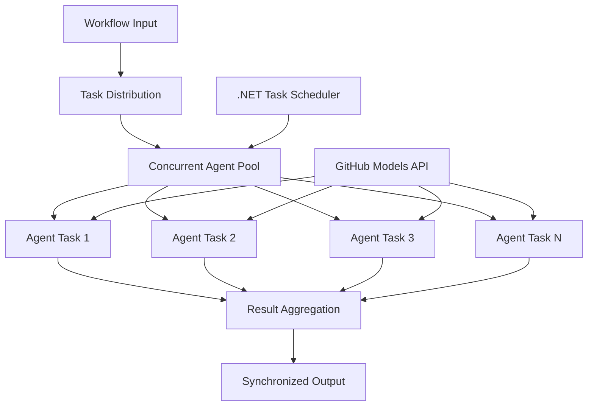

<!--
CO_OP_TRANSLATOR_METADATA:
{
  "original_hash": "b9c6e32c9b5f2fed20b6916984440d88",
  "translation_date": "2025-11-11T13:21:04+00:00",
  "source_file": "08-multi-agent/code_samples/workflows-agent-framework/dotNET/03.dotnet-agent-framework-workflow-ghmodel-concurrent.md",
  "language_code": "sv"
}
-->
# ⚡ Samtidiga Agentarbetsflöden med GitHub-modeller (.NET)

## 📋 Handledning för högpresterande parallell bearbetning

Den här guiden visar **samtidiga arbetsflödesmönster** med Microsoft Agent Framework för .NET och GitHub-modeller. Du kommer att lära dig att bygga högpresterande, parallella arbetsflöden som maximerar genomströmningen genom att köra flera AI-agenter samtidigt, samtidigt som du upprätthåller samordning och datakonsistens.

## 🎯 Lärandemål

### 🚀 **Grunderna i samtidiga processer**
- **Parallell agentkörning**: Kör flera AI-agenter samtidigt för maximal prestanda
- **Async/Await-mönster**: Utnyttja .NET:s asynkrona programmeringsmodell för effektiv samtidighet
- **Integration med GitHub-modeller**: Samordna flera samtidiga anrop till GitHubs AI-modelltjänst
- **Resurshantering**: Hantera AI-modellresurser effektivt över samtidiga operationer

### 🏗️ **Avancerad arkitektur för samtidighet**
- **Uppgiftsbaserad parallellism**: Använd .NET:s Task Parallel Library för optimal samtidighet
- **Synkroniseringsmönster**: Samordna samtidiga agenter och undvik race conditions
- **Lastbalansering**: Fördela arbete effektivt över tillgänglig bearbetningskapacitet
- **Feltolerans**: Hantera enskilda agentfel utan att stoppa hela arbetsflödet

### 🏢 **Samtidiga applikationer för företag**
- **Högvolym dokumentbearbetning**: Bearbeta flera dokument samtidigt
- **Realtidsinnehållsanalys**: Samtidig analys av inkommande datastreams
- **Optimering av batchbearbetning**: Maximera genomströmningen för storskaliga databehandlingsoperationer
- **Multimodal analys**: Parallell bearbetning av olika innehållstyper och format

## ⚙️ Förutsättningar och installation

### 📦 **Nödvändiga NuGet-paket**

Viktiga paket för högpresterande samtidiga arbetsflöden:

```xml
<!-- Core AI Framework with Async Support -->
<PackageReference Include="Microsoft.Extensions.AI" Version="9.9.0" />

<!-- Client Model Abstractions for API Communication -->
<PackageReference Include="System.ClientModel" Version="1.6.1.0" />

<!-- Azure Identity and Async LINQ for Advanced Operations -->
<PackageReference Include="Azure.Identity" Version="1.15.0" />
<PackageReference Include="System.Linq.Async" Version="6.0.3" />

<!-- Local Agent Framework References -->
<!-- Microsoft.Agents.AI.dll - Core agent abstractions with async support -->
<!-- Microsoft.Agents.AI.OpenAI.dll - GitHub Models integration with concurrency -->
```

### 🔑 **Konfiguration av GitHub-modeller**

**Miljöinställningar (.env-fil):**
```env
GITHUB_TOKEN=your_github_personal_access_token
GITHUB_ENDPOINT=https://models.inference.ai.azure.com
GITHUB_MODEL_ID=gpt-4o-mini
```

**Överväganden för samtidiga processer:**
```csharp
// Configure for concurrent operations
var clientOptions = new OpenAIClientOptions()
{
    Endpoint = new Uri(githubEndpoint),
    // Configure connection pooling for concurrent requests
    NetworkTimeout = TimeSpan.FromMinutes(5)
};
```

### 🏗️ **Arkitektur för samtidiga arbetsflöden**



**Nyckelkomponenter:**
- **Task Parallel Library**: .NET:s inbyggda stöd för samtidiga operationer
- **Agentpool**: Flera agentinstanser för parallell bearbetning
- **Resultataggregation**: Samordning och sammanslagning av resultat från samtidiga agenter
- **Synkroniseringspunkter**: Säkerställ datakonsistens över samtidiga operationer

## 🎨 **Designmönster för samtidiga arbetsflöden**

### 🔍 **Parallell forskning och analys**
```
Research Topic → Concurrent Research Agents → Result Synthesis → Final Report
```

### 📊 **Bearbetning av data från flera källor**
```
Data Sources → Parallel Processing Agents → Data Integration → Unified Output
```

### 🎭 **Innehållsgenereringspipeline**
```
Content Requirements → Concurrent Content Generators → Quality Review → Final Content
```

### 🔄 **Fan-Out/Fan-In-bearbetning**
```
Single Input → Multiple Concurrent Processors → Result Aggregation → Single Output
```

## 🏢 **Företagsfördelar med hög prestanda**

### ⚡ **Genomströmning och skalbarhet**
- **Linjär prestandaskalning**: Lägg till fler samtidiga agenter för att öka genomströmningen
- **Resursutnyttjande**: Maximal effektivitet av tillgänglig AI-modellkapacitet
- **Minskad bearbetningstid**: Betydande tidsreduktion genom parallell körning
- **Elastisk skalning**: Justera antalet samtidiga agenter dynamiskt baserat på arbetsbelastning

### 🛡️ **Tillförlitlighet och motståndskraft**
- **Felisolering**: Enskilda agentfel påverkar inte andra samtidiga operationer
- **Graciös nedtrappning**: Systemet fortsätter att fungera med reducerad agentkapacitet
- **Felåterhämtning**: Automatiska återförsöksmekanismer för misslyckade samtidiga operationer
- **Lastfördelning**: Jämn fördelning av arbete över tillgängliga agenter

### 📊 **Prestandaövervakning**
- **Metrik för samtidiga operationer**: Spåra prestanda för alla parallella operationer
- **Resursanvändningsanalys**: Övervaka CPU-, minnes- och nätverksanvändning
- **Genomströmningsanalys**: Mäta effektivitetsvinster från samtidiga processer
- **Flaskhalsdetektering**: Identifiera och lösa prestandabegränsningar

### 🔧 **Utveckling och drift**
- **Asynkron programmeringsmodell**: Utnyttja .NET:s mogna async/await-mönster
- **Uppgiftskoordinering**: Inbyggd hantering och koordinering av uppgifter
- **Undantagshantering**: Omfattande felhantering för samtidiga operationer
- **Felsökningsstöd**: Visual Studio-verktyg för felsökning av samtidiga arbetsflöden

Låt oss bygga högpresterande samtidiga AI-arbetsflöden med .NET! 🚀

## 💻 Köra koden

Den kompletta implementeringen finns i `03.dotnet-agent-framework-workflow-ghmodel-concurrent.cs`. Denna fil demonstrerar ett **Fan-Out/Fan-In-samtidigt arbetsflöde** för reseplanering:

### 🏗️ **Arbetsflödesarkitektur**

```
User Request → ConcurrentStartExecutor → [Researcher Agent || Planner Agent] → ConcurrentAggregationExecutor → Final Output
```

**Nyckelkomponenter:**

1. **ConcurrentStartExecutor**: Skickar användarförfrågan till alla agenter samtidigt
2. **Researcher Agent**: Analyserar destinationer och sevärdheter samtidigt
3. **Planner Agent**: Skapar detaljerade reseplaner samtidigt
4. **ConcurrentAggregationExecutor**: Samlar och sammanfogar resultat från båda agenterna

### 🎯 **Fan-Out/Fan-In-mönster**

Detta arbetsflöde demonstrerar det klassiska **Fan-Out/Fan-In-mönstret**:
- **Fan-Out**: Ett inmatningsmeddelande skickas till flera agenter samtidigt
- **Samtidig bearbetning**: Flera agenter arbetar parallellt med samma uppgift
- **Fan-In**: Resultat från alla agenter samlas och sammanfogas till en enda utmatning

### 🚀 Köra exemplet

```bash
# Make the script executable (Unix/Linux/macOS)
chmod +x 03.dotnet-agent-framework-workflow-ghmodel-concurrent.cs

# Run the concurrent workflow
./03.dotnet-agent-framework-workflow-ghmodel-concurrent.cs
```

Eller på Windows:
```powershell
dotnet run 03.dotnet-agent-framework-workflow-ghmodel-concurrent.cs
```

### 📝 Förväntat resultat

Arbetsflödet kommer att:
1. **Skicka förfrågan**: Skicka "Planera en resa till Seattle i december" till båda agenterna
2. **Samtidig bearbetning**: Båda agenterna arbetar samtidigt:
   - Researcher identifierar sevärdheter och detaljer
   - Planner skapar resplan och logistik
3. **Aggregation**: Kombinera båda svaren till en omfattande utmatning
4. **Visa resultat**: Visa den sammanslagna reseplanen med all information

### 🔧 Anpassningsalternativ

**Lägg till fler samtidiga agenter:**
```csharp
// Create additional specialized agents
AIAgent budgetAgent = openAIClient.GetChatClient(github_model_id).CreateAIAgent(
    name: "Budget-Agent", instructions: "Calculate travel costs...");

// Add to fan-out
var workflow = new WorkflowBuilder(startExecutor)
    .AddFanOutEdge(startExecutor, targets: [researcherAgent, plannerAgent, budgetAgent])
    .AddFanInEdge(aggregationExecutor, sources: [researcherAgent, plannerAgent, budgetAgent])
    .WithOutputFrom(aggregationExecutor)
    .Build();

// Update aggregation count
if (this._messages.Count == 3) { ... }
```

**Ändra agentinstruktioner:**
```csharp
const string ResearcherAgentInstructions = "Your custom instructions for research...";
const string PlanAgentInstructions = "Your custom instructions for planning...";
```

**Ändra uppgiften:**
```csharp
StreamingRun run = await InProcessExecution.StreamAsync(
    workflow, 
    "Plan a European vacation for 2 weeks in summer"
);
```

### 🎯 Verkliga applikationer

Detta samtidiga mönster är idealiskt för:
- **Innehållsskapande**: Flera skribenter skapar olika sektioner samtidigt
- **Kodgranskning**: Flera granskare analyserar kod från olika perspektiv
- **Marknadsundersökning**: Parallell analys av olika marknadssegment
- **Dokumentbearbetning**: Samtidig extraktion, analys och validering
- **Multiperspektivanalys**: Få olika synpunkter på samma inmatning

### 🔍 Förstå anpassade exekutorer

**ConcurrentStartExecutor:**
- Implementerar `IMessageHandler<string>` för att acceptera stränginmatning
- Skickar meddelanden till alla anslutna agenter
- Skickar `TurnToken` för att trigga samtidiga processer

**ConcurrentAggregationExecutor:**
- Implementerar `IMessageHandler<ChatMessage>` för att ta emot agentrespons
- Samlar meddelanden på ett trådsäkert sätt
- Aggregerar när alla förväntade svar har anlänt
- Ger slutlig utmatning med `context.YieldOutputAsync()`

### ⚡ Prestandafördelar

**Samtidigt vs Sekventiellt:**
- Sekventiellt: Agent1 (30s) → Agent2 (30s) = **60 sekunder totalt**
- Samtidigt: Agent1 (30s) || Agent2 (30s) = **30 sekunder totalt**

**Genomströmningsförbättring**: Upp till N× snabbare för N samtidiga agenter (beroende på arbetsbelastning och resurser)

### 🛡️ Felhantering

Arbetsflödet hanterar enskilda agentfel graciöst:
- Om en agent misslyckas fortsätter andra att bearbeta
- Aggregator kan implementera timeout-logik
- Partiella resultat kan returneras vid behov

### 📊 Avancerade funktioner

**Dynamiskt antal agenter:**
Ändra aggregationslogiken för att stödja variabelt antal agenter:

```csharp
private int _expectedAgentCount;
private readonly List<ChatMessage> _messages = [];

public async ValueTask HandleAsync(ChatMessage message, IWorkflowContext context)
{
    this._messages.Add(message);
    if (this._messages.Count == _expectedAgentCount)
    {
        // Process aggregation
    }
}
```

Detta samtidiga arbetsflödesmönster är avgörande för att bygga högpresterande, skalbara AI-agentssystem!

---

<!-- CO-OP TRANSLATOR DISCLAIMER START -->
**Ansvarsfriskrivning**:  
Detta dokument har översatts med hjälp av AI-översättningstjänsten [Co-op Translator](https://github.com/Azure/co-op-translator). Även om vi strävar efter noggrannhet, bör du vara medveten om att automatiserade översättningar kan innehålla fel eller felaktigheter. Det ursprungliga dokumentet på dess modersmål bör betraktas som den auktoritativa källan. För kritisk information rekommenderas professionell mänsklig översättning. Vi ansvarar inte för eventuella missförstånd eller feltolkningar som uppstår vid användning av denna översättning.
<!-- CO-OP TRANSLATOR DISCLAIMER END -->