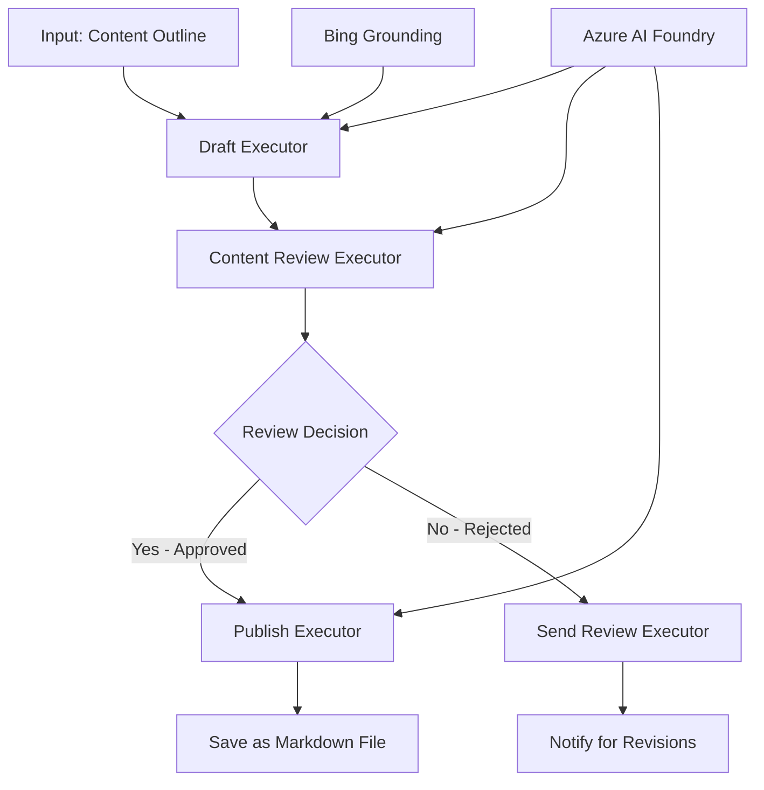

<!--
CO_OP_TRANSLATOR_METADATA:
{
  "original_hash": "8abd335151cee553293b637ee3d80d10",
  "translation_date": "2025-11-11T12:18:27+00:00",
  "source_file": "08-multi-agent/code_samples/workflows-agent-framework/dotNET/04.dotnet-agent-framework-workflow-aifoundry-condition.md",
  "language_code": "sv"
}
-->
# 🔀 Villkorliga agentarbetsflöden med Azure AI Foundry (.NET)

## 📋 Handledning för intelligenta beslutbaserade arbetsflöden

Den här notebooken demonstrerar **villkorliga arbetsflödesmönster** med Azure AI Foundry och Microsoft Agent Framework för .NET. Du kommer att lära dig att bygga avancerade, beslutsdrivna arbetsflöden som intelligent styr bearbetning baserat på AI-analys, affärsregler och dynamiska villkor för automatisering på företagsnivå.

## 🎯 Inlärningsmål

### 🧠 **Intelligent beslutsarkitektur**
- **Implementering av villkorlig logik**: Bygg komplexa beslutsträd med flera förgreningspunkter
- **AI-driven styrning**: Använd Azure AI Foundry-modeller för att fatta intelligenta styrningsbeslut
- **Dynamisk anpassning av arbetsflöden**: Ändra arbetsflödesbeteende baserat på analys och villkor vid körning
- **Integration av företagsregler**: Inkludera affärslogik och efterlevnadskrav i arbetsflöden

### 🔀 **Avancerade villkorsmönster**
- **Beslutsfattande med flera kriterier**: Utvärdera flera faktorer för styrningsbeslut
- **Kontextmedveten bearbetning**: Fatta beslut baserat på ackumulerad arbetsflödeskontext och historik
- **Anpassning av arbetsflöden**: Dynamiskt justera bearbetningsvägar baserat på realtidsvillkor
- **Integration av regelmotor**: Implementera avancerade affärsregelmotorer inom arbetsflöden

### 🏢 **Villkorliga applikationer för företag**
- **Dokumentklassificering och styrning**: Klassificera och styr dokument automatiskt till lämpliga arbetsflöden
- **Kundtjänsttriage**: Intelligent styrning av kundförfrågningar till specialiserade hanteringsteam
- **Efterlevnad och riskbearbetning**: Tillämpa olika validerings- och granskningsprocesser baserat på riskbedömning
- **Kvalitetssäkringsarbetsflöden**: Styr innehåll genom lämpliga granskningsprocesser baserat på kvalitetsmått

## ⚙️ Förutsättningar och installation

### 📦 **Nödvändiga NuGet-paket**

Avancerade paket för villkorlig arbetsflödesbearbetning:

```xml
<!-- Core AI Framework -->
<PackageReference Include="Microsoft.Extensions.AI" Version="9.9.0" />

<!-- Azure AI Agents with Persistent State -->
<PackageReference Include="Azure.AI.Agents.Persistent" Version="1.2.0-beta.5" />

<!-- Azure Identity and Utilities -->
<PackageReference Include="Azure.Identity" Version="1.15.0" />
<PackageReference Include="System.Linq.Async" Version="6.0.3" />
<PackageReference Include="DotNetEnv" Version="3.1.1" />

<!-- Local Workflow Framework References -->
<!-- Microsoft.Agents.Workflows.dll - Advanced workflow orchestration -->
<!-- Microsoft.Agents.AI.AzureAI.dll - Azure AI Foundry integration -->
<!-- Microsoft.Agents.AI.dll - Core agent abstractions -->
```

### 🔑 **Konfiguration av Azure AI Foundry**

**Nödvändiga Azure-resurser:**
- Azure AI Foundry-arbetsyta med modeller för villkorlig bearbetning
- Azure-abonnemang med lämpliga beräkningskvoter och behörigheter
- Implementerade AI-modeller för beslutsfattande och innehållsanalys
- (Valfritt) Bing Search API-anslutning för grundläggande funktioner

**Miljökonfiguration (.env-fil):**
```env
# Azure AI Foundry Configuration
AZURE_AI_PROJECT_ENDPOINT=https://your-project.cognitiveservices.azure.com/
BING_CONNECTION_ID=your-bing-connection-id
```

**Autentiseringsinställningar:**
```csharp
// Azure CLI or Managed Identity authentication
using Azure.Identity;
var credential = new AzureCliCredential();

// Load environment configuration
DotNetEnv.Env.Load("../../../.env");
```

### 🏗️ **Arkitektur för villkorliga arbetsflöden**



**Nyckelkomponenter:**
- **Draft Executor**: AI-agent som skapar initiala innehållsutkast från konturer
- **Content Review Executor**: AI-agent som utvärderar utkastets kvalitet och efterlevnad
- **Villkorlig styrning**: Beslutslogik som styr baserat på granskningsresultat
- **Publicerings-/granskningsvägar**: Separata bearbetningsvägar för godkänt respektive avvisat innehåll
- **Tillståndshantering**: Bibehåller innehåll och granskningskontext genom hela arbetsflödet

## 🎨 **Designmönster för villkorliga arbetsflöden**

### 📋 **Innehållsproduktion med kvalitetskontroller**
```
Outline → Draft Creation → Quality Review → {Approve: Publish | Reject: Revise}
```

### 🎯 **Riskbaserad dokumentbearbetning**
```
Document → Risk Assessment → {Low: Standard | High: Enhanced Review}
```

### 🔍 **Intelligent styrning av kundtjänst**
```
Customer Query → Analysis → {Simple: FAQ Bot | Complex: Human Agent}
```

### 💼 **Efterlevnadsdrivna arbetsflöden**
```
Content → Compliance Check → {Pass: Publish | Fail: Legal Review}
```

## 🏢 **Fördelar med villkorliga arbetsflöden för företag**

### 🎯 **Intelligent automatisering**
- **Smarta beslut**: AI-driven styrning baserad på innehållsanalys och kontext
- **Anpassad bearbetning**: Arbetsflöden som automatiskt justeras baserat på förändrade villkor
- **Efterlevnad av affärsregler**: Automatisk tillämpning av komplex affärslogik och policyer
- **Kontextmedveten styrning**: Beslut baserade på fullständig arbetsflödeshistorik och ackumulerad kontext

### 📈 **Operativ excellens**
- **Optimerad resursallokering**: Styr arbete till de mest lämpliga specialisterna och processerna
- **Minskad manuell intervention**: Automatiskt beslutsfattande minimerar behovet av mänsklig styrning
- **Snabbare lösningstider**: Direkt styrning till lämplig expertis och bearbetningskapacitet
- **Konsekvent tillämpning**: Enhetlig tillämpning av affärsregler och beslutsgrunder

### 🛡️ **Riskhantering och efterlevnad**
- **Automatisk riskbedömning**: AI-driven utvärdering av innehåll och risknivåer
- **Efterlevnadssäkring**: Automatisk styrning genom nödvändiga regulatoriska processer
- **Tillämpning av säkerhetsprotokoll**: Förbättrade säkerhetsåtgärder baserade på riskbedömning
- **Underhåll av granskningsspår**: Komplett dokumentation av styrningsbeslut och motiveringar

### 📊 **Analys och kontinuerlig förbättring**
- **Beslutsanalys**: Spåra effektiviteten och noggrannheten i styrningsbeslut
- **Mönsterigenkänning**: Identifiera trender och mönster i styrningsbeslut över tid
- **Prestandaoptimering**: Kontinuerlig förbättring av beslutsgrunder och styrningseffektivitet
- **Affärsintelligens**: Insikter i innehållskarakteristik och bearbetningskrav

### 🔧 **Teknisk excellens**
- **Persistent tillståndshantering**: Bibehåll komplexa tillstånd genom arbetsflödesutförande
- **Skalbar arkitektur**: Hantera högvolymbearbetning med villkorlig styrning
- **Integrationsmöjligheter**: Sömlös integration med befintliga affärssystem och processer
- **Övervakning och observabilitet**: Omfattande spårning av arbetsflödets prestanda och beslut

Låt oss bygga intelligenta, beslutsdrivna arbetsflöden för företag med .NET! 🚀

## 💻 Köra koden

Den kompletta implementeringen finns i `04.dotnet-agent-framework-workflow-aifoundry-condition.cs`. Den demonstrerar ett **arbetsflöde för innehållsproduktion med kvalitetskontroller**:

### 🏗️ **Arbetsflödesarkitektur**

```
Content Outline → Draft Creation → Quality Review → Conditional Routing:
                                                      ├─ Approved (>200 words) → Publish
                                                      └─ Rejected (<200 words) → Review Notification
```

**Agenter i arbetsflödet:**
1. **Evangelist Agent**: Skapar utkast till handledningar från konturer med Bing-grundning
2. **Content Reviewer Agent**: Utvärderar utkastets kvalitet (ordantal, fullständighet)
3. **Publisher Agent**: Sparar godkänt innehåll som tidsstämplade Markdown-filer

**Anpassade exekutorer:**
1. **DraftExecutor**: Orkestrerar skapandet av utkast
2. **ContentReviewExecutor**: Utför kvalitetsbedömning
3. **PublishExecutor**: Hanterar publicering av godkänt innehåll
4. **SendReviewExecutor**: Hanterar aviseringar om avvisat innehåll

### 🚀 Köra exemplet

**Förutsättningar:**
- Konfigurerad Azure AI Foundry-arbetsyta
- Azure CLI-autentisering (`az login`)
- (Valfritt) Bing Search-anslutning för grundning

```bash
# Make the script executable (Unix/Linux/macOS)
chmod +x 04.dotnet-agent-framework-workflow-aifoundry-condition.cs

# Run the conditional workflow
./04.dotnet-agent-framework-workflow-aifoundry-condition.cs
```

Eller på Windows:
```powershell
dotnet run 04.dotnet-agent-framework-workflow-aifoundry-condition.cs
```

### 📝 Förväntat resultat

Arbetsflödet kommer att:
1. **Skapa agenter**: Initiera tre specialiserade Azure AI Foundry-agenter
2. **Generera utkast**: Evangelist-agenten skapar handledningsutkast från konturer
3. **Granska innehåll**: Content Reviewer utvärderar utkastets kvalitet
4. **Villkorlig styrning**:
   - **Om godkänt (>200 ord)**: Publish Executor sparar som Markdown-fil
   - **Om avvisat (<200 ord)**: Skicka granskningsavisering
5. **Visa resultat**: Visa slutligt arbetsflödesresultat

### 🔧 Anpassningsalternativ

**Ändra granskningskriterier:**
```csharp
const string ContentReviewerInstructions = @"
You are a content reviewer...
1. Check if content is more than 500 words (instead of 200)
2. Verify technical accuracy
3. Ensure proper formatting
...";
```

**Lägg till fler villkorliga vägar:**
```csharp
var workflow = new WorkflowBuilder(draftExecutor)
    .AddEdge(draftExecutor, contentReviewerExecutor)
    .AddEdge(contentReviewerExecutor, publishExecutor, condition: GetCondition("Excellent"))
    .AddEdge(contentReviewerExecutor, editExecutor, condition: GetCondition("Good"))
    .AddEdge(contentReviewerExecutor, sendReviewerExecutor, condition: GetCondition("Poor"))
    .Build();
```

**Ändra innehållskrav:**
```csharp
string OUTLINE_Content = @"
# Your Custom Topic
## Section 1
https://your-reference-url
## Section 2
...
";
```

### 🎯 Verkliga applikationer

Detta villkorliga arbetsflödesmönster är idealiskt för:
- **Innehållshanteringssystem**: Automatiserade redaktionella arbetsflöden med kvalitetskontroller
- **Dokumentbearbetning**: Styr dokument baserat på klassificering och efterlevnad
- **Kundsupport**: Intelligent biljettstyrning baserat på komplexitet och brådska
- **Juridisk granskning**: Styr kontrakt baserat på riskbedömning och värde
- **HR-processer**: Styr ansökningar genom lämpliga granskningsarbetsflöden

### 🔍 Förstå villkorlig logik

**Villkorsfunktion:**
```csharp
public Func<object?, bool> GetCondition(string expectedResult) =>
    reviewResult => reviewResult is ReviewResult review && review.Result == expectedResult;
```

Denna funktion skapar en predikat som:
1. Kontrollerar om resultatet är av typen `ReviewResult`
2. Jämför egenskapen `Result` med det förväntade värdet
3. Returnerar sant/falskt för att avgöra styrning

**Arbetsflödeskanter med villkor:**
```csharp
.AddEdge(contentReviewerExecutor, publishExecutor, condition: GetCondition("Yes"))
.AddEdge(contentReviewerExecutor, sendReviewerExecutor, condition: GetCondition("No"))
```

### 📊 Avancerade funktioner

**JSON-schema validering:**
Arbetsflödet använder JSON-scheman för att säkerställa strukturerade svar:

```csharp
// Define response structure
public class ReviewResult
{
    [JsonPropertyName("review_result")]
    public string Result { get; set; } = string.Empty;
    
    [JsonPropertyName("reason")]
    public string Reason { get; set; } = string.Empty;
    
    [JsonPropertyName("draft_content")]
    public string DraftContent { get; set; } = string.Empty;
}

// Apply to agent
ResponseFormat = ChatResponseFormat.ForJsonSchema(
    AIJsonUtilities.CreateJsonSchema(typeof(ReviewResult)), 
    "ReviewResult", 
    "Review Result From DraftContent"
)
```

**Bing-grundningsintegration:**
Evangelist-agenten använder Bing-grundning för att få tillgång till realtidsinformation:

```csharp
var bingGroundingConfig = new BingGroundingSearchConfiguration(bing_conn_id);
BingGroundingToolDefinition bingGroundingTool = new(
    new BingGroundingSearchToolParameters([bingGroundingConfig])
);
```

Detta gör det möjligt för agenten att följa URL:er i konturen och extrahera aktuell information.

### 🛡️ Felhantering

Arbetsflödet inkluderar robust felhantering för avvisat innehåll:
- Granskningsfel utlöser den alternativa vägen
- Aviseringar ger tydliga avvisningsskäl
- Innehåll bevaras för revidering

### 🔄 Utöka arbetsflödet

**Lägg till en revideringsloop:**
Skapa en feedbackloop som automatiskt skapar om innehåll:

```csharp
.AddEdge(contentReviewerExecutor, publishExecutor, condition: GetCondition("Yes"))
.AddEdge(contentReviewerExecutor, draftExecutor, condition: GetCondition("No")) // Loop back
```

**Implementera fler nivåer av granskning:**
Lägg till flera granskningssteg med olika kriterier:

```csharp
.AddEdge(draftExecutor, technicalReviewer)
.AddEdge(technicalReviewer, editorialReviewer, condition: GetCondition("TechPass"))
.AddEdge(editorialReviewer, publishExecutor, condition: GetCondition("EditPass"))
```

Detta villkorliga arbetsflödesmönster ger grunden för att bygga avancerade, intelligenta automatiseringssystem för företag! 🚀

---

<!-- CO-OP TRANSLATOR DISCLAIMER START -->
**Ansvarsfriskrivning**:  
Detta dokument har översatts med hjälp av AI-översättningstjänsten [Co-op Translator](https://github.com/Azure/co-op-translator). Även om vi strävar efter noggrannhet, bör det noteras att automatiserade översättningar kan innehålla fel eller felaktigheter. Det ursprungliga dokumentet på dess ursprungliga språk bör betraktas som den auktoritativa källan. För kritisk information rekommenderas professionell mänsklig översättning. Vi ansvarar inte för eventuella missförstånd eller feltolkningar som uppstår vid användning av denna översättning.
<!-- CO-OP TRANSLATOR DISCLAIMER END -->