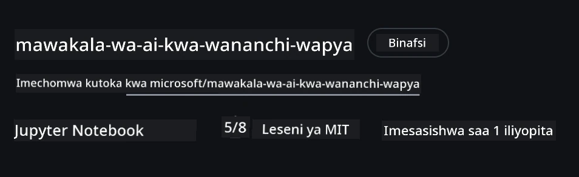
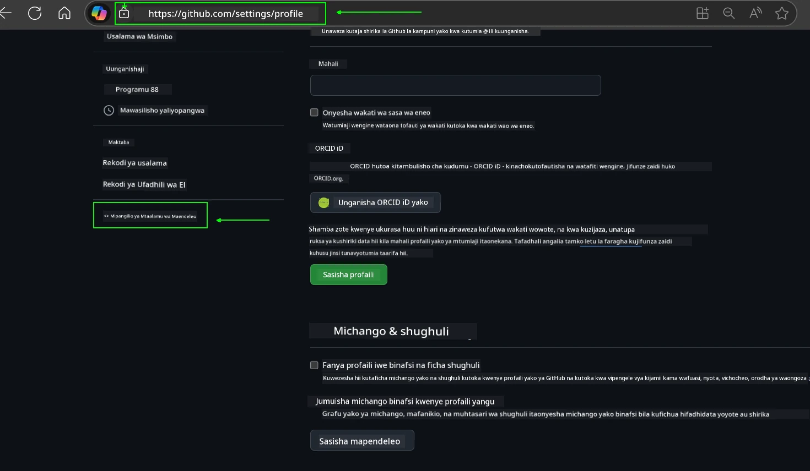
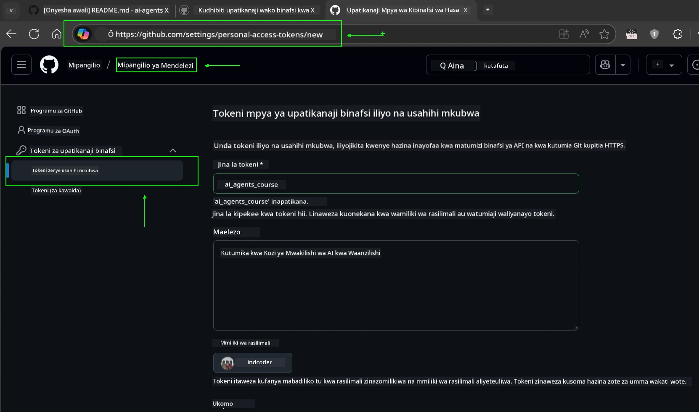
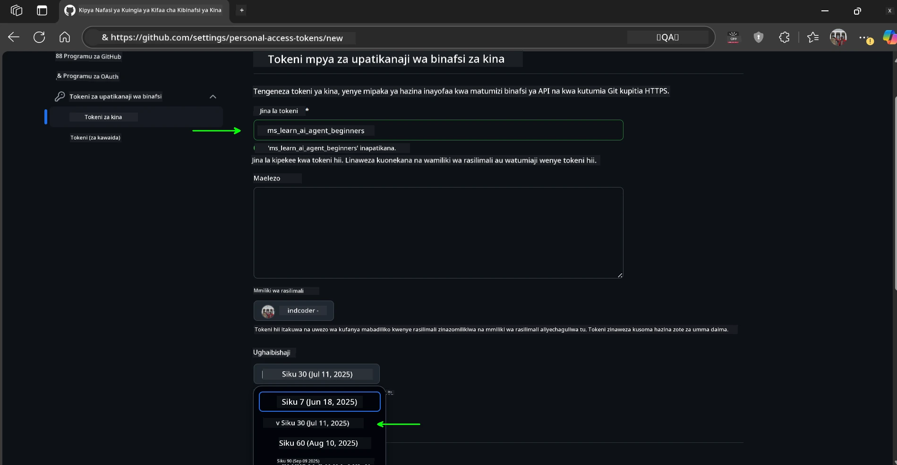
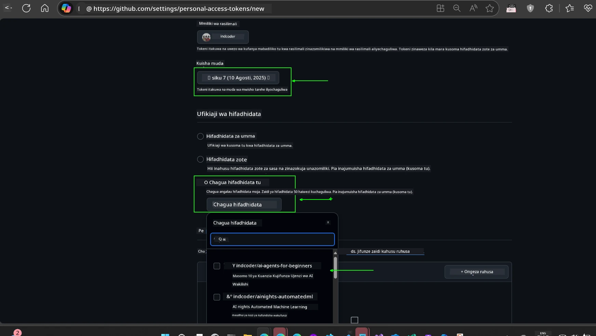
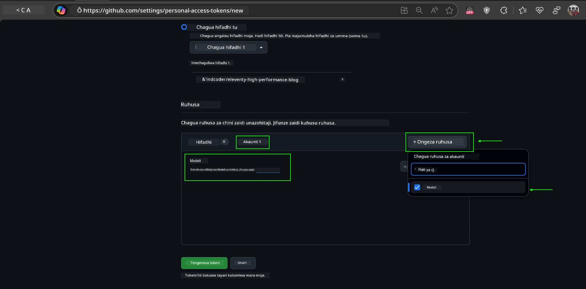
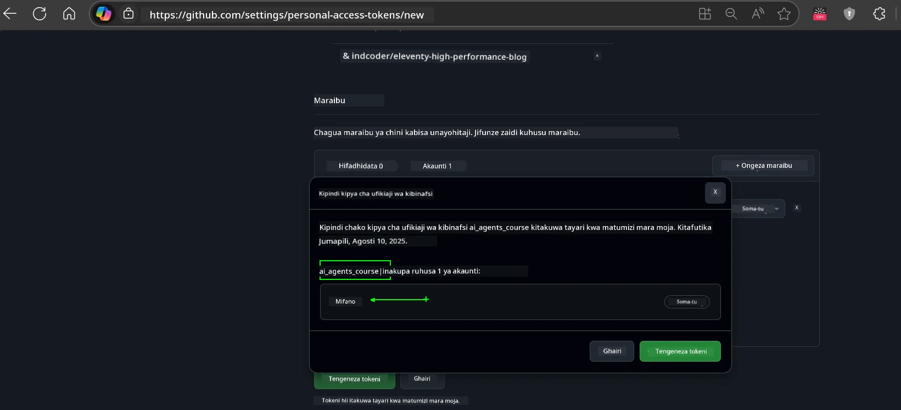
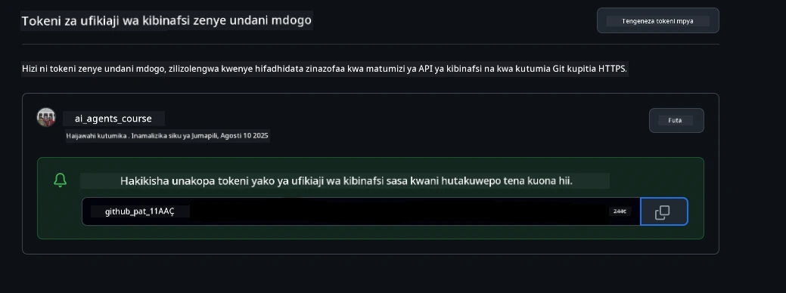
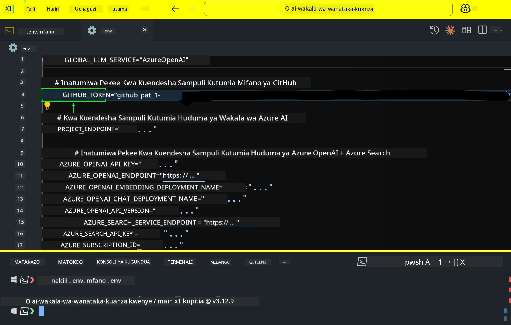
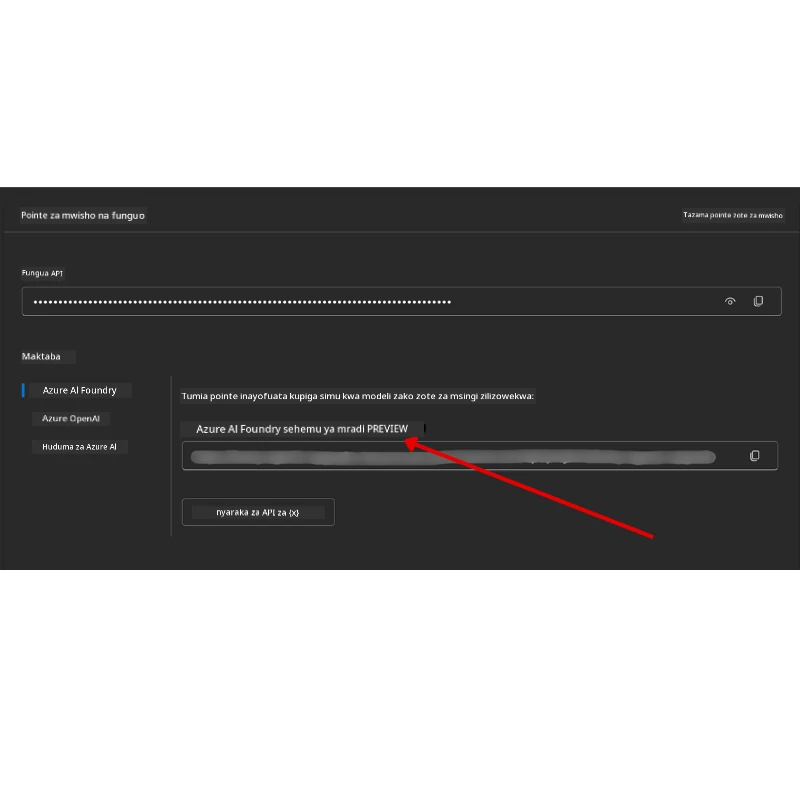

<!--
CO_OP_TRANSLATOR_METADATA:
{
  "original_hash": "63b1a8f6e840df15934935b728e569f0",
  "translation_date": "2025-12-03T14:48:36+00:00",
  "source_file": "00-course-setup/README.md",
  "language_code": "sw"
}
-->
# Kuweka Kozi

## Utangulizi

Somo hili litafundisha jinsi ya kuendesha sampuli za msimbo wa kozi hii.

## Jiunge na Wanafunzi Wengine na Pata Msaada

Kabla ya kuanza kunakili repo yako, jiunge na [AI Agents For Beginners Discord channel](https://aka.ms/ai-agents/discord) ili kupata msaada wowote wa kuweka mazingira, maswali yoyote kuhusu kozi, au kuungana na wanafunzi wengine.

## Nakili au Fork Repo Hii

Ili kuanza, tafadhali nakili au fork Hifadhi ya GitHub. Hii itakupa toleo lako la nyenzo za kozi ili uweze kuendesha, kujaribu, na kurekebisha msimbo!

Hii inaweza kufanyika kwa kubonyeza kiungo cha <a href="https://github.com/microsoft/ai-agents-for-beginners/fork" target="_blank">fork repo</a>

Sasa unapaswa kuwa na toleo lako la forked la kozi hii katika kiungo kifuatacho:



### Nakili kwa Kina Kidogo (inapendekezwa kwa warsha / Codespaces)

  >Hifadhi nzima inaweza kuwa kubwa (~3 GB) unapopakua historia nzima na faili zote. Ikiwa unahudhuria tu warsha au unahitaji tu folda chache za somo, nakala ya kina kidogo (au sparse clone) huepuka sehemu kubwa ya upakuaji huo kwa kufupisha historia na/au kuruka blobs.

#### Nakala ya haraka ya kina kidogo — historia ndogo, faili zote

Badilisha `<your-username>` katika amri zilizo hapa chini na URL ya fork yako (au URL ya upstream ikiwa unapendelea).

Ili kunakili historia ya commit ya hivi karibuni pekee (upakuaji mdogo):

```bash|powershell
git clone --depth 1 https://github.com/<your-username>/ai-agents-for-beginners.git
```

Ili kunakili tawi maalum:

```bash|powershell
git clone --depth 1 --branch <branch-name> https://github.com/<your-username>/ai-agents-for-beginners.git
```

#### Nakala ya sehemu (sparse) — blobs ndogo + folda zilizochaguliwa pekee

Hii inatumia nakala ya sehemu na sparse-checkout (inahitaji Git 2.25+ na Git ya kisasa inayopendekezwa na msaada wa nakala ya sehemu):

```bash|powershell
git clone --depth 1 --filter=blob:none --sparse https://github.com/<your-username>/ai-agents-for-beginners.git
```

Ingia kwenye folda ya repo:

```bash|powershell
cd ai-agents-for-beginners
```

Kisha taja folda unazotaka (mfano hapa chini unaonyesha folda mbili):

```bash|powershell
git sparse-checkout set 00-course-setup 01-intro-to-ai-agents
```

Baada ya kunakili na kuthibitisha faili, ikiwa unahitaji tu faili na unataka kuokoa nafasi (hakuna historia ya git), tafadhali futa metadata ya hifadhi (💀isiyoweza kubadilishwa — utapoteza utendaji wote wa Git: hakuna commits, pulls, pushes, au ufikiaji wa historia).

```bash
# zsh/bash
rm -rf .git
```

```powershell
# PowerShell
Remove-Item -Recurse -Force .git
```

#### Kutumia GitHub Codespaces (inapendekezwa kuepuka upakuaji mkubwa wa ndani)

- Unda Codespace mpya kwa repo hii kupitia [GitHub UI](https://github.com/codespaces).  

- Katika terminal ya Codespace mpya iliyoundwa, endesha moja ya amri za nakala ya kina kidogo/sehemu hapo juu ili kuleta folda za somo unazohitaji tu kwenye workspace ya Codespace.
- Hiari: baada ya kunakili ndani ya Codespaces, ondoa .git ili kurejesha nafasi ya ziada (tazama amri za kuondoa hapo juu).
- Kumbuka: Ikiwa unapendelea kufungua repo moja kwa moja ndani ya Codespaces (bila nakala ya ziada), fahamu Codespaces itajenga mazingira ya devcontainer na inaweza bado kutoa zaidi ya unavyohitaji. Kunakili nakala ya kina kidogo ndani ya Codespace mpya hukupa udhibiti zaidi wa matumizi ya diski.

#### Vidokezo

- Badilisha URL ya nakala kila wakati na fork yako ikiwa unataka kuhariri/commit.
- Ikiwa baadaye unahitaji historia zaidi au faili, unaweza kuzichukua au kurekebisha sparse-checkout ili kujumuisha folda za ziada.

## Kuendesha Msimbo

Kozi hii inatoa mfululizo wa Jupyter Notebooks ambazo unaweza kuendesha ili kupata uzoefu wa vitendo wa kujenga AI Agents.

Sampuli za msimbo zinatumia:

**Inahitaji Akaunti ya GitHub - Bure**:

1) Semantic Kernel Agent Framework + GitHub Models Marketplace. Imewekwa alama kama (semantic-kernel.ipynb)
2) AutoGen Framework + GitHub Models Marketplace. Imewekwa alama kama (autogen.ipynb)

**Inahitaji Usajili wa Azure**:

3) Azure AI Foundry + Azure AI Agent Service. Imewekwa alama kama (azureaiagent.ipynb)

Tunapendekeza ujaribu aina zote tatu za mifano ili kuona ni ipi inakufaa zaidi.

Chaguo lolote unalochagua, litaamua hatua za kuweka mazingira unazohitaji kufuata hapa chini:

## Mahitaji

- Python 3.12+
  - **NOTE**: Ikiwa huna Python3.12 iliyosakinishwa, hakikisha unaisakinisha. Kisha unda venv yako ukitumia python3.12 ili kuhakikisha matoleo sahihi yamesakinishwa kutoka faili ya requirements.txt.
  
    >Mfano

    Unda folda ya Python venv:

    ```bash|powershell
    python -m venv venv
    ```

    Kisha wezesha mazingira ya venv kwa:

    ```bash
    # zsh/bash
    source venv/bin/activate
    ```
  
    ```dos
    # Command Prompt for Windows
    venv\Scripts\activate
    ```

- .NET 10+: Kwa sampuli za msimbo zinazotumia .NET, hakikisha umesakinisha [.NET 10 SDK](https://dotnet.microsoft.com/download/dotnet/10.0) au baadaye. Kisha, angalia toleo la SDK ya .NET iliyosakinishwa:

    ```bash|powershell
    dotnet --list-sdks
    ```

- Akaunti ya GitHub - Kwa Ufikiaji wa GitHub Models Marketplace
- Usajili wa Azure - Kwa Ufikiaji wa Azure AI Foundry
- Akaunti ya Azure AI Foundry - Kwa Ufikiaji wa Azure AI Agent Service

Tumeshirikisha faili ya `requirements.txt` katika mzizi wa hifadhi hii ambayo ina vifurushi vyote vya Python vinavyohitajika kuendesha sampuli za msimbo.

Unaweza kuvisakinisha kwa kuendesha amri ifuatayo katika terminal yako kwenye mzizi wa hifadhi:

```bash|powershell
pip install -r requirements.txt
```

Tunapendekeza kuunda mazingira ya Python virtual ili kuepuka migogoro na matatizo.

## Kuweka VSCode

Hakikisha unatumia toleo sahihi la Python katika VSCode.


## Kuweka Sampuli zinazotumia GitHub Models 

### Hatua ya 1: Pata Token ya Ufikiaji wa Kibinafsi ya GitHub (PAT)

Kozi hii inatumia GitHub Models Marketplace, ikitoa ufikiaji wa bure kwa Large Language Models (LLMs) ambazo utatumia kujenga AI Agents.

Ili kutumia GitHub Models, utahitaji kuunda [GitHub Personal Access Token](https://docs.github.com/en/authentication/keeping-your-account-and-data-secure/managing-your-personal-access-tokens).

Hii inaweza kufanyika kwa kwenda kwenye <a href="https://github.com/settings/personal-access-tokens" target="_blank">mipangilio ya Token ya Ufikiaji wa Kibinafsi</a> katika Akaunti yako ya GitHub.

Tafadhali fuata [Kanuni ya Upendeleo wa Chini](https://docs.github.com/en/get-started/learning-to-code/storing-your-secrets-safely) unapounda token yako. Hii inamaanisha unapaswa kutoa token ruhusa zinazohitajika tu kuendesha sampuli za msimbo katika kozi hii.

1. Chagua chaguo la `Fine-grained tokens` upande wa kushoto wa skrini yako kwa kwenda kwenye **Developer settings**

   

   Kisha chagua `Generate new token`.

   

2. Weka jina la kuelezea kwa token yako linaloonyesha kusudi lake, ili iwe rahisi kuitambua baadaye.

    🔐 Pendekezo la Muda wa Token

    Muda uliopendekezwa: siku 30
    Kwa usalama zaidi, unaweza kuchagua muda mfupi—kama siku 7 🛡️
    Ni njia nzuri ya kuweka lengo la kibinafsi na kukamilisha kozi wakati kasi yako ya kujifunza iko juu 🚀.

    

3. Punguza wigo wa token kwa fork yako ya hifadhi hii.

    

4. Punguza ruhusa za token: Chini ya **Permissions**, bonyeza tab ya **Account**, na bonyeza kitufe cha "+ Add permissions". Dropdown itaonekana. Tafadhali tafuta **Models** na angalia kisanduku chake.

    

5. Thibitisha ruhusa zinazohitajika kabla ya kuunda token. 

6. Kabla ya kuunda token, hakikisha uko tayari kuhifadhi token katika sehemu salama kama vault ya meneja wa nywila, kwani haitatolewa tena baada ya kuunda. 

Nakili token yako mpya ambayo umekuja kuunda. Sasa utaongeza hii kwenye faili yako ya `.env` iliyojumuishwa katika kozi hii.

### Hatua ya 2: Unda Faili Yako ya `.env`

Ili kuunda faili yako ya `.env` endesha amri ifuatayo katika terminal yako.

```bash
# zsh/bash
cp .env.example .env
```

```powershell
# PowerShell
Copy-Item .env.example .env
```

Hii itanakili faili ya mfano na kuunda `.env` katika folda yako ambapo utaweka maadili ya vigezo vya mazingira.

Kwa token yako iliyokopiwa, fungua faili ya `.env` katika mhariri wako wa maandishi unaopenda na bandika token yako kwenye sehemu ya `GITHUB_TOKEN`.



Sasa unapaswa kuwa na uwezo wa kuendesha sampuli za msimbo wa kozi hii.

## Kuweka Sampuli zinazotumia Azure AI Foundry na Azure AI Agent Service

### Hatua ya 1: Pata Endpoint ya Mradi wa Azure Yako

Fuata hatua za kuunda hub na mradi katika Azure AI Foundry zilizopatikana hapa: [Hub resources overview](https://learn.microsoft.com/azure/ai-foundry/concepts/ai-resources)

Baada ya kuunda mradi wako, utahitaji kupata string ya muunganisho kwa mradi wako.

Hii inaweza kufanyika kwa kwenda kwenye ukurasa wa **Overview** wa mradi wako katika portal ya Azure AI Foundry.



### Hatua ya 2: Unda Faili Yako ya `.env`

Ili kuunda faili yako ya `.env` endesha amri ifuatayo katika terminal yako.

```bash
# zsh/bash
cp .env.example .env
```

```powershell
# PowerShell
Copy-Item .env.example .env
```

Hii itanakili faili ya mfano na kuunda `.env` katika folda yako ambapo utaweka maadili ya vigezo vya mazingira.

Kwa token yako iliyokopiwa, fungua faili ya `.env` katika mhariri wako wa maandishi unaopenda na bandika token yako kwenye sehemu ya `PROJECT_ENDPOINT`.

### Hatua ya 3: Ingia kwenye Azure

Kama mazoea bora ya usalama, tutatumia [uthibitishaji bila funguo](https://learn.microsoft.com/azure/developer/ai/keyless-connections?tabs=csharp%2Cazure-cli?WT.mc_id=academic-105485-koreyst) kuingia kwenye Azure OpenAI na Microsoft Entra ID. 

Kisha, fungua terminal na endesha `az login --use-device-code` ili kuingia kwenye akaunti yako ya Azure.

Baada ya kuingia, chagua usajili wako katika terminal.

## Vigezo vya Mazingira vya Ziada - Azure Search na Azure OpenAI 

Kwa Somo la Agentic RAG - Somo la 5 - kuna sampuli zinazotumia Azure Search na Azure OpenAI.

Ikiwa unataka kuendesha sampuli hizi, utahitaji kuongeza vigezo vifuatavyo vya mazingira kwenye faili yako ya `.env`:

### Ukurasa wa Muhtasari (Mradi)

- `AZURE_SUBSCRIPTION_ID` - Angalia **Project details** kwenye ukurasa wa **Overview** wa mradi wako.

- `AZURE_AI_PROJECT_NAME` - Angalia juu ya ukurasa wa **Overview** wa mradi wako.

- `AZURE_OPENAI_SERVICE` - Pata hii katika tab ya **Included capabilities** kwa **Azure OpenAI Service** kwenye ukurasa wa **Overview**.

### Kituo cha Usimamizi

- `AZURE_OPENAI_RESOURCE_GROUP` - Nenda kwenye **Project properties** kwenye ukurasa wa **Overview** wa **Management Center**.

- `GLOBAL_LLM_SERVICE` - Chini ya **Connected resources**, pata jina la muunganisho wa **Azure AI Services**. Ikiwa halipo, angalia **Azure portal** chini ya kikundi chako cha rasilimali kwa jina la rasilimali za AI Services.

### Ukurasa wa Models + Endpoints

- `AZURE_OPENAI_EMBEDDING_DEPLOYMENT_NAME` - Chagua mfano wako wa embedding (mfano, `text-embedding-ada-002`) na kumbuka **Deployment name** kutoka maelezo ya mfano.

- `AZURE_OPENAI_CHAT_DEPLOYMENT_NAME` - Chagua mfano wako wa chat (mfano, `gpt-4o-mini`) na kumbuka **Deployment name** kutoka maelezo ya mfano.

### Portal ya Azure

- `AZURE_OPENAI_ENDPOINT` - Tafuta **Azure AI services**, bonyeza juu yake, kisha nenda kwenye **Resource Management**, **Keys and Endpoint**, shuka chini kwenye "Azure OpenAI endpoints", na nakili ile inayosema "Language APIs".

- `AZURE_OPENAI_API_KEY` - Kutoka skrini hiyo hiyo, nakili KEY 1 au KEY 2.

- `AZURE_SEARCH_SERVICE_ENDPOINT` - Pata rasilimali yako ya **Azure AI Search**, bonyeza juu yake, na angalia **Overview**.

- `AZURE_SEARCH_API_KEY` - Kisha nenda kwenye **Settings** na kisha **Keys** ili kunakili funguo kuu au sekondari ya msimamizi.

### Ukurasa wa Nje

- `AZURE_OPENAI_API_VERSION` - Tembelea ukurasa wa [API version lifecycle](https://learn.microsoft.com/azure/ai-services/openai/api-version-deprecation#latest-ga-api-release) chini ya **Latest GA API release**.

### Kuweka uthibitishaji bila funguo

Badala ya kuweka maelezo yako ya kuingia, tutatumia muunganisho bila funguo na Azure OpenAI. Ili kufanya hivyo, tutaingiza `DefaultAzureCredential` na baadaye kuita kazi ya `DefaultAzureCredential` kupata uthibitisho.

```python
# Kipyton
from azure.identity import DefaultAzureCredential, InteractiveBrowserCredential
```

## Umekwama Mahali Fulani?
Kama unakutana na changamoto yoyote ukiendesha mpangilio huu, jiunge na <a href="https://discord.gg/kzRShWzttr" target="_blank">Azure AI Community Discord</a> yetu au <a href="https://github.com/microsoft/ai-agents-for-beginners/issues?WT.mc_id=academic-105485-koreyst" target="_blank">unda suala</a>.

## Somo Lijalo

Sasa uko tayari kuendesha msimbo wa kozi hii. Jifunze kwa furaha zaidi kuhusu ulimwengu wa Mawakala wa AI!

[Utangulizi wa Mawakala wa AI na Matumizi Yake](../01-intro-to-ai-agents/README.md)

---

<!-- CO-OP TRANSLATOR DISCLAIMER START -->
**Kanusho**:  
Hati hii imetafsiriwa kwa kutumia huduma ya tafsiri ya AI [Co-op Translator](https://github.com/Azure/co-op-translator). Ingawa tunajitahidi kwa usahihi, tafadhali fahamu kuwa tafsiri za kiotomatiki zinaweza kuwa na makosa au kutokuwa sahihi. Hati ya asili katika lugha yake ya awali inapaswa kuzingatiwa kama chanzo cha mamlaka. Kwa taarifa muhimu, tafsiri ya kitaalamu ya binadamu inapendekezwa. Hatutawajibika kwa kutoelewana au tafsiri zisizo sahihi zinazotokana na matumizi ya tafsiri hii.
<!-- CO-OP TRANSLATOR DISCLAIMER END -->