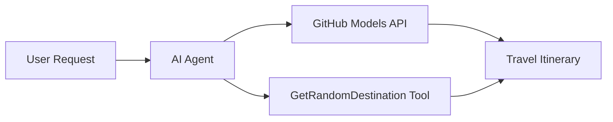

<!--
CO_OP_TRANSLATOR_METADATA:
{
  "original_hash": "5f351412e934f0833c8c821a0a60efaf",
  "translation_date": "2025-11-13T13:32:16+00:00",
  "source_file": "01-intro-to-ai-agents/code_samples/01-dotnet-agent-framework.md",
  "language_code": "sw"
}
-->
# 🌍 AI Wakala wa Kusafiri na Microsoft Agent Framework (.NET)

## 📋 Muhtasari wa Hali

Mfano huu unaonyesha jinsi ya kujenga wakala wa akili wa kupanga safari kwa kutumia Microsoft Agent Framework kwa .NET. Wakala anaweza kuunda ratiba za safari za siku moja kwa moja kwa maeneo ya nasibu duniani kote.

### Uwezo Muhimu:

- 🎲 **Uchaguzi wa Maeneo ya Nasibu**: Hutumia zana maalum kuchagua maeneo ya likizo
- 🗺️ **Upangaji wa Safari wa Akili**: Huunda ratiba za kina za kila siku
- 🔄 **Utiririshaji wa Wakati Halisi**: Inasaidia majibu ya papo hapo na ya utiririshaji
- 🛠️ **Muunganiko wa Zana Maalum**: Inaonyesha jinsi ya kupanua uwezo wa wakala

## 🔧 Muundo wa Kiufundi

### Teknolojia za Msingi

- **Microsoft Agent Framework**: Utekelezaji wa hivi karibuni wa .NET kwa maendeleo ya wakala wa AI
- **Muunganiko wa Miundo ya GitHub**: Hutumia huduma ya utambuzi wa miundo ya AI ya GitHub
- **Ulinganifu wa API ya OpenAI**: Hutumia maktaba za mteja wa OpenAI na viunganishi maalum
- **Usanidi Salama**: Usimamizi wa funguo za API kulingana na mazingira

### Vipengele Muhimu

1. **AIAgent**: Msimamizi mkuu wa wakala anayeshughulikia mtiririko wa mazungumzo
2. **Zana Maalum**: Kazi ya `GetRandomDestination()` inayopatikana kwa wakala
3. **Mteja wa Mazungumzo**: Kiunganishi cha mazungumzo kinachotegemea Miundo ya GitHub
4. **Utiririshaji wa Majibu**: Uwezo wa kuunda majibu ya wakati halisi

### Muundo wa Muunganiko



## 🚀 Kuanza

### Mahitaji ya Awali

- [.NET 10 SDK](https://dotnet.microsoft.com/download/dotnet/10.0) au zaidi
- [Tokeni ya ufikiaji wa API ya Miundo ya GitHub](https://docs.github.com/github-models/github-models-at-scale/using-your-own-api-keys-in-github-models)

### Vigezo vya Mazingira Vinavyohitajika

```bash
# zsh/bash
export GH_TOKEN=<your_github_token>
export GH_ENDPOINT=https://models.github.ai/inference
export GH_MODEL_ID=openai/gpt-5-mini
```

```powershell
# PowerShell
$env:GH_TOKEN = "<your_github_token>"
$env:GH_ENDPOINT = "https://models.github.ai/inference"
$env:GH_MODEL_ID = "openai/gpt-5-mini"
```

### Mfano wa Msimbo

Kuendesha mfano wa msimbo,

```bash
# zsh/bash
chmod +x ./01-dotnet-agent-framework.cs
./01-dotnet-agent-framework.cs
```

Au kwa kutumia dotnet CLI:

```bash
dotnet run ./01-dotnet-agent-framework.cs
```

Tazama [`01-dotnet-agent-framework.cs`](../../../../01-intro-to-ai-agents/code_samples/01-dotnet-agent-framework.cs) kwa msimbo kamili.

```csharp
#!/usr/bin/dotnet run

#:package Microsoft.Extensions.AI@9.*
#:package Microsoft.Agents.AI.OpenAI@1.*-*

using System.ClientModel;
using System.ComponentModel;

using Microsoft.Agents.AI;
using Microsoft.Extensions.AI;

using OpenAI;

// Tool Function: Random Destination Generator
// This static method will be available to the agent as a callable tool
// The [Description] attribute helps the AI understand when to use this function
// This demonstrates how to create custom tools for AI agents
[Description("Provides a random vacation destination.")]
static string GetRandomDestination()
{
    // List of popular vacation destinations around the world
    // The agent will randomly select from these options
    var destinations = new List<string>
    {
        "Paris, France",
        "Tokyo, Japan",
        "New York City, USA",
        "Sydney, Australia",
        "Rome, Italy",
        "Barcelona, Spain",
        "Cape Town, South Africa",
        "Rio de Janeiro, Brazil",
        "Bangkok, Thailand",
        "Vancouver, Canada"
    };

    // Generate random index and return selected destination
    // Uses System.Random for simple random selection
    var random = new Random();
    int index = random.Next(destinations.Count);
    return destinations[index];
}

// Extract configuration from environment variables
// Retrieve the GitHub Models API endpoint, defaults to https://models.github.ai/inference if not specified
// Retrieve the model ID, defaults to openai/gpt-5-mini if not specified
// Retrieve the GitHub token for authentication, throws exception if not specified
var github_endpoint = Environment.GetEnvironmentVariable("GH_ENDPOINT") ?? "https://models.github.ai/inference";
var github_model_id = Environment.GetEnvironmentVariable("GH_MODEL_ID") ?? "openai/gpt-5-mini";
var github_token = Environment.GetEnvironmentVariable("GH_TOKEN") ?? throw new InvalidOperationException("GH_TOKEN is not set.");

// Configure OpenAI Client Options
// Create configuration options to point to GitHub Models endpoint
// This redirects OpenAI client calls to GitHub's model inference service
var openAIOptions = new OpenAIClientOptions()
{
    Endpoint = new Uri(github_endpoint)
};

// Initialize OpenAI Client with GitHub Models Configuration
// Create OpenAI client using GitHub token for authentication
// Configure it to use GitHub Models endpoint instead of OpenAI directly
var openAIClient = new OpenAIClient(new ApiKeyCredential(github_token), openAIOptions);

// Create AI Agent with Travel Planning Capabilities
// Initialize OpenAI client, get chat client for specified model, and create AI agent
// Configure agent with travel planning instructions and random destination tool
// The agent can now plan trips using the GetRandomDestination function
AIAgent agent = openAIClient
    .GetChatClient(github_model_id)
    .CreateAIAgent(
        instructions: "You are a helpful AI Agent that can help plan vacations for customers at random destinations",
        tools: [AIFunctionFactory.Create(GetRandomDestination)]
    );

// Execute Agent: Plan a Day Trip
// Run the agent with streaming enabled for real-time response display
// Shows the agent's thinking and response as it generates the content
// Provides better user experience with immediate feedback
await foreach (var update in agent.RunStreamingAsync("Plan me a day trip"))
{
    await Task.Delay(10);
    Console.Write(update);
}
```

## 🎓 Mambo Muhimu ya Kujifunza

1. **Muundo wa Wakala**: Microsoft Agent Framework hutoa njia safi na salama ya aina ya kujenga mawakala wa AI katika .NET
2. **Muunganiko wa Zana**: Kazi zilizopambwa na sifa za `[Description]` zinakuwa zana zinazopatikana kwa wakala
3. **Usimamizi wa Usanidi**: Vigezo vya mazingira na usimamizi salama wa hati vinazingatia mazoea bora ya .NET
4. **Ulinganifu wa OpenAI**: Muunganiko wa Miundo ya GitHub unafanya kazi bila matatizo kupitia API zinazolingana na OpenAI

## 🔗 Rasilimali za Ziada

- [Nyaraka za Microsoft Agent Framework](https://learn.microsoft.com/agent-framework)
- [Soko la Miundo ya GitHub](https://github.com/marketplace?type=models)
- [Microsoft.Extensions.AI](https://learn.microsoft.com/dotnet/ai/microsoft-extensions-ai)
- [.NET Single File Apps](https://devblogs.microsoft.com/dotnet/announcing-dotnet-run-app)

---

<!-- CO-OP TRANSLATOR DISCLAIMER START -->
**Kanusho**:  
Hati hii imetafsiriwa kwa kutumia huduma ya tafsiri ya AI [Co-op Translator](https://github.com/Azure/co-op-translator). Ingawa tunajitahidi kwa usahihi, tafadhali fahamu kuwa tafsiri za kiotomatiki zinaweza kuwa na makosa au kutokuwa sahihi. Hati asilia katika lugha yake ya asili inapaswa kuzingatiwa kama chanzo cha mamlaka. Kwa taarifa muhimu, tafsiri ya kitaalamu ya binadamu inapendekezwa. Hatutawajibika kwa kutoelewana au tafsiri zisizo sahihi zinazotokana na matumizi ya tafsiri hii.
<!-- CO-OP TRANSLATOR DISCLAIMER END -->